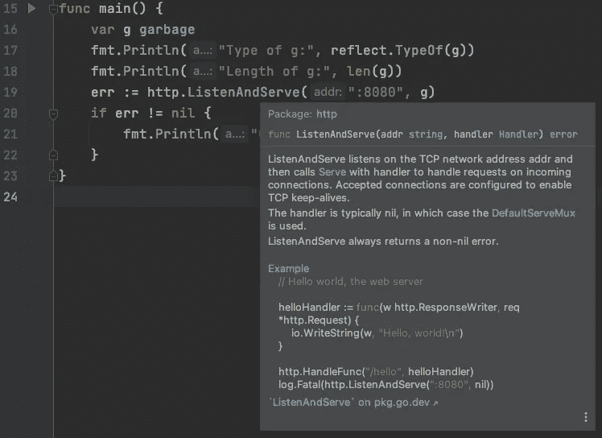

# 使用 Go 中的 net/http 包提升您的 Web 技能

> 原文：<https://levelup.gitconnected.com/level-up-your-web-skills-with-the-net-http-package-in-go-6cc79837da8c>

## 理解处理程序、请求、响应等等！


来自[壁纸洞穴](https://wallpapercave.com/w/wp7041189)

Go 正在迅速成长为一种最方便的通用编程语言，并且专门面向 web。它的标准库不仅全面，而且足够模块化，可以鼓励程序员逻辑地解决程序，而不是用万能的库方法(看看你，Python)。

在本文中，我们将介绍 Go 中的`“net/http”`包，以提高您的 web 编程技能，同时学习技术领域中最热门的语言之一。我们要讨论的主题如下:

*   处理程序接口
*   处理请求和响应

让我们学一些围棋吧！

# 处理程序接口

make 是一门非常值得学习的语言，这有三个方面。首先是它的语法客观上简单明了。第二个原因是 Go 提供了出色的文档，第三个原因是 Go 的源代码也是自文档化的。

为了给你一个更好的想法，看看 Go 文档中的`net/http`包的文档。我们将在整个教程中引用这些文档。

[](https://golang.org/pkg/net/http/) [## http-Go 编程语言

### resp，err := http。Get("http://example.com/")...resp，err := http。post(" http://example . com/upload "，" image/jpeg"…

golang.org](https://golang.org/pkg/net/http/) 

我们立即从 Go 中 Get 或 Post 请求的简单 RESTful 示例开始，例如:

因为 Go 鼓励事件驱动架构，所以它对处理程序有很大的吸引力。处理程序只是一个函数，当被事件或环境变化触发时，它执行预定义的操作。Go 将一个处理程序定义为一个`interface`，如下所示。

`Handler interface`是通过一个名为`ServeHTTP()`的方法实现的，该方法带有两个参数`ResponseWriter`和一个指向`http.Request`的指针。因为 Go 不使用继承，你可以简单地通过给对象本身添加`ServeHTTP()`方法来使**任何** **对象**扩展为`Handler`类型。

让我们看看代码。在第 9 行，我们定义了自己的自定义 Go 类型`garbage`，它也是类型`string`。通过如上所述实现方法`ServeHTTP()`，我们隐式地实现了自定义类型`garbage`上的`Handler interface`。所以，`garbage`现在是`string`类型的**和`Handler`类型的**。

我们可以通过打印`garbage`的一些属性(如第 17 行和第 18 行)来看到这一点。既然`g`属于类型`http.Handler`，我们也可以将我们实例化的`garbage`类型`g`传递到`http.ListenAndServe()`方法中。

我们可以看到这个例子的输出，首先作为服务器运行上面的程序，然后使用命令行工具`curl`点击端口`:8080`来触发`http.ListenAndServe()`方法来使用我们的新处理程序`g`。

```
$ go run handler.go 
```

然后在另一个终端…

```
$ curl localhost:8080
$
```

回到我们的第一个终端，我们现在应该看到输出:

```
$ go run handler.go
Type of g: main.garbage
Length of g: 0
The garbage struct of type string is now also an http.Handler 
```

太棒了。我们可以看到`g`属于`main.garbage`类型，也可以访问`len()`方法，因为`g`也属于`string`类型。

> *但是* `*http.ListenAndServe()*` *到底是怎么回事呢？好吧，许多高级软件工程师向我传授了一个亲密学习语言的伟大策略。那个提示是* ***潜入源代码。***

## 探索 http。ListenAndServe()

我使用的是 Mac 上的 IntelliJ IDE，因此您访问方法源代码的方式可能会有所不同。最坏的情况是，您可以参考文档或查看下面的实际 Go 源代码:

[](https://github.com/golang/go) [## golang/go

### Go 是一种开源编程语言，它使构建简单、可靠和高效的软件变得容易。地鼠…

github.com](https://github.com/golang/go) 

**注:**如果只是想看一下`net/http package`的基础，可以跳过这部分。或者，你可以做一个负责任的软件工程师，继续学习。=)

回到我们的基本程序，如果我将鼠标悬停在`http.ListenAndServe()`方法上，我可以看到它接受类型为`string`的端口地址的两个参数，以及当我们收到连接请求时执行的处理程序对象。我们还可以看到，该方法使用传输控制协议(TCP)作为其通信标准。



如果我按住 Mac Command 键，然后点击`http.ListenAndServe()`，我就可以看到那些写围棋的人是如何实现这个方法的。

我们可以看到谷歌的工程师给我们留下了关于功能`ListenAndServe()`的描述性评论。这包括这样的知识，如果处理程序是左`nil`，那么我们将使用一个`DefaultServeMux`作为我们的处理程序类型。基本上，它会寻找一个处理程序来匹配你要访问的 URL。

但是这仍然没有真正回答这个问题，即`http.ListenAndServe()` *实际上是如何处理我们的连接请求的？嗯，我们可以 CMD+点击方法`server.ListenAndServe()`了解一下！*

现在我们变得更加冗长。我们可以看到，如果我们不从上面传递端口地址，那么在第 15 行我们将使用默认地址`“:http”`。我们也看到了如何使用`“tcp”`作为我们的通信协议。还是 CMD+点击`srv.Serve()`继续挖吧！

太远，太远了！！在你离开之前，看一看，这是你可以从专业人士那里学习如何编写 Go 代码的地方。我们可以看到侦听器上的每个传入连接都为每个连接创建了一个新的 go 例程。go 例程就像一个轻量级线程，独立于程序的其余部分运行。

开发人员还通过在重新分配监听器后直接在监听器上使用`defer l.Close()`来保持代码的整洁，从而确保我们不会留下开放的连接。

我们还可以看到,“监听”过程是通过从第 40 行开始的无限 for 循环完成的。这段代码的大部分只是错误处理，第 48–61 行实现了后退错误检查，我们连续检查错误状态，直到达到最大时间限制。

另一个很酷的细节是在第 72 行看到我们为`Serve()`方法设置了某种形式的状态。也许围棋开发者用的是有限状态机？我自己的观察显然不全面，所以帮自己一个忙，继续探索！

> 虽然你可能认为这是多余的，但是深入源代码的真正力量在于你对你的高级方法是如何相互作用的有了深刻的理解。不仅如此，您还可以向最优秀的人学习，获得如何更好地构建代码的想法，甚至获得新的架构想法！这是记录良好的源代码的真正价值，因为您不仅使代码变得更好，而且使开发人员社区作为一个整体变得更好。

# 处理请求和响应

别担心，我们会让事情变得简单。给你:

[](https://golang.org/pkg/net/http/#Request) [## http-Go 编程语言

### resp，err := http。Get("http://example.com/")...resp，err := http。post(" http://example . com/upload "，" image/jpeg"…

golang.org](https://golang.org/pkg/net/http/#Request) 

算是开玩笑吧。如果你打开那个链接，你将会看到 Go 的请求结构有很多事情要做。归根结底，它只是一个结构。这个结构有我们可以访问的不同的字段和方法。

让我们一起来看看。首先我们要定义一个名为`Response`的新`struct`，它将扩展`http.ResponseWriter`对象。然后我们可以定义一个名为`Text()`的新方法，它接受一个 Http 状态代码和一个字符串类型的`body`参数。

由于我们的`Response`结构扩展了`http.ResponseWriter`，我们可以将响应的头设置为文本。头是键值对，用来描述我们希望如何配置请求和响应之间的附加信息。在本例中，我们在第 16 行自定义了自己的标题，将内容类型设置为 text，在第 17 行用提供的状态代码调用`WriteHeader()`。最后，在我们的`Text()`方法中，我们调用`io.WriteString()`，它将主体写入我们的响应对象`r`。

现在在 main 方法中，我们从定义一个来自`http.NewServeMux()`的新处理程序开始。该处理程序能够采用请求路由，并使用适当的处理程序进行响应。然后我们调用`handler.HandleFunc()`，它接受所描述的路线和一个函数，这个函数**必须**接受一个`ResponseWriter`和一个`Request`来实现`handler`方法。

对于上面给出的代码，我们有三种不同的可能路径。第一个是匹配任何可能的 URL 的一般路由`"/"`。这是我们的默认值，将创建一个新的响应，随后将状态代码设置为`http.StatusNotFound`，主体字符串值为`"Not found"`。

第二条路线将与`"/hello"`延长路线相匹配。这里我们将响应的状态设置为`http.StatusOK`，并返回一个主体为`"helo world"`的响应。

第三条也是最后一条路由使用了通配符语法，它可以采用任何形式`"/hello/something"`。在这种情况下，我们获取`req.URL.Path`并删除`"/hello"`子串，这样我们只剩下传递给请求的名称。当我们构建`resp.Text()`时，我们传递一个 OK 状态码，并将 body 值设置为`“Hello <name>”`。

最后，我们用`http.ListenAndServe()`启动我们的服务器并检查任何错误，因为这是负责任的 Go 开发者所做的。

通过首先启动我们的服务器，我们可以看到这个例子的行为…

```
$ go run handlers.go 
```

然后在另一个终端使用`curl`点击不同的路线…

```
$ curl localhost:8080
Not found
$ curl localhost:8080/hello
Hello world
$ curl localhost:8080/hello/Harry-Potter
Hello Harry-Potter
```

现在，您已经构建了一个处理程序，它可以处理多个路由，通过`req.URL.Path`引用请求中的数据，并将自定义响应返回给客户端。恭喜你！

我希望你喜欢学习 Go 中的`net/http`包的基础知识。如果你有任何进一步的问题，或者只是喜欢这篇文章，我鼓励你在下面留下评论。感谢您的阅读！