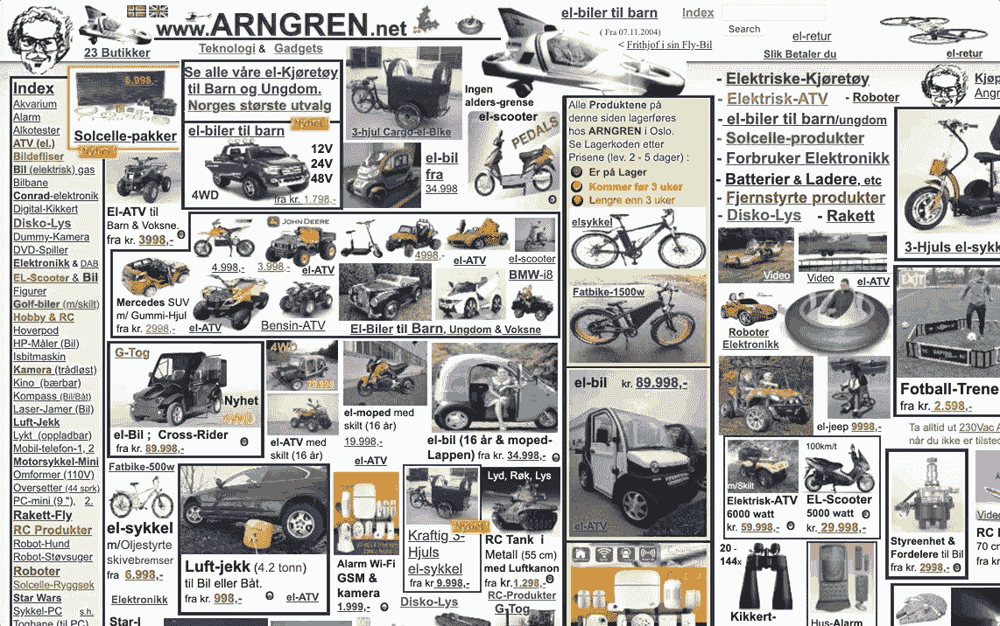
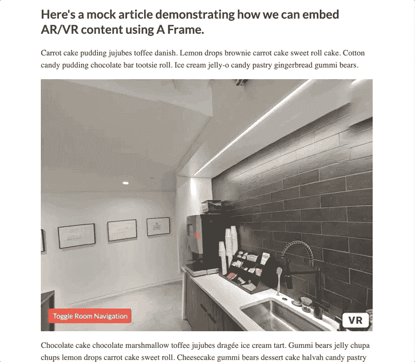

# 利用虚拟现实让你的网站访问者沉浸在 A-Frame 中

> 原文：<https://levelup.gitconnected.com/leverage-virtual-reality-to-immerse-your-site-visitors-using-a-frame-ded6d5f019f3>

## 使用 A-Frame javascript 框架探索虚拟现实和增强现实在 web 上的优势和潜在用途。


弗兰克·维西亚在 [Unsplash](https://unsplash.com?utm_source=medium&utm_medium=referral) 上拍摄的照片

O 多年来，许多技术被用来吸引网站访问者。在早期的 web 开发中，过度使用图像、字幕文本、音乐、动画光标和其他繁琐的方法是“必须的”。当然，从那以后发生了很大的变化，网络看起来不那么混乱了。然而，随着技术的进步，我们使用网络的方式也在进步。



一个 90 年代的遗物:[http://www.arngren.net/](http://www.arngren.net/)

许多社交媒体网站和应用程序已经利用了虚拟现实和增强现实应用程序，如 Snapchat 过滤器和脸书上的 360 图像和视频。虽然这种用法主要是为了娱乐，但在你的网站上仍然有许多实用的方法来使用 VR/AR。

# 虚拟现实/增强现实在网络上的潜在用途

## 数据可视化

《华盛顿邮报》的专题[美国地下室的神秘恐龙](https://www.washingtonpost.com/graphics/2018/national/smithsonian-dinosaur-augmented-reality/)利用增强现实技术以 3D 形式展示了恐龙蛋头骨的不同部分。

## 虚拟旅游

BBC 的[刚果 VR](https://canvas-story.bbcrewind.co.uk/congo-vr/) 之旅让用户有身临其境的体验，参观一个杂草丛生的宫殿，与俾格米人一起狩猎，并通过刚果民主共和国遇到大猩猩。

## 买之前先试试

Houzz 的[查看我的房间](https://blog.houzz.com/houzz-upgrades-augmented-reality-app-capabilities/)增强现实工具使用户能够查看他们家中的家居装饰和家具，与真实比例相当。

## 教育

[Kai XR](https://kaixr.com/) 提供混合现实体验，作为补充课堂资源，增强儿童教育。看看她在[https://kaixr.com/vr-playground](https://kaixr.com/vr-playground)的一些虚拟现实实地考察。

# VR/AR 在汉利伍德的潜在用途

Hanley Wood 可以从我们的[项目画廊](https://www.architectmagazine.com/project-gallery)中的 VR/AR 以及像[建筑商 chūwa 概念住宅](https://www.builderonline.com/chowa-living-in-balance)这样的功能中受益，这比他们单独使用图像更能让用户沉浸其中。

## 项目库

Project Gallery 是一个为建筑师、事务所和制造商展示他们作品的平台。用户可以从 VR/AR 技术中受益的一个用例是上传他们设计的交互式 3D 模型或用户可以漫游的增强现实平面图的能力。

## 楚瓦概念家园

chwa 是《建筑者》杂志的最新概念住宅，展示了日本和美国团队的合作，汇集了住宅建筑的最佳技术和实践。尽管完成的房屋设计很漂亮，但我们的 Builderonline.com[观众可能会从虚拟体验中受益最多，这种体验可以让他们透过墙壁和地板窥视。这种体验将使用户能够看到各种施工阶段和使用的方法，从而产生一种全面的虚拟现实体验，在这种体验中，用户可以立即看到成品和施工阶段。](https://www.builderonline.com/)

## 360 影像办公室之旅的概念验证

虽然上面提到的想法很容易实现，但是我们没有办法在最近的特性中实现。作为一个敏捷开发团队，允许我们的编辑将 VR/AR 融入他们的内容的最小可行产品可能就像给他们添加 360°图像和视频的能力一样简单。A-Frame 将使我们有可能在很短的时间内完成这一点，因为它易于安装，学习曲线最短。

下面是一篇 360°图片的文章示例。使用光标环视房间，并使用导航按钮切换到另一个房间。点按跳动的粉红色圆点以观看咖啡机的视频。

如果你在查看嵌入内容时遇到问题，这里有链接:[https://incongruous-hardware.glitch.me/](https://incongruous-hardware.glitch.me/)

使用 A-Frame 的 360°影像办公室参观互动演示



# 介绍 A 形框架

A-Frame 是一个免费的开源 javascript 框架，使您能够将虚拟现实体验添加到您的网站，而无需您的观众下载应用程序或购买耳机。您可以为 Vive、Rift、Daydream、GearVR 和 Cardboard 以及桌面和智能手机构建跨平台的 VR 体验。

安装需要将最新版本的 aframe.min.js 添加到 HTML 文档的中，然后使用 A-Frame 的实体组件框架编写<a-scene>。</a-scene>

```
<html>
 <head>
 <script src=”[https://aframe.io/releases/1.0.3/aframe.min.js](https://aframe.io/releases/1.0.3/aframe.min.js)"></script>
 </head>
 <body>
 <a-scene>
 <a-box position=”-1 0.5 -3" rotation=”0 45 0" color=”#4CC3D9"> </a-box>
 <a-sky color=”#ECECEC”></a-sky>
 </a-scene>
 </body>
</html>
```

因为 A-Frame 是基于 HTML 的，所以很容易快速上手 AR/VR。他们的文档推荐 Glitch 作为入门的平台，所以请查看安装页面，查看不同的示例，并创建自己的示例。

## 优势

*   能够在内部创建 VR/AR 体验，而不是将工作外包给另一家公司。
*   无摩擦，无需下载额外的软件
*   允许用户在没有耳机的情况下与场景进行交互。
*   跨平台，允许您为智能手机和桌面浏览器构建，以及为 Cardboard、Rift、Windows、Vive、Windows 混合现实、Daydream 和 GearVR 构建 VR 应用程序。

# 需要考虑的事项

仅仅因为 AR/VR 是现在的新事物，并不一定意味着你的网站需要它。考虑你的受众和你的网站提供的服务或产品的类型。

此外，虚拟现实技术对网站来说可能相当沉重，所以虽然它可能会吸引有兴趣尝试它的用户，但一个缓慢的网站会很快赶走他们。《粉碎》杂志为此提供了以下解决方案:

> 我的建议是不要预装所有东西。取而代之的是加载足够用户开始使用的数据，然后动态加载并开始缓存剩余的数据。如果你读过谷歌的 PRPL 模式，你应该对这种行为很熟悉。
> 
> 即使只是展示一个模糊的 360°天空盒和一些低聚合度的内容，让用户四处看看，也会为你赢得宝贵的几秒钟的参与时间，从而带来额外的内容和引人入胜的体验。
> 
> -Ada—[Web 开发人员虚拟现实指南](https://www.smashingmagazine.com/2017/09/guide-virtual-reality-web-developers/)

根据 https://web.dev/apply-instant-loading-with-prpl/的说法，PRPL 是

*   推动—推动您最重要的资源
*   渲染(render )-尽快渲染初始路径
*   预缓存—预缓存剩余资产
*   延迟加载剩余的路线和资产

如果你打算涉足 WebXR，我建议你使用上面的链接阅读 PRPL 指南和 Smashing 杂志指南。

# 结论

WebXR 是一种令人兴奋的新网络技术，我渴望我们汉利伍德的人能尝试一下。

确实有一些缺点和有待发现的地方，但是，A-Frame 似乎是一个很好的框架，可以帮助我们快速入门。

你做过网络虚拟现实吗？你用过哪些框架？下面评论。

# 进一步阅读

*   [A 字架学校](https://aframe.io/aframe-school/#/)——网络虚拟现实互动课程
*   欢迎来到沉浸式网络
*   Braden Becker 的 9 个 2020 年你想偷的虚拟现实营销示例
*   [采用 PRPL](https://web.dev/apply-instant-loading-with-prpl/) 模式进行即时装载
*   [网络开发者虚拟现实指南](https://www.smashingmagazine.com/2017/09/guide-virtual-reality-web-developers/)阿达·罗斯·爱德华兹著
*   亚当·利维的《增强现实新闻》
*   [面向所有人的虚拟现实](https://developer.washingtonpost.com/pb/blog/post/2016/03/11/vr-for-all/) —《华盛顿邮报》关于使用 A-Frame 的[火星互动之旅](https://www.washingtonpost.com/graphics/business/mars-journey/)的案例研究