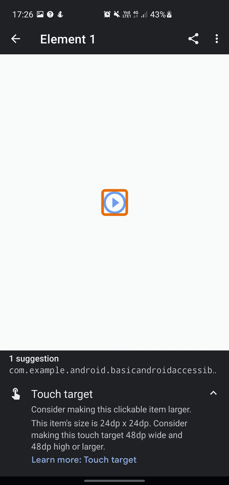

# 利用 Android 框架实现可访问性

> 原文：<https://levelup.gitconnected.com/leveraging-android-framework-for-accessibility-69da89a2adb7>

## 如果你提供了一个有用的服务，为什么要限制谁能得到它呢？

如果你正在开发一个应用程序，只有你一个人可以使用它是不够的。我们必须对任何人开放我们的应用，不管他们如何与他们的设备交互。这可以针对多种屏幕尺寸进行开发，填充您的 ImageView 所需的内容描述，甚至考虑您在应用程序中使用的调色板。

从现实主义者的角度来看，包容所有人不仅是一种道德义务，也是一个绝佳的商业机会。我们行业的紫色英镑价值 171 亿英镑。仅在英国，这就是残疾人的消费能力。让你的应用程序变得易于访问可以显著提高利润率。

最后，如果这还不足以让你满意，2018 年发布的法律规定，任何网站或移动应用程序在上线前都必须完全无障碍。 [**无障碍法规**](http://www.legislation.gov.uk/uksi/2018/952/made) 旨在帮助确保在线公共服务对所有用户都是无障碍的，包括残疾人，这使得这变得非常严重。

## 可访问性类型

我们通常将 Android 开发中的可访问性分为不同的类别，现在不是对人进行分类，而是找到一个共同问题的解决方案，让我们面对它。我们都会变老，也就是说，在你生命中的某个时刻，以下可及性类别之一很可能会影响到你——读者:

*   耳聋和重听
*   运动损伤
*   认知障碍
*   失明和视觉障碍。

在这篇文章中，我希望为您提供一些深入的知识，以便我们可以一起为 Android 应用程序开发创造一个更具包容性的未来。

—让我们投入进去吧！

## 对讲系统

Talkback 是一款适用于 Android 设备的谷歌屏幕阅读器。它在引擎盖下为我们做了很多工作，以不同的方式翻译我们在视图中构建的内容。让我们来探索这些:

*   语音——对讲应用程序将向用户宣布问题，以指示视图中的内容。
*   盲文—可以通过蓝牙连接和使用外部盲文机器。使用它，用户可以感觉到屏幕上的内容。
*   开关-开关可以通过蓝牙连接，对于在应用程序中执行用力动作(如滑动)有困难的人来说可能很有用。

现在，Android 框架可以翻译成页面上的对讲，但开发人员必须了解对讲，才能有效地利用其功能。在下一节中，我们来研究一下这个问题。

## 无障碍扫描仪

让我们使用 Google Play 上的[可访问性扫描器](https://play.google.com/store/apps/details?id=com.google.android.apps.accessibility.auditor)应用来调查这些问题。[可访问性扫描仪](https://play.google.com/store/apps/details?id=com.google.android.apps.accessibility.auditor)是谷歌开发的一款应用，目的是指出你的应用程序中简单的可访问性问题。然而，糟糕的是，如果你的元素提示和图片描述没有意义，应用程序不会告诉你重新编写你的标题和描述。T4 总是建议让真正的用户给出建设性的反馈来帮助改善这些问题。也就是说，在合并到主分支之前，它仍然是在您的要素上运行的有用工具。

如果你愿意，你可以去 play store 看看这些例子。这里可以下载 app [。您还需要](https://play.google.com/store/apps/details?id=com.google.android.apps.accessibility.auditor)[演示应用程序](https://github.com/googlecodelabs/android-accessibility)。

让我们来看看我在演示应用程序上运行扫描仪时遇到的前 3 个问题。

## 文本对比

这是巨大的。我们需要易读的文本。有时候对你自己来说，它看起来很完美。它可以让我们从椅子上站起来，惊叹于我们新创建的布局。我们几乎是带着心中火热的激情来吹嘘的……但不是每个人都能看到你能看到的？那么，我们怎样才能让每个人都有同样的激情呢？我们必须首先考虑视觉障碍的常见类型；**丧失中央视觉、丧失周边(侧面)视觉、视觉模糊、极度光敏感&夜盲症**让它们影响我们的设计。

我们在 Android 应用程序中创建主题，利用颜色对比度，同时牢记我们的设计决策。让我们先来看看色彩对比。在 WCAG 2 中，对比度是对两种颜色之间感知的“亮度”或亮度差异的一种度量(从不使用“颜色对比度”这一术语)。这种亮度差异被表示为从 1∶1(例如白色对白色)到 21∶1(例如白色对黑色)的比率。给出一个参照系，在白色背景上:

*   纯红(#FF0000)的比例是 4:1。
*   纯绿色(# 00ff 00)1.4:1 的比例非常低。
*   纯蓝(#000FF)的对比度为 8.6:1。

WebAIM 有一个很棒的对比度检查器。查看此处的以确保您的应用程序颜色具有正确的对比度。WebAIM 也有一个 API，我们可以用它来动态地为我们的用户改变颜色，并通过调用下面的 URL 获得 JSON 响应。这真的很有帮助，因为我们可以通过或失败不同大小的文本。如果你需要为某个色盲的人动态地改变颜色，这可能会很有用。

谷歌建议所有文本的最小对比度应该是 **4.5:1** ，然而，对于大字体或粗体文本， **3.0:1** 被认为是可以接受的。这是朝着正确方向迈出的一大步。我们有一个指南，根据颜色和大小来告诉我们我们的文本是否可访问。

你可以在下面看到一个对比度差的例子，因为扫描仪向我们显示了一个问题所在的黄色圆圈。这款应用甚至很友好，点击黄色圆圈就能提出改进建议。这个屏幕可以让你尝试各种颜色，直到你找到完美的颜色对比。

既然我们已经发现我们的样式不可访问，我们可以做的是通过 [**创建一个新的样式**](https://developer.android.com/guide/topics/ui/look-and-feel/themes#Styles) 或 [**扩展和自定义一个设置了新属性的样式**](https://developer.android.com/guide/topics/ui/look-and-feel/themes#Customize) 来更改我们的样式，以便它们可以在您的应用程序中重复使用，从而为视障人士创建一个一致且可访问的用户界面。您还可以 [**创建一个主题**](https://developer.android.com/guide/topics/ui/look-and-feel/themes#CustomizeTheme) 轻松改变整个应用程序的颜色。

## 项目标签

当 Talkback 向用户宣布问题时，由于我们设计应用程序的方式，Talkback 可能无法宣布问题。甚至可能是我们没有在布局中包含核心 XML 来利用对讲功能。

下面的截图显示了可访问性扫描仪圈出了一个我们可能没有标签的区域。那么我们能做些什么呢？

**提示** —在我们的编辑文本视图中，我们可以使用属性 ***提示*** ，这是一个常用的输入示例。如果我告诉你这个提示对你的可访问性非常重要呢？您可以输入符合逻辑的提示。在下面的示例中，我们将它存储在 values xml 中。

我们还可以决定添加一个文本视图，并使用 ***标签 for*** xml 属性将一个文本视图连接到一个编辑文本字段。然后，该编辑文本字段将使用文本视图作为标签，并按照对讲的正确顺序首先读出标签。这里的 所示为 [**的一个例子。**](https://support.google.com/accessibility/android/answer/6378120)

> **注意—** 如果用户在可编辑字段中输入了文本，屏幕阅读器会朗读文本来代替标签。

**标签** —很像 web 版本的 alt 属性 xml property contentDescription 用于描述我们的图像。我们应该将它添加到我们的图像视图中。我们可以用它来告诉用户一些关于图像的逻辑信息。

*   这是什么？
*   点击它会做什么？
*   为什么会在那里？

> **注意** — *装饰性图像或不能以图形方式传达有意义信息的图像不需要内容标签。在这些情况下，设置* `*"@null"*` *的一个* `*android:contentDescription*` *属性或者* `*"no"*` *的一个* `[*android:importantForAccessibility*](https://developer.android.com/reference/android/view/View.html#attr_android:importantForAccessibility)` *属性。*

## 触摸目标

我想讨论的第三个也是最后一个问题是**触摸目标。你可以把这想象成游戏中的“击中盒子”。如果视图(如图像或按钮)太小而无法单击，这将在可访问性扫描仪中引发触摸目标可访问性问题。**

我们可以从下面的截图中看到，我们有一个小的图像，扫描仪的建议是，我们将图像增加到 4 倍的大小。我想这会产生各种各样的设计问题，但是有不同的方法来解决这个问题。

**填充** —我们可以在图像周围添加填充，使点击框更大。这是一个绝妙的主意，因为它不会以任何方式扭曲图像。

**最小宽度**和**最小高度—** 属性也可以使用，但是这些属性会扭曲图像，并可能给你的设计带来问题。

更新布局中图像的大小后，你的应用程序将立即变得对有运动障碍的人更加友好。

# 概括起来

*   让每个人都可以使用我们的应用
*   编写新功能时，使用**辅助功能扫描仪**进行测试
*   ***提示*** 和 ***内容描述*** 属性用来描述内容
*   使用对比度模型来确保前景和背景颜色清晰可辨
*   ***主题***‘和’***风格***‘鼓励一致性
*   为运动障碍用户使用更大的“触摸目标”
*   **始终**优先考虑用户反馈。

我希望能鼓励你在应用程序中考虑可访问性。如果你想听到更多关于这个的信息，请给我一些掌声。👍

延伸阅读:

*   提高 app 易用性的原则 [#](https://developer.android.com/guide/topics/ui/accessibility/principles)
*   测试你的应用程序的可访问性 [#](https://developer.android.com/guide/topics/ui/accessibility/testing)
*   材料设计—无障碍 [#](https://material.io/design/usability/accessibility.html#understanding-accessibility)