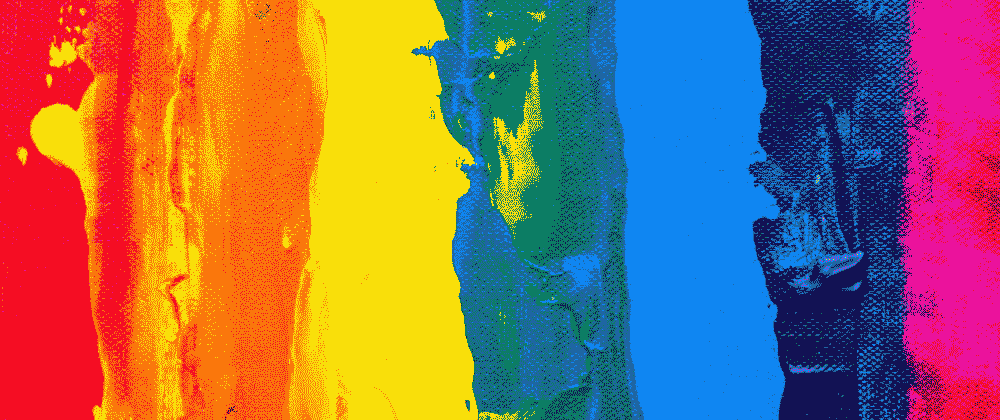

# CSS 中编码的 LGBTQ+标志

> 原文：<https://levelup.gitconnected.com/lgbtq-flags-coded-in-css-cc844a12afc7>

## 不同 LGBTQ+标志背后的含义，以及如何用 CSS 和单个 HTML 元素对它们进行编码。

六月是骄傲月。在本文中，我将回顾一些主要的 LGBTQ+标志，以及我们如何在 CSS 和单个 HTML 元素中对它们进行编码(保持它们的响应性，以便它们可以兼作图标)。)

我不打算展示如何编码所有的标志。它们有几十种，许多都是同一个想法的不同版本，只是颜色不同。所以我将只添加其中一个标志的代码，而不谈论“衍生”版本。在文章的底部，你可以找到一个用 CSS 编码的 [35 个不同的 LGBTQ+标志的演示。](https://codepen.io/alvaromontoro/pen/NWyBrZJ)

# 旗帜

## 吉尔伯特·贝克骄傲旗

美国同性恋者用粉红色的三角形来象征同性恋运动(见下文)，但它有一个黑暗的过去。20 世纪 70 年代，电影制作人小阿蒂·布雷桑和政治活动家哈维·米尔克要求吉尔伯特·贝克开发一个新的符号。代表希望、自由和运动“重生”的东西。1977 年，他设计了一面有八种颜色的旗帜，每种颜色都有它的含义:粉色代表性，红色代表生命，橙色代表治愈，黄色代表阳光，绿色代表自然，蓝绿色代表魔法/艺术，蓝色代表宁静，紫色代表精神。

由水平线组成的标志很容易在 CSS 中构建。我们使用一个`linear-gradient`来定义每种颜色的停止点。例如，吉尔伯特·贝克的旗帜有八种颜色，因此停止点将出现在 12.5%的倍数中(因为 100 / 8 = 12.5)。我们甚至可以使用 HTML 颜色:热粉色、红色、橙色、黄色、绿色、暗青绿色(比青绿色更接近原始颜色)、蓝色和靛蓝。

## 1978 年骄傲旗

一年后，国旗被修改，删除了粉红色的酒吧。这不是一个政治选择(与代表性别的粉红色无关)，而是一个实际的选择:[很难获得那种粉红色的材料](https://www.rd.com/list/lgbtq-flags/#card-3/)，所以他们决定放弃它，以便满足对彩虹旗帜的需求(这种需求在哈维·米尔克被谋杀后有所增加)。)

像吉尔伯特·贝克旗一样，我们将使用一个`linear-gradient`。但这一次，它有七种颜色，使它稍微复杂一点(但不多)。诀窍是:将数字四舍五入到两位小数(或者使用冗长的`calc()`函数)。旗帜不会是 100%完美的，但也是无法区分的。

## 传统同性恋骄傲旗

一年后的 1979 年，这面旗帜失去了另一种颜色。这一次是为了装饰:他们要去[把国旗一分为二来装饰旧金山游行路线](https://en.wikipedia.org/wiki/Rainbow_flag_(LGBT)#1978_to_1979)上的路灯，他们需要偶数个颜色，所以他们把颜色减少到了六个(路灯每边三个。)然后绿松石就掉了。

这个标志类似于 CSS: a `linear-gradient`中前面的标志，这次有六个停靠点，比有七个停靠点时稍微简单一些。这次会是 16.66%的倍数(16.66，33.33，50 等。)

## 进步骄傲旗帜

近年来，传统同性恋骄傲旗的更新版本变得流行起来。它包括象征有色人种的黑色和棕色条纹，以及与变性国旗相同的浅蓝色、粉色和白色。黑线有两层含义:它代表黑人和荣誉，也是对那些死于艾滋病的人的纪念。

为了在 CSS 中绘制这个旗帜，我们从上一个旗帜(传统的同性恋骄傲旗帜)的代码开始，然后添加圆锥形渐变以形成左侧的三角形。在这种情况下，使用圆锥形渐变的一个问题是线条可能太尖锐，看起来像像素。为了避免这种情况，我们可以使用伪元素或两个线性渐变(但这带来了不同的问题，因为 Chrome 有超过四个停止点的渐变问题)。

## 粉色三角旗

粉红色的三角形是压迫的象征。纳粹用一个倒置的粉红色三角形(或" [*die Rosa-Winkel*](https://time.com/5295476/gay-pride-pink-triangle-history/) ")来标识同性恋者，他们在集中营里遭受了最恶劣的条件。几十年后，同性恋者穿着它来提醒过去，并承诺防止历史重演。

在 CSS 中，一种简单的绘制三角形的方法是使用一个`conic-gradient`。在这种情况下，我们希望有一个二次曲线渐变，其原点在底部的中心(`at 50% 100%`)，起点度数为 330 ( `from 330deg`)。这样，它将生成一个等边三角形):

## 盟友骄傲旗帜

这面旗帜来历不明。[它创建于 2000 年代末](https://www.oprahdaily.com/life/relationships-love/g36332366/pride-flags-meanings/?slide=25)，象征着异性恋者和异性恋者(黑白条纹)对 LGBTQ+群体的支持，以及他们为平等和代表权而斗争。彩虹旗的颜色被做成代表“盟友”的 A 形

这面旗帜是吉尔伯特·贝克的旗帜在文章中的最后一个变体。我们可以用一个`repeating-linear-gradient`做黑白条纹，然后用一个伪元素把传统的同性恋骄傲旗放在上面，用`clip-path`剪成 A 形。

## 两性骄傲旗帜

阴阳人骄傲旗与我们目前看到的旗帜不同。这是故意的。澳大利亚 OII 用金色和紫色(被认为是中性的)和一个代表整体和完整的圆形[创造了它。](https://outrightinternational.org/content/flags-lgbtiq-community)

从编码的角度来看，阴阳人骄傲标志很简单:一个基本的径向渐变就可以了(颜色可以用 HTML 命名为 colors: gold 和 darkviolet)。唯一重要的是记得添加关键字`circle`，这样它就是一个圆形而不是椭圆形(因为国旗不是方形的)。)

## 非洲的骄傲旗帜

这面旗帜是由创意机构 [Joe Public United 在 2019 年约翰内斯堡骄傲期间创造的，以代表非洲 LGBTQ+ME 社区的多样性](https://joepublicunited.co.za/work/Pride-of-Africa)。老实说，我不知道这面旗帜有多主流和广泛(网上有许多版本，这将有助于保持它想要代表的多样性)，但我不得不说，这是一股新鲜空气。

从 CSS 的角度来看，非洲的骄傲旗帜是一个巨大的挑战(或者说是一场噩梦；这取决于你对这种语言的喜爱程度):线性、放射状、圆锥形和重复线性渐变，不同的位置、大小和颜色。我的这个标志版本并不完美，但我很喜欢编码它。

## 实验室的女同性恋骄傲旗

这面旗帜是象征性的(也是坏屁股):[拉布里斯是亚马逊人使用的神话中的双齿斧](https://heckinunicorn.com/blogs/heckin-unicorn-blog/what-is-the-lesbian-labrys-pride-flag-and-what-does-it-mean)；倒置的黑色三角形与粉色三角形有相似的起源，紫色与女同性恋联系在一起。不幸的是，这面旗帜并没有广泛传播，主要有两个原因:一个同性恋者设计了它，一些跨性别群体试图将自己与实验室联系起来。

这个看起来很酷的标志通过使用掩码(对于 ax)相对容易用 CSS 编码。我们从粉色三角形作为基础开始(改变颜色和大小)，然后使用`::before`和`::after`伪元素来绘制 labrys 的刀片和手柄。

## 其他标志

许多其他的 LGBTQ+标志代表了社区内的不同群体:女同性恋者、半浪漫主义者、异性、非二元、无性等等。传统的同性恋骄傲旗也有很多变化。

我没有把重点放在这些方面，因为它们主要是上面的标志(不同颜色的堆叠水平线)的衍生物，可以通过调整我们已经完成的标志的值来实现。例如:

*   泛性骄傲旗类似于性别酷儿骄傲旗，但有粉色、金色和浅蓝色。
*   女同性恋骄傲旗和 1978 年的骄傲旗(7 格)是一样的，但是有不同的橙色、白色和粉色。
*   Aromantic 骄傲旗类似于变性骄傲旗，但有绿色、白色、灰色和黑色。
*   半性骄傲标志是一个接近(但不相似)双性恋标志的线性渐变，增加了一个`conic-gradient`，就像进步骄傲标志一样。
*   诸如此类。

双性恋骄傲旗也属于这一类:我们可以从跨性别骄傲旗中进行编码，第一和第二格使用相同的颜色，第四和第五格使用另一种颜色。

我用一个 HTML 元素在 CSS 中编码了 35 个 LGBTQ+标志(另外，它们具有响应性，可以很容易地用作图标😉).[你可以在这个 CodePen 演示中看到它们](https://codepen.io/alvaromontoro/full/NWyBrZJ/aa5ea4787fcfae23e10b991bff1fa2a1):

# 结论

这篇文章回顾了一些历史和今天使用的一些最具代表性的 LGBTQ+旗帜背后的原因。

还有，我们练了一点 CSS。特别是，[背景图像和渐变](https://developer.mozilla.org/en-US/docs/Web/CSS/CSS_Images/Using_CSS_gradients)(线性、放射状、圆锥形和重复线性)，以及伪元素、剪辑路径和遮罩以及颜色。

希望你喜欢这篇文章，并对历史和/或 CSS 有所了解。我喜欢写它，研究旗帜以及它们是如何形成的。感谢阅读。

# 参考

*   《32 面 LGBTQ 骄傲旗帜背后的意义》,作者伊丽莎白·段丽阳，健康(《读者文摘》品牌)。
*   奥普拉日报上的 25 面 LGBTQ+骄傲旗及其含义
*   [彩虹旗:起源故事(彩虹旗是如何被创造出来的)](https://gilbertbaker.com/rainbow-flag-origin-story/)，吉尔伯特·贝克基金会
*   [骄傲旗帜信息](https://www.wcsu.edu/pridecenter/pride-flags/)，西康涅狄格州立大学
*   [奥利维亚·B·瓦克斯曼在《时代》杂志上写道，纳粹政权的粉色三角标志是如何被改造成 LGBTQ 的骄傲](https://time.com/5295476/gay-pride-pink-triangle-history/)
*   [50 种不同的 LGBTQ 旗帜及其背后的含义！](https://queerintheworld.com/different-lgbtq-flags-and-meaning/)论世界上的酷儿
*   [彩虹旗(LGBT)](https://en.wikipedia.org/wiki/Rainbow_flag_(LGBT)) ，维基百科上的文章
*   [使用 CSS 渐变](https://developer.mozilla.org/en-US/docs/Web/CSS/CSS_Images/Using_CSS_gradients)，关于 MDN 的文章