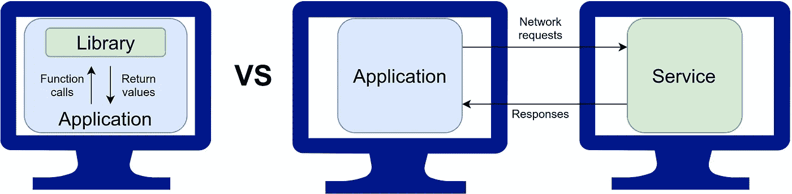
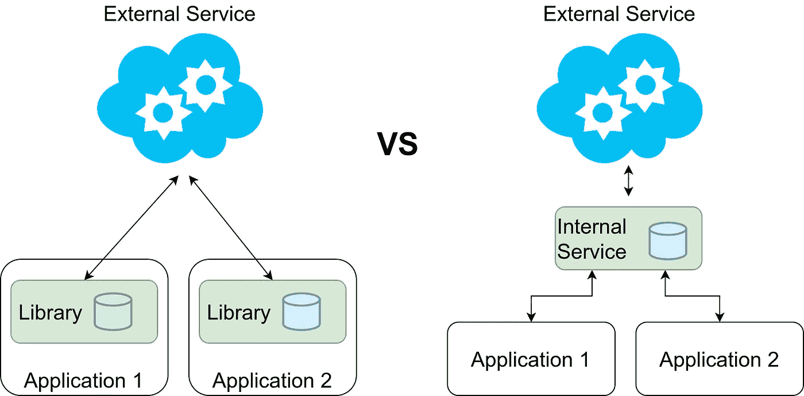
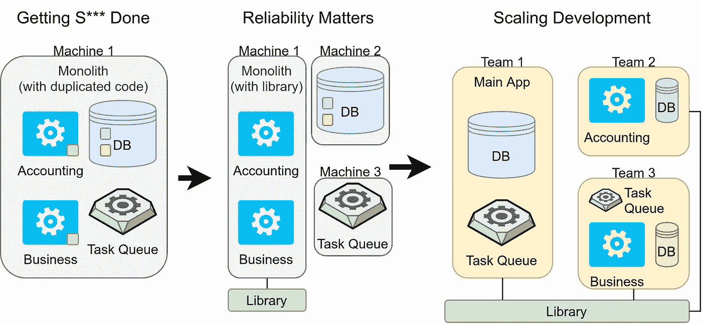

# 图书馆与服务:需要考虑的 7 个论点

> 原文：<https://levelup.gitconnected.com/library-vs-service-7-arguments-to-consider-5088dced6022>

## 了解区别以及何时使用哪一种

共享代码可以在库中，也可以在服务中。图片由马丁·托马斯提供。

P 防止代码重复是一个软件开发原理，叫做*—**D**on**R**EPE at**Y**yourself。DRY 很重要，因为重复的代码通常意味着需要维护更多的代码。如果你需要修复一个 bug，你需要修复所有重复的地方。如果您需要扩展功能，您需要在代码的多个部分进行扩展。当一个新的开发人员调整重复代码的一部分，而忘记调整其他地方时，情况会变得更加复杂。*

*有两种非常不同的方法来保持你的代码干燥:把共享代码放在一个库中或者放在一个服务中。Eric Knipp 称之为“共享能力”( [source](https://blogs.gartner.com/eric-knipp/2013/03/20/libraries-vs-services/) )，这已经表明了抽象的不同。当您与服务交互时，您通常不想关心该服务的实现细节。在库中，您可能会更多地考虑运行时的复杂性，甚至偶尔会跳入代码中。*

*读完这篇文章，你会知道图书馆和服务之间的区别，以及什么时候你应该使用其中的一个。开始吧！*

# *差异*

**

*照片由[丹尼斯·琼斯](https://unsplash.com/@cooljonez?utm_source=medium&utm_medium=referral)在 [Unsplash](https://unsplash.com?utm_source=medium&utm_medium=referral) 拍摄*

*库是与每个应用程序一起部署的共享代码。所以这个库是应用程序的一部分，和应用程序运行在同一台机器上。库是通过函数调用来访问的。*

*相比之下，服务有自己的基础设施。这意味着它有自己的机器，但也有日志记录、监控、警报，可能还有一个随叫随到的团队来解决问题。它独立于应用程序进行部署。更新可以在服务用户没有注意到有任何变化的情况下推出。*

*通常，当我与服务交互时，我喜欢将这种交互保留在代码的一部分中。我喜欢为我交互的每个服务编写一个自己的模块。这个模块只负责服务交互。在某些情况下，服务提供这样的模块，例如用于与 AWS 服务交互的 boto3 库。我想说的是:如果你创建一个服务，你可能最终会创建一个服务*和*一个小库。*

*让我们深入探讨这种或那种解决方案的不同论点吧！*

# *#1:通话速度*

*本地机器上的函数调用在几纳秒内执行，而网络请求需要几毫秒。您可以预期网络请求比内部函数调用花费的时间多 1，000，000 倍。*

*请记住，这只是涵盖了沟通的部分，而不是实际的工作。如果要计算圆周率的第一千亿位，通信速度与工作量相比相形见绌。因此，如果呼叫的工作量很快，那么呼叫的速度只是一个参数。如果是的话，这一点显然属于图书馆。*

# *#2:通话的可靠性*

*网络总是失败。CPU 指令也可能失败，但这种情况非常罕见，大多数开发人员可以安全地忽略这种情况。*

*如果您有网络连接，您需要处理超时。您需要处理不可用的服务。因此，商业服务通常会提供服务级别协议(SLA)。有了 SLA，您可以了解服务是否可能离线太长时间，或者有一段时间可能会严重影响您自己的 SLA。*

*这一点显然适用于图书馆。*

# *#3:基础设施*

*服务通常带有自己的基础设施。它有自己的机器。这意味着您必须比在库的情况下多照顾一台机器。但这并没有结束。如果您有服务，您需要确保您有日志记录、监控、警报和潜在的随叫随到团队。*

*这使得创建库比创建服务更简单。*

# *#4:开发开销*

*我们试图遵循 DRY 原则的一个核心原因是保持低开发和维护成本。如果我们创建一个服务，与库相比，它会带来很多开销。*

*一方面，是已经提到的基础设施成本。另一方面，你现在必须考虑秘密管理和[认证/授权](https://medium.com/plain-and-simple/identification-vs-authentication-vs-authorization-e1f03a0ca885)。如何确保只有授权用户才能访问新服务？*

# *#5:可扩展性*

*您可以[水平或垂直扩展应用程序](https://medium.com/plain-and-simple/scaling-vertically-vs-scaling-horizontally-82547a77d925)。纵向扩展意味着购买更大的机器，横向扩展意味着购买第二台机器。购买更大的机器是琐碎和便宜的，直到某一点。从那时起，这就变得不可能了。如果你幸运的话，你永远不会觉得需要垂直扩展。纵向扩展要复杂得多，而且您需要在这上面花费开发时间，这通常会增加成本。*

*如果你有一个独立的服务，你可能已经接近一个允许你纵向扩展的架构。然而，这对于服务来说并不是一个强有力的论据，因为您需要关注服务的基础设施。您只是提前支付了成本，即基础设施的争论。*

# *#6:开发的灵活性*

*不同的问题需要不同的解决方案。你甚至可能想为你的部分代码转换编程语言，因为一个领域的社区更强大。虽然 Python 和许多其他编程语言都提供了外部函数接口( [FFIs](https://en.wikipedia.org/wiki/Foreign_function_interface) )，但是用不同的服务完全封装这部分可能更简单。*

*请注意，我认为开发中的灵活性是一个强有力的论据，但缺乏关于 FFI 如何工作的知识是一个弱有力的论据。如果你有不同的团队在不同的主题上工作，如果网络造成的开销不相关，那么就使用服务。*

# *#7:共享状态*

*如果我们的代码有一个无状态的部分，这表明库可能是一个好的解决方案。如果你有一个共享状态，也许一个服务更好。*

*我目前正在考虑的一个具体案例是一个外部服务，它可能不像我希望的那样可靠或快速。它需要包装在一个本地“缓存”层中，该层还抽象出外部服务的一些复杂性。*

**

*图片作者:马丁·托马斯*

*在这种情况下，并不清楚库选项比应用程序选项更好还是更差。对数据的处理使我倾向于使用服务，但是我需要处理网络的不可靠性。访问这些数据肯定需要更长的时间。*

# *图书馆与服务:一些简单的例子*

*世界是复杂的，我不能给你一个 5 步指南来决定你是否应该使用服务或图书馆。在上面这种情况下，情况就不那么明朗了。但是有一些简单的例子:*

*   ***纯算法，无共享状态**:如果你只想共享算法或者一些常量(例如 HTTP 状态码，国家名称/代码，货币，时区)，这是一个非常明确的指示，你想要一个**库**。我想到的例子有 [Numpy](https://numpy.org/) ， [Scipy](https://www.scipy.org/) ， [Tensorflow](https://www.tensorflow.org/) ，*
*   ***拥有大量数据的算法**:[谷歌地图](https://developers.google.com/maps)服务具有复杂的功能，比如“离这个 GPS 点最近的地址是哪里？”或者“从 A 到 B 最快的路线是什么？”结合大量数据来支持这些算法。服务很繁重，需要定期更新数据，实现这一点的基础架构非常复杂。利用这一点的应用程序非常简单:画出我的跑步路线。在我的导航系统中显示最快的路线。计算一下我邻居的房产面积。编写一个**服务**来消除沉重的基础设施负担是一个好主意。*
*   ***需要大量内存**:如果你有一部分代码经常需要大量内存，你可能想把它放在自己的机器上。这样，您可以更长时间地保持纵向可伸缩性。在某些情况下，像只做预测的机器学习应用程序，扩展是微不足道的:只需旋转另一台机器并以循环方式(或类似方式)服务请求。你没有一个共享的状态，只有需要在内存中的模型。所有翻译和 OCR **服务**都是很好的例子。*
*   ***只有粉碎状态，没有算法**:你可以考虑只给**直接数据库访问**。请注意，这有其自身的问题，从长远来看，这不太可能是一个好的解决方案。这可能是一个可以接受的中间解决办法。*

# *过渡*

*大型软件项目通常不是从零开始创建的，而是随着时间的推移而发展的。它始于“**完成工作**”阶段，在这个阶段，开发人员将所有东西都放在他们的本地机器或托管的 web 服务上。*

*如果事情很严重，就会进入“可靠性很重要”的阶段。在这个阶段，开发人员开始考虑如何处理更多的用户，如何以不中断用户的方式进行部署，多种环境，如本地/开发/试运行/生产、日志记录、监控和警报。开发人员开始在多台机器上运行东西，例如，数据库和应用程序在不同的机器上，特别是 CPU 密集型的东西在另一台机器上。由于 AWS，这在过去几年变得简单多了。*

*在某种程度上，需要扩大开发规模。如果你有几十个开发人员，你需要确保不是每个人都需要知道所有的事情。你需要**规模化发展**。你需要对软件进行分区。软件可以根据它们提供的价值类型来划分。团队有明确定义的责任，并拥有他们的技术堆栈——代码、基础设施和操作。他们需要与客户交流，需要定义他们的接口。*

*作为一个图像，它可能看起来像这样:*

**

*图片作者:马丁·托马斯*

*我见过几次的一种转变是，首先创建一个整体，让业务运转起来。当公司成长时，他们按照业务功能构建整体。例如，可能有处理会计的模块和处理分析的其他模块。当整体变得非常难以维护时，因为一切都依赖于其他一切，(微)服务被从整体中剔除。*

*我目前考虑的一个中间解决方案是上面描述的(潜在不可靠的)外部服务的问题。有可能首先创建一个库解决方案，其中不同的应用程序可以具有状态的不同部分。两个应用程序中可能都有少量数据。多个应用程序中的数据很难从库解决方案转移到服务解决方案，因为必须考虑同步机制。*

# *摘要*

*库和服务让你的代码保持干燥(**d**on t**r**EPE at**y**yourself)。库更多地集成到应用程序中，构建它们的前期成本更低。服务在基础设施级别上提供了明确的分离，但是您需要考虑网络请求的问题。*

*在许多情况下，从一个图书馆到一个服务是微不足道的。一段时间后，从一个服务转向一个图书馆可能是完全不可行的。*