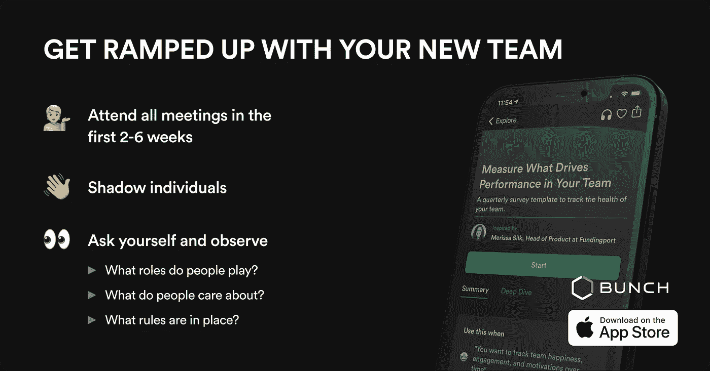
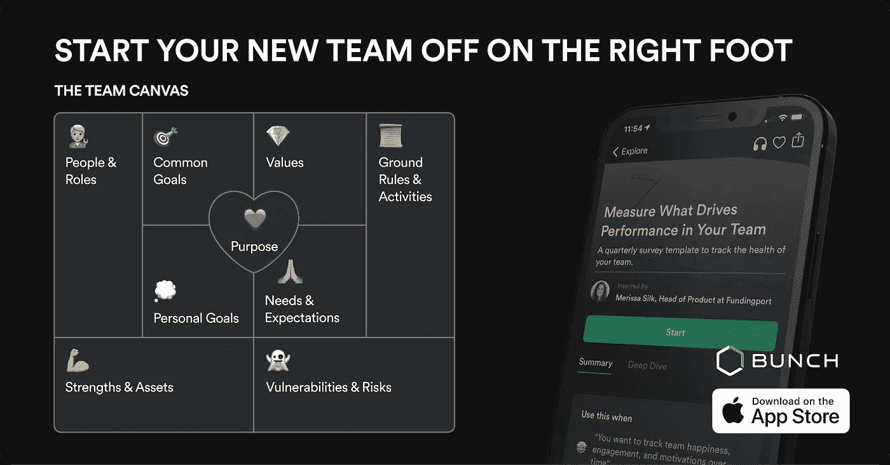
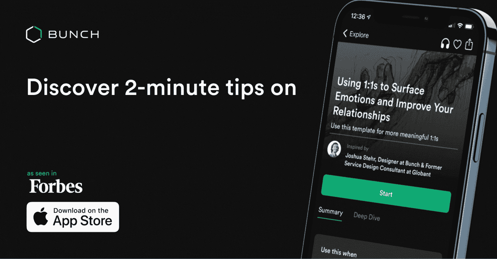

# 你听过的关于远程团队的谎言(以及如何实际领导他们)

> 原文：<https://levelup.gitconnected.com/lies-youve-heard-about-remote-teams-and-how-to-actually-lead-them-3494c654dbf0>

14 年来，fundingport 的首席产品和技术官 Merissa Silk 一直领导着远程技术团队。在这样做的过程中，她学到了作为一个只有虚拟存在的领导者的挑战和优势。

我们采访了梅丽莎，了解她领导远程技术团队的一些顶级技巧。如果你是新经理，你很幸运。梅丽莎有十几条关于如何成为一名伟大的领导者的建议，即使不在同一个房间里。

以下是她要说的:

# **👩‍⚖️澄清事实**

我听过很多关于远程团队的误解，包括但不限于:

*   了解他人并建立融洽关系变得更加困难
*   我不能相信我的团队
*   我从来不知道我的团队在做什么
*   我不知道我的团队成员是否真的在工作
*   你必须面对面地与人交流，才能建立良好的关系
*   招聘更加困难
*   入职更难

> 不要想当然地认为远程=更难。如果你从这个角度来看待团队领导，你已经失败了。

反向工作，为您的远程团队创建愿景。想想你工作过的最好的地方或者你最喜欢的团队。列一个清单，说明这项工作的特别之处，然后集思广益，用虚拟和/或异步的方式让你的新团队实现这一目标。

如果你第一次没做对，甚至第二次也没关系。如果你向你的团队展示你关心他们，你致力于建立一个伟大的团队和文化，他们会对你有耐心。

# 领导远程技术团队的新经理的 11 条建议

好的领导者会让它与他们的团队一起工作，不管他们是远程的、分布式的、并置的、同步的、异步的、混合的等等。以下是我学到的一些经验，这样你就可以快速成长为一名远程领导者。

# 👯‍♀ ️ **如何建立关系**

## **1。虚拟咖啡☕️**

当我加入一个新团队时，我喜欢和每个人预定 20 分钟的虚拟咖啡。这为建立良好的关系铺平了道路，这是我在悉尼工作时学到的。如果你已经在非正式场合认识了某人，那么委派工作或寻求支持会容易得多。我也喜欢在团队中鼓励这一点。每当有新人加入，我们都会在他们第一天的时候提供一个完整的团队虚拟咖啡，在那里我们会做简短的介绍。然后，我们在虚拟咖啡中与关键合作者一起帮助新的入门书籍，帮助他们取得成功。

## **2。休闲聊天应用签到👋**

把你的职业关系想象成一株小植物。你的植物需要偶尔浇水和照顾，否则它会开始看起来悲伤和枯萎。你的团队成员是一样的。偶尔看看他们怎么样，周末做了什么，或者他们是否有即将到来的假期计划。闲聊有助于你的团队成员知道你在那里，知道你关心他们。记住——现在不是工作聊天的时候。把闲聊时间和工作话题混为一谈会破坏你们的关系。

## **3。遮蔽😎**

了解你的团队或利益相关者的另一个方法是跟踪他们。尤其是如果你正在管理一个拥有不同技能或不同专业知识的团队，这是建立共鸣和信任的好方法。让你的团队成员向你展示他们在做什么，或者问你是否可以陪他们去开会学习和观察。我写了一堆关于这个话题的技巧——你可以在这里查看:

# 🎏如何发展团队文化

## **1。依靠你的工具** 🛠

依靠您的工具就是为您的团队协作建立正确的“工具堆栈”,然后优化您将启用工具的工作流缝合在一起的方式。如果你的协作工具不能帮助你的团队协作，那么你可能做错了。😉

一个示例工具堆栈可以是:

*   MS Teams 或 Slack 用于聊天并充当您的通信枢纽
*   文件的汇合或概念
*   吉拉或阿萨纳的项目管理和门票
*   Figma 和/或 Miro 共同设计和制图
*   缩放、会议或视频通话

例如，我喜欢使用 Confluence 作为文档中心。在这里，我写下关于一个功能如何工作的描述性信息，然后交叉链接我们已经在 Miro 中制作的图表。

随着工作的进展，我会用新的信息和链接更新合流页面，例如，到我们的 Figma 项目或相关的吉拉门票。每次我更新 Confluence 时，我还会在 MS Teams 中发布正确的团队成员@-提及，以便他们知道有新信息的审查。

然后，团队成员可以在 Confluence、Miro、Figma 或吉拉中留下内联评论，然后在 MS Teams 中让我知道他们完成了什么。

## **2。水冷通道💧**

我总是在我团队的聊天应用程序中添加一个#watercooler 频道，以此来模仿在走廊上擦肩而过或站在咖啡机旁时发生的有趣的非工作时刻

## 3.闪电聊天⚡️

通过主持灯光聊天，帮助您的团队相互了解。这可以通过 Zoom 或 ms 团队中的分组讨论室来完成，并让您的团队成员在小组中选择一个破冰问题来回答。我喜欢这些来自 Range.co 的。

## 4.给聚会带来一些活力，🥳

表情符号和 gif 可以真正帮助你的团队为异步交互带来个性和基调。不要低估一个厚脸皮表情符号的力量。

以下是我在特殊场合最喜欢的 gif/meme:

对于出色完成的工作:

当我兴奋时:

当我累的时候:

当我努力工作时:

庆祝周末:

# 🧞如何让工作变得可见

当您的团队处于远程时，每个人都需要找到让彼此都能看到工作的方法。这对你和经理都很重要，对团队成员也是如此。否则很容易让人和话题迷失或者不小心被忽略。

## 1.选择一个通信枢纽💬

我们使用微软团队作为我们的沟通和协作中心。即使工作正在我们的其他工具中进行，我们也总是确保在 MS Teams 中发布一个摘要。

## 2.创建协作系统🎨

然后，团队成员需要留下表情符号反应，以表明他们已经看到了信息，并打算做任何被要求的事情。如果你要把一些事情委托给你的团队，确保提供说明、相关工具的链接和截止日期。当你的团队成员完成工作后，他们会在帖子里让你知道有什么需要回顾的。这是一个经理和报告者如何使他们的工作互相可见的例子。

# 🚀如何晋升为领导者

## 1.过度沟通📣

当你的团队不在时，你需要付出额外的努力在他们在的地方与他们见面，以确保每个人都参与工作和决策。这通常意味着在实时会议和协作工具中不断重复自己。不可避免地，您的团队成员会有他们最喜欢的工具或细微的方式来处理通知，因此在多个渠道中重复相同的内容是保持一致性的重要方法。

## 2.迅速做出决定(然后过度沟通)👩‍⚖️

老实说，在偏远的地方，有时东西会丢失或被忽略。这是因为你没有像在办公室里那样的视觉提醒或线索。所以，我强烈建议养成快速决策的习惯。如果你的团队在你的产品交付中使用敏捷方法，那么通常“撤销”一个失误并不困难。快速决策(但不要仓促)会让你的团队保持畅通、行动和动力。

一个决定总比没有决定好，即使你最终“逆转”了它，或者在获得更多信息时做出了改变。在远程环境中，等待决策的风险更大，因为你无法“看到”人们被阻止或等待你。

# **⚠️关于一些常见打嗝的合理警告**

为了让远程工作*发挥作用*，团队成员必须相互承诺，并坚持他们既定的工作方式。如果你没有这两种成分，整个事情就会失败。

这就是为什么我喜欢使用团队画布作为我团队的工具。我们一起决定如何合作，然后每个人都有责任让人们负起责任。如果有人没有遵守协议，那么作为领导者，你有责任及时提供建设性的反馈。

我已经看到，当经理们觉得他们在团队中没有正确的承诺时，他们会求助于会让事情变得更糟的习惯——比如微观管理。所以，如果你有不断检查你的团队成员的冲动，或者你发现你自己沉迷于每个人都在做什么，后退一步，找到一种方法来重置团队。这可能是通过[复古](https://www.atlassian.com/team-playbook/plays/retrospective)、[健康监测](https://www.atlassian.com/team-playbook/health-monitor)，或者重新审视你现有的团队协议和流程。

如果您想学习如何使用团队画布，您可以在这里查看 Bunch 的另一个技巧:

# **💻今天结束前的最后一点**

如果你的团队在设计上是远程的(例如，不是因为疫情)，那么建立你的远程优先文化就从招聘开始。并非所有团队成员都希望远程工作或成为分布式团队的一员。你的招聘广告和招聘流程应该着眼于吸引那些希望远离公司、并在偏远环境中表现出色的人才。

Merissa 是众多分享他们给 Bunch 的 2 分钟建议的领导者之一。下载我们的 [***AI 领导力蔻驰***](https://apps.apple.com/app/apple-store/id1500872908?pt=121075759&ct=MEDIUM%20Merissa%20remote%20leader&mt=8) ***app 每天 2 分钟成为更好的领导者。***

👋想直接接触梅丽莎？在 Work Slack 社区加入我们的团队，在这里你可以和 Merissa 以及成千上万的其他领导者讨论所有关于领导力的事情。

🐦[在 Twitter 上关注我](https://bit.ly/3qwwVNB)或[查看我们的 YouTube 频道](https://bit.ly/3uaB8ZH)了解更多关于技术领导力的内容。

💌你也可以订阅每周简报，这是我的周日领导时事通讯。