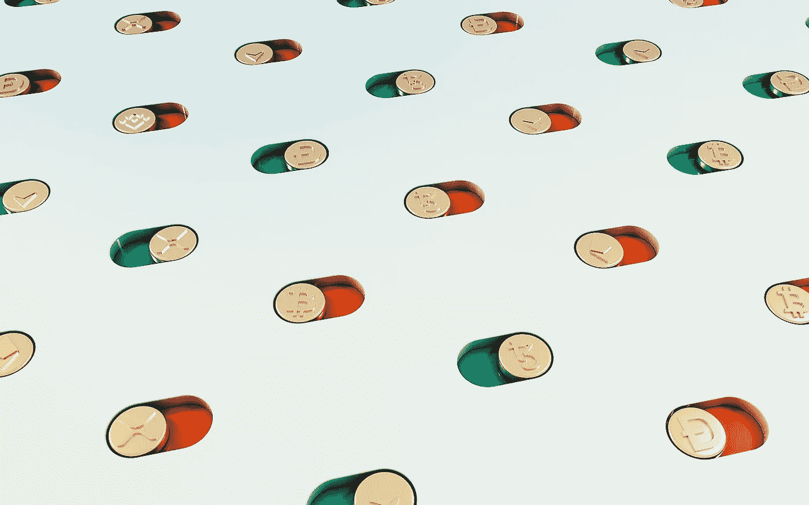
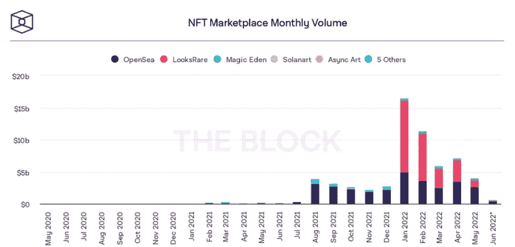
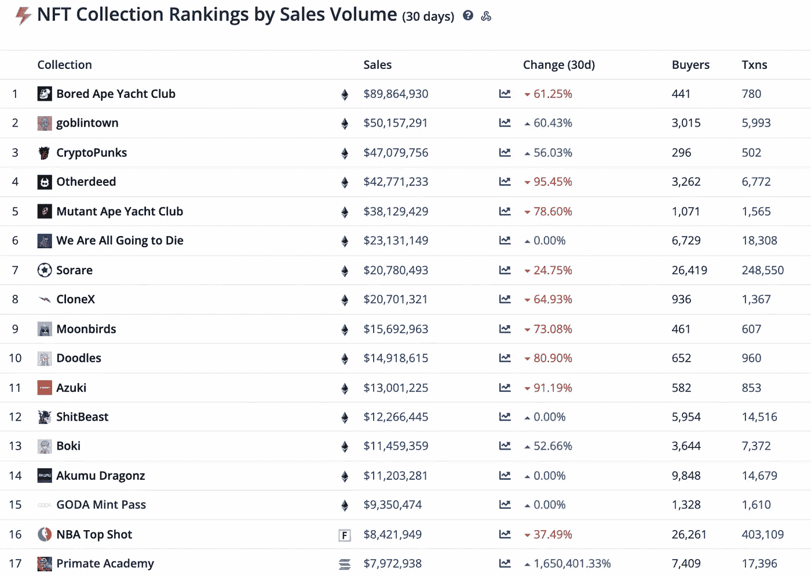

# 朋克和猿猴之后的生活:为什么非艺术收藏品有一个光明的未来

> 原文：<https://levelup.gitconnected.com/life-after-punks-and-apes-why-nfts-have-a-bright-future-away-from-collectible-art-f272250761cc>

在经历了 2021 年下半年的疯狂和 2022 年的强劲交易量后，NFT 艺术品市场[像 Bored Ape Yacht Club、CryptoPunks 和 Pudgy Penguins 已经开始急剧下滑，因为普遍的市场低迷影响了代币的价值。](/what-is-an-nft-b8445c975005)

根据 DappRadar 的数据，自 2021 年 6 月以来，NFT 的月销售额首次低于 10 亿美元。与此同时，世界上最大的 NFT 交易所 OpenSea 的销售量自 5 月以来下降了 75%，交易量与 2021 年 7 月持平。

除此之外，市场上最受欢迎的不可替代代币的价格也出现了下跌。Bored Ape 游艇俱乐部(BAYC)备受追捧的[系列在过去一个月销量下降了约 63%](https://dappradar.com/nft) ，销售额也下降了 15%。

*(图片:*[*BeInCrypto*](https://beincrypto.com/nft-marketplace-volume-12-billion-2022-lows/)*)*

BeInCrypto 研究显示了市场下滑的规模。根据加密货币新闻平台的数据，截至 2022 年 5 月，加密货币市场的总交易量为 40 亿美元。这代表着从同年 4 月记录的 71.8 亿美元的快速大幅回调。

领先的市场，OpenSea 在此期间吸引了最高的交易量，贡献了 26 亿美元，同时其他领先的平台如 LooksRare，Magic Eden 和 Solanart 也做出了贡献。

就像股票交易平台一样，这些 NFT 市场是广泛用于代币买卖的数字平台。尽管一些世界领先的交易所提供了越来越多的加密货币钱包，允许存储非交易货币，但大多数用户都将不可替代的代币存储在他们最喜欢的市场上。

为了进一步了解下滑的规模，2022 年 1 月，NFT 的总销量为 165.7 亿美元，LooksRare 活动的激增仅贡献了 111 亿美元，推动了活动的激增。总的来说，2022 年 5 月的交易量比 1 月低 12.57 美元，下降了 75%——6 月的交易量预计会更低。

# 建立在公用事业基础上的未来

尽管 NFT 交易量普遍下降，但并非所有投资者都对不可替代代币的未来持悲观态度。虽然围绕 NFT 艺术收藏的可持续性有很多问题可以提出，但围绕基于效用的代币的潜力及其在未来技术中的作用的疑问要少得多。

在 6 月份举行的 Global Rockstar 沙盒峰会 Web3 特别会议上，公司首席执行官克里斯托夫·施特劳布发表演讲，他声称 NFTs 可以为艺术家“将未发布的内容货币化”铺平道路；恢复目录；建立更强的粉丝参与度；并通过技术提高流程效率。”

“众所周知，NFT 不能仅仅是 JPEGs。他们可以包含真正的价值，”[施特劳布补充道](https://musically.com/2022/06/29/global-rockstar-talks-music-nfts-they-can-contain-real-value/)，然后强调出售 NFT 音乐版权可以给音乐人带来更公平比例的版税。

“我们 100%相信音乐非功能性传播会一直存在:如果它们包含真正的价值；如果他们在解决实际问题；如果它们是可信的和合法的；以及这些平台背后的模式是否公平和可持续。”

音乐产业只是 NFTs 可以帮助革新的众多领域之一。有证据表明，市场情绪正稳步开始越来越多地转向比我们已经习惯于在社交媒体等领域看到的艺术品更具实用性的代币。

*(图片:*[*cryptoslamp！*T9*)*](https://cryptoslam.io/)

虽然 NFT 空间最大的名字仍然在数量上占据大部分图表，但我们开始看到更多基于公用事业的项目成为空间前 20 名集合中的领军人物。

除了无聊的 Ape 游艇俱乐部和 Cryptopunks，我们可以看到 NFT 的游戏，如 Otherdeed，Sorare 和 NBA Top Shot 占据了排名的首位。

通过 NBA Top Shot，用户可以通过交换球员在比赛中的视频 NFT，将篮球交易卡游戏带到数字前沿。这个概念已经[传播到 NFL 和 UFC](https://www.forbes.com/advisor/investing/cryptocurrency/nba-top-shot/#:~:text=NBA%20Top%20Shot%20is%20an,Kevin%20Durrant%20and%20Klay%20Thompson.) ，类似的项目在不可替代的领域出现。

与此同时，Sorare 是 NFTs 如何支持一种全新的玩梦幻足球的方式的一个例子，通过这种方式，球员们购买并交换交易卡，以创建一个 5 人团队，根据每个球员的现实生活表现赢得奖金。

2021 年 9 月，Sorare 在欧洲有史以来最大的 B 轮融资中筹集了 5.797 亿€，估值约为 36 亿€。该平台最近甚至宣布，它打算进军美国职业棒球大联盟，以进一步扩大其在体育界的效用。

如此强劲的增长指标表明，非专利技术领域的前景很可能是光明的。尽管随着市场不断被新的限量收藏稀释，BAYC 和 CryptoPunks 等基于艺术的收藏的价值可能会受到质疑，但 NFT 与在线游戏、音乐和艺术等有形实用工具，甚至企业奖励计划等许多其他潜在使用案例的内在联系表明，该行业肯定有一个光明的未来。

# 分级编码

感谢您成为我们社区的一员！更多内容请参见[升级编码出版物](https://levelup.gitconnected.com/)。
跟随:[推特](https://twitter.com/gitconnected)，[领英](https://www.linkedin.com/company/gitconnected)，[通迅](https://newsletter.levelup.dev/)
**升一级正在改造理工大招聘➡️** [**加入我们的人才集体**](https://jobs.levelup.dev/talent/welcome?referral=true)