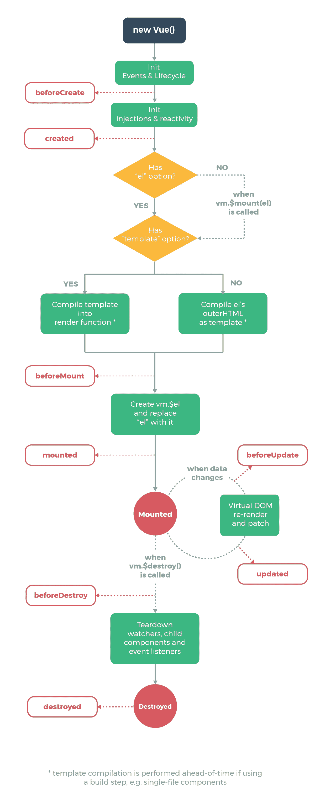

# Vue 实例的生命周期挂钩

> 原文：<https://levelup.gitconnected.com/lifecycle-hooks-of-the-vue-instance-19a2b06dc694>


由 [Beata Ratuszniak](https://unsplash.com/@beataratuszniak?utm_source=medium&utm_medium=referral) 在 [Unsplash](https://unsplash.com?utm_source=medium&utm_medium=referral) 拍摄的照片

Vue.js 是一个易于使用的 web 应用框架，我们可以用它来开发交互式前端应用。

在本文中，我们将研究 Vue 实例的生命周期挂钩。

# Vue 实例生命周期挂钩

每个 Vue 实例都经历一个生命周期。生命周期事件可以用函数来处理，这些函数是生命周期挂钩。

例如，当创建一个 Vue 实例时，调用`created`钩子。

我们可以如下处理 Vue.js 发出的`created`事件:

```
new Vue({
  data: {
    foo: "bar"
  },
  created() {
    console.log(`foo is ${this.foo}`);
  }
});
```

那么我们应该从`console.log`中看到`foo is bar`。一旦创建了 Vue 实例并设置了初始数据，就会调用`created`钩子。

这就是为什么我们会从`console.log`看到这样的输出。

注意，我们不能对生命周期挂钩使用箭头函数，因为我们引用了来自`this`的属性，它是 Vue 实例。

还有其他生命周期挂钩，如`mounted`、`updated`、`destroyed`。

# 生命周期图

完整的生命周期图如下。它概述了创建新 Vue 实例的整个工作流程。

红色的圆角矩形有一个钩子叫做。



vuejs.org 的好意

# 创作挂钩

当 Vue 实例开始它的初始化过程时，创建钩子被调用。它让我们在 Vue 实例被添加到 DOM 之前做一些事情。

这个钩子也在服务器端渲染时运行

我们不能访问这个钩子中的`this.$el`(目标挂载元素)或 DOM，因为此时没有进行任何 DOM 操作。

## 创建前

`beforeCreate`钩子在初始化期间运行。`data`已被激活，`events`尚未设置。

例如，如果我们有:

```
new Vue({
  data: {
    foo: "bar"
  },
  beforeCreate() {
    console.log("beforeCreated called");
  },
  created() {
    console.log(`foo is ${this.foo}`);
  }
});
```

然后我们看到:

```
beforeCreated called
foo is bar
```

这确认了`beforeCreate`在`created`之前被调用。

## 创造

由于 Vue 实例已经初始化，所以`data`和`events`在`created`钩子中可用。

例如，如果我们写:

```
new Vue({
  data: {
    foo: "bar"
  },
  created() {
    this.foo = "baz";
    console.log(`foo is ${this.foo}`);
  }
});
```

然后我们得到:

```
foo is baz
```

因为我们在记录值之前改变了`created`钩子中`this.foo`的值。


照片由[维多利亚迪化薛](https://unsplash.com/@applexue?utm_source=medium&utm_medium=referral)在 [Unsplash](https://unsplash.com?utm_source=medium&utm_medium=referral) 上拍摄

# 安装挂钩

挂载钩子在 DOM 操作完成时运行，包括将 Vue 实例挂载到指定的元素。

我们可以用它来访问或修改组件的 DOM。

## 安装前

`beforeMount`钩子在初始渲染发生之前和模板或渲染函数编译之后运行。

在服务器端渲染期间不会调用它。

例如，如果我们写:

```
new Vue({
  el: "#app",
  data: {
    foo: "bar"
  },
  created() {
    console.log(`created called`);
  },
  beforeMount() {
    console.log(`beforeMount called`);
  }
});
```

然后我们得到:

```
created called
beforeMount called
```

## 安装好的

当调用`mounted`钩子时，我们可以访问组件、模板和 DOM。

它经常用于初始化我们自己的数据，比如通过网络获取数据和集成非 Vue 库。

例如，如果我们在`src/index.js`中有以下内容:

```
new Vue({
  el: "#app",
  data: {
    foo: "bar"
  },
  beforeMount() {
    console.log(this.$el.textContent);
  }
});
```

以及`index.html`中的以下内容:

```
<!DOCTYPE html>
<html>
  <head>
    <title>Hello</title>
    <meta charset="UTF-8" />
    <script src="[https://cdn.jsdelivr.net/npm/vue/dist/vue.js](https://cdn.jsdelivr.net/npm/vue/dist/vue.js)"></script>
  </head> <body>
    <div id="app">foo</div>
    <script src="./src/index.js"></script>
  </body>
</html>
```

然后我们让`foo`登录，因为我们在 ID 为`app`的`div`中有`foo`。

# 更新挂钩

当我们的组件使用的一个反应属性改变或者我们手动触发重新渲染时，更新钩子被调用。

它们对于检查组件何时被重新渲染很有用。

但是，我们应该使用计算属性或观察器来跟踪反应性属性的变化。

## 更新前

`beforeUpdate`在组件中的数据更改之后运行，就在 DOM 更新和重新呈现之前。

它让我们在 DOM 重新呈现之前获得新的状态。

例如，如果我们在`src/index.html`中有以下内容:

```
new Vue({
  el: "#app",
  data: {
    foo: "bar"
  },
  beforeUpdate() {
    console.log(this.foo);
  },
  methods: {
    toggle() {
      this.foo = this.foo === "bar" ? "baz" : "bar";
    }
  }
});
```

以及`index.html`中的以下内容:

```
<!DOCTYPE html>
<html>
  <head>
    <title>Hello</title>
    <meta charset="UTF-8" />
    <script src="[https://cdn.jsdelivr.net/npm/vue/dist/vue.js](https://cdn.jsdelivr.net/npm/vue/dist/vue.js)"></script>
  </head> <body>
    <div id="app">
      <p>{{foo}}</p>
      <button [@click](http://twitter.com/click)="toggle">Toggle</button>
    </div>
    <script src="./src/index.js"></script>
  </body>
</html>
```

然后，当我们单击切换按钮时，我们可以看到在`beforeUpdate`方法的`console.log`调用中记录的值变化。

## 更新

在我们的 Vue 实例上的数据改变和 DOM 重新呈现之后,`updated`钩子运行。

例如，如果我们在`src/index.js`中有以下内容:

```
new Vue({
  el: "#app",
  data: {
    foo: "bar"
  },
  updated() {
    console.log(this.$refs.foo.textContent);
  },
  methods: {
    toggle() {
      this.foo = this.foo === "bar" ? "baz" : "bar";
    }
  }
});
```

以及`index.html`中的以下内容:

```
<!DOCTYPE html>
<html>
  <head>
    <title>Hello</title>
    <meta charset="UTF-8" />
    <script src="[https://cdn.jsdelivr.net/npm/vue/dist/vue.js](https://cdn.jsdelivr.net/npm/vue/dist/vue.js)"></script>
  </head> <body>
    <div id="app">
      <p ref="foo">{{foo}}</p>
      <button [@click](http://twitter.com/click)="toggle">Toggle</button>
    </div>
    <script src="./src/index.js"></script>
  </body>
</html>
```

然后，我们可以通过记录如下值来获取`ref`设置为`foo`的`p`元素的文本内容:

```
console.log(this.$refs.foo.textContent);
```

在`updated`钩子中，当我们点击切换按钮时，我们可以看到它的新值。

# 破坏钩

这些钩子在 Vue 实例被销毁时运行。因此，我们可以在那里运行清理代码。

这些钩子在服务器端渲染时不会运行。

## 销毁前

`beforeDestroy`在拆卸前运行。我们的 Vue 实例仍然存在并正常工作。

因此，我们可以在这里运行清理代码。

例如，我们可以如下使用它:

```
new Vue({
  el: "#app",
  data: {
    foo: "bar"
  },
  beforeDestroy() {
    this.foo = null;
  }
});
```

## 破坏

这是在销毁 Vue 实例后调用的。所有指令都被解除绑定，事件监听器被移除，子 Vue 实例被销毁。

例如，我们可以如下使用它:

```
new Vue({
  el: "#app",
  data: {
    foo: "bar"
  },
  destroyed() {
    this.foo = null;
  }
});
```

# 结论

生命周期挂钩对于在 Vue 实例的生命周期中做事情很有用。

创建钩子可以用来运行任何初始化代码。

当 Vue 实例被挂载到 DOM 中时，挂载挂钩就会运行。

每当 Vue 实例的数据更新时，更新挂钩，销毁挂钩在销毁 Vue 实例时运行。