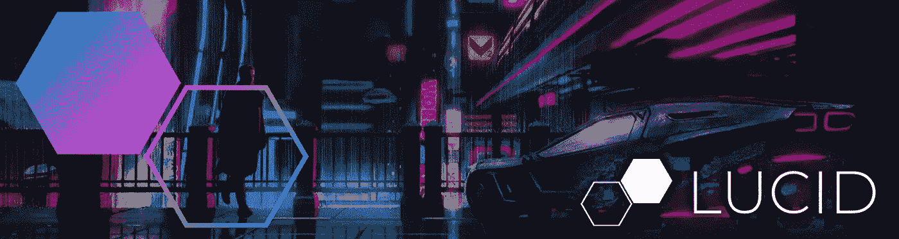

# 举起支柱

> 原文：<https://levelup.gitconnected.com/lifting-props-up-f1be43a1d7a4>

## 使用 React 的上下文 API 来访问父属性

React 文档中有很大一部分是关于在几个组件共享相同变化数据的情况下[提升状态](https://reactjs.org/docs/lifting-state-up.html)的。建议将共享状态提升到组件最接近的公共祖先。然后将状态作为道具传递给所需的后代组件。

在处理属性时，经常会将相同的属性传递给兄弟/后代组件(当将某个状态提升到一个共同的祖先时可能就是这种情况)。考虑以下标题组件的示例:

我们有一个带有子组件`Navigation`和`UserPanel`的`Header`组件，它们都需要访问`type`属性，我们假设属性是`horizontal`或`vertical`。然后`Navigation`和`UserPanel`组件将能够根据这个值呈现不同的布局。

查看子组件内部，我们可以看到如何使用`type`道具:

在`Navigation`组件内部，当`type`被设置为`vertical`时，我们正在呈现一个带有徽标的更突出的标注部分。我们也会对`UserPanel`组件做一些类似的事情；我们可以想象根据父`Header`是`vertical`还是`horizontal`呈现稍微不同的布局。

## 问题

在我看来，现在的问题是我们在重复将`type` prop 传递给后代组件；每个需要`type`值的后代组件必须手动将其作为属性传递。虽然这种显式性可能是可取的，但我认为能够从父/祖先隐式访问`type`值是一种更好的体验，并允许更干净、更干燥的 JSX。这实际上意味着能够隐式访问父属性。关于父母道具的另一种思考方式是*情境*。

鉴于 React 有一个[上下文 API](https://reactjs.org/docs/context.html) ，我们肯定能够设计出一个令人满意的 API。使用原始的上下文 API 来实现我们想要的会相当麻烦；我们将不得不在`Header`组件中创建并导出一个上下文对象，并将道具传播到其中。然后，在任何需要访问值的后代组件中，我们必须导入上下文并使用`useContext`钩子。

这将是比简单地把道具传给每个需要它的后代更糟糕的体验；目标是消除由钻柱引起的任何组件耦合——通过每次导入一个专用的上下文对象，组件仍然是耦合的。解决这种耦合的唯一方法是使用全局状态/上下文管理器(或者像 Redux 这样的东西，或者全局上下文对象)。

## 不同的方法

本着将状态提升到最近的共同祖先的精神，我们希望我们的示例是这样的:

从 DX/API 的角度来看，将道具一次传递给最近的公共祖先比多次传递给每个后代更有意义。在我们的子组件中，我们现在将通过`context`而不是`props`访问`type`，所以我们需要为组件的函数提供第二个参数(由于析构了参数对象，其他都是一样的):

按照这种思路，我们可以固有地访问父组件的属性。然而，不幸的是，从技术角度来看，这不太可行。在 React 中固有地访问父信息通常是不可取的，建议显式地向下传递数据。在这种特殊情况下，本质上访问父节点`div`的道具是不可能的。如果不能访问`div`的原型，我们就不能在这里用`type` prop 做任何有用的事情(比如将它传递给某个上下文对象)。

如果我们有某种*更高级别的组件*来处理所有的脏工作，并且我们愿意使用所述组件来将元素呈现给 DOM，我们可以以下面的 JSX 结束:

我们所做的就是用定制的`Component`组件替换父`div`包装器。我们可以让*添加*一个新的包装器/提供者组件来包围现有的`div`，但是考虑到任何 UI 组件都会有某种包装 HTML 元素，不引入更多的嵌套更实际。

这个定制组件将在幕后维护它自己的上下文对象(对于每个实例)，传递它的属性。当然，为了接收上下文对象，后代组件也需要使用自定义的`Component`，这将使`Navigation`组件看起来像这样:

不幸的是，使用这种方法，因为是`<Component>`提供了上下文，我们不能将`context`参数作为第二个参数传递给组件的函数并期望访问它。我们能做的最好的事情是使用渲染道具(或者更具体地说，一个作为子的*函数)，所以类似于:*

…如果你问我，我觉得这并没有多糟糕，但仍然是一次非常愉快的经历。这使得我们能够继承父属性，甚至任何祖先属性，这取决于我们的定制`Component`组件是如何构建的，而不必手动创建、导出和导入上下文对象。

## `<Component>`

您可以创建一个定制组件来相当容易地实现这一功能。最终结果可能类似于:

…您可以看到我们如何在内部利用上下文 API 为组件提供父属性。通过将这个功能提取到一个单独的实用程序组件，我们可以证明以这种方式使用*上下文*(即访问父/祖先属性)——为库中的每个 UI 组件手动这样做(或类似于 this 的事情)是不值得的。

## 结论

本文的目的是确定一种解决方案，允许祖先的信息被后代继承，而不会污染我们的 JSX，不会将组件耦合在一起，也不会对我们的开发人员体验产生负面影响。动机来自于当兄弟组件需要访问相同的状态时，必须重复地将相同的信息传递给它们。像 Redux 这样的全局状态管理器应该被避免。使用自定义*高阶组件*而不是 HTML 标签的最终解决方案允许我们使用子函数来满足我们的目标，在子函数中我们可以暴露包含父道具的自定义`context`对象。

## 进一步的想法

我正在开发一个库，更深入地探索本文中讨论的概念，它叫做 [Lucid，可以在 Github](https://github.com/One-Nexus/Lucid) 上找到。

我还写了一些其他文章，探索与本文中讨论的类似的想法，如果你愿意，可以在这里查看:

*   创建可伸缩的用户界面:主题化&配置
*   [美丽状态&基于上下文的样式与反应(CSS-in-JS)](https://medium.com/valtech-design/beautiful-state-context-based-styling-with-react-css-in-js-781a14cb2f9b)

[推特](https://twitter.com/esr360) | [Github](https://github.com/esr360)