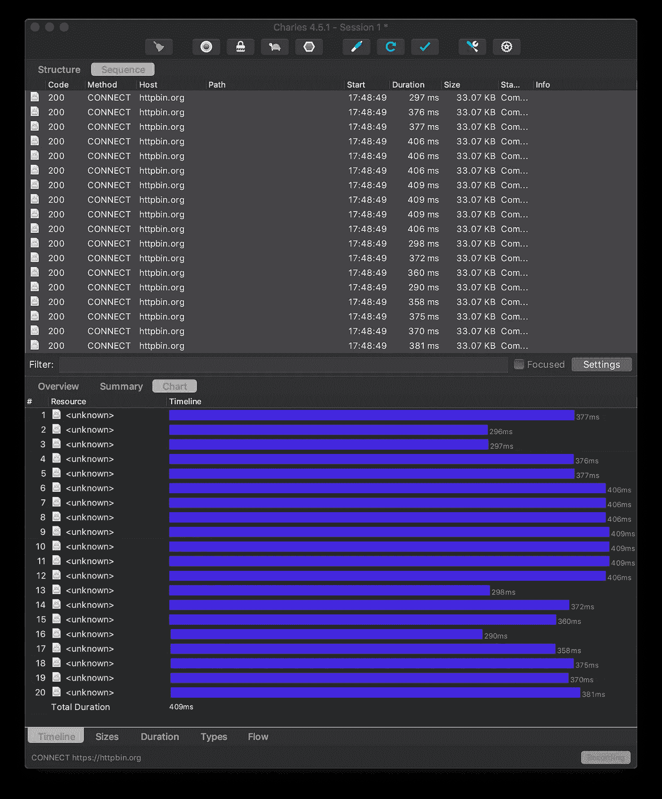
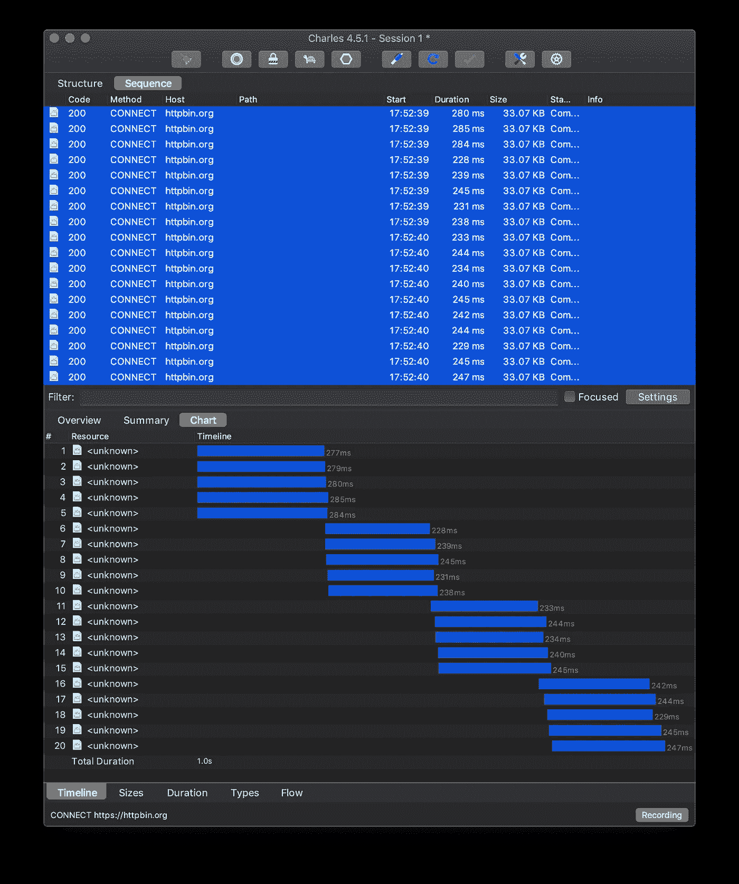

# 用 RxJS 和 Promises 限制并发

> 原文：<https://levelup.gitconnected.com/limit-concurrency-with-rxjs-and-promises-78590d2c85d0>

最近，我需要抑制对一个内部 API 的调用。用例是我们接收一个`ids`列表，并需要为这些 id 中的每一个调用一个 API。因为我们使用承诺，我们最终会用大量并行 API 调用淹没 API。

有很多文章都在谈论如何使用`debounce`和它的朋友来*限制*你的通话。虽然对于某些用例来说这是一个选项，但我真的想要一个解决方案，通过总是并行发送 X 个请求来允许我们最大化并发性。

# 我们的设置

我们的环境是带有 TypeScript 的 NodeJS。我们使用`[request-promise-native](https://github.com/request/request-promise-native)`作为`[request](https://github.com/request/request)`的一个很好的承诺支持包装器。

如果你不熟悉`request`(更准确地说是`request-promise`)，一个简单的 API 调用看起来像这样:

为了获得更真实的体验，我们将调用`httpbin.org`并取回我们的查询参数。这将让我们看到请求实际上是何时发起的，以及它的结果是何时返回的。`getData()`方法看起来像这样:

我们的 id 列表是使用 StackOverflow 上的 [Ben McDonald](https://twitter.com/BenMcDonald___) 的这个[巧妙技巧](https://stackoverflow.com/a/10050831/80280)生成的:

```
const ids = [...Array(20).keys()];
```

# 问题是

如果你采用通用的方法，通过`Promise.all()`并行地为每个`id`执行`getData()`，你最终会得到所有同时开始*的请求*。

```
const results = await Promise.all(ids.map(x => getData(x)));
```

# RxJS

`RxJs`有一个名为`[mergeAll](https://rxjs-dev.firebaseapp.com/api/operators/mergeAll)`的非常有用的操作符，它使用一个`concurrent`参数来限制被订阅的内部可观察对象的数量。
这正是我们想要的。因此，您只需获取`[from](https://rxjs-dev.firebaseapp.com/api/index/function/from)`创建者并生成一个 RxJs 版本。

在那里，我们告诉 RxJs 一次只订阅 5 个 observables。然而，如果您运行它，您会看到我们仍然是一次发出所有 20 个请求。
这是一个使用 [Charles 代理](https://www.charlesproxy.com/)的网络截图



即时网络呼叫

# 推迟

最后一步是使用`[defer](https://rxjs-dev.firebaseapp.com/api/index/function/defer)`而不是`from`来生成我们的*可观测量*。这是因为`from`会将现有的承诺转化为可观察的承诺，而`defer`则使用工厂来产生承诺。只有当它被订阅时，它才会执行工厂。

如果我们简单地调整我们的可观测量的产生，我们使它工作。

就是这样。您现在可以看到，我们正在尽可能快地执行所有 20 个请求，但同时执行的只有 5 个。



延迟的网络呼叫