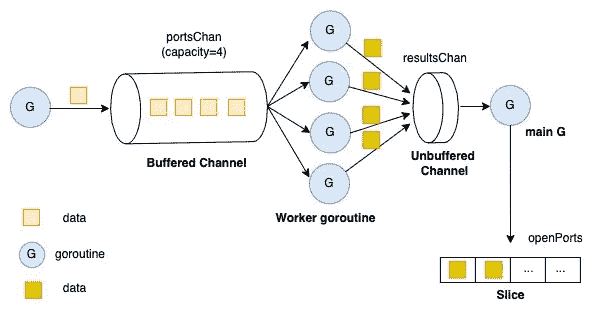

# 限制 Go 中的无限制并发性(第 1 部分)

> 原文：<https://levelup.gitconnected.com/limit-unbound-concurrency-in-go-part-1-72f7cedf2e61>

## 在 Go 中实现一个端口扫描器，并解释一些并发概念

一个**端口扫描器**被设计用来探测一个[服务器](https://en.wikipedia.org/wiki/Server_(computing))或[主机](https://en.wikipedia.org/wiki/Host_(network))是否打开[端口](https://en.wikipedia.org/wiki/TCP_and_UDP_port)。在这篇文章中，我们将在 Go 中实现一个端口扫描器，同时解释一些并发概念。

如果你喜欢看相关视频，我强烈推荐你看这个视频。

Johnny Boursiquot 和 Aaron Schlesinger——Go 中的自由并发

# 概述

*   最简单的形式
*   顺序请求
*   并发——错误的方式！
*   同步并发
*   工作池并发

## 1.最简单的形式

出于演示目的，让我们首先只扫描一个端口。

我们使用`Dial`函数连接到端口 5000 上的一个可能的服务器。如果服务器不可用，它将返回一个错误并退出。但是，如果服务器可用，它将打印端口号并结束。

在 Go 中，拨号功能是连接到服务器的内置功能。它采用网络类型(TCP，UDP。etc)和一个字符串地址`host:port`并返回一个`net.Conn`。

只扫描一个端口超级简单。现在让我们添加更多的端口来处理。

## 2.顺序请求

循环迭代非常适合以顺序形式处理许多端口。

这里，我们使用`for`关键字按顺序逐一迭代 5300 到 5500 的端口范围。

以上是我们的基本顺序端口扫描器，我们将在下面的部分中将其与并行端口扫描器进行比较。

## 3.并发——错误的方式！

有时候我们会写出很臭的代码，尤其是如果我们是初学程序员的话。下面的代码是一个常见的错误，需要我们注意。

主 goroutine 将快速退出，而不会等待派生的子 go routine 完成。正确的方法应该是使用某种同步机制来确保所有的 goroutine 在主 go routine 退出之前完成。

我们将在下一部分演示这一点。

## 4.同步并发

在这个版本的代码中，我们做了一些代码重构。首先，`flag`是解析命令行参数。其次，一些论证验证是为了保证它们的正确性。最后但同样重要的是，`WaitGroup`是一个内置的并发原语，允许我们等待几个 goroutines 完成。

关键的一点是函数`Add`应该在主 goroutine 中调用，而不是在子 goroutine 中。这是围棋初学者常犯的另一个错误。

现在，它看起来像一个完美的扫描仪，但它不是！

让程序扫描许多端口可能会触发“打开的文件太多”错误。该错误意味着操作系统已达到最大“打开文件”限制，不允许其他正在运行的应用程序打开更多文件。

所以我们需要限制我们产生的 goroutines 的数量，并限制我们可以拥有的无限并发性。

在下一节中，我们将使用工人池模式来实现它。

## 5.工作池并发

Goroutine 工人池模式

在这个版本中，我们再次重构了代码。

## 信号

为了在退出之前优雅地关闭程序并打印结果，我们需要在单独的 goroutine 中监听信号。Go 的**信号**通知通过在通道上发送`os.Signal`值来工作。

方法`signal.Notify`注册给定的通道来接收指定信号的通知。`SIGINT`和`SIGTERM`是特定的操作信号，当用户中断(如 Ctrl+C)或系统终止进程时，Go 运行时将发送给进程。

## 两个频道

在本节中，我们使用一个缓冲通道和一个非缓冲通道。

`portsChan`是一个大小为`numWorkers`的缓冲通道。它用于对要扫描的端口进行排队。worker goroutines 将从该通道读取并扫描端口。当 worker goroutines 完成时，它们会将结果发送回`resultsChan`通道。

# 结论

在这篇文章中，我们从头开始构建了一个生产就绪的端口扫描器。最重要的是我们在 Go 中实现了一个有界并发。

我希望你喜欢这篇文章😃。