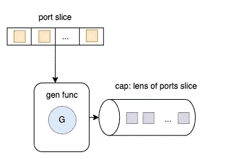

# 限制 Go 中的无限制并发性(第 2 部分)

> 原文：<https://levelup.gitconnected.com/limit-unbound-concurrency-in-go-part-2-a00ada3bb50f>

## 在 Go 中实现一个端口扫描器并解释管道模式

一个**端口扫描器**被设计用来探测一个[服务器](https://en.wikipedia.org/wiki/Server_(computing))或[主机](https://en.wikipedia.org/wiki/Host_(network))是否打开[端口](https://en.wikipedia.org/wiki/TCP_and_UDP_port)。在这一系列文章中，我们将在 Go 中实现一个端口扫描器，同时解释一些并发概念。

我们将在《限制无限制并发性》的第 2 部分中讨论管道模式。如果你错过了第一部分和中的[和**部分，请仔细阅读，了解必要的背景知识。**](/limit-unbound-concurrency-in-go-part-1-72f7cedf2e61?source=your_stories_page----------------------------------------)

 [## 限制 Go 中的无限制并发性(第 1 部分)

### 在 Go 中实现一个端口扫描器，并解释一些并发概念

levelup.gitconnected.com](/limit-unbound-concurrency-in-go-part-1-72f7cedf2e61) 

# 什么是管道？

Go 中没有管道的正式定义；它只是众多并发程序中的一种。非正式地说，管道是由通道连接的一系列*阶段*，其中每个阶段是一组运行相同功能的 goroutines。在每一个阶段，戈鲁丁人

*   通过*入站*通道从*上游*接收数值
*   对数据执行一些功能，通常产生新值
*   通过*出站*通道向下游发送数值

# *管道流程图*

**

*管道*

*上图显示了端口扫描器的整个管道。让我们在下一节中逐一解释每个相关的功能。*

*   *功能初始化*
*   *Func parsePortsToScan*
*   *结构`scanOp`*
*   *功能生成*
*   *功能扫描*
*   *函数过滤器*
*   *功能商店*
*   *功能主体*

# *主要成分*

*   ***功能初始化***

*`init`函数定义了用户传入的参数。*

*`ports`变量是一串由破折号分隔的要扫描的端口。`outFile`变量是写入结果的文件。*

> ***Func parsePortsToScan***

*`parsePortsToScan`函数从命令行参数解析要扫描的端口。如果参数无效，将返回错误。如果参数有效，则返回`ints`的一部分。*

> ***结构扫描操作***

*`scanOp`表示单端口扫描操作及其结果(`open`、`scanErr`、`scanDuration`)。`open`是一个布尔值，表示端口是否打开。`scanErr`是扫描失败时的错误信息。`scanDuration`是执行扫描所花费的时间。*

*要将结果输出到 CSV 文件，CSV 编写器使用两种方法。`csvHeaders`返回一段字符串中的头。`asSlice`将`scanOp`的值字段作为一段字符串返回。*

> ***功能基因***

**

*`gen`函数是一个生成器函数，它从一片 int 端口返回一个缓冲通道的`scanOps`结构值。它用于创建将按顺序执行的函数管道，它是管道中的第一个函数。*

> ***功能扫描***

*`scan`功能负责执行实际的端口扫描。它获取一个缓冲通道`scanOps`并返回一个非缓冲通道`scanOps`。*

> ***Func 滤波器***

*`filter`功能负责过滤打开的扫描操作。*

> ***Func store***

*存储功能负责将`scanOps`存储在一个 CSV 文件中。这是流水线中的最后一个函数。*

> ***Func main***

*主函数负责执行函数管道。它从命令行参数中获取一部分 int 端口和一个字符串`outfile`。*

*然后，它开始编排函数管道，从`gen`函数开始，到`store`函数结束。*

*最后，它将结果打印到控制台。*

*值得注意的是，我们还可以通过将管道中的函数链接在一起来堆叠它们。*

# *结论*

*通道可用于将 goroutines 连接在一起，以便一个的输出成为另一个的输入。当您的管道中有许多函数并且想要连接它们时，它会非常有用。*

*发现这篇文章很有用👏？看看我下面的其他文章吧！*

1.  *[Golang 频道是如何工作的](/how-does-golang-channel-works-6d66acd54753)*
2.  *[用实例解释 Golang 中的固体原理](/solid-principles-in-golang-explained-by-examples-4a4cccf47388)*
3.  *[Golang 中的观察者设计模式与实例](/observer-design-pattern-in-golang-with-an-example-6c24898059b1)*