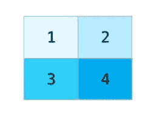
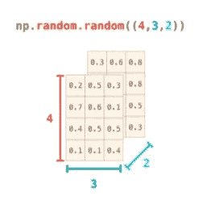
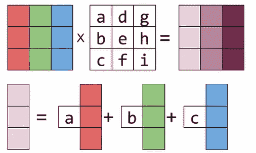
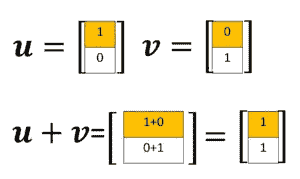
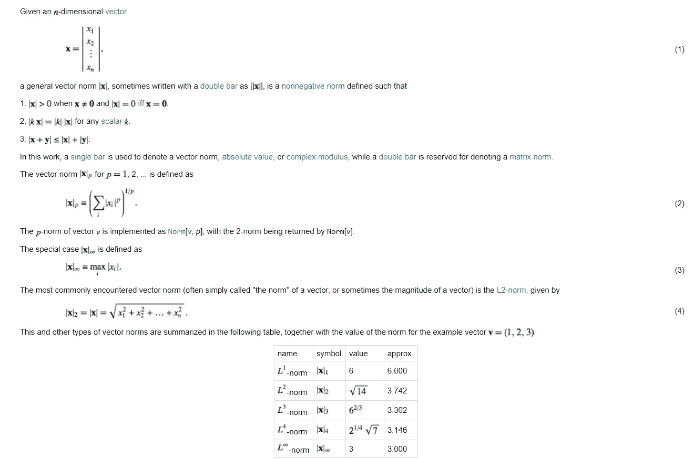
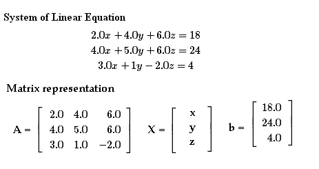

# 线性代数概念(用于机器学习)

> 原文：<https://levelup.gitconnected.com/linear-algebra-concepts-for-machine-learning-fa7549c6a722>

# 介绍

机器学习的基础是完全纯粹的数学和逻辑。我们可以理解逻辑，进一步实现它取决于个人的经验和创造性思维，但为此，我们需要理解一些线性代数的基础知识，以及如何处理矩阵和张量。

我将使用 *NumPy* 作为大部分数学函数和处理数据的主库。

所有代码都在我的 Github 资源库中，[点击这里](https://github.com/aryanchugh816/Data-Science/tree/master/03%20-%20Linear%20Algebra%20(For%20Machine%20Learning))访问它。我已经开始了一系列很好的解释性文章，这些文章将涵盖数据科学管道的所有主要主题，请访问我的主 [Github 库](https://github.com/aryanchugh816/Data-Science)以阅读更多这样的文章和代码。

这篇文章需要对 Numpy 有一个基本的了解，所以我建议先浏览下面的文章。

[](https://medium.com/swlh/numpy-basics-for-machine-learning-4e5e0af3b0c3) [## 机器学习的 Numpy 基础

### 统计数字

medium.com](https://medium.com/swlh/numpy-basics-for-machine-learning-4e5e0af3b0c3) 

# 主题:

*   标量和向量
*   矩阵和张量
*   **操作:**
*   1.移项
*   2.广播
*   4.矩阵乘法
*   5.哈达玛乘积(逐元素乘法)
*   规范
*   决定因素
*   相反的
*   线性方程组

# 标量和向量

出于编程的目的，我们不会使用标量和向量的正式定义(如物理学中的定义),而是一个更有用和简单的定义。

一个**标量**是一个单一的数字，通常表示为 *x.* 我们可以把标量看作常量/值，用来缩放一个矢量，甚至形成一个矢量。

一个**向量**是一个标量数组，用 **x** 表示，因此向量可以有 n 个标量 ***。*** 向量可以看做列表(从计算机系学生的角度)，也可以看做空间中的箭头(从物理系学生的角度)。

```
import numpy as np# Two ways of representing vectors:# 1) Representing vector as a row vector, that is having multiple columns
x1 = np.array([4,5,6])
print(x1)
print(x1.shape)
print("----------------------------------")# 2) Representing vector as a column vector, that is having multiple rows
x2 = np.array([[4], [5], [8]])
print(x2)
print(x2.shape)
```

## 输出

```
[4 5 6]
(3,)
----------------------------------
[[4]
 [5]
 [8]]
(3, 1)
```

# 矩阵和张量

**矩阵**是由 *X 表示的 2D 标量数组。*以矩阵形式表示数字数据将有助于更快、更有效地执行不同的操作。



*   这个矩阵有 2(m)行和 2(n)列
*   这个矩阵的每个元素都是一个标量
*   如果 m = n，则该矩阵称为方阵

**张量**是一个多于 2 个轴的数组，即张量是一个可以容纳 N 维数据的容器。张量由 **X.** 表示



*   可以把张量看作是具有两个以上轴的数组的推广
*   我们可以把张量看成一个以上(m×n)的矩阵，一层一层地堆叠在一起
*   张量在深度学习任务中非常有用

```
# Here T is a Tensor
T = np.array([[[4,5,7], [10,11,13]], [[56,80,90], [9,8,10]]])print(T.shape)
print(T)
```

## 输出

```
(2, 2, 3)
[[[ 4  5  7]
  [10 11 13]]

 [[56 80 90]
  [ 9  8 10]]]
```

# 操作

## 矩阵的转置

矩阵的转置只不过是它沿对角线的镜像。对于 2D 矩阵，转置可以由 A(i，j) = A(j，I)得到。在向量的情况下，转置使一列向量变成一行。因此，列向量也可以表示为 X = [x1，x2，x3 … xn]^T.

```
X = np.array([[4,5,7], [10,11,13], [56,80,90]])
print(X)
print("----------------------------------")# Transpose of x:
Xt = np.transpose(X)
print(Xt)
# Can also find transpose using the following method: X.T
```

## 输出

```
[[ 4  5  7]
 [10 11 13]
 [56 80 90]]
----------------------------------
[[ 4 10 56]
 [ 5 11 80]
 [ 7 13 90]]
```

## 广播

术语 ***广播*** 是指 Numpy 在导致某些约束的算术运算期间如何处理不同维度的数组，较小的数组在较大的数组中广播，以便它们具有兼容的形状。

广播在机器学习和深度学习操作中非常有用，因为它将我们使用嵌套循环替代执行的数组操作矢量化。我们将在以下示例中看到这一点:

```
l1 = np.array([1,2,3,4])
l1 = l1 + 1 # Broadcasting operation
print(l1)
print("----------------------------------")# We can perform broadcasting operations on  matrix too
l = np.array([[1,2,3,4], [5,6,7,8]])
print(l)
print("----------------------------------")l = l**2
print(l)
```

## 输出

```
[2 3 4 5]
----------------------------------
[[1 2 3 4]
 [5 6 7 8]]
----------------------------------
[[ 1  4  9 16]
 [25 36 49 64]]
```

在广播中，较小维度的数组/矩阵被整形并扩展到较大矩阵的维度，然后对较大矩阵进行逐元素操作，因此广播操作比 C 或 C++中的嵌套循环更快。

**Python 列表不支持广播**，所以你最好在使用它们之前先把它们转换成 Numpy 数组，否则我们将使用**映射一个函数来对列表执行任何简单的操作**。

## 矩阵乘法



*   C= AB 仅在 A 的第二维度与 B 的第一维度匹配时定义
*   此外，如果 A 的形状为(m，n ), B 的形状为(n，p ),则 C 的形状为(m，p)
*   通过取 A 的第 I 行与 B 的第 j 列的点积来计算 C(ij)
*   考虑矩阵乘法的更有用的方法是矩阵 A 的列的线性组合，由矩阵 B 的列条目加权(该方法在第一行的图像的下部描述)

```
X = np.array([[4,5,7], [10, 11,13], [56,80,90]])
Y = np.array([[40,50,70], [100,110,130], [560,800,900]])
print(X.shape)
print("----------------------------------")
print(Y.shape)
print("----------------------------------")# To get the matrix multiplication result of the two arrays:
prod = np.dot(X,Y)
print(prod)
```

## 输出

```
[[ 4  5  7]
 [10 11 13]
 [56 80 90]]
----------------------------------
[[ 40  50  70]
 [100 110 130]
 [560 800 900]]
----------------------------------
[[ 4580  6350  7230]
 [ 8780 12110 13830]
 [60640 83600 95320]]
```

## 哈达玛乘积(逐元素乘法)

如果我们对一个数组中的每个元素只应用前一个数组中的相应元素的运算，我们会得到一个元素式乘积。



```
X = np.array([[4,5,7], [10, 11,13], [56,80,90]])
Y = np.eye(3)# Element wise multiplication:
print(X*Y)
print("----------------------------------")#VS
# Matrix multiplication
print(np.dot(X,Y))
```

## 输出

```
[[ 4\.  0\.  0.]
 [ 0\. 11\.  0.]
 [ 0\.  0\. 90.]]
----------------------------------
[[ 4\.  5\.  7.]
 [10\. 11\. 13.]
 [56\. 80\. 90.]]
```

# 规范

**向量**空间中向量的**范数是一个真实的非负值，直观地表示向量的长度、大小或大小。**



需要记住以下几点:

*   l-范数，也称为*欧几里德范数*是最常用的范数
*   l-范数是向量所有元素的简单和
*   L^{infinity}给出了该数组的最大数，我们可以通过上面给出的公式来验证这一点

**规范使用 Numpy**

```
X = np.array([-5,3,10])# Finding norm of a vector using numpylp2 = np.linalg.norm(X) 
# By default it is treated as L2 norm and 'linalg' stands for linear algebra moduleprint(lp2)
```

## 输出

```
11.575836902790225
```

# 决定因素

行列式有助于我们找到矩阵的逆矩阵，并为我们提供有关矩阵的信息，这些信息可用于不同的应用，如方程组、微积分等。

```
A = np.array([[1,2],
              [3,4]])
print(np.linalg.det(A))
```

## 输出

```
-2.0000000000000004
```

# 相反的

在下面的代码中，我们将实现两种类型的反演:-

1.  **正逆**:这个只能在矩阵的行列式不为零且为方阵的情况下计算。
2.  **Moore-Penrose 伪逆**:这个逆可以在非零非方阵上计算。如果矩阵是可逆的，我们得到与正规逆矩阵相同的结果。关于这个[的更多信息，请点击这里](https://www.itl.nist.gov/div898/software/dataplot/refman2/auxillar/pseudinv.htm#:~:text=The%20Moore%2DPenrose%20pseudo%20inverse%20is%20a%20generalization%20of%20the,when%20A%20is%20not%20invertible.)。

```
A = np.array([[1,2],
              [3,4]])Ainv = np.linalg.inv(A) # Normal Inverse
print(Ainv)
print("----------------------------------")

pinv = np.linalg.pinv(A) # Pseudo Inverse
print(pinv)
print("----------------------------------")B = np.array([[6,3], # Matrix with determinant = 0
              [8,4]])pinv = np.linalg.pinv(B)
print(inv)
```

## 输出

```
[[-2\.   1\. ]
 [ 1.5 -0.5]]
----------------------------------
[[-2\.   1\. ]
 [ 1.5 -0.5]]
----------------------------------
[[0.048 0.064]
 [0.024 0.032]]
```

# 解线性方程组



这个可以用来解一个线性方程组，[点击这里](https://numpy.org/doc/stable/reference/generated/numpy.linalg.solve.html#numpy.linalg.solve)查看函数。

```
A = np.array([[2, 4, 6],
              [4, 5, 6],
              [3, 1, -2]])
B = np.array([18, 24, 4])print(np.linalg.solve(A,B))
```

## 输出

```
[ 4\. -2\.  3.]
```

# 结论

我希望这篇文章对使用基本的线性代数概念有一个简要的了解，并在各种应用中使用它们，并鼓励你学习更多或用它创造一些好东西。

**更多有趣的项目和说明代码请随意浏览我的**[**Github repositor**](https://github.com/aryanchugh816/Data-Science)**y。**

如果您喜欢我的任何工作，请随时 [**联系我**](mailto:%20chugharyan816@gmail.com) 有关任何项目合作或工作机会。