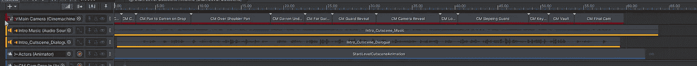
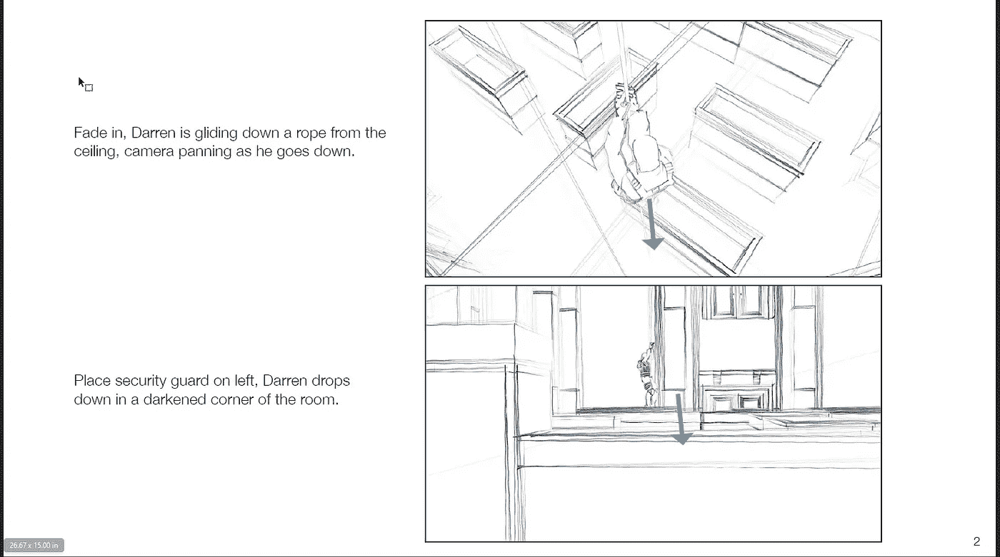

# 使用时间轴在 Unity 中排列音频和视频以构建过场动画

> 原文：<https://levelup.gitconnected.com/lining-up-audio-visual-to-build-cutscenes-in-unity-331f3ce79060>

没有润色的过场动画

在过去的几篇文章中，我讨论了在 Unity 中使用 Timeline 和 Cinemachine 创建电影艺术。今天，我们将看看一个更复杂的电影，利用多个摄像头和两个音轨。

本项目中使用的所有资产均可从 Unity 资产商店获得:

 [## 伟大的羊毛|教程| Unity 资产商店

### 使用 GameDevJon，Inc .的大羊毛提升您的下一个项目。在…上找到这个&更多教程和模板

assetstore.unity.com](https://assetstore.unity.com/packages/templates/tutorials/the-great-fleece-110186) 

时间线中的音频轨道

当处理使用画外音的过场动画时，我们的核心动画应该与画外音轨道对齐。在我们最初的文章中，我们创建的过场动画只使用了电影剪辑和时间线动画。画外音音轨增加了另一层复杂性。

下面是我的流程。首先，我将两个音频轨道添加到过场动画、Cinemachine 大脑和演员预制动画中。我可以根据导演的笔记来制作这个过场动画，所以我大概知道这个镜头需要多少台摄像机，以及哪里需要剪辑。所以这只是一个将它们与画外音轨道对齐的问题。为了使这更容易，我首先将音轨与基础动画同步，完成后，我开始添加我的虚拟摄像机，并在导演笔记中描述的地方开发电影剪辑。

这个过程需要大量的迭代来将事物与音轨对齐，尤其是在使用多个虚拟摄像机时。

董事笔记

## 从头开始工作

如果你没有导演笔记可以使用，试着创建自己的笔记，当摄像机对准一个对象时，将音轨中的任何讲话与头部和嘴部动画对齐。一旦你这样做了，你就可以计划哪里的电影剪辑最有意义。利用 180 度法则和三分法等电影技巧来创造更专业的电影体验。

我上面的过场动画是第一遍，我展示的是这篇文章的演示，所以你可以看到通过润色和迭代可以改进的地方。当我根据一组导演的笔记将这个场景制作成过场动画时，我看到了一些地方，我可以做出一些调整来改变最初的设想。

## **测试**

在 Unity 的以前版本中，你必须玩实际的游戏才能测试你的音频同步，Unity 2021 取消了这一要求，你现在可以播放音轨和剩余的时间线预览。这使得工作流程更快，因为你不必等待 Unity 在游戏窗口中启动游戏。

## **结论**

Timeline 和 Cinemachine 拥有如此强大的功能和潜力，如果你是一名独立开发者或业余爱好者，我建议你花时间学习这些令人敬畏的工具，让你的游戏看起来更专业。

 [## Cinemachine - Unity Learn

### 了解我们如何将 Unity 的统一程序相机系统用于游戏中的相机、电影和过场动画。

learn.unity.com](https://learn.unity.com/tutorial/cinemachine)  [## Cinemachine 文档

### Cinemachine 是一套用于操作 Unity 摄像机的模块。Cinemachine 解决了复杂的数学和逻辑…

docs.unity3d.com](https://docs.unity3d.com/Packages/com.unity.cinemachine@2.3/manual/index.html)