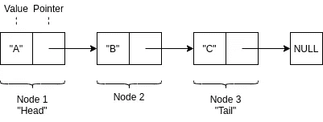
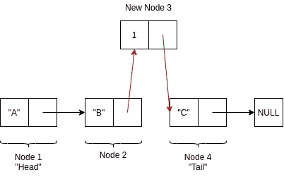
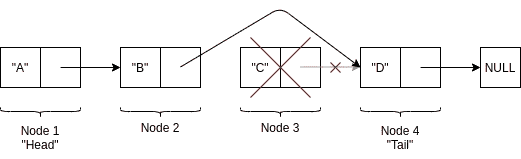
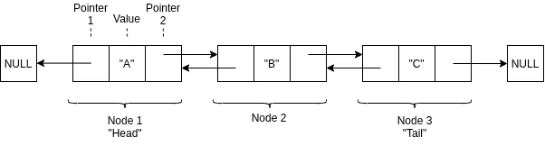
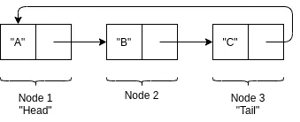

# 链表数据结构

> 原文：<https://levelup.gitconnected.com/linked-list-data-structures-e94d2f2a6251>

如果你是数据结构的新手，我强烈建议你浏览一下我写的这篇关于栈数据结构的文章的第一部分。它将帮助您理解什么是数据结构，这将使本文更容易理解。

## 什么是链表？

链表是一种由数据元素的“线性”集合组成的数据结构。在其最简单的形式中，链表可以被认为是一种链:

号码

没错。

线性指的是数据的组织方式——一个项目接一个项目。链表“链”中的“链”(或元素)称为*节点*。虽然有几种类型的链表，但它们都是由互连的节点组成的，并且每个节点都包含两个所有链表共有的“成分”:

1.  一种价值观
2.  两颗北极指极星

该值是节点存储的实际数据。对于大多数应用程序来说，链表可以将任何类型的数据存储为一个值，例如:整数、字符串和布尔值。请注意，根据应用程序的不同，不必将值本身存储在节点中，而是可以存储一个引用(如变量)。

指针是不言自明的——它们从一个节点“指向”另一个节点。一个链表(或“配方”)与另一个链表的区别主要在于它们如何管理指针。

最简单的一种链表叫做单链表，其中每个节点只有一个唯一的指针指向链表中的下一个节点，因此称为“单链表”。列表中的第一个节点通常被称为*头*，而最后一个节点是*尾*

单链表的基本结构

注意，在上面的图中，节点是有编号的，但是实际上链表的节点并不是唯一标识的。

## 它们是如何工作的？

正如我在上一篇文章中提到的，数据结构有四个主要功能，可以根据这些功能的实现方式进行分类:

1.  输入信息
2.  处理信息
3.  维护信息
4.  检索信息

**输入信息**

对于单链表，新数据通常被添加到“尾部”。创建了一个新的尾节点，指向它的链接存储在前面的节点(原始尾节点)中，该节点现在只是一个常规节点。然后，空“值”被需要存储的数据替换。

数据也可以在链表中的节点之间输入。例如，要在第一张图中的节点 2 和 3 之间添加一个新节点，我们需要执行以下操作:

在现有节点之间添加新节点

*   新节点(成为节点 3)被赋予一个指向包含“C”的节点(成为节点 4)的指针
*   节点 2 的指针被重新分配给新节点 3

**处理、维护和检索信息**

在链表处理中，维护和检索信息是紧密联系在一起的，所以我将把它们放在一起讨论。

有了链表，一个程序只需要引用链表的头就可以访问整个链表。这意味着对于单链表，为了找到一个特定的条目，可能需要遍历整个链表。链表中的遍历是递归的，你可以把链表想象成一堆俄罗斯嵌套玩偶，其中每个玩偶都是链表中的一个节点。

красивые цветы!

如果你拿着“头”娃娃，默认情况下，你拿着所有的娃娃，因为每个娃娃都包含下一个娃娃。为了找到你要找的特定娃娃，你从看第一个娃娃开始，如果它不是你想要的，你就打开它；如果里面什么都没有，那么你要找的娃娃就不存在。如果里面有另一个娃娃，而它不是你想要的，那么你继续依次打开每个娃娃，检查它们，直到你找到你想要的娃娃。如果娃娃不存在，你将最终到达最后一个娃娃，它不包含任何其他娃娃(即:没有指针)。所有需要查找特定节点的操作都需要这种遍历“算法”。

在此图中，玩偶代表节点，值由玩偶的外观表示。请注意，玩偶不需要有“值”,它可以是完全未绘制的(空),但只要它包含另一个玩偶(指针),您就可以继续搜索。在链表中，大多数时候任何值——包括*nothing——*是允许的，但这取决于具体的实现。

从链表中删除一个节点的过程与添加一个节点的过程相同，只是过程相反。来自我们希望移除的元素的指针被删除，并且来自它之前的节点的指针现在指向被移除的节点所指向的节点。

删除节点

# 优势

与数组相比，链表的主要优点是插入或删除元素不需要重新组织整个数据结构。要将元素插入数组，需要将所有尾随元素“下移”以为新元素腾出空间。相对来说，这在计算上是昂贵的。链表没有这个问题；插入新元素只需要调整现有指针并创建一个新指针。

链表在内存方面也有优势，它们可以根据需要增长或收缩——内存是在运行时分配的，不是固定的。相反，数组的大小在初始化时是固定的——内存必须预先分配。

动态内存分配提供了另一个好处，那就是链表非常有效地使用内存——在任何时候只使用它们需要的内存。此外，链表中的数据不需要“一起”存储在内存中，这使得它更加灵活。

# 不足之处

尽管链表可以有效地使用内存，但是每个节点比数组中的一个等价元素占用更多的内存。这是因为每个节点除了数据之外还包含指针。对于存储像字符或布尔值这样的小数据项，这意味着在某些情况下，存储引用所需的内存可能是存储实际数据所需内存的几倍。

因为链表节点没有索引，为了选择一个特定的节点，必须遍历它前面的每个节点。因此，数据检索速度不如在数组中那么快或高效。在每个节点使用多个指针的不同类型的链表中，这个缺点得到了部分解决。

由于它们的结构，当需要反向遍历单链表时，会非常麻烦。双向链表解决了这个限制，但是这样做的代价是为内存中的每个节点增加一个指针。

# 它们用在哪里？

链表可以用在任何使用其他线性数据结构的地方。事实上，它们可以用于实现其他几种常见的数据类型，例如:

*   大量
*   行列
*   列表

一般来说，对于任何处理未知数量的数据元素的应用程序，都需要使用链表。

# 其他类型的链表

**双向链表**

双向链表有两个指针和一个值。第二个指针用作向后指向列表中前一个节点的引用。这意味着列表的头部和尾部都指向“空”节点。这解决了一些与单链表相关的遍历挑战，但也大大增加了所需的内存。

**循环链表**

在循环链表中，尾部指针指向链表的头部。这意味着无需使用反向遍历，我们可以从任何其他节点访问列表中的任何节点。而不需要任何额外的存储器空间。

# JavaScript 中的示例实现

要查看控制台日志，您必须访问链接(悲伤脸)