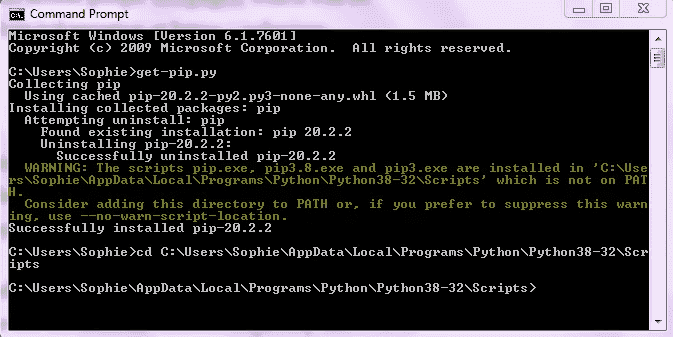
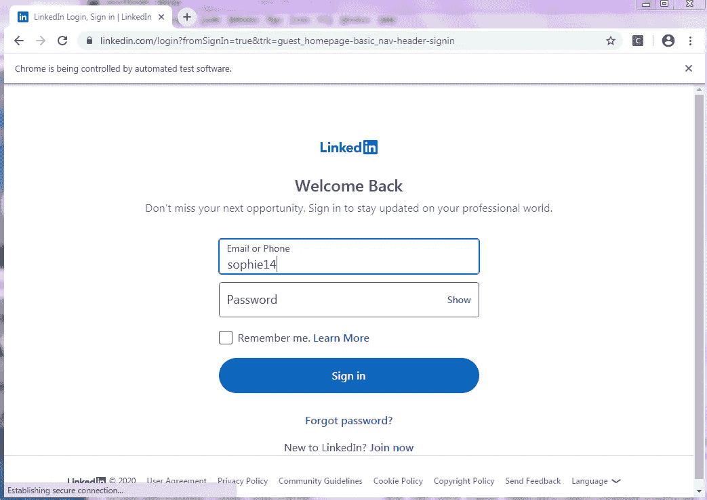
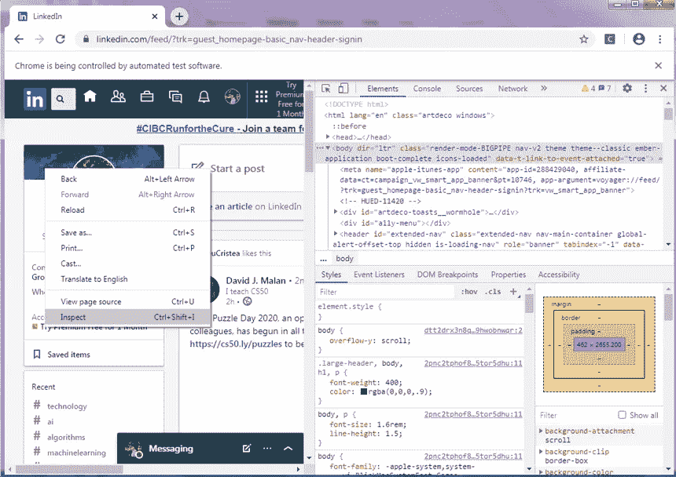
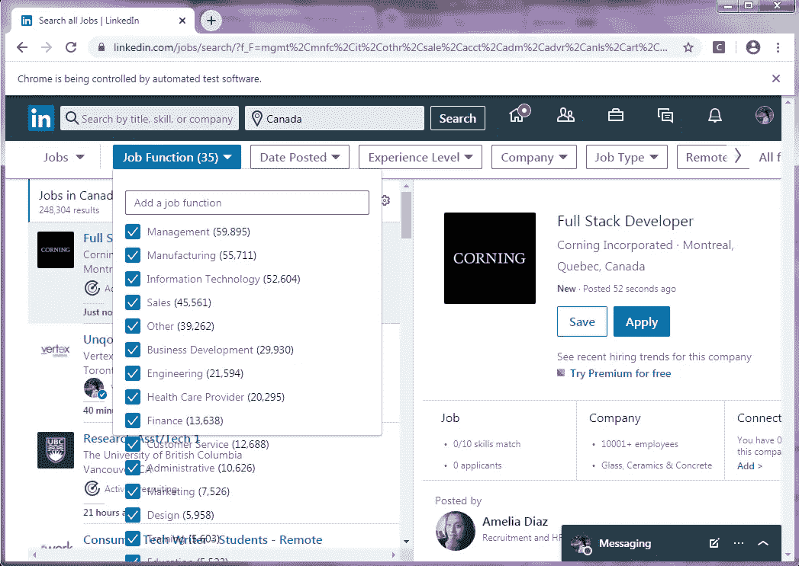
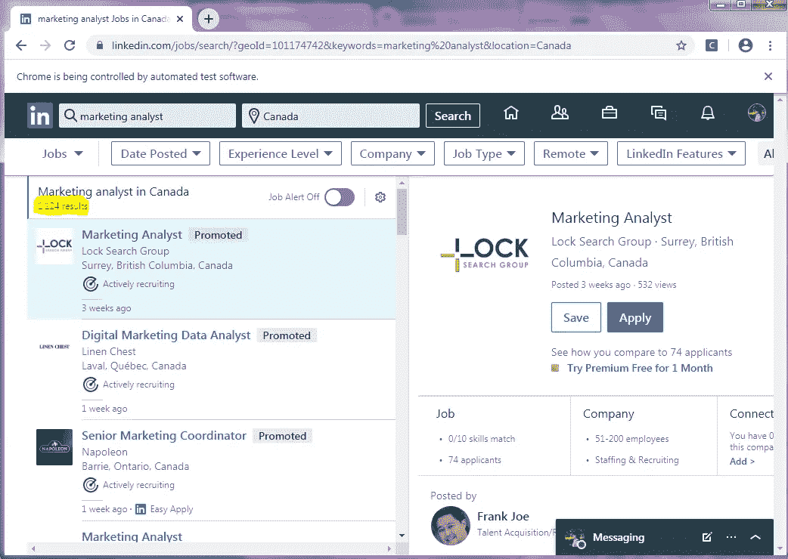
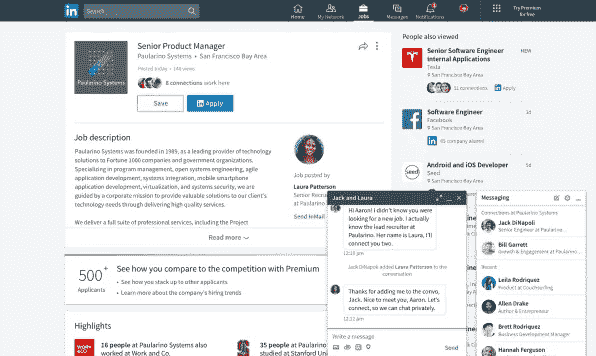

# 我是如何使用硒和美丽的汤收集 LinkedIn 数据的

> 原文：<https://levelup.gitconnected.com/linkedin-scrapper-a3e6790099b5>

导师:陈思宁

LinkedIn 是一个为职业网络而设计的社交网络，非常以就业为导向。它的网站和应用程序包括数以亿计的专业用户资料和招聘信息。


图片取自 https://aeroleads.com/blog/linkedin-lead-extractor/

为了深入了解 LinkedIn 展示的就业市场，我们使用了用 Python 编写的网络抓取工具: **Selenium** 和 **Beautiful Soup** 。这个故事讲述了你如何通过 pip 在你的电脑上安装 selenium **webdriver** 和 Beautiful Soup 来访问我们在 LinkedIn 上看到的信息。特别是通过使用网页的**源代码**，我们创建了自动化功能，如**在搜索框中输入文本**，点击**按钮**，以及**抓取** **文本**。为了做到这一点，我们必须克服一些挑战，包括**区分硒和美丽的汤**，**定位我们需要访问的元素**，以及避免由**消息** **弹出**带来的错误。

我们还将数据显示的趋势可视化。我们的图表显示在我们的另一个故事中，链接如下:[https://medium . com/@ Sophie 14159/LinkedIn-job-trends-2d d64 f1 d 4541](https://medium.com/@sophie14159/linkedin-job-trends-2dd64f1d4541)

## 硒

Selenium Python 提供了一个 API，允许您访问包括 Firefox、Internet Explorer 和 Chrome 在内的 web 驱动程序，这将在稍后演示。

## 美味的汤

Beautiful Soup 是一个 python 库，它允许我们通过访问网页的源代码从网页中抓取信息。这使用 HTML 或 XML 解析器。

更多信息可以在本文结尾的其他资源中找到。

# 装置

为了像 LinkedIn 那样从一个网页中抓取，我们必须安装 selenium、Beautiful Soup 和一个 webdriver。

1.  **安装 pip**

我需要在我的笔记本电脑上安装 pip 和 selenium，我使用命令提示符完成了这个任务。我首先安装了 pip。



在 Windows 上使用命令提示符安装 pip 并重定向路径

注意:因为我已经下载了 pip，所以它被卸载并重新安装了最新版本。然后，要访问 pip 并安装 selenium，我需要使用“pip install selenium”。然而，正如警告所示，我还需要用“cd”更改路径来访问 pip。

**2。装硒美汤**

随着 pip 成功安装并能够被访问，我简单地使用了命令“pip install selenium”和“pip install bs4”。因此，硒和美丽的汤也安装成功。我们现在能够在我们的 python 脚本中使用它们。

**3。下载网络驱动程序**

在我的例子中，我决定使用 Chrome 驱动程序，尽管如前所述，Selenium 并不局限于 Chrome。根据我使用的 Chrome 版本，我使用以下网站下载 Chrome 驱动程序:【https://chromedriver.chromium.org/downloads[。](https://chromedriver.chromium.org/downloads)

注意:如果你不确定你用的是哪个版本的 chrome，你可以按照这里的指示。

有了 Selenium、漂亮的 Soup 和设置好的 webdriver，我们就可以开始编写代码了！

# Python 脚本

```
**#import chrome webdriver** from selenium import webdriverbrowser = webdriver.Chrome('chromedriver_win32/chromedriver.exe')
```

在上面的代码中，我们导入了 chromedriver，它现在允许我们从 chrome 浏览器访问网页。接下来，我登录我的 LinkedIn 账户来访问这些网页。

```
**#Open login page**
browser.get('https://www.linkedin.com/login?fromSignIn=true&trk=guest_homepage-basic_nav-header-signin')

**#Enter login info:**
elementID = browser.find_element_by_id('username')
elementID.send_keys(username)

elementID = browser.find_element_by_id('password')
elementID.send_keys(password)**#Note: replace the keys "username" and "password" with your LinkedIn login info**elementID.submit()
```



自动登录页面

一个自动网页应该打开，该计划将自动输入您的用户名和密码，因为你已经在代码中设置。

请记住，由于您使用的是自己的 LinkedIn 帐户，您可以从 LinkedIn 访问的网页和信息受到您的个人资料的限制。例如，您可能看不到与您无关的特定用户。

成功登录后，我们现在能够执行许多功能，下面列出了我使用过的一些功能:

## 1.在搜索框中输入

```
**#Go to webpage**
browser.get('https://www.linkedin.com/jobs/?showJobAlertsModal=false')**#Find search box**
jobID = browser.find_element_by_class_name('jobs-search-box__text-input')**#Send input**
jobID.send_keys(job)
```

在上面的例子中，我访问了能够搜索工作的页面。我需要浏览器找到的元素是搜索框。我在页面上点击右键，进入“inspect ”,找到了类名，它显示了任何网页的源代码。



来自检查选项的源代码

事实上，利用源代码是执行我的代码中的功能的更重要的关键。通过单击源代码窗口左上角的箭头，我可以看到我在 LinkedIn 页面上单击的任何元素的代码。然后，我会将类名插入到我的 python 代码中来访问它。

## 2.单击按钮

点击按钮可以提交您在上面的搜索框中输入的内容，但绝对不限于此。出于我自己的目的，我需要单击一个按钮来打开应用于求职的过滤器列表。



所有 LinkedIn 工作职能过滤器

这是一个简单的两步过程:

1.  找到元素并
2.  对元素执行 click 方法

```
browser.find_element_by_class_name("search-s-facet__button").click()
```

我通过源代码找到了元素类名，如前面的函数中所解释的，然后应用了 click 方法。我用一行代码写了这段代码，但也可以用变量分两行完成:

```
**#These two lines of code are not clicking the same button as the previous instance**search = browser.find_element_by_class_name('jobs-search-box__submit-button')
search.click()
```

## 3.抓取文本

在图像后的代码中，我试图获取搜索特定类型职业所得到的职位发布的数量。这个数字首先被剥离成一个字符串，所以我也把它转换成一个整数。



抓取职位发布的数量

```
**#Get page source code**
src = browser.page_source
soup = BeautifulSoup(src, 'lxml')**#Strip text from source code**
results = soup.find('small', {'class': 'display-flex t-12 t-black--light t-normal'}).get_text().strip().split()[0]
results = int(results.replace(',', ''))
```

# 错误和解决方案

硒和美汤可以一起发挥很多功能，绝对不局限于我上面用过的。然而，我想指出我在编写自己的代码时遇到的一些错误，并解释我的解决方案。

## 1.硒 v.s .美汤

因为我的代码同时使用了 Selenium 和 Beautiful Soup，所以我经常会因为自己的目的而弄不清需要使用哪一个。我曾经试图通过在 html 代码中搜索来找到并单击一个元素，然后才意识到我正在尝试使用 Beautiful Soup 执行 Selenium 函数！

虽然这两者是一起工作的，但 Beautiful Soup 允许我收集我可以在 LinkedIn 上访问的数据。同时，Selenium 是我用来自动访问网页和网站元素的工具。

## 2.找不到元素

这可能是最令人沮丧的错误，因为源代码中有我的代码似乎无法访问的元素。

下面是帮助我解决这个问题的代码块:

```
last_height = browser.execute_script('return document.body.scrollHeight')
for i in range(3):
    browser.execute_script('window.scrollTo(0, document.body.scrollHeight);')
    time.sleep(SCROLL_PAUSE_TIME)
    new_height = browser.execute_script('return document.body.scrollHeight')
    last_height = new_height
```

上面的代码块就像一个页面加载器，它允许我找到更多的源代码来找到我需要的元素。例如，当您第一次加载一个页面时，您无法看到网站的大部分内容，直到您向下滚动。上面的代码允许您自动执行“向下滚动”操作。

向我介绍这段代码的 YouTube 频道的链接与其他资源一起链接在这个故事的结尾。

## 3.消息弹出窗口

我遇到的第一个问题是我的信息弹出的方式，这实际上阻止了我希望能够看到的一大块网页。



弹出消息的示例。图片取自[https://www . fast company . com/40405918/linkedins-new-instant-conversations-are-a-major-messaging-upgrade](https://www.fastcompany.com/40405918/linkedins-new-instant-conversations-are-a-major-messaging-upgrade)

这似乎是 LinkedIn 的一个自动功能，所以我需要一种方法来解决它。如果我手动使用 LinkedIn，我只需点击一次消息选项卡，弹出窗口就会自动最小化。我需要在代码中执行这个操作。

我下面的解决方案检查弹出窗口是否已经最小化，在这种情况下，它不会阻止页面上的其他元素。如果我的代码找不到最小化的消息，那么我会寻找它实际上是一个弹出窗口的情况，然后单击它离开。

```
**#Import exception check**
from selenium.common.exceptions import NoSuchElementExceptiontry:
    if browser.find_element_by_class_name('msg-overlay-list-bubble--is-minimized') is not None:
        pass
except NoSuchElementException:
    try:
        if browser.find_element_by_class_name('msg-overlay-bubble-header') is not None:
            browser.find_element_by_class_name('msg-overlay-bubble-
header').click()
    except NoSuchElementException:
        pass
```

# 结论

硒和美丽的汤允许我们执行许多不同的功能，包括抓取我从 LinkedIn 获得的数据。使用这个故事中的函数收集的数据，我能够获得必要的数据来生成反映 LinkedIn 建议的就业市场的图表。

# 资源:

硒:[https://selenium-python.readthedocs.io/](https://selenium-python.readthedocs.io/)

美汤:【https://pypi.org/project/beautifulsoup4/】T2

相关 YouTube 频道:【https://www.youtube.com/channel/UCTiWgVtEGSY4cuduJbMPblA 