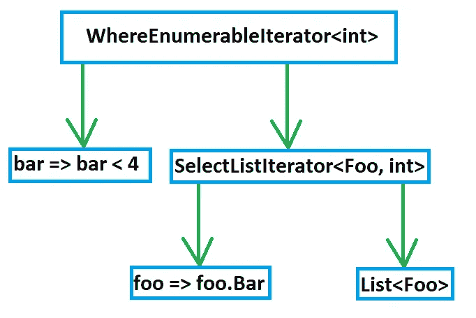
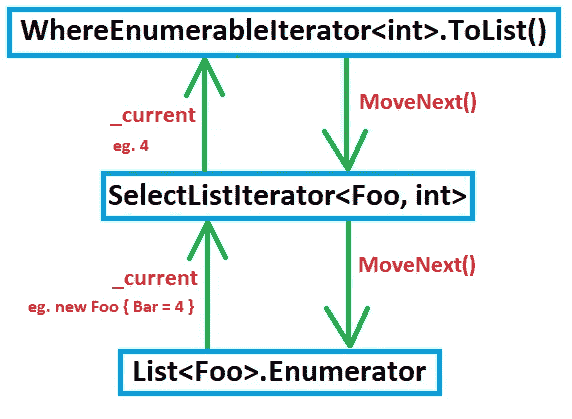

# 幕后的 Linq

> 原文：<https://levelup.gitconnected.com/linq-behind-the-scenes-efd664d9ebf8>

## 中迭代次数的比较。NET 5 和。NET 框架

照片由 [Matteo Catanese](https://unsplash.com/@matteocatanese) 在 [Unsplash](https://unsplash.com/photos/PI8Hk-3ZcCU) 上拍摄

当下面的代码执行时，会发生多少次源代码“迭代”?

## 假设

大多数人认为两件事之一:

1.  源只迭代一次，所以对于包含三个项目的源，需要三次迭代/循环。
2.  九次迭代(每个扩展方法迭代集合)。

让我们找出正确的答案。

## 什么是迭代？

我们首先需要就迭代的定义达成一致。

大多数人认为迭代是 foreach/for/while 等的一次循环。

但是当你循环遍历一个 foreach 时会发生什么呢？

## foreach 句法糖的背后

在幕后，实现了[迭代器模式](https://en.wikipedia.org/wiki/Iterator_pattern#C#)。

上面的`foreach`循环是以下内容的语法糖:

一个`foreach`循环可以被认为是对`GetEnumerator()`的调用，一个`while`循环，一个对`MoveNext()`的调用和对`Current`属性的访问。

## 迭代定义

实际的迭代可以认为是对返回`true`的`MoveNext()`的调用(因为如果它返回`false`，则`foreach`不会迭代)，并读取`Current`属性。

对于本文的其余部分，记住这一点很重要。

## 幕后的 Linq 方法

让我们回到最初的代码片段:

为了理解这里发生了什么，让我们剥去语法的糖衣。

## 没有句法糖

上面的代码片段将编译成相同的 CIL 代码，如果你这样写的话:

上面的代码是使用 [sharplab.io](https://sharplab.io/) 生成的，丑陋的编译器生成的名字被重命名为更加用户友好的名字。

这里我们可以看到在四块句法糖的掩盖下:

1.  Lambda 表达式成为静态类成员。
2.  列表初始化器变成了单独的类实例，每一个都是使用`List.Add()`添加的。
3.  扩展方法变成静态方法调用，以相反的书写顺序。
4.  自动属性成为带有支持字段的属性。

去掉语法糖的原因是因为这样更容易查看 Linq 方法发生了什么:

## ToList()，Where()和 Select()

这里我们可以看到，`Select()`的结果被用作`Where()`的输入，`Where()`的结果被用作`ToList()`的输入。

`Select()`获取列表，以及选择器委托的一个实例，`Where()`获取结果，以及谓词委托的一个实例。

让我们检查一下每一项的代码。

## [选择()](https://github.com/dotnet/runtime/blob/release/5.0/src/libraries/System.Linq/src/System/Linq/Select.cs#L13)

英寸 NET 5 中，`Enumerable`中的 Linq 扩展方法分布在多个文件中，这就是使用`partial`关键字的原因。

`Select()`只是返回一个`SelectListIterator<Foo, int>`(一个`IEnumerable<T>`)的实例，它包含一个对 source ( `list`)和`selector` func 的引用。

## [Where()](https://github.com/dotnet/runtime/blob/release/5.0/src/libraries/System.Linq/src/System/Linq/Where.cs#L12)

`Where()`调用最终创建了`WhereEnumerableIterator<int>`的一个实例，传入了一个引用`this`，它是充当`Iterator`的`SelectListIterator<Foo, int>`。

需要注意的一点是，`SelectListIterator<Foo, int>`有一个`TSource` ( `Foo`)和一个`TResult` ( `int`)，然而`WhereEnumerableIterator<int>`只有`TSource`被指定，因为`TResult`总是`bool`。

## 等级制度

在我们看`ToList()`之前，想象一下我们现在拥有的物体结构可能会有帮助。

在`Where()`返回之后，在`ToList()`被调用之前，我们在最高层有一个`WhereEnumerableIterator<int>`实例，包含一个`Func<int, bool>` ( `bar => bar < 4`)和一个`IEnumerable<Foo>` ( `SelectListIterator<Foo, int>`)。

同样，`SelectListIterator<Foo, int>`包含一个`Func<Foo, int>`和一个`IEnumerable<Foo>` ( `List<Foo>`)。

对象组成/层次。

## [ToList()](https://github.com/dotnet/runtime/blob/release/5.0/src/libraries/System.Linq/src/System/Linq/ToCollection.cs#L22)

最后，通过调用`WhereEnumerableIterator<int>.ToList()`的`IEnumerable<Foo>`接口，在`WhereEnumerableIterator<int>`上调用`ToList()`。

到目前为止，什么都没有发生，我们只是创建并返回了一些对象。

让我们看看`WhereEnumerableIterator<int>.ToList()`会发生什么。

如您所见，`WhereEnumerableIterator<int>.ToList()`遍历`_source`，后者是一个`SelectListIterator<Foo, int>`，将每个元素添加到一个局部`list`。

# 第一次迭代

如果你想自己调试源代码，你可以按照这些[指令](/how-to-debug-asp-net-core-source-code-448544c16473)去做。

正如我们之前了解到的，上面代码片段中的`foreach`只是调用`GetEnumerator()`的语法糖，一个`while`循环调用枚举器上的`MoveNext()`，并访问`Current`属性。

## [选择列表迭代器< Foo，int >。GetEnumerator()](https://github.com/dotnet/runtime/blob/release/5.0/src/libraries/System.Linq/src/System/Linq/Iterator.cs#L79)

作为`foreach`的一部分，发生的第一件事是`GetEnumerator()`在`SelectListIterator<Foo, int>`的父类`Iterator<Foo>`上被调用。这只是返回它自己，因为它已经是一个`IEnumerator<Foo>`(也是一个 `IEnumerable<Foo>`)。

## [选择列表迭代器< Foo，int >。MoveNext()](https://github.com/dotnet/runtime/blob/release/5.0/src/libraries/System.Linq/src/System/Linq/Select.cs#L218)

在一个`foreach`中，在`GetEnumerator()`被调用之后，`MoveNext()`被调用。

不要太在意`switch`的说法。只知道`_source.GetEnumerator()`只叫一次。这里的`_source`就是原来的`List<Foo>`。

## [列表< Foo >。GetEnumerator()](https://github.com/dotnet/coreclr/blob/master/src/System.Private.CoreLib/shared/System/Collections/Generic/List.cs#L576)

这由上面代码片段中的第 8 行调用。这将返回一个`Enumerator`结构的实例。

回到`SelectListIterator<Foo, int>.MoveNext()`内部，`_enumerator.MoveNext()`在第 12 行被调用。

## [List<Foo>. enumerator . movenext()](https://github.com/dotnet/coreclr/blob/master/src/System.Private.CoreLib/shared/System/Collections/Generic/List.cs#L1096)

这里发生的主要事情是`_current`属性被赋予了`_list`中的下一项。

点击[此处](https://stackoverflow.com/questions/66798333/why-does-listts-movenext-implementation-use-a-locallist)了解他们为什么引入局部变量`localList`。

## 该过程

我们现在有了所有感兴趣的代码片段。

在我们讨论正在发生的事情时，请随意向上滚动并查看相关的代码片段。

在调用了`List<Foo>.Enumerator.MoveNext()`之后，我们开始通过方法调用反向冒泡。

`SelectListIterator<Foo, int>`是介于`ToList()`(迭代开始的地方)和我们开始的底层`List<Foo>`之间的中间人。

回到`SelectListIterator<Foo, int>.MoveNext()`，我们根据返回`int`的选择器，从`List<Foo>`的`Enumerator`的`_current`属性中为其`_current`属性赋值。

然后`SelectListIterator<Foo, int>.MoveNext()`调用将返回`true`，回到它被调用的地方，在`while`循环内(显示为`foreach`循环)，在 [ToList()](https://github.com/dotnet/runtime/blob/release/5.0/src/libraries/System.Linq/src/System/Linq/Where.SpeedOpt.cs#L50) 内。

`ToList()`然后使用它的谓词来确定`int`是否低于 4。如果是，则添加到本地`list`。

“流程”的简化图。

## 多少次迭代？

从上图可以看出，只有两个`MoveNext()`方法被调用。

foreach 迭代仅在`MoveNext()`返回`true`时发生。

所以让我们算出这些`MoveNext()`方法被调用了多少次，并返回`true`。

在`List<Foo>`中有三个元素，我们有对返回`true`的`MoveNext()`的`3 * 2 = 6`调用。

如果你用`foreach`和`yield return`写等价的代码，将会有六次迭代(每个`foreach`三次)。

# 那在……NET 框架？

。NET 5 比。NET 框架。

大部分代码与。净 5。主要区别是`Where()`和`ToList()`。

## [Where()](https://referencesource.microsoft.com/#system.core/system/linq/Enumerable.cs,119)

`WhereEnumerableIterator<int>`没有优化的`ToList()`方法。

相反，它只是实现了迭代器模式，使用`predicate`在`MoveNext()`方法中返回`true`或`false`。

英寸 NET 5，我们现在应该已经完成了，但是因为在。NET 框架，`WhereEnumerableIterator<int>`并不创建`List<int>`，`ToList()`必须为我们做这些，这是额外的一步。

## [ToList()](https://referencesource.microsoft.com/#System.Core/System/Linq/Enumerable.cs,947)

这只是调用了`List<int>`构造函数，传入了`IEnumerable<int>`，也就是`WhereEnumerableIterator<int>`。

## [列表< int >建造师](https://referencesource.microsoft.com/#mscorlib/system/collections/generic/list.cs,74)

这里是额外的`MoveNext()`调用。NET 5 没有。

它们不是组合`List<int>`创建和`where`谓词，而是在单独的步骤中完成。

`List<int>`现在已经初始化，我们完成了。

# 摘要

英寸 NET 5，只有两个等价的`foreach`循环在幕后发生。然而在。NET 框架中，有一个额外的发生，这意味着 9 次迭代发生，而不是 6 次。

我希望您喜欢学习 Linq 的幕后工作方式。

了解底层实现细节不仅有趣，它还能帮助您编写更好的代码(我相信您知道不要不必要地调用`ToList()`)。

如果你有任何问题，请随时留下评论。

# 分级编码

感谢您成为我们社区的一员！[订阅我们的 YouTube 频道](https://www.youtube.com/channel/UC3v9kBR_ab4UHXXdknz8Fbg?sub_confirmation=1)或者加入 [**Skilled.dev 编码面试课程**](https://skilled.dev/) 。

 [## 编写面试问题+获得开发工作

### 掌握编码面试的过程

技术开发](https://skilled.dev)