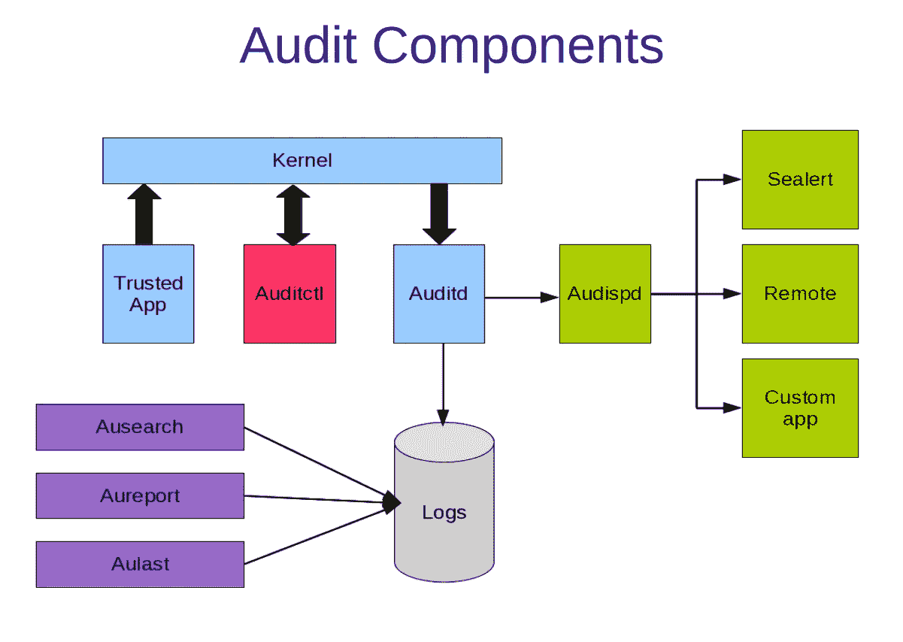
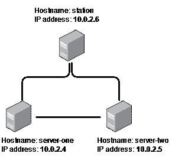

# Linux 审计系统:集中登录到远程服务器

> 原文：<https://levelup.gitconnected.com/linux-auditing-system-centralized-logging-to-remote-server-9644089702fb>


在 [Unsplash](https://unsplash.com?utm_source=medium&utm_medium=referral) 上[科学高清](https://unsplash.com/@scienceinhd?utm_source=medium&utm_medium=referral)拍摄的照片

当您有多台服务器时，可能很难跟上正在发生的事情。与其在不同的机器上查看分成不同文件的数千行日志，为什么不将所有内容发送到一个中央日志记录站，在那里您可以分析所有内容而不会丢失全局？

本文的目的是向您展示一个实际操作的例子，说明如何设置一个集中式日志记录机器，从网络的其他节点接收日志。为此，我将使用 Linux 审计系统。

**免责声明:**我绝不是这方面的专家。我想和你们分享我学习和试验这种酷技术的旅程。我希望你能和我一样开心。

# 什么是 Linux 审计系统？

对于那些对此一无所知的人(比如几天前的我)，Linux 内核审计系统是 Linux 内核的一个特性，它允许对系统上的任何相关操作进行深入的信息收集。

在内核级实现时，Linux 审计系统能够记录:

*   系统调用，以及其他有用的信息，如父进程 ID、进程 ID、可执行文件以及调用是否成功
*   文件访问，以及执行的操作类型(读、写、执行、文件属性的更改)

即使在某些方面，审计系统类似于标准的 Unix/Linux 日志记录功能，也存在一些相关的差异。其中之一是 Linux 审计系统不记录每个应用程序，而只记录可信的应用程序。[1]



图片取自:[https://people.redhat.com/sgrubb/audit/audit_ids_2011.pdf](https://people.redhat.com/sgrubb/audit/audit_ids_2011.pdf)

# 为什么？

Audit 为您提供了跟踪系统中安全相关信息的工具。然而，Audit **不会为您的系统提供额外的安全性**。调查系统中违反安全策略的情况非常有用，但这并不能阻止它们。Linux 审计系统最大的优势是**通用性**。你可以用它监控(几乎)任何你需要的东西。另外，Linux 审计系统是完全免费的，这是另一个相关的优势。[2]

# 场景描述



网络描述。作者图片

出于本教程的目的，我们将假设我们的网络由三台机器组成:

*   其中两个是**数据源**(服务器一和服务器二)
*   第三个是我们的**集中伐木站**(站)

我用 VirtualBox 创建了三个不同的虚拟机，并在其中两个上安装了 Ubuntu Live Server 20.04.2。三台机器在同一个 NAT 网络上。

# 步骤 1:安装和设置组件

Auditd 是审计用户空间守护进程，默认情况下不会安装在 Ubuntu 上，我们必须安装它。此外，我们将需要 audispd 插件来将日志事件转发到远程机器。

```
$ sudo apt install -y auditd audispd-plugins
```

现在，检查是否一切正常:

```
$ systemctl status auditd
```

你应该会得到一个绿色的信息，就像这样:

```
...
Active: active (running)
...
```

现在，是时候设置 audisp 远程日志插件了。

对于每个远程服务器(在这个例子中我们只有*服务器一*和*服务器二)，*我们必须告诉插件它应该把所有事件发送到哪里。

键入以下命令，将这两行放在最上面:

```
$ sudo nano /etc/audisp/audisp-remote.conf
remote_server = 10.0.2.6 #replace this with the IP of your central station
port = 60
```

# 步骤 2:配置日志记录站

现在是在伐木站工作的时候了。

首先，安装 auditd。

```
$ sudo apt install -y auditd
```

在本例中，我们不涉及防火墙，但是如果您有防火墙，不要忘记允许端口 60 的传入流量，否则，来自远程服务器的数据包将被拒绝。
打开审计配置文件，从包含 tcp_listen_port 的行中删除“## ”:

```
$ sudo nano /etc/audit/auditd.conf
...
tcp_listen_port = 60
...
```

现在，重新启动守护进程。

```
$ sudo service auditd restart
```

**注意:** Auditd 是高度可定制的，所以请确保查看*/etc/audit/Auditd . conf .*该文件包含特定于审计守护程序的配置信息。要了解更多，请阅读这里的文件:[https://linux.die.net/man/8/auditd.conf](https://linux.die.net/man/8/auditd.conf)

# 步骤 3:审计规则和观察者

因为我们只是在试验这个神奇的工具，所以让我们做一些非常基本的事情，比如监控对包含敏感信息的文件的访问。

如果我们想为 */etc/passwd* 创建一个文件监视规则该怎么办？

```
$ sudo nano /etc/audit/rules.d/audit.rules
...
-w /etc/passwd -p wrxa -k identity
```

我们可以将这条规则分为三部分:

*   -w /etc/passwd=监视/etc/passwd
*   -p wrxa =记录写、读、执行和属性更改权限的使用情况
*   -k identity =将密钥标识分配给该规则

现在，通过重新启动 auditd 来启用更改:

```
$ sudo service auditd restart
```

# 第四步:开始记录！

现在一切都已经设置好了，让我们在两台远程服务器(服务器一和服务器二)上激活远程日志插件。

```
$ sudo nano /etc/audisp/plugins.d/au-remote.conf
...
active = yes
...
```

像往常一样，通过重新启动 auditd 来启用更改:

```
$ sudo service auditd restart
```

如果一切顺利，当您尝试在一个远程服务器上读取、写入或更改/etc/passwd 的属性时，您将在中央工作站上有一个事件。您可以像阅读普通文件一样轻松地阅读日志文件，但是，由于我们讨论的是日志，它可能是一个巨大而混乱的文件。Ausearch 为这个问题提供了一个很好的解决方案，它是一个用于在审计日志中搜索事件的工具。

例如，如果我们想搜索来自 server-one 的带有密钥标识的事件，我们只需编写:

```
$ ausearch --node server-one -k identity
```

# 结论

像我一样随意试验这个工具！它易于配置，易于使用，并开辟了一个关于审计系统的新的可能性的世界。

谢谢😉

# 参考

[1]: Grubb，S. (2011)。使用 RHEL6 和审计子系统进行本地主机入侵检测，PDF 文档:[https://people.redhat.com/sgrubb/audit/audit_ids_2011.pdf](https://people.redhat.com/sgrubb/audit/audit_ids_2011.pdf)

[2][https://access . red hat . com/documentation/en-us/red _ hat _ enterprise _ Linux/6/html/security _ guide/chap-system _ auditing](https://access.redhat.com/documentation/en-us/red_hat_enterprise_linux/6/html/security_guide/chap-system_auditing)