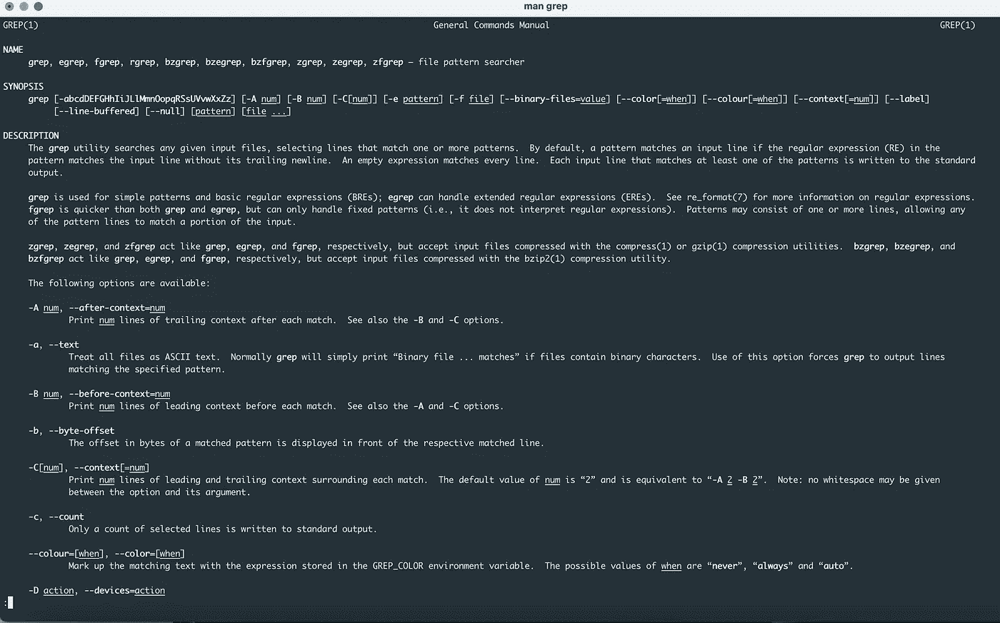
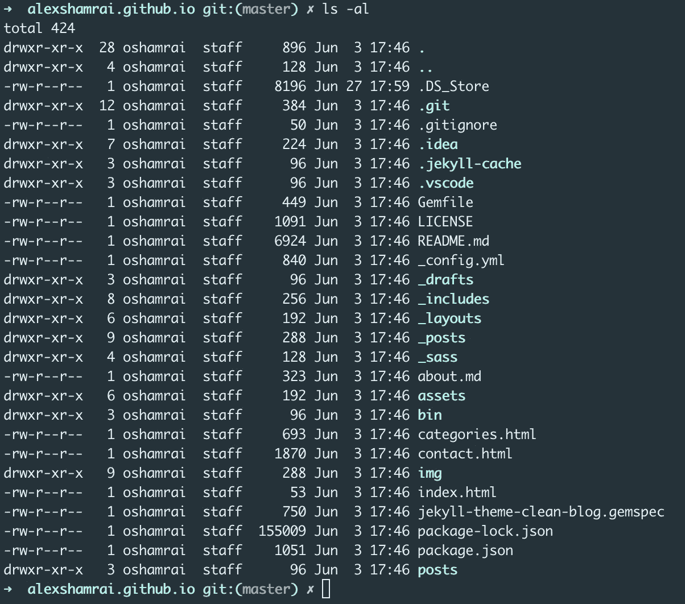
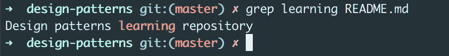
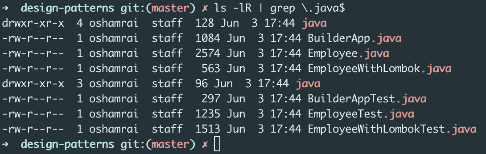
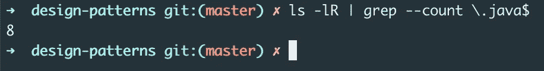

# Linux 日常命令

> 原文：<https://levelup.gitconnected.com/linux-commands-for-everyday-43581d6e3a03>

我们中的许多人迟早会面对使用 Linux/Unix 命令行来满足不同需求的必要性。它可能只是一个简单的使用终端来配置本地机器或与远程服务器一起工作。这里有一个命令列表，对完全的初学者会有帮助，坦率地说，这是我每天使用的命令列表。


由 [Markus Spiske](https://unsplash.com/@markusspiske?utm_source=unsplash&utm_medium=referral&utm_content=creditCopyText) 在 [Unsplash](https://unsplash.com/s/photos/matrix?utm_source=unsplash&utm_medium=referral&utm_content=creditCopyText) 上拍摄的照片

# 指南

第一个也是最有用的命令是`man`。每当你需要知道如何使用任何命令时，只需在命令行中键入

```
man <command>
```

这是`grep`命令的手册(要退出手册页，只需键入*“q”*)。通常手册包含了关于命令的所有综合信息，如果你需要快速浏览如何使用一个命令和一个合适的选项，阅读所有的页面并不总是方便的。



我经常使用一个 [**tldr 页面**](https://tldr.sh/) 来学习一个新命令或刷新我的用法示例知识。这是一个简化的、社区驱动的手册页版本。

# 基本命令

`pwd` —打印当前目录路径
`cd` —更改当前工作目录
`mkdir <directoryname>` —在当前工作目录或指定路径
`rmdir <directoryname>`新建一个目录—删除一个目录
`rm <filename>` —删除一个文件
`mv <file> <new_file_path>` —移动文件到新位置
`cat <filename>`—打印文件

`ls` —显示目录的内容
使用`ls`命令的一个最流行的例子是与`-al`结合使用。它以表格形式显示所有文件和目录(包括隐藏的文件和目录)(权限、所有权、大小和修改日期)。



`clear` —清空终端屏幕
`touch <filename>` —创建一个空文件(如果文件已经存在，则以写模式打开文件并更新其时间戳)
`echo` —打印终端(或给定文件)的参数
`diff <firstfile> <secondfile>` —比较文件
`history` —显示命令行历史

`grep` —一个强大的工具，可用于在文件中搜索精确的字符串或正则表达式。它还可以与管道结合使用来过滤另一个命令的输出。
`grep <exact string> <filename>` —在文件中搜索精确的字符串



`ls -lR | grep \.java$` —显示所有 java 文件



`ls -lR | grep --count \.java$` —统计 java 文件



# 网络和流程管理

`ps` —显示进程列表
`sudo` —以 root
身份运行命令`kill <PID>` —通过 PID
`killal <name_of_program>`终止进程——通过名称
`ping <host>`终止程序或进程——向网络主机发送数据包
`ssh -i <paht_to_key_file.pem> <user>@<host>` —使用 ssh 协议连接远程服务器

注意:这个列表是根据我的个人经验形成的，如果你认为遗漏了什么重要的东西，不要犹豫，在这里发表评论，或者在任何社交媒体上联系我。