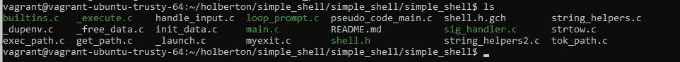
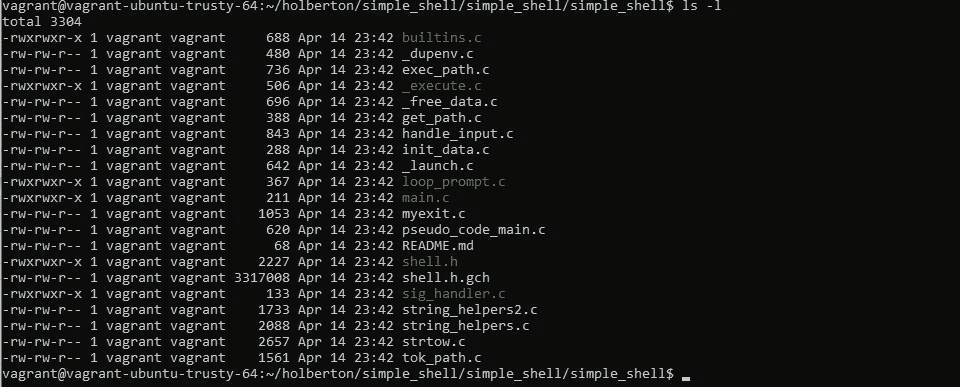
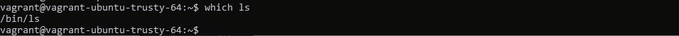
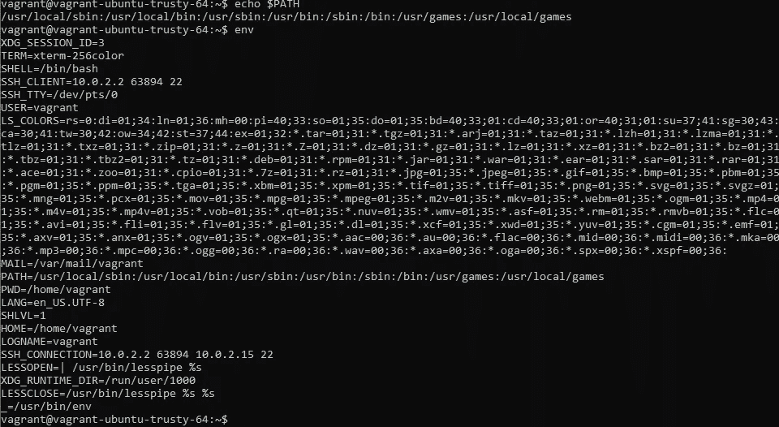
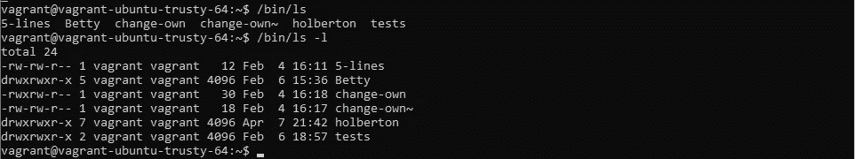

# Linux 命令:ls 及其选项-l

> 原文：<https://levelup.gitconnected.com/linux-commands-ls-and-its-option-l-51d720769d6a>

当你在一个 shell 中输入`ls -l`并点击*回车*是怎么回事？


# 重要的事情先来

在这篇文章中，我们将讨论 shell、Linux 命令及其选项。因为我们非常希望您**理解并内化**标题主题，所以记住一些将帮助您实现我们目标的概念总是有好处的。

所以，我们开始吧！

*   什么是贝壳？

外壳是一个程序，它从用户的键盘获取命令，并将这些**指令**发送给操作系统，以便操作系统能够**执行这些指令**。它被命名为 shell，因为它是操作系统的最外层(它使用一个*内核*)。

换句话说，shell 提供了一个用户界面，允许用户通过命令行界面(CLI)访问操作系统。此外，操作系统使用外壳来控制使用外壳脚本的系统的执行。

用户需要熟悉命令及其调用系统，以及特定于 shell 的脚本语言，这样才能利用它的所有特性。

*   你是说… *内核*吗？


是啊！内核是每个 Linux 发行版的共同点。其实 Linux 特指内核，1991 年以创始人 Linus Torvald 命名(他想到的第一个名字:Freax，“免费+怪胎+ UNIX”)。

每个操作系统都使用一个内核，当你与任何软件交互时，它会完成大部分工作，让你拥有一台可以工作的电脑！内核就像一座桥梁，连接你的计算机硬件和你想要使用的软件。

资源管理是内核提供的另一个功能，因为它必须检查**是否有足够的可用内存**来执行程序，并在内存中正确分配程序。当出现内存故障时，系统会停止正常工作，因为一个程序需要另一个程序当前正在使用的资源。

请说重点！🤷‍♀️

我们快到了，别担心！正如我前面所说的，你需要知道一些基本的话题，这样你才能理解我们的目标。

*   命令，听起来没那么难，对吧？

命令是一个字符或一串字符，当写在 shell 中并按回车键时，它向内核发送一个“指令”(即**系统调用**)，执行指定的功能。

命令很多，使用最多的有 *pwd* (打印工作目录) *cd* (更改目录) ***ls* (列出文件和目录)**。

大多数命令**允许选项和参数**，它们是这样操作的:

```
*command -options arguments*
```

分解一下，*`*command*`指的是命令的名称，`*-options*`是您想要对命令的行为进行的调整(选项是可选的)，而`*arguments*`是命令操作的“对象”。*

*   *ls 命令*

*ls 命令非常有用，因为 CLI 看不到文件夹或文件，就像您在日常计算机浏览器上看到的那样。为了让您知道您的目录中有什么内容，请在 shell 中键入 ls 命令。*

*简而言之，从 *ls man* 来看，该命令的作用是**列出关于文件的信息**(默认为当前目录)，如果没有其他指示，则按字母顺序对条目进行排序。*

*它的**语法**如下所示:*

```
*$ ls [*options*] [*file*|*dir*]*
```

*(哦，看到那个灰色的长方形里面有几个字吗？这是您在 shell 中实际键入的内容)*

*命令**选项**之前提到过，现在我们知道它们调整命令的行为方式。下面，你会看到*一些*的 ls 选项:*

*ls **-a** ，列出所有文件，包括以“.”开头的隐藏文件
ls **-d** ，用“*/”列出目录。
ls **-i** ，列出每个文件的索引号。
ls **-l** ，长格式列表—显示权限。
ls **-s** ，列表文件大小。
ls **-la** ，列出包含隐藏文件的长格式。
s **-ls** ，带文件大小的长格式列表。*

*(有没有注意到 **-la** ， **-ls** 选项？要知道你可以一次使用不同的选项，这里的‘主’选项是 **l** ，它会用长格式列出，如果和 **a** 一起使用，长格式的列表也会列出文件大小，也可以单独使用)。*

## ***言归正传***

*我知道使用命令看起来非常简单，每个人都可以毫无困难地使用它们。嗯，是的。但是，当你把指令发送到内核并让它工作时，会发生很多事情。*

*所以，当你打开一个 shell 时，你会看到一个带有' $ '的**提示**，那是你写下你想要或需要执行的命令或'动作'的提示，然后回车。当您使用 *ls* 并按回车键时，它看起来像这样:*

**

*在这里，您可以看到我们的 simple_shell 项目中有哪些文件和目录，只是它们的名称。*

*这是当你使用 ls -l 时你会看到的:*

**

*现在，关于目录中的内容有了更多的信息:文件权限、所有者、组、大小(以字节为单位)、修改时间和文件名。*

**一件重要的事情！*shell 将您在命令行上写的单词或字符作为参数，从 0 到您想写的任何内容。要知道参数 0 arg[0]意味着什么:它是一个命令，并且必须是**可执行的**。*

*首先，在提示符下写下 **ls -l** 之后，一按 enter 键，shell 就会使用一个名为 getline()的函数读取这些内容，并将命令行解析成将要发送给执行程序的参数。shell 检查命令是否是别名，用它的值替换它，如果不是，检查命令 arg[0]，看它是否是内置的**。***

*****别名**是引用命令的快捷方式，用于避免键入长命令。而**内置的**命令是包含在外壳本身中的命令。)***

***为了执行(实际上是从 shell 启动的另一个程序), shell 需要知道命令的位置以及它是否可执行。我们的命令在文件夹 **bin** 中，位于系统的**根目录**下。您可以使用命令*检查任何命令的位置，该命令*:***

******

***要获得更多关于哪个的信息，请参考哪个手册。***

***shell 现在通过环境变量$PATH 知道程序在它的环境中沿着路径( **/bin/ls** ，'/'表示根目录)在哪里，这个环境变量包含一个目录列表，每次输入一个命令都会在这个目录中搜索这个命令。这个变量用“=”分隔，它包含的目录用“:”作为彗差进行解析。使用 *env* 命令列出所有环境变量，并回显 PATH 以查看该变量的具体内容，如下所示:***

******

***env 包含$PATH 变量，因为我们只关心$PATH，所以我们使用命令 echo 来查看它包含了什么。***

***请记住，shell 只搜索在$PATH 上找到的目录，它包含该目录的绝对路径**而不是当前工作目录。此外，您可以使用命令的绝对路径(/bin/ls)和命令选项，您将获得与 *ls* 描述中所示相同的输出！：*****

******

# *****越陷越深*****

***此时shell 确切知道 ls 命令是可执行的，并且位于哪里。接下来，必须完成执行部分。为此，需要完成三个系统调用。***

*   ***叉子()***

***还记得运行一个命令是在另一个进程(Shell，parent)上启动一个进程(ls，child)吗？多亏了 *fork()* ，它通过复制**父**流程创建了一个**子**流程。在系统调用之后，两个进程都将执行下面的指令。***

***子进程和父进程在不同的内存空间中运行。shell 上的所有进程都有自己的进程 ID ( *pid* )。 *fork()* 的返回值有:***

****负值*:如果子进程创建不成功。
*归零*:返回已创建的子流程。
*正值*:返回父进程。该值包含子进程 ID。***

***下面是 fork()的概要:***

```
*****#include <sys/types.h>**
**#include <unistd.h>**

       **pid_t fork(void);*****
```

*   ***execve()***

***现在我们有了一个子流程，系统需要关注这个子流程。execve()系统调用通过停止父进程来执行路径名引用的程序，在本例中为 *ls，*，并用新程序替换它，包括新初始化的堆栈、堆和数据段。***

***下面是 execve()的概要:***

```
*****#include <unistd.h>**

**int execve(const char ****pathname***, char *const** *argv***[],**
           **char *const** *envp***[]);*****
```

***要执行的程序是 *pathname，argv* 是作为命令行参数传递给新程序的字符串指针数组， *envp* 是作为新程序环境传递的字符串指针数组。envp 数组必须以空指针结束***

*   ***等待()***

***您可能想知道在执行子进程时父进程发生了什么。嗯，系统调用 wait()用于等待父进程的子进程的状态变化，并获取关于该子进程的信息。***

> ***状态改变被认为是:子终止；这个孩子被一个信号拦住了；或者孩子被一个信号恢复了。在终止孩子的情况下，执行等待允许系统释放与孩子相关联的资源；如果不执行等待，那么被终止的子进程将保持“僵死”状态。
> **wait**()系统调用挂起调用线程的执行，直到它的一个子线程终止。***

***下面是 wait()的概要:***

```
*****#include <sys/types.h>**
**#include <sys/wait.h>**

       **pid_t wait(int ****wstatus***);*****
```

## ***所以…真正的问题是:当你在一个 shell 中键入 *ls -l* 并点击 *Enter* 会发生什么？***

***好吧，当提示符需要一个命令' $ '时，你键入 *ls -l* ，然后在$PATH 环境变量中搜索程序。之后进行上面提到的系统调用:父进程，shell 本身，被复制到一个子进程( *fork()* )，我们要运行的程序。这个程序的执行是由 *execve()* 完成的，而父进程等待它改变状态( *wait()* )。***

***当程序被执行时(并且如果程序实际存在于环境中；如果没有，你将得到一个错误:命令没有找到)输出将被显示，使用的内存将被释放，提示符将再次等待下一个命令被执行。***

******

## ***太多了！***

***是的，它是。然而，当您在 shell 上写了一个命令后按 Enter 键时，您会惊奇地发现正在发生什么。你越了解事物的运作方式，它们就越有趣！***

## ***贡献者:***

*   ***圣地亚哥·门迭塔、马努埃尔·托雷斯和法比奥·古铁雷斯。***