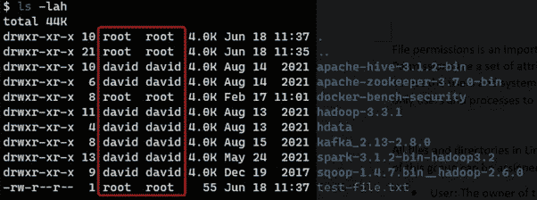
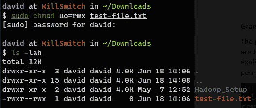
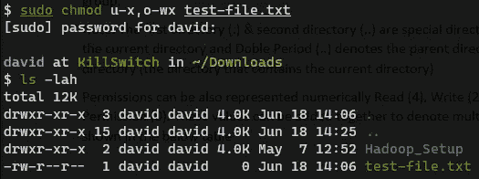

# Linux 101:文件权限

> 原文：<https://levelup.gitconnected.com/linux-file-permissions-explained-970eaf11faac>

## Linux 基础知识


对于任何使用 Linux 的人来说，文件权限是一个需要理解的重要概念。权限是一组属性(以及所有权)，用于控制用户和系统进程对文件的访问级别。它是一种安全机制，确保只有授权的用户和进程才能访问某些文件和目录。

# 权限组

Linux 中的所有文件和目录都分配有三个权限组。该组中的每一个都可以被分配不同的访问级别。这三组如下:

*   **用户**:该组代表文件或目录的所有者，即创建文件或目录的用户或进程。
*   **群组**:群组就是一群用户。一个 Linux 系统可以有多个用户，并说这些用户需要被分配权限，而不是一次一个地为他们设置权限，我们可以将他们全部添加到一个组中。在组级别应用的权限会传播给该组中的所有用户。因此，此处分配的权限适用于与文件或目录属于同一组的所有用户。
*   **其他**:为该组指定的权限适用于系统中不是文件所有者且不属于文件或目录所有者组的所有人。

# 文件所有权

在我们进入权限集之前，让我们快速浏览一下文件所有权。Linux 中的每个文件和目录都属于一个用户和组。我们可以使用 **ls** 命令查看这些信息



请注意突出显示的部分，第一列表示文件的所有者，第二列表示拥有该文件的组。一个文件或目录只能由一个组拥有。

要查看我们所属的组，我们可以使用 **id** 或 **groups** 命令


请注意 id 命令输出的数值，这是分配给系统中每个用户和组的数值。用户属于多个组也是完全有效的，这可以在 id 和 groups 命令的输出中看到。显示为 UID(用户 ID)的值是系统用户的名称，而显示为 GID(组 ID)的值是用户的**主组**。当用户创建任何文件或目录时，默认情况下该文件或目录将归该组所有。

# 权限集

有三种权限可以分配给每个文件或目录。这些权限是读、写和执行。

Linux 权限及其对文件和目录的意义


回到之前的输出，现在让我们关注第一列。请注意，对于每个文件和目录，该列中始终有 10 位。第一位用于表示文件的类型。在这个位置的一个 **d** 代表一个目录，而一个连字符( **-** )将意味着一个普通的文件。

> **注意**:在这个位置还可以找到一些其他的值，比如 b、c、s、p、l，这些用来表示文件类型，不在本讨论的范围之内。这些文件类型只有当人们在系统中寻找时才会遇到。

剩余的 9 位被分成 3 组，每组 3 位。第一组 3 位代表所有者的许可。下一组代表拥有该文件的组的权限，最后 3 位代表适用于系统中其他每个人的权限。

3 组中每组的第一个位置可以具有值 r(读)，第二个位置可以具有值 w(写)，最后一位可以具有值 x(执行)。如果 9 位中的任何一位有连字符(-)，则意味着没有设置权限。


回到图像，让我们试着运用我们所学的知识，试着更清楚地理解图像。我们可以看到有 8 个目录和 1 个普通文件(通过查看 permissions 列的第一位推断出来)。目录为所有者设置了读取、写入和执行位，为所有者组设置了读取和执行位，为其他用户设置了相同的位(读取和执行)。大多数目录(其中 7 个)归用户“david”所有，属于组“david ”,而其中一个目录归用户“root”所有，属于组“root”。对于映像中唯一的文件，所有者设置了读取和写入位，所有者组和其他用户仅设置了读取位。该文件归“root”用户和“root”组所有。

> **注意**:第一个&第二个目录是特殊目录。句号(。)表示当前工作目录，而双句点(..)表示当前目录的父目录

权限也可以用数字形式表示:读(4)、写(2)、执行(1)和无权限(0)。这些权限可以添加在一起，表示如下所示的复杂权限

Linux 权限的数字表示

# 授予和撤销权限

使用 **chmod** (更改模式)命令可以更改文件的权限。有两种方法可以设置文件的权限——符号方法和数字方法。

## 符号方法

这种方法要求我们明确而详细地指定需要对文件应用的权限。它具有以下一般形式:

```
chmod WhoWhatWhich filename
```

*   **谁**:用户，组，其他，所有(u，g，o，a)
*   **什么**:添加，删除，精确(+，-，=)
*   **哪个**:读，写，执行(r，w，x)


我们有一个名为`test-file.txt`的文件，现在让我们更改该文件的权限，以便所有者和其他权限组可以拥有读取、写入和执行权限。



每个组的权限也可以用逗号分隔的值单独分配。

```
sudo chmod u=rwx,o=rwx test-file.txt
```

如果我们想要添加或删除某些权限，可以使用加号(+)和减号(-)。等号(=)将权限精确地设置为用户指定的值。

## 数值方法

在这种方法中，我们利用前面讨论过的权限的数字表示。我们需要指定三个数字，第一个代表所有者的权限，第二个代表所有者组的权限，第三个代表分配给所有其他用户的权限。

```
chmod ### file
```

在我们设置示例之前，让我们使用符号方法将文件的权限重置为其原始权限，然后尝试使用数字方法设置相同的权限。



正如我们所看到的，使用这种方法，我们可以非常快速和优雅地设置文件的权限。


最后，权限是 Linux 系统的一个重要部分，理解它对于有效地使用 Linux 非常重要。我们研究了什么是权限组和权限集。然后我们走了一个小弯路去了解组和文件所有权。然后，我们探讨了可以用来更改文件和目录权限的两种方法:符号和数字。

## 参考

*   [https://linuxize . com/post/understanding-Linux-file-permissions/](https://linuxize.com/post/understanding-linux-file-permissions/)
*   [https://www . the geekdiary . com/understanding-basic-file-permissions-and-ownership-in-Linux/](https://www.thegeekdiary.com/understanding-basic-file-permissions-and-ownership-in-linux/)
*   [https://Linux foundation . org/blog/classic-sysadmin-understanding-Linux-file-permissions/](https://linuxfoundation.org/blog/classic-sysadmin-understanding-linux-file-permissions/)