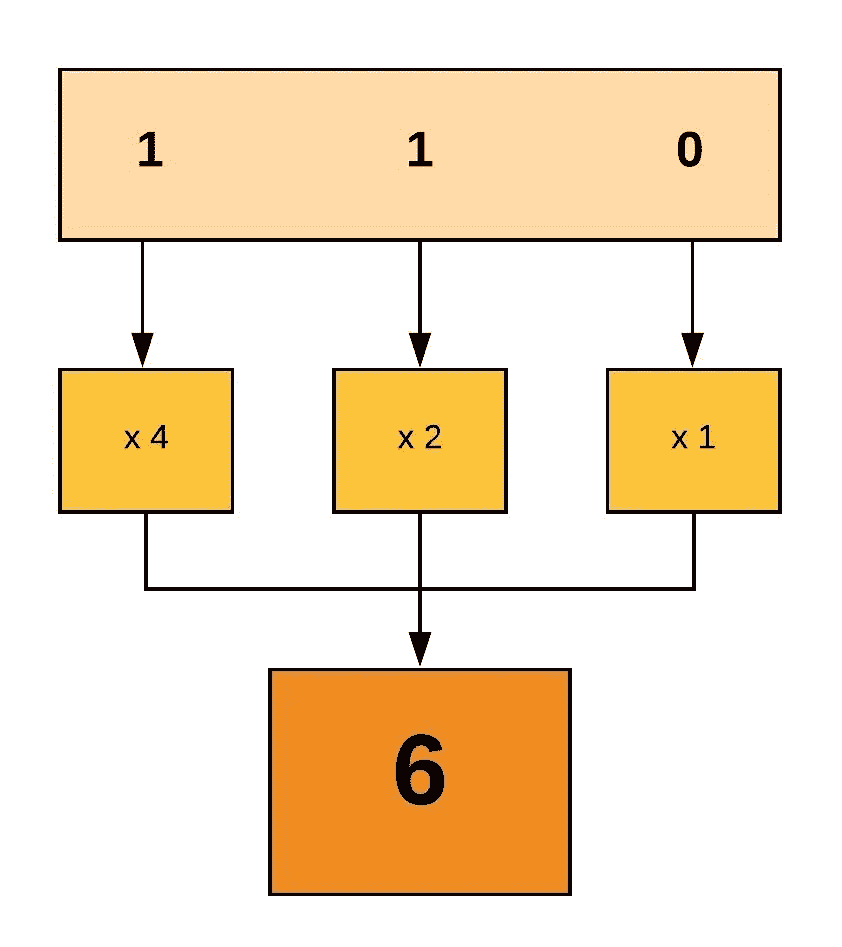

# Linux:文件权限和所有权

> 原文：<https://levelup.gitconnected.com/linux-file-permissions-ownership-20b84fbb2340>

## 使用 chmod 和 chown 处理权限和所有权

熟悉基于 Linux 的操作系统的用户在终端中执行一些命令时，应该至少遇到过一次与`Permission denied`相关的问题。本文旨在阐明与文件和目录相关的用户权限和所有权。

为了获得权限和所有权的介绍，在**终端**中，导航到文件驻留的位置并执行`ls -al`以列出文件和目录以及所有相关的详细信息。

```
**drwxr-xr-x**  12 bibi         staff     384 16 Mar 11:19 public
**-rw-r--r--**   1 bibi         staff    1660 16 Mar 11:51 note.txt
```

让我们来分解这些条目的每个部分代表什么:


文件上 **ls 命令**的输出

**注意**:文件类型可以是`-`文件，也可以是`d`目录。

# 文件权限:

本节试图捕捉更多关于上面介绍的**权限**块，以及权限在基于 Linux 的操作系统中是如何有用的。

## **用户类型包括:**

*   用户 →文件所有者。除非以后更改，否则文件的创建者将是所有者。
*   **组** →文件的用户组，还应包括文件的所有者。
*   **其他** →除上述两类以外的所有其他用户或组。

## 权限类型包括:

*   **读** → **文件**:查看或复制文件，**目录**:列出或复制文件
*   **写** → **文件**:修改文件，**目录**:添加或删除文件
*   **对文件**执行 → **:可执行则运行，对目录**执行**:进入目录**

当考虑文件和目录时，有 3 种类型的用户和 3 种类型的权限。因此，应该使用 9 种组合来表达文件或目录如何与给定的用户和给定的权限交互。

因此，9 个字符可以定义每个用户的权限类型，这将**定义每个用户对给定文件或目录的访问级别**。


start.sh 脚本的权限

按照这个例子，如果许可被授予，将通过字母值显示，如`r`、`w`、`x`，如果相关许可未被授予，则通过`-`表示。对于这个例子:

*   **用户**拥有**读**、**写**和**执行**的权限。因此，所有者可以阅读、编辑和执行该脚本。
*   **组**拥有**读**、**写**的权限但没有执行权限。因此，组中的用户只能读取、编辑脚本，但不能执行脚本。
*   **其他**只有**读取**权限，任何非所有者或所有者组中的其他用户只能读取脚本内容。

## 使用 chmod 命令更改权限:

可以根据需要改变文件权限，并使用`chmod`命令。这里的`chmod`简单来说就是**改变模式**。

## **1。使用带有符号值的 chmod】**

**用户类型**定义如下:用户→ `u`、群组→ `g`、其他→ `o`、全部→ `a`。

**权限类型**定义如下:读取→ `r`，写入→ `w`，执行→ `x`

也可以使用多个运算符，如下所示:添加新权限→ `+`,删除现有权限→ `-`,设置确切权限→ `=`。

让我们接着看一些例子:

*   `chmod **g+x** abc.sh` →这将**向**组**添加** **可执行**权限，该组的其他读写权限值保持不变。
*   `chmod **o=r** abc.txt` →这将**为**其他**设置精确的**权限，其中仅附加读取权限，并将删除写入和执行值。
*   `chmod **a-w** abc.sh` →这将**从**所有**中移除**写权限，并且不改变与用户相关的读或执行权限。

为了便于使用，也可以一次更改多个用户和权限:

```
chmod **u=rwx,g=rx,o=r** start.sh
```

**注意:**从堆栈溢出回答中，你可能遇到过类似`**chmod +x ./command.sh**`的命令，它只是表示`**a+x**`命令。

## **2。使用带有八进制值的 chmod】**

每个用户权限都使用三位二进制值声明，如果该权限被授予，则包含`1`，否则为`0`。由于使用了 3 位数字，因此可以用从 0 到 7 的八进制值来解释。然后 3 个八进制值用于解释用户、组和其他人的权限。



权限的二进制计算

这里的二进制组合包括如下。`read = 1`、`write = 0`、`execute = 0`。这建立了`110`二进制值，如果你熟悉二进制，可以看到这对应于值`6`。即使不熟悉二进制转换，也可以使用`x 4`、`x 2`或`x 1`进行乘法运算，并对`6`的值求和。

应该对每个用户的所有权限重复这一过程，以最终值结束。这个看似 3 位数的值可以解释所有哪些用户类型的哪些权限类型:


权限的八进制值

所以让我们分解命令`chmod 764 command.sh`:

*   **用户**的数字是 7。二进制是 111，所以有`r`、`w`、`x` → `u=rwx`
*   **组**的数字为 6。二进制是 110，所以有`r`、`w` → `g=rw`
*   **其他**有 4 为数字。二进制是 100，因此`r` → `o=r`

`ls -l command.sh`应该按照之前的学习返回`**— rwx rw- r--**` 。

**注意:**细粒度的访问可以通过给定的用户权限图获得，因此像`chmod 777`那样授予所有访问权限不是一个好的做法，这会导致安全漏洞。

**注:**为了给整个目录的内容添加权限，可以这样使用递归`chmod -R 764 public/`。但是，这不同于只更改父目录`chmod 764 public`的权限，而不更改其内容。

**注:**与`ls -l`类似，Linux status 命令也可以像`stat run.sh`一样用于检查权限和所有权细节

**让我们通过一个练习来跟进权限变更:**

*   使用`nano run.sh`创建 shell 脚本，并添加简单的命令:

```
#!/bin/bash
**echo "Executed...!"**
```

*   使用`ls -l run.sh`或`stat run.sh`检查现有权限

```
- **rw- r-- r--**
```

*   为了便于练习，我们将只使用文件所有者的当前用户。
*   删除用户的所有权限:`chmod 000 run.sh`，并使用前面的命令:`--- --- ---`检查权限列表。
*   尝试使用`less run.sh` → `run.sh: Permission denied`读取`run.sh`。
*   使用`chmod 400 run.sh`授予读取权限，并检查是否可以读取。
*   尝试使用`nano run.sh`写入`run.sh`,进行更改并尝试保存→ `[Error writing run.sh: Permission denied]`。
*   通过`chmod 600 run.sh`授予写权限，并检查您是否可以编辑。
*   尝试使用`./run.sh`执行`run.sh`→

```
-bash: ./run.sh: Permission denied
```

*   通过`chmod 700 run.sh`授予执行权限，执行`Executed...!`输出的脚本。
*   使用`stat run.sh` → `rwx --- ---`检查文件权限

# 文件所有权

从上面对文件权限和`chmod`命令的介绍来看，可以是**所有者**和**群组**的权限。因此，研究一下这些所有者、组，以及如果需要的话如何改变它是很重要的。

*   **所有者** →指拥有给定文件或目录的用户。通常文件的创建者作为其所有者被附加，直到它被改变。
*   **组** →指拥有给定文件或目录的组。通常，用户创建者可以是多个组的一部分，但将拥有主要组。当用户创建文件或目录时，将默认设置该组。

基于 Linux 的系统中的用户和组用于适当地管理安全性，这是这里要讨论的高级主题。但是在终端中，一个简单的命令如`groups`将列出当前用户所属的所有组。

考虑到文件是目录，从`ls -l`的输出可以看出**权限**和**所有权**，输出示例如下:

```
-rw-r--r--  1 **bibi**  **staff**     272 12 Mar 12:00 assets.json
```

这里`bibi`是 **assets.json** 的所有者，`staff`是该文件的组所有者。此外，我们可以理解权限是如何附加的:`— **rw-** **r--** r--`。因此作为所有者的用户`bibi`被赋予了对该文件的读写权限`rw-`，因此该用户将拥有对该文件的读写权限，但没有执行权限。组`staff`中的用户被附加了`r--`权限，在这里它只能读取文件。

**注:**更改权限或所有权的一个用例是使用`scp`复制到服务器或使用`ssh`访问服务器。在这里，复制脚本的用户可能无权执行更新后的脚本。因此，要么需要更改脚本的权限，以便当前用户可以执行，要么将脚本的所有权更改为现有用户，以便可以执行。

## 使用 chown 命令更改所有权:

类似于之前使用的`chmod`命令，还有`chown`命令来改变文件或目录的所有权。这里的`chown`简单来说就是**换主人**。

*   `chown **bibi** assets.json` →这将把**仅用户**的所有权更改为该文件或目录的给定用户。
*   `chown **bibi:staff** assets.json` →这将把**用户**所有权**和**组**所有权更改为该文件或目录的给定用户和给定组。**
*   `chown **:staff** assets.json` →这将仅将**组**的所有权更改为给定的员工。或者`chgrp`命令也可用于仅改变组，如`chgrp staff assets.json`所示。

**让我们通过练习来跟进所有权变更:**

*   通过`su root`切换到`root`用户，使用`nano note.txt`创建一个包含一些内容的文本文件。使用用户`root`的`stat note.txt` **→** `rw-`权限，验证其是否附属于`root`的当前用户

```
-**rw-**r--r--  1 **root**  staff
```

*   通过退出`root`的终端切换回用户`bibi`，并尝试使用`nano note.txt` → `**Permission denied**`从`bibi`编辑该文件
*   尝试使用`chown`将当前所有者从`root`更改为`bibi`，这样当前用户将继承`rw-`吃东西的权限:`chown bibi note.txt` →

```
chown: note.txt: Operation not permitted
```

*   由于安全因素，这是受限制的，因为这可能导致用户改变所有权来修改未被授权的文件。
*   因此，这可以通过`chown bibi note.txt`的`root`端子或使用`bibi`端子的`sudo chown bibi note.txt`进行更改。
*   验证用户所有权是否已更改为`bibi`:

```
-**rw-**r--r--  1 **bibi**  staff
```

*   使用`nano note.txt`从`bibi`用户处编辑，以验证已保存的更改没有任何问题。

我希望这篇文章能够深入了解 Linux 中的**权限**和**所有权**，并使用`**chmod**`和`**chown**`命令来改变**文件**和**目录**的权限和所有者。