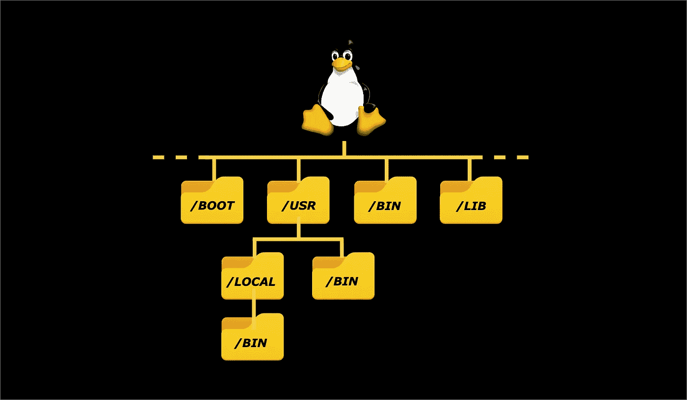

# 每个优秀的开发人员都应该知道的关于 Linux 文件系统的 3 个基本知识

> 原文：<https://levelup.gitconnected.com/linux-file-system-everything-you-need-to-know-in-9-mins-58aceece3cae>

## 关于 Linux 中文件系统类型、目录结构和一些相关命令的教程

Linux 文件系统结构(图片由作者创建|图标致谢: [PNGWing](https://www.pngwing.com/) )

文件系统是存储设备上组织数据的标准。文件系统将驱动器上的存储空间划分为称为簇的虚拟区间。它还维护每个文件所在位置和可用空间的索引。

在本文中，我们将讨论不同的文件系统类型、文件系统中的目录结构，以及一些用于在文件系统上导航和执行不同操作的命令。

# 文件系统类型

Linux 支持各种文件系统类型，我们将在下面讨论一些重要的类型。

## **分机**

扩展文件系统(ext)是 1992 年为 Linux 推出的，是第一个专门为 Linux 设计的文件系统。它的设计部分基于 UNIX 文件系统。其创建的目的是超越当时使用的文件系统(MINIX 文件系统)并克服其局限性。该文件系统允许最大 2 GB 的文件大小和 2 GB 的卷大小。

## **Ext2**

第二个扩展文件系统(ext2)创建于 1993 年，是 Linux 最初的 ext 文件系统的继承者。它在存储容量和一般性能等方面有所改进。这是许多 Linux 发行版多年来的默认设置。该文件系统允许最大 2 TB 的文件大小和 32 TB 的卷大小。

## **Ext3**

2001 年创建的第三个扩展系统(ext3)超越了 ext2，它是一个日志文件系统。日志文件系统是记录不同阶段的数据变化和更新的系统。日志记录用于在重新启动时修复数据并将其恢复到之前的状态，以防您的计算机或硬盘崩溃或遇到电源故障。该文件系统允许最大 2 TB 的文件大小和 32 TB 的卷大小。

## **Ext4**

第四个扩展系统(ext4)创建于 2008 年。因为这个文件系统克服了 ext3 的许多限制，所以它被广泛使用，并且是大多数 Linux 发行版使用的默认文件系统。该文件系统允许最大 16 TB 的文件大小和 1 EB 的卷大小。

## **JFS**

日志文件系统(JFS)最初是由 IBM 在 1990 年创建的，后来在 1999 年开放源代码用于 Linux。正如我们在 ext3 中讨论的，这也是一个日志文件系统，它使用文件系统中的更新记录来修复和恢复数据。它也可以作为 ext4 的替代品，在 ext 4 中，我们需要用很少的资源来保持稳定性，因为它使用的 CPU 比其他文件系统少。该文件系统允许最大 4 PB 的文件大小和 32 PB 的卷大小。

## **ReiserFS**

ReiserFS 是 2001 年开发的日志文件系统，是 ext3 的替代品。它使用 B+树，这使得它在目录查找和更新方面的时间少于线性时间。它是 SUSE Linux 的默认文件系统，直到 2006 年由于一些政策变化而切换到 ext3。该文件系统允许最大 8 TB 的文件大小和 16 TB 的卷大小。

## **XFS**

扩展文件系统(XFS)是由 Silicon Graphics 在 1990 年创建的，但后来在 2001 年交给了 Linux。XFS 是为并行 I/O 处理开发的 64 位高性能日志文件系统。它提供了许多功能，如快照、在线碎片整理、稀疏文件和可变块大小。特别值得注意的是，它对大文件的处理非常好，而对小文件的处理却不是最好的。NASA 仍然在使用这个文件系统和它的高存储服务器(300+TB 的服务器)。该文件系统允许最大 8 EB 的文件大小和 8 EB 的卷大小。

## **BTRFS**

B 树文件系统(BTRFS)是 Oracle 在 2009 年创建的。它用于容错、修复系统、扩展存储配置等等。但是，它并不适合生产系统。它提供了许多功能，如快照、驱动器池、数据清理、自我修复和在线碎片整理。它是 Fedora 工作站的默认文件系统。该文件系统允许最大 16 EB 的文件大小和 16 EB 的卷大小。

## **互换**

交换文件系统并不完全是一个文件系统，而是在系统休眠期间用于 Linux 操作系统中内存分页的保留磁盘空间。从不进入休眠状态的系统需要与其 RAM 大小相等的交换空间。

# 目录结构

Linux 文件系统具有由文件系统分级标准(FSHS)定义的目录的分级文件系统结构。它看起来像一个倒置的树，根(`**/**`)在最高层，所有其他的目录和子目录都从根层分支出来。

在根级别，您可以找到不同的目录，它们有特定的用途，保存运行操作系统和在操作系统上执行各种操作所需的文件。

根级别上有多少和什么目录会随着 Linux 发行版的不同而不同。因此，这里我们将看到大多数发行版中最常见的目录。

## /boot

该目录包含引导操作系统(OS)所需的文件。一些例子是基本输入/输出系统(BIOS)、Linux 内核、主引导记录(MBR)引导加载程序和许多其他文件。

BIOS 检查系统中硬盘的完整性，然后执行主引导记录(MBR)引导加载程序。

虽然所有与引导相关的文件都存放在`**/boot**`目录中，但是配置文件并不存放在这里，而是存放在`**/etc**`目录中。

## /等等

如上所述，用于引导的配置文件和在操作系统上运行的所有不同程序都在`**/etc**` 目录中。您也可以根据需要编辑这些文件。

基本上，你可以在`**/etc**` 目录**，**中找到不同的配置文件，包括系统配置文件和你在操作系统上安装和使用的所有程序的配置文件。

## /bin

该目录包含核心系统可执行文件(程序)和实用程序。例如，`**cd**`、`**ls**`、`**cat**`等非常知名且常用的命令都在`**/bin**`、**、**目录中。所有用户都可以使用这些文件。

## /sbin

`**/sbin**`目录与`**/bin**`非常相似，因为它包含核心系统管理可执行文件(程序)和实用程序，通常用于系统管理。因此，这些文件只对根用户可用。一些例子是`**fdisk**`和`**ifconfig**`实用程序。

## /库

每个程序或二进制文件都使用特定的库来运行，所有的共享库都在`**/lib**`目录中。根据发行版，这个目录有时还包含内核相关的文件。

## /首页

`**/home**`目录包含系统中每个用户的主文件夹。这些文件夹使用用户名命名。

例如，如果用户名是 **joe** ，用户的个人文件夹将是`**/home/joe**`。

这些单独的主文件夹包含特定于用户的用户数据文件和配置文件，这些文件需要存储在除了我们前面讨论的`**/etc**`目录之外的其他地方。

如果一个用户想要修改系统上其他用户的文件，他们必须成为根用户，因为每个用户对他们自己的主文件夹只有`**“write”**`权限。

## /usr

**/usr** 目录存储只读数据，包括可执行二进制文件、库和多个用户共享的其他文件。

`**/usr**`目录有自己的`**/bin**`和`**/sbin**`目录，存储对操作系统不重要的二进制文件，供最终用户使用。

在`**/usr**`中有一个`**/local**`目录，它又有自己的`**/bin**`和`**/sbin**`目录，这些目录包含用户手动编译的二进制文件，保存在这里是为了不与系统二进制文件有任何冲突。

## /开发

Linux 将所有连接的设备显示为目录/文件，`**/dev**`目录包含所有这些目录/文件。尽管您在这里看到的都是硬件，但这些是访问和使用这些连接设备所需的设备驱动程序文件。它也是您可以装载和查看物理驱动器的地方。

## /tmp

`**/tmp**`目录存储由系统中不同程序创建的临时文件，当系统重启时这些文件会被删除。如果您想要手动删除临时文件，您可以使用`**tmpwatch**`实用程序。`**tmpwatch**`命令递归删除给定时间内未被访问的文件。

## /proc

`**/proc**`目录与我们之前讨论的`**/dev**`目录非常相似。这些特定的文件实际上是内核和进程伪文件，显示为目录。这些目录或文件由进程号或其他对系统来说是动态的信息来标记。

## /var

`**/var**`目录类似于`**/usr**`目录，但它不是只读的，而是可写的，用于存储系统日志、打印文件和任何其他可能具有可变数据量的文件。

## /opt

`**/opt**`目录包含可选软件包所在的子目录，由软件包管理器管理。

# 使用文件系统的命令很少

您可以在文件系统中探索和执行不同的操作，下面是一些与文件、目录、导航以及在文件系统上执行其他操作相关的命令。

`**cd <path>**`会将您带到您指定的目录。如果您使用不带路径的`**cd**`，它将带您到您的主目录。您可以使用`**cd ..**`命令从当前位置向上移动一级。

当前工作目录的`**pwd**`命令显示你当前所在的目录。

`**ls**`命令允许您列出当前位置的内容，或者您可以提供列出内容的路径。

`**tree <path>**`将以树形格式列出给定路径中的所有目录和内容。

`**df**` 是对文件系统上使用了多少空间的一个大概估计。

另一方面,`**du <path>**`为您提供关于空间的更精确的细节，以及关于给定路径下的文件和目录的许多其他细节。

`**find path expression term**`允许您根据给定的用户表达式在给定的路径中定位给定的术语。

`**file <file name>**`用于知道给定文件的类型。

`**cat name name2**`通常用于显示一个或多个文件的内容，而不必打开这些文件进行编辑。

`**mkdir <path with name>**`允许您在给定的路径下用给定的名称创建一个新的目录。

`**rm <path with name>**` 用于从给定路径中移除给定名称的文件。

`**rmdir <path with name>**`允许您删除给定路径下具有给定名称的目录。

`**touch <file name>**` 命令用于创建一个不存在的文件。但它的主要功能不是，而是改变任何给定文件的修改和访问时间。

`**whereis <command name>**` 允许您查找给定命令的二进制文件、源文件和手动页面文件的位置。

`**which <file name>**` 是从 **PATH** 环境变量指定的目录列表中查找给定的可执行命令的位置。

这些内容包括什么是文件系统，Linux 的不同类型的文件系统，文件系统中的目录结构，以及一些在文件系统中导航和执行文件和目录操作的命令。希望你觉得它们有用。

感谢阅读，祝学习愉快！

如果你喜欢阅读这样的故事，并想支持我成为一名作家，可以考虑[注册成为一名媒体会员](https://nehalk.medium.com/membership)。一个月 5 美元，你可以无限制地阅读 Medium 上的所有故事。如果你用我的链接注册，我会赚一点佣金。

 [## 通过我的推荐链接加入 Medium-Nehal Khan

### 作为一个媒体会员，你的会员费的一部分会给你阅读的作家，你可以完全接触到每一个故事…

nehalk.medium.com](https://nehalk.medium.com/membership) 

# 分级编码

感谢您成为我们社区的一员！更多内容见[级编码出版物](https://levelup.gitconnected.com/)。
跟随:[推特](https://twitter.com/gitconnected)，[领英](https://www.linkedin.com/company/gitconnected)，[通迅](https://newsletter.levelup.dev/)
**升一级正在改造理工大招聘➡️** [**加入我们的人才集体**](https://jobs.levelup.dev/talent/welcome?referral=true)