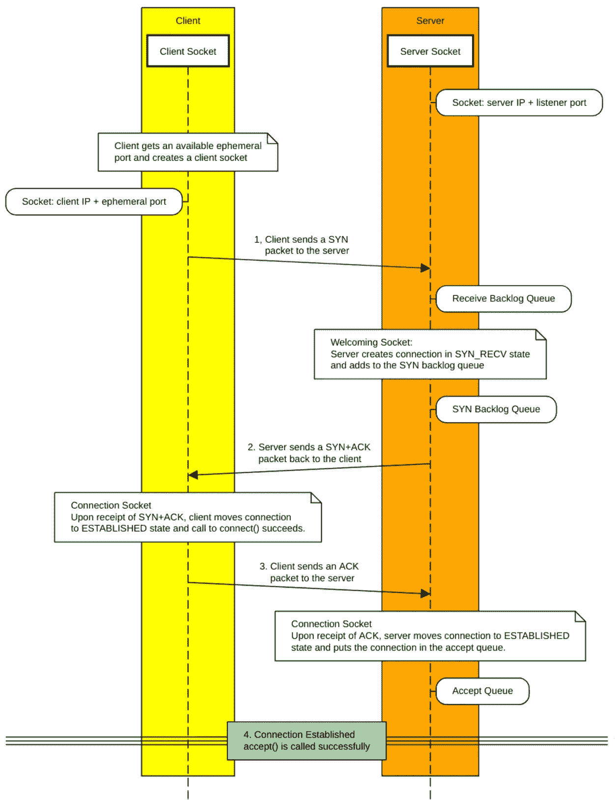
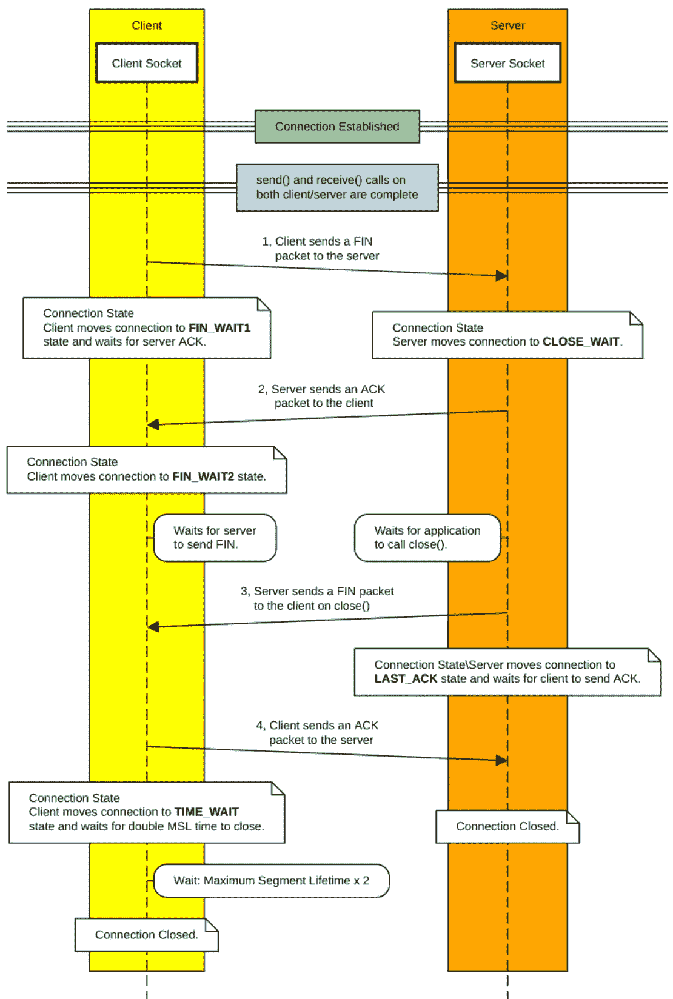

# TCP/IP 连接初级程序

> 原文：<https://levelup.gitconnected.com/linux-kernel-tuning-for-high-performance-networking-5999a13b3fb4>

## 高性能网络系列的 Linux 内核调优

在 [Unsplash](https://unsplash.com?utm_source=medium&utm_medium=referral) 上由 [Toa Heftiba](https://unsplash.com/@heftiba?utm_source=medium&utm_medium=referral) 拍摄的照片

# TCP/IP 套接字和开放式连接底漆

每个 TCP/IP 连接都由所谓的**三次握手**组成。服务器将在与侦听器端口关联的欢迎套接字上进行侦听。

> 服务器欢迎套接字:服务器 IP 地址+监听器端口

当客户端连接到服务器时，如果可能，客户端将使用临时端口范围中以前未使用的端口。客户端使用与可以到达服务器的网络设备相关联的临时端口和客户端 IP 地址来创建套接字。

> 客户端套接字:客户端 IP 地址+来自[临时端口范围](https://medium.com/@johnhpatton/linux-kernel-tuning-for-high-performance-networking-f3256ffecf98)的端口。

1.客户端通过向服务器和服务器正在监听的端口发送一个带有序列号的同步包，或 **SYN** (1)，来启动 TCP 连接。

2.服务器从网卡上的 rx 环读取数据包，并将其放入接收积压队列。准备就绪后，服务器从接收队列中读取数据包，确定它是一个 **SYN** 数据包，创建一个处于“SYN_RECV”状态的新连接，并将这个连接放入 SYN backlog 队列。然后，服务器将带有自己序列号的同步+确认包，或 **SYN+ACK** (2)发送回客户端。

3.客户端通过向服务器发回确认或 **ACK** (3)来确认收到 **SYN+ACK** 数据包，从而完成连接。收到 **ACK** 数据包后，服务器创建一个连接套接字，该连接从 SYN backlog 队列中移除并移到 accept 队列中，状态从“SYN_RECV”变为“ESTABLISHED”

应用程序在下一次调用 accept()时从已建立的连接接收客户机套接字，现在可以与客户机通信了。

> 服务器连接套接字:映射到服务器欢迎套接字，但专用于已建立的连接。

## 开放连接序列

**TCP/IP 三次握手**

> **TCP 连接:
> 客户端 IP &临时端口+服务器 IP &监听器端口
> 或
> 客户端套接字+服务器套接字**

# TCP/IP 紧密连接底漆

当客户机和服务器完成发送和接收数据时，需要以类似于打开连接的方式关闭连接。客户端通常控制关闭连接的触发时间。然而，该协议在关闭连接之前给服务器应用程序时间来做一些清理工作，这在客户机和服务器上都增加了一个额外的状态。

1.客户端应用程序通过向服务器套接字发送一个终结包或 **FIN** (1)来启动关闭 TCP 连接，并将客户端连接置于“FIN_WAIT1”状态。

2.服务器接收到 **FIN** 数据包，将连接转移到“关闭等待”状态，并将 **ACK** (2)数据包发送回客户端。服务器等待服务器应用程序调用`close()`。

客户端接收到 **ACK** 数据包，将连接转移到“FIN_WAIT2”状态，等待服务器上的应用程序完成，等待服务器发送一个 **FIN** 数据包，指示一切完成。

3.服务器应用程序调用`close()`，服务器发送 **FIN** (3)数据包，并将连接转移到“LAST_ACK”状态。

4.客户端接收到 **FIN** 包，向服务器发送最后的 **ACK** (4)包，并将连接转移到“TIME_WAIT”状态。客户端连接在最大段生存期加倍后关闭(MSL)。

> 在大多数系统上，MSL 默认为 60 秒，客户端连接将及时—等待 120 秒。

## 闭合连接序列

**TCP 连接关闭序列**

# 交通高峰的影响

当一个事件一下子吸引了大量的流量，比如产品发布会、音乐会门票销售、时事新闻等，网站就会超载。它们过载的原因多种多样，但配置不佳的 web 服务器可能是一长串潜在瓶颈中的第一个。web 服务器过载的主要原因之一是网络堆栈调整不当，或者更糟糕的是，默认的网络堆栈配置。

## 半开连接

客户端连接发起并完成三次握手，以创建已建立的连接。因此，在等待部分连接完成时，接收服务器可能处于不稳定状态。此外，大多数 TCP 应用程序无法访问该状态，因为这些细节是由内核的网络驱动程序和网络堆栈处理的。TCP/IP 服务器应用程序创建一个绑定到欢迎套接字的侦听器(`listen()`)，从 TCP 栈上已建立的连接队列中检索一个客户端套接字(`accept()`)，从/向客户端套接字执行读/写操作(`recv()` / `send()`)，最后关闭连接(`close()`)。

内核负责一个 CPU 在所有侦听器的接收缓冲区中可以拥有的最大数据包数量，包括在 3 次握手中使用的数据包。接收缓冲区位于网络接口卡(NIC)和协议栈处理器之间。一旦接收队列变满，进入接收缓冲区的速度超过处理速度的数据包将导致数据包被丢弃。

内核配置控制着等待 **ACK** 的半开连接的数量。如果 SYN backlog 队列是 128，那么每个监听器最多只能容纳 128 个 SYN 包。这意味着一次只有 128 个客户端可以尝试握手，或者 128 个半开连接。在握手的这一点上，有几个因素需要注意:

*   任何服务器+端口都可以从各种来源接收到大量的 **SYN** 数据包，而且并非所有的数据包都来自合法来源。
*   客户端不必完成握手，将许多 SYN**数据包留在 SYN backlog 队列中，直到它们超时。**
*   积压队列已满将导致任何额外的客户端连接尝试失败。

## 等待应用程序的已建立连接

当连接状态变为“已建立”时，它被移动到接受队列，在那里它将被服务器应用程序在调用`**accept()**` **时拾取。这个队列的大小由内核和应用程序共同设置。应用程序在调用`**listen()**`时请求大小，内核设置队列的最大大小限制。如果应用程序请求一个大于内核限制的接受队列积压，这将被静默地截断到内核限制。**

结果是，满的接受队列将导致内核限制接收 **SYN** 数据包的速率，以匹配接受队列的处理速率，从而丢弃超过阈值的数据包。增加 SYN 积压队列和 accept 积压队列是一种有效的补救措施。

## 半封闭连接

另一个有问题的迹象可能发生在连接的两端，其中一个处于半封闭状态。客户端连接上的“TIME_WAIT”表示连接已关闭，但需要等待最大段生存期的 2 倍才能被回收。这是在反向代理服务器上看到的问题，这些服务器不重用“TIME_WAIT”中的连接，或者具有 keepalive。服务器连接上的“CLOSE_WAIT”表示连接正在等待应用程序完成清理。

*TIME_WAIT Starvation*
对于 HTTP 反向代理，如果代理目标支持，可以通过启用 keepalive 设置来减少“TIME_WAIT”中的大量连接，但请确保该值在 3 到 5 秒之间，以便在不再需要连接时可以更快地关闭连接。这是一个 HTTP/1.1 协议，通常用于 HTTP 反向代理。

可以调整内核来重用处于“TIME_WAIT”状态的连接。重用“TIME_WAIT”连接会带来一些小风险，尤其是在 NAT 之后或在不兼容的客户端操作系统上运行时。此外，4.12 版之前的 linux 内核允许端口被回收而不是关闭。这不是一个推荐的设置，应小心使用，并且永远不要在 NAT 后的系统或不兼容的操作系统上启用，但在某些环境中可以提供一些价值。检查这些系统上增加的 **RST** 数据包或连接重置，以验证这些设置。

> 重用连接时等待 2 分钟(MSL x 2)的目的是确保协议不会创建包含网络中可能仍然存在的前一个数据段的重复序列的数据段。

或者，也可以在某些系统上降低 MSL，以允许更快地回收“TIME_WAIT”连接，但这样做时应该小心。在负载较重的反向代理服务器上，降低 MSL 可能是提高代理连接性能的好方法。

*CLOSE_WAIT 饥饿* 在拥有大量“CLOSE_WAIT”连接的服务器上，应用程序无法完成对`**close()**`的调用。在正常情况下，这些问题会很快得到解决，而反向代理 web 服务器往往能很好地解决这个问题。然而，当大量的“CLOSE_WAIT”连接滞留时，这是应用程序无法及时调用 CLOSE()的结果。如果这些连接被锁定，清除它们的唯一方法是等待或重新启动应用程序。这可能会导致内存问题，因为连接会占用内存；然而，更大的问题是应用程序正在做什么导致这些堆积起来。对于“CLOSE_WAIT”连接数量增加的原因，除了调整或修复保持连接打开的服务器应用程序之外，没有太多可以做的事情。

# 结论

本文中的概述旨在提供对打开和关闭 TCP 连接的基础元素的基本理解。本文中没有涉及到很多细节，但是这应该为进一步研究 TCP 协议提供了一个良好的基础。

如果这篇文章中的任何信息不准确，请发表评论，我会更新文章以纠正信息。