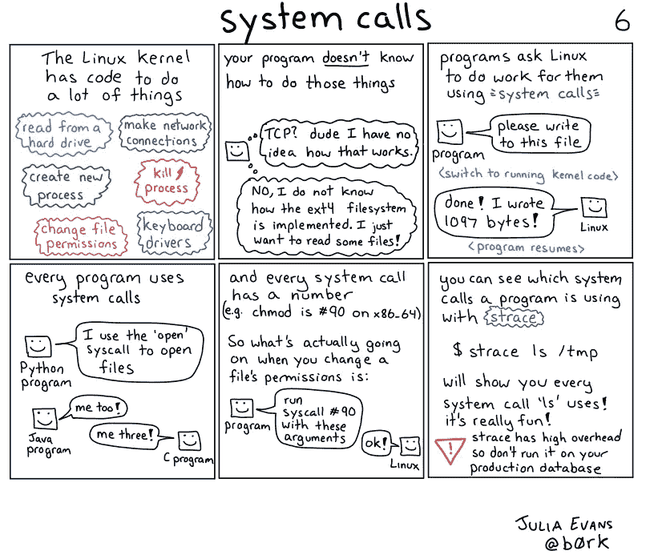

# Linux:系统调用和跟踪

> 原文：<https://levelup.gitconnected.com/linux-system-calls-and-strace-43898063e1f>

## 系统调用和跟踪工具概述

当运行在 Linux 上的应用程序/进程想要使用由 Linux 内核管理的资源时，例如读取文件、创建进程等。应用程序进程对 Linux 内核进行系统调用，Linux 内核执行必要的操作，然后将控制权交还给调用程序。strace 工具提供了在 Linux 上跟踪系统调用的能力。



出发地:[https://wizardzines.com/comics/syscalls/](https://wizardzines.com/comics/syscalls/)

为了在 Linux 中创建一个文件，我们可以简单地用想要的文件名运行一个`**touch**` 命令。看起来很简单吧？但是在这个简单的任务之下，包含了如此多的系统调用。要找出所有系统调用，我们可以运行以下命令:

```
**$ strace touch test.txt****-------------------------------------------------------------------****execve**("/usr/bin/touch", ["touch", "test.txt"], 0x7fff42d6fe38 /* 18 vars */) = 0....
```

在执行了上面的命令之后，我们将会看到很多关于在创建一个简单文件的过程中所做的系统调用的信息。我们可以看到一个名为" **execve"** 的系统调用正在被调用，这个系统调用将执行一个驻留在"/usr/bin/touch "目录下的程序。

## 查看正在运行的进程的实时系统调用

为了跟踪正在运行的进程发出的系统调用，我们需要获取进程的 PID。通过使用该特定进程的 PID，我们可以查看该进程发出的实时系统调用。让我们获得" **kube-proxy** "进程的 PID:

```
**$ pidof kube-proxy****----------------------------------------------------------------**25166
```

现在，使用 PID，我们可以查看 kube-proxy 进程发出的未来系统调用:

```
**$ strace -p 25166****-------------------------------------------------------------------**strace: Process 25166 attached
epoll_pwait(4, [], 128, 0, NULL, 140720404847384) = 0
epoll_pwait(4, [], 128, 832, NULL, 140720404847448) = 0
epoll_pwait(4, [], 128, 0, NULL, 140720404847384) = 0
epoll_pwait(4, [], 128, 4999, NULL, 140720404847448) = 0
epoll_pwait(4, [], 128, 0, NULL, 140720404847384) = 0
epoll_pwait(4, [], 128, 4484, NULL, 140720404847448) = 0
**getrandom**("\x20\xa7\xb0\xd9\x16\x22\x76\x58", 8, 0) = 8
**write**(11, "\27\3\3\0\"Zl\25dan\2711i\361.K\215\343\207A>\327\5_xZ\370P:H\17"..., 39) = 39
.....
```

## 系统调用摘要

要查看某个命令发出的系统调用次数的完整摘要，请使用以下命令:

```
**$ strace -c touch test
-------------------------------------------------------------------**% time     seconds  usecs/call     calls    errors **syscall**
------ ----------- ----------- --------- --------- ----------------
  0.00    0.000000           0         1          ** read**
  0.00    0.000000           0         6          ** close**
  0.00    0.000000           0         2          ** fstat**
  0.00    0.000000           0         8          ** mmap**
  0.00    0.000000           0         3           **mprotect**
  0.00    0.000000           0         1           **munmap**
  0.00    0.000000           0         3          ** brk**
  0.00    0.000000           0         6          ** pread64**
  0.00    0.000000           0         1         1 **access**
  0.00    0.000000           0         1          ** dup2**
  0.00    0.000000           0         1          ** execve**
  0.00    0.000000           0         2         1 **arch_prctl**
  0.00    0.000000           0         3           **openat**
  0.00    0.000000           0         1           **utimensat**
------ ----------- ----------- --------- --------- ----------------
100.00    0.000000                    39         2 total
```

## 检查某些系统调用

要检查某些系统调用，请运行以下命令:

```
**$ strace  -e  trace=read touch test1.txt 
-------------------------------------------------------------------****read**(3, "\177ELF\2\1\1\3\0\0\0\0\0\0\0\0\3\0>\0\1\0\0\0\300A\2\0\0\0\0\0"..., 832) = 832
+++ exited with 0 +++**************************************************************************$ strace -c -e  trace=read,close touch test2.txt 
-------------------------------------------------------------------**% time     seconds  usecs/call     calls    errors syscall
------ ----------- ----------- --------- --------- ----------------
  0.00    0.000000           0         1          ** read**
  0.00    0.000000           0         6         **  close**
------ ----------- ----------- --------- --------- ----------------
100.00    0.000000                     7           total
```

> *如果你觉得这篇文章很有帮助，请* ***别忘了*** *去点击* ***跟随*** 👉*****拍拍*** 👏*按钮帮助我写更多这样的文章。
> 谢谢🖤***