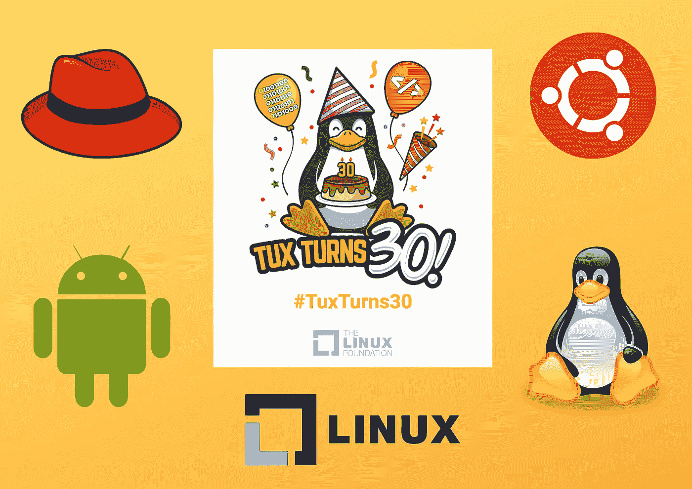

# Linux 迎来 30 岁生日——以下 16 个事实让 Linux 成为有史以来最重要的操作系统

> 原文：<https://levelup.gitconnected.com/linux-turns-30-here-are-16-facts-that-make-linux-the-most-important-os-ever-created-5c854455d06c>

## 今天，Linux 驱动了一切，包括智能手机、股票市场、潜水艇、电影 VFX，以及更多的应用程序。

作者使用 Canva 创建的图像

那是在 1991 年，一名年轻的计算机科学学生在赫尔辛基大学学习，他对[*MINIX*](https://en.wikipedia.org/wiki/Minix)的许可感到沮丧，这是一种类似 UNIX 的操作系统，旨在帮助想学习操作系统的学生。这位年轻的程序员然后开始开发自己的操作系统，他声称这是他的爱好。程序员是*莱纳斯·托沃兹*。

托沃兹一点也不知道他的操作系统将永远改变软件业。今天，Linux 是最受欢迎的开源项目，也是世界上占主导地位的操作系统。因为它是免费的，它有数百个由各种企业、创业公司甚至个人程序员生产的 Linux *发行版*(不同版本或风格的 Linux 操作系统的企业名称)。

以下是使 Linux 成为最重要和最独特的操作系统的 12 个事实。

1.  [Linux Foundation](https://www.linuxfoundation.org/)是一个面向开发人员和公司的非营利性组织，旨在构建加速开源项目的系统，该组织主持了数百个开源合作项目，其中有超过 700，000 名开发人员参与其中*。*
2.  尽管事实上他编写了 100%的第一个 Linux 版本，但 Torvalds 的代码只出现在不到 1%的最新内核版本中。
3.  每个版本的 Linux 内核都有一些时髦的代号。比如 v5.12.19 命名为“*冰封荒原*，“v4.3.6 命名为“*模糊的鱼屁股*，“v3.7.0 命名为“*惊恐的花栗鼠*”等等。
4.  根据 Gartner 和 Statista(T21)的数据，基于 Linux 内核修改版的 Android 操作系统占据了全球智能手机 86%的市场份额。
5.  GitHub repository for Linux 拥有超过 [*117k 的 stars 和迄今为止超过 700 个版本*](https://github.com/torvalds/linux) 。
6.  所有排名前 500 的超级计算机 100%都使用 Linux 的发行版。
7.  最初的 Linux 内核只有 65 KB 大小，只有 10k 行代码。举个例子，今天甚至一个标准的 Linux 内核都有超过 1000 万行代码。
8.  根据[openhub.net](https://www.openhub.net/p/linux)的说法，大多数(大约。Linux 的 95%)是用 C 语言写的。
9.  日本子弹头列车上复杂的自动列车控制(ATC)系统使用 Linux 进行维护和管理。
10.  托沃兹在 1996 年挑选了一只企鹅(名为“ *Tux* ”)作为 Linux 的吉祥物，因为他小时候在澳洲坎培拉游玩时被一只愤怒的企鹅咬了一口。
11.  世界上大多数著名的银行都使用 Linux 作为操作系统，因为它为用户提供了一个极其安全而稳定的环境。
12.  纽交所的交易由 T4 红帽 T5 运行，这是一个基于 Linux 的操作系统。
13.  全世界的军队都将 Linux 操作系统用于研究、官方和行政目的。大多数潜艇，包括创新的核潜艇、导弹系统、无人驾驶飞行器(UAV)等等，都是使用基于 Linux 的系统来建造和管理的。
14.  90%的公共云工作负载在 Linux 发行版上运行。
15.  2000 年，史蒂夫·乔布斯给莱纳斯·托沃兹提供了一份工作，条件是他停止开发 Linux，但他拒绝了。
16.  像*阿凡达*或*复仇者联盟*这样的好莱坞大片中的特效在制作过程中的某些时候依赖于 Linux。

Linux 已经成为软件业和你的日常生活的重要组成部分。它已经成为有史以来最重要的操作系统，为从智能手表到物联网设备，从智能手机到特斯拉汽车的一切提供动力[特斯拉利用 Linux Ubuntu 作为他们的操作系统](https://electrek.co/2016/10/06/tesla-updated-browser-linux-os-december-says-musk/)。

Linux 基金会为 Linus Torvalds 的贡献每年支付 150 万美元。托瓦尔兹目前大部分时间都在家里工作。

就我们所知，Linux 已经改变了一切技术。这就是当一个项目被开源以供全世界贡献和创新时会发生的事情。我希望我们将来能看到更多成功的开源项目。

如果你喜欢读这篇文章，你可能也会发现下面的文章值得你花时间去读。

 [## 我的第一份科技创业工作不到一年就失败了，我是如何挺过来的

### 在那里工作 4 个月是一场噩梦。我像疯子一样工作，学到了重要的人生经验。

levelup.gitconnected.com](/how-i-survived-my-first-tech-startup-job-that-failed-within-a-year-667a6a3f97ea)  [## 每个程序员必看的 10 部电影

### 这些电影会给你带来灵感或娱乐，或者两者兼而有之。

blog.devgenius.io](https://blog.devgenius.io/10-movies-that-every-programmer-must-watch-465186bb7f2a) 

如果你喜欢阅读有助于你更好地学习、生活和工作的故事，可以考虑 [*成为*](https://viveknaskar.medium.com/subscribe) *的订阅者。成为会员后，你可以无限制地阅读 10000 篇故事、文章和作家。每月只要 5 美元。* [*如果你使用我的链接*](https://viveknaskar.medium.com/membership) *注册，我将获得一点佣金，帮助我写更多的文章。*