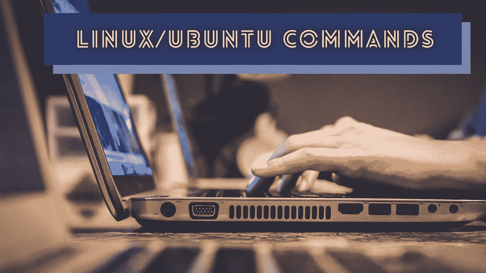
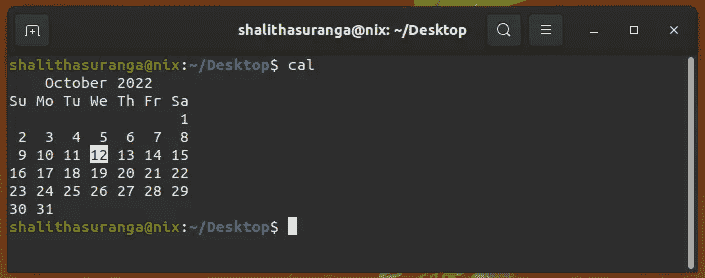
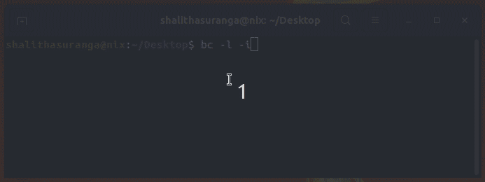
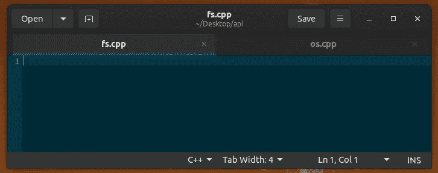

# Linux/Ubuntu 命令加速您的日常工作

> 原文：<https://levelup.gitconnected.com/linux-ubuntu-commands-to-speed-up-your-daily-work-32f0d2517e8b>

## 在您的终端和 shell 脚本中使用这些命令来提高您的日常工作效率



照片由[约翰·施诺布里奇](https://unsplash.com/@johnschno?utm_source=unsplash&utm_medium=referral&utm_content=creditCopyText)在 [Unsplash](https://unsplash.com/s/photos/computer?utm_source=unsplash&utm_medium=referral&utm_content=creditCopyText) 上拍摄，由 Canva 编辑

程序员根据个人喜好使用各种操作系统。由于开发人员友好性和配置灵活性，大多数程序员通常使用 Unix 或基于 Unix 的操作系统。基于 GNU/Linux 的发行版促进了软件自由，并提供了一个开发人员友好的工作环境，即使在低端计算机上也能很好地工作。在所有的 GNU/Linux 发行版中，大多数开发人员选择 Ubuntu 是因为它内置的工具和高效的、可定制的默认桌面环境 GNOME。

GNU/Linux 系统提供了 Unix 命令，因此我们可以在终端和 shell 脚本中使用它们来提高工作效率，从而更快地完成日常任务。此外，GNU/Linux 系统为开发人员提供了一些非 Unix 的 Linux 专用命令。此外，大多数 Ubuntu GUI 应用程序也提供命令行界面支持。

在这个故事中，我将解释一些鲜为人知的 GNU/Linux 和内置的 Ubuntu 命令，您可以使用它们更快地完成日常编程和一般任务。此外，您可以在 Bash 脚本或任何其他编程语言中使用这些命令来满足您的自动化需求。

# 将 cal、ncal 和 date 用于日期/时间相关的任务

有时，我们需要查看日历来计划任务期限或我们应该完成的其他日常任务。客户或团队成员可能会问:“您能在下周五完成这项任务吗？”。然后，你可能需要找出下周五的日期。Unix 命令让您甚至不用离开终端就可以查看日历:



cal 命令在 GNU/Linux 上的输出，作者截图

像任何其他 Unix 实用程序命令一样，`cal`命令也附带了几个有用的命令行开关。例如，您可以获得当前年份的十二月日历，如下所示:

```
cal -m Dec 
```

或者，通过提供当前年份作为参数来检查全年的日历:

```
cal 2022
```

`ncal`命令也输出日历，但是它使用不同的日历样式。

`date`命令输出当前日期和时间详情。您可以在 Bash 脚本中使用它。例如，您可以将当前时间细节存储在 Bash 变量中，如下所示:

```
t=$(date +%T)
```

如果你在全屏模式下使用终端或者在 Ubuntu 中使用[隐藏你的顶栏](https://github.com/tuxor1337/hidetopbar)来关注你的终端活动，你甚至可以使用`date`命令作为你的虚拟时钟。

# 从你的终端截图

我们经常会截图保存关于 bug 的细节或者记住日常编程任务中的各种事件。例如，如果您想要报告一个开源项目中的构建失败，您可能需要将终端输出捕获为图像。Ubuntu 带有一个内置的截图应用程序，可以以面向图形用户界面的方式截图，但你也可以在不离开终端的情况下做同样的事情！

假设您在终端上得到一个错误，需要捕获它。输入以下命令来截图:

```
gnome-screenshot
```

上面的命令会立即截屏并存储在默认的图片目录中。这个程序提供了[命令行开关](https://manpages.debian.org/bullseye/gnome-screenshot/gnome-screenshot.1.en.html#OPTIONS)来捕获一个窗口，选择一个区域，延迟截图事件，等等。以下命令在十秒钟后对当前窗口进行带有阴影效果的屏幕截图，并将其存储在系统剪贴板中:

```
gnome-screenshot -w -c -e shadow -d 10 &
```

这里我们在后台执行命令——然后我们有时间在以后输入更多的命令。您可以通过 [Python 或 Bash](https://betterprogramming.pub/bash-vs-python-vs-javascript-which-is-better-for-automation-92a277ef49e) 脚本来调用它——或者您甚至可以为您的日常编程效率创建一个 Bash 别名。

# 从终端打开 GUI 文件管理器应用程序

程序员通常更喜欢通过命令行界面使用文件系统。例如，在编程活动中，我们经常使用`touch`、`mv`、`rm`、`mkdir`和`cp`命令。但是，我们通常需要打开 GUI 文件管理器应用程序来更好地可视化文件。如果你以前用过 Mac 操作系统版本，你知道我们可以用`open`命令打开 Finder 窗口。

在 GNU/Linux 系统上，有两种方法可以打开文件管理器 GUI 应用程序。一种方法是使用标准的 XDG 命令打开文件管理器。例如，以下命令显示当前目录的内容:

```
xdg-open .
```

或者，您可以从您的终端直接调用 Nautilus(又名 GNOME [Files](https://wiki.gnome.org/action/show/Apps/Files) app ):

```
nautilus . 
```

`xdg-open`命令是一个为 GNU/Linux 系统广泛接受的标准，所以您可以在几乎所有 GNU/Linux 发行版的 Bash 脚本中使用它来打开文件管理器或默认的 web 浏览器。在一个开源项目中，我在一个 [C++源文件](https://github.com/neutralinojs/neutralinojs/blob/d266009be3794f2cf9d0bcdb72c300b06fb32430/api/os/os.cpp#L82)中使用了`xdg-open`。

# 从命令行使用计算器

程序员使用各种方法进行快速的数字计算。一些程序员像普通计算机用户一样使用内置的 GUI 计算器。与此同时，一些铁杆程序员使用 Python REPL 或谷歌搜索引擎。

`bc` Unix 命令允许您从终端通过管道传输算术表达式来进行计算。请看下面的例子:

```
bc <<< 152*56
```

您也可以按如下方式启动交互模式:



使用 bc 命令的交互模式，作者截图

GNOME 计算器也为计算提供友好的命令行开关。例如，看看它如何让您高效地计算百分比:

```
gnome-calculator -s 23500*12%
```

# 触摸命令的更好的基于 GUI 的替代方案

我们通常使用`touch`命令从终端创建新文件。如果我们需要创建一个包含一些文本的文件，我们可以使用 Bash [重定向](https://www.gnu.org/software/bash/manual/html_node/Redirections.html)操作符，如下所示:

```
echo "#include <iostream>" > main.cpp
```

如果您需要从终端创建一个包含多行字符串的文件，该怎么办？出于自动化的目的，您可以使用`\n`，但是我们必须使用命令行文本编辑器或 GUI 编辑器来手动创建包含更多文本的文件。

gedit 程序带有开发人员友好的命令行开关，可以帮助您快速创建文本文件。例如，您可以创建一个具有首选文件名的新文件，如下所示:

```
gedit main.cpp &
```

一旦您添加并保存了多行文本，gedit 将根据文件名自动创建一个新文件。此外，您可以结合使用 gedit 命令行支持和 Bash 的[大括号扩展](https://www.gnu.org/software/bash/manual/html_node/Brace-Expansion.html)特性来更快地创建多个文件:

```
gedit api/{fs,os}.cpp &
```

*注意:在执行该命令之前，* `*api*` *目录应该已经存在。*

上面的命令打开两个 gedit 选项卡，让您根据需要添加多行文本:



从命令行用 gedit 创建新文件，作者截图

下面的故事解释了如何有效地使用大括号扩展:

[](/5-lesser-known-linux-terminal-tips-and-experiments-f14ac5739ea8) [## 5 个鲜为人知的 Linux 终端技巧和实验

### 开始试验您的终端，并找到新的方法来提高您的编程效率

levelup.gitconnected.com](/5-lesser-known-linux-terminal-tips-and-experiments-f14ac5739ea8) 

# 结论

程序员经常每天使用命令行界面来完成编程任务。我们经常使用标准的 Unix 命令，如`cd`、`cp`、`rm`、`mkdir`等。，在我们的终端 GUI 中与操作系统进行有效的通信，而不使用通用的 GUI。此外，我们经常通过将这些基于 Unix 的命令添加到 shell 脚本中来实现 Bash 任务的自动化。

但是，只有少数程序员研究并找到了上面的 GNOME 专用命令。即使这些命令不是 Unix 标准的一部分，我们也可以在个人自动化脚本和终端程序中使用它们。例如，`gnome-screenshot`命令让你以编程的方式截取屏幕截图。此外，程序员通常倾向于使用 GUI 组件和`expr`(或者 Bash 中的[算术扩展](https://www.gnu.org/software/bash/manual/html_node/Arithmetic-Expansion.html))分别用于上述日期/时间相关的命令和`bc`(或者`gnome-calculator`)。但是，`bc`提供了更高级的特性，包括浮点支持，而`gnome-screenshot`支持像百分号支持这样的现代特性。

尝试在您的终端或 shell 脚本中练习上述命令，以提高您的日常工作效率。您甚至可以从任何编程语言中调用这些命令！

使用以下技巧更新您的 shell 脚本:

[](/5-modern-bash-scripting-techniques-that-only-a-few-programmers-know-4abb58ddadad) [## 只有少数程序员知道的 5 种现代 Bash 脚本技术

### 使用这些技巧让您的 Bash 脚本更具交互性和未来感。

levelup.gitconnected.com](/5-modern-bash-scripting-techniques-that-only-a-few-programmers-know-4abb58ddadad) 

感谢阅读。