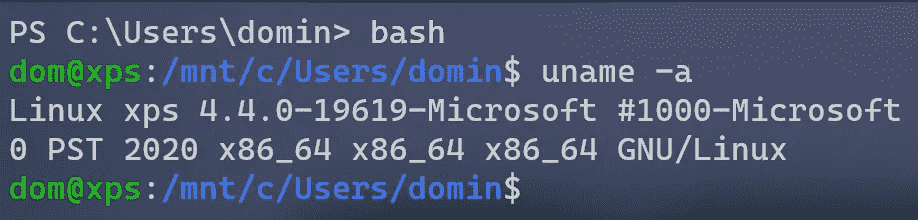
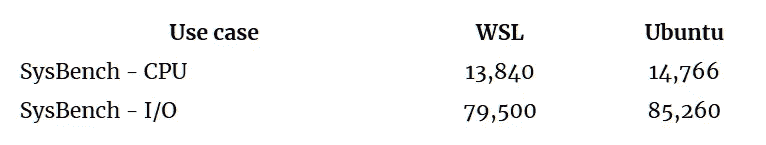
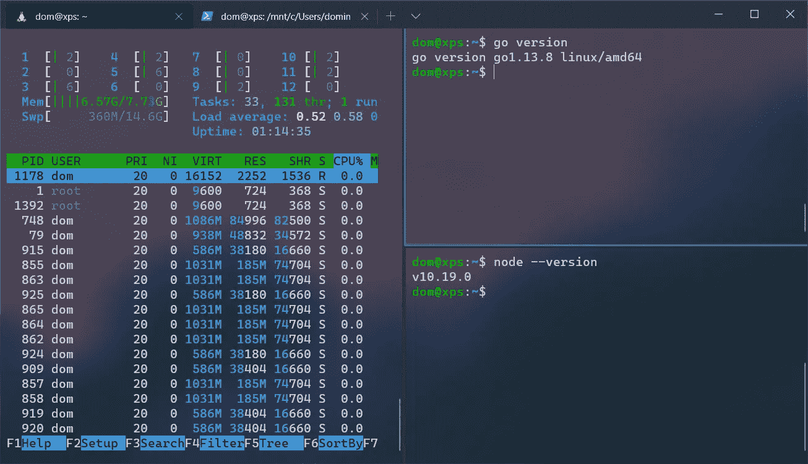
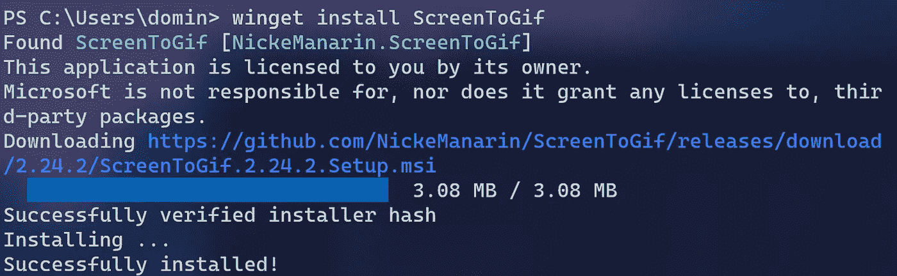
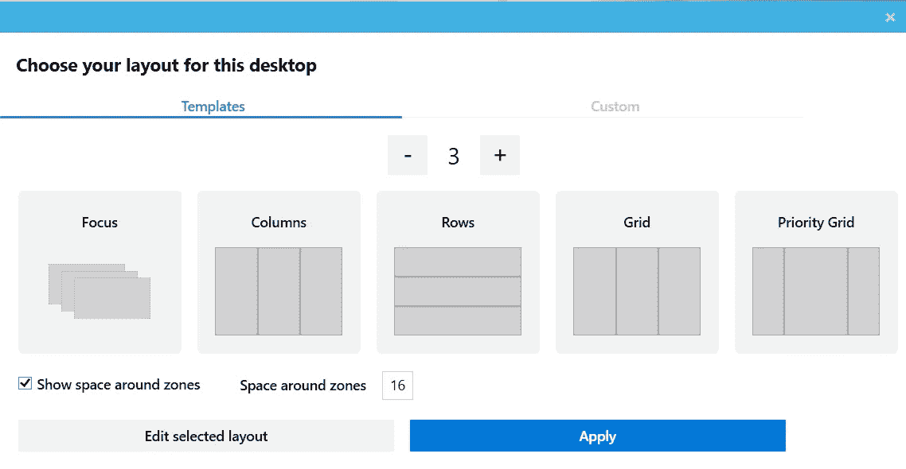
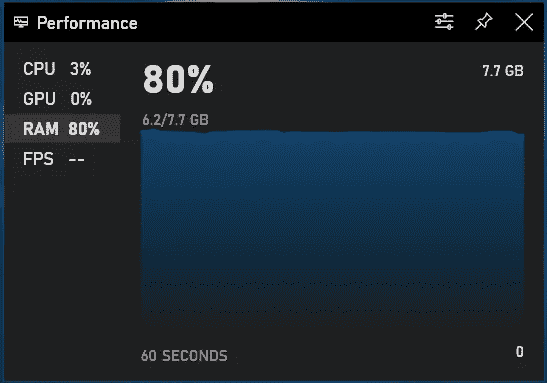

# Linux 用户 2020 年试用 Windows

> 原文：<https://levelup.gitconnected.com/linux-user-tries-windows-in-2020-682e5eca7778>

## WSLv2、新终端、PowerToys 会让我转行吗？

所以我已经在我的设备上使用 Linux 两年了，包括过去 6 个月的 Arch。下面是我用了一个星期后对 Windows 10 的看法。

# WSL v2

你可能已经听说了，Windows 10 将很快发布带有最新版本的真正的 Linux 内核。不需要 Cygwin 或 Linux 虚拟机。

令人惊讶的是，它在 Hyper-V 上运行时非常轻便，根本不使用太多的 RAM 或 CPU。它启动非常快，甚至集成到了 VsCode 中。

那有什么条件呢？慢吗？好吧，我们来看看性能对比。

# WSL 性能

https://linuxconfig.org/how-to-benchmark-your-linux-system

我在我的 Ubuntu 20.04 和 Windows 分区(在 WSL v2 中)上测试了一些“真实世界”的基准。

【https://tdom.dev/win10-review 

如你所见，其性能可与原生 Ubuntu 环境相媲美(平均 WSL 似乎慢了 8%)。

# Linux 上的 Linux GUI 应用程序

微软最近宣布，他们将完全支持在 Wayland 上通过 WSL 运行 GUI Linux 应用程序，甚至支持硬件加速。

甚至 NVIDIA [也宣布](https://news.developer.nvidia.com/microsoft-and-nvidia-announce-june-preview-for-gpu-acceleration-support-for-wsl/)支持 CUDA 的 GPU“穿越”，将于 6 月份进行内部预览。

这是巨大的。不幸的是，我不能告诉你太多，因为它还不可用。

# Windows 终端

自从 1985 年 Windows 1.0 发布以来，Windows 一直没有一个好的终端应用。CMD 和 Powershell 终端与现在使用的其他终端相比都很糟糕。

直到去年 Windows 终端出现。

好点了吗？它确实支持许多现代功能:

*   表情符号👌
*   GPU 加速
*   丙烯酸模糊(包括自定义主题)
*   TMUX 喜欢平铺和多个标签
*   多个配置文件(cmd、powershell、bash 等)

# WinGet —新的包管理器

**苹果**有自制软件， **Linux** 有*(在此插入你最喜欢的软件包管理器)*， **Windows** 有……显然 **WinGet** 现在有了。现在是 2020 年，微软终于决定赶上竞争对手，支持自己的包管理器。

只是没那么好。还没有。您安装的应用程序仍然经常需要用户与 GUI 安装程序进行交互，这可能在某种程度上违背了好的软件包管理器的目的。

你可能会认为一个包管理器既能安装又能删除应用程序，但是当然你必须自己卸载它们。

# 更多的调整

## 电动玩具

当谈到在大屏幕上组织窗口时，我发现 Windows 非常缺乏。一些快捷方式也缺失或不方便。PowerToys 是另一个试图解决这个问题的微软应用程序。

例如，我必须将`Alt+F4`重新绑定到`Win+W`。不幸的是，没有办法用键盘将窗口移动到不同的虚拟桌面。它的“平铺”解决方案甚至无法与 Linux 上的 *i3* 或 *bspwm* 相比。

# 剪贴板、屏幕截图等等

以下是我上次使用 Windows 后添加的一些内容:

*   剪贴板管理器(`Win+V`)
*   截图工具(`Win+Shift+S`)
*   没有(明显)性能影响的屏幕录制(`Win+G`)
*   现在搜索其实挺快的(`Win+S`)
*   VsCode 感觉比在 Linux 上更快/更流畅？？

# 资源使用

当然不可能完美。一切都是有代价的。在这种情况下是 RAM。在 Firefox、WSL、VsCode 和一个简单的 NPM 服务器中运行几个标签需要 6GB 的内存。在 Linux 上运行相同的工作流不会超过 3GB 的内存。

CPU 使用率与 Linux 相当，同时保持(根据我的经验)更好的电池寿命，并能够在需要的地方利用硬件加速(在 Linux 上观看 4k 视频**很糟糕**)。然而，当谈到磁盘利用率时，我发现 Windows 比 Linux 使用更多的空间。我甚至懒得在 120GB 的分区上使用 Windows，绝对至少 250GB，最好是 500GB。

# 最终印象

Windows(至少对我来说)过去感觉开发极其缓慢。我可以说现在已经不是这样了。升级到配备 NVME SSD 的 6 核机器可能会有所帮助，但众所周知，在 Windows 上做了大量工作，让开发人员使用 Windows 而不是 MacOS/Linux。

## 现在怎么办？

我要换回 Linux 吗？现在我要进行双重引导，等待 WSL GUI 支持，包括 CUDA，并进行测试。我还想看看 VsCode 的 WSL 支持，其中 GUI 在 Windows 上运行，但所有二进制文件(语言服务器或编译器)都在 WSL 上运行。

我正计划发布另一篇关于我的 GUI 体验的文章，以及我是否会完全切换到 Windows，敬请关注！

 [## 编写面试问题

### 一个完整的平台，在这里我会教你找到下一份工作所需的一切，以及…

技术开发](https://skilled.dev)