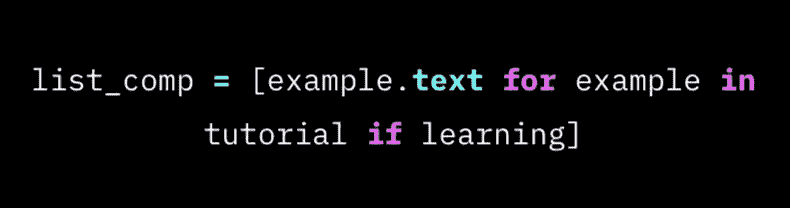
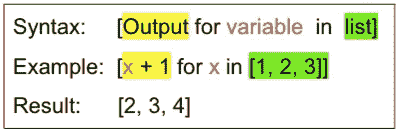
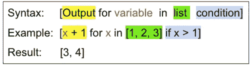

# Python 列表理解要点

> 原文：<https://levelup.gitconnected.com/list-comprehensions-for-beginners-fc4998991419>

## 用例子学习列表理解

## 创建列表的 Pythonic 方式



粗略的语法

这篇文章旨在向 Pythonistas 新手介绍理解列表的艺术。它是 Python 中高级编码的一个重要组成部分，在您熟悉了用 Python 创建循环和列表之后，应该很快接受它。

我花了 7 年时间向高中生教授 Python。对于大多数话题，大多数学生凭直觉学会了结构和句法。然而，有一些主题和结构总是遇到一些阻力。其中之一是列表理解。

# 列表理解

创建和填充列表是一项常见的 Python 任务。列表理解是完成这项任务的一种捷径。

列表理解实际上并不是 Python 语言的必要部分。列表理解所能做的一切也可以通过传统的循环和列表构建来完成。列表理解为“句法糖”。它通过使我们的代码更简洁、更易读或更容易表达来使我们作为程序员的生活变得更容易。它“美化”了人类消费的代码。


由[莎伦·麦卡琴](https://unsplash.com/@sharonmccutcheon?utm_source=medium&utm_medium=referral)在 [Unsplash](https://unsplash.com?utm_source=medium&utm_medium=referral) 上拍摄的照片

清单理解只是列清单的一种方式。在 Python 中，这通常是创建列表最直接、最干净的方式。如下面的例子所示，理解可以在一行代码中创建复杂的列表，而不用担心列表是如何被创建或附加以获得最终结果的。太棒了。

# 语法

列表理解看起来有点像`for`循环，除了输出在前面。括号中包含的理解提醒我们它返回一个列表。(**注**:也有集合和字典用花括号代替括号的理解)。



列表理解的基本语法

您可以选择以传统的`if`语句的形式在末尾添加一个过滤器。对于更复杂的理解，额外的语法也是可以接受的，但是这对于您在日常 Python 编码中可能遇到的几乎任何事情都足够了。



带过滤器的基本语法

# 例子

在教学中，我发现最好的学习方法是通过例子和实践。让我们来看一些使用这种语法的例子来说明:

## 示例 1(创建一个 0 到 9 的数字列表)

在使用理解之前，我们应该习惯于以更传统的方式使用列表。我们从如何在没有列表理解的情况下完成这个任务**开始。**我们需要创建一个空列表，并使用一个循环将结果追加到列表中。

```
my_list = []
for i in range(10):
    my_list.append(i)

----------------------------------------
my_list: [0, 1, 2, 3, 4, 5, 6, 7, 8, 9]
```

**使用列表理解**语法更简单，并且达到相同的结果。

```
my_list = [x for x in range(10)]----------------------------------------
my_list: [0, 1, 2, 3, 4, 5, 6, 7, 8, 9]
```

在这两种方法中，Python 本质上执行相同的操作。理解更容易阅读，因为它是一个简单的声明，不需要担心列表的创建和/或修改。

## 示例 2(平方列表中的每一项)

列表理解对于通过迭代旧列表来创建新列表也很有用。下面的代码对列表中的每一项求平方:

```
my_list = [1, 2, 3, 4, 5]
my_list = [x ** 2 for x in my_list]--------------------------------------
my_list: [1, 4, 9, 16, 25]
```

请记住，当您使用列表理解时，即使您使用现有的变量名，您也是在内存中创建新的列表(理解创建新的列表，它们不会修改现有的列表)

## 示例 3(过滤掉奇数)

使用*条件*进行过滤可以作为列表创建的一部分。这里我们放一个条件来检查 x 是否是偶数。

```
my_list = [5, 9, 2, 6, 11, 14]
my_list = [x for x in my_list if x % 2 == 0]--------------------------------------
my_list: [2, 6, 14]
```

使用`and/or`的复合条件句在这里也适用，但是如果你想使用`elif`或`else` 作为你的列表理解的一部分，那需要一些额外的语法，这里没有涉及。([见此处](https://stackoverflow.com/questions/9987483/elif-in-list-comprehension-conditionals))

## 示例 4(读取文件)

理解是将文件直接读入列表的快捷方式。语法很简单，所以不需要添加很多代码或增加复杂性。

假设我有一个名为`months.txt`的文件，每行包含一个月，如下所示:

```
---months.txt---
January
February
March
April
...
December 
```

要以列表的形式读入文件，我们可以这样使用列表理解:

```
months = [line for line in open('months.txt')]--------------------------------------
months: ['January', 'February', ... 'November', 'December]
```

这真的很方便。也许我们想改变月份的格式:

```
months = [line[:3].upper() for line in open('months.txt')]--------------------------------------
months: ['JAN', 'FEB', 'MAR', ... 'NOV', 'DEC']
```

这里我结合字符串方法`upper`使用了索引，但是考虑一下如何将`split`或`replace`方法用于其他类型的文本。

为了回顾到目前为止我们所看到的，让我们只返回所有以字母“M”开头的月份的三个字母缩写。

```
[line[:3].upper() for line in open('months.txt') if line[0] == 'M']--------------------------------------
months: ['MAR', 'MAY']
```

## 示例 5(嵌套循环)

我们也可以实现列表理解中的嵌套，但是如果你没有使用它的经验，它会很快变得令人困惑。下面是一个使用循环将两个列表中所有可能的组合相加的例子。

```
num1 = [1, 2, 3]
num2 = [10, 20, 30]my_list = [x + y for x in num1 for y in num2]--------------------------------------
my_list: [11, 21, 31, 12, 22, 32, 13, 23, 33]
```

在此示例中，外部循环是 x，内部循环是 y。这相当于对嵌套循环执行以下操作:

```
num1 = [1, 2, 3]
num2 = [10, 20, 30]my_list = []for x in num1:
    for y in num2:
        my_list.append(x + y)--------------------------------------
my_list: [11, 21, 31, 12, 22, 32, 13, 23, 33]
```

# 外卖食品

您可以使用循环(或`map`函数)来创建列表，那么是什么让列表理解成为更好的选择呢？我们已经展示了理解是如何使我们的工作更容易的一点句法糖，但是使用它们还有其他原因。

为什么要使用列表理解？

*   这是最 Pythonic 化的方式。Python 社区推崇使用简单而强大的工具，比如 list comprehension，您可以以多种方式应用它。在大多数情况下，它取代了映射功能和循环。这是 Python 中的“最佳实践”,使得许多循环编码模式变得过时。
*   理解非常适合作为函数中的一个参数。您只需在函数调用中就地创建列表。例如，我发现自己在 Matplotlib 和 Plotly 中创建可视化时一直在使用它们。
*   理解比循环方法运行得更快。它们实际上在 C 语言中运行，速度大约是循环的两倍。这在处理大型列表时尤其重要。

**什么时候我可以避免使用理解？**

*   它是迭代的，所以在矩阵选项(如 [Numpy](https://numpy.org/) )是更好选择的地方，不要将它们用于大型数据集。
*   不要在过于复杂的操作中使用它们，这会使代码难以阅读。在 Python 中，可读性很重要。您可能今天就能让它正常工作，但是请始终考虑下一个必须查看该代码并对其进行故障排除的人。(可能是你)
*   我通常不使用两层以上嵌套的理解。这就到了最后一点，你不应该让它们过于复杂。有时使用循环更容易，可读性更强，即使它需要更多的行。运用你的判断力。

如果您是 Python 的新手，您可能会倾向于使用循环来创建列表。试着走出你的舒适区，试着用列表理解来代替；你的努力会得到十倍的回报。成为一名勇敢的程序员是你变得更好的方法。

祝你好运！☘️

如果您发现任何错误或有任何问题，请随时联系我。