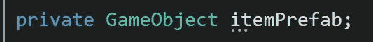

# 列表

> 原文：<https://levelup.gitconnected.com/lists-153438bb822f>

在 C#中使用列表有点像在现实生活中使用列表。如果你想跟踪某样东西，特别是同类的东西，把它写在一个列表中，以便组织和保存它的一个*引用*。购买食品时，你可能会有一份手写的食品清单。当创建游戏对象时，你可能也想保留一个列表。好了，让我们开始使用列表吧！

*列表*的工作方式与*数组*相似，只是有一些不同。首先，声明和初始化的方式看起来有些不同。在 *ItemDatabase* 类的顶部有两个变量。数组通常是非动态的，这意味着理想情况下您希望数组具有固定的大小。这里用*项数组*，为了*初始化*它，我需要声明数组 *(10)* 的*大小*。列表可以被动态地*添加或删除，所以我不需要在这里声明和初始化 *itemList* 变量时指定列表长度。*

**

**列出了*使用的*系统。Collections.Generic* 名称空间。如此处所示，注释掉名称空间将导致列表出现*错误*。*

**

*这个基本的*预设*将作为一个例子，说明如何将一个现有的*对象*添加到一个*列表*中。*

**

*添加到一个列表看起来也与数组不同。对于数组，我需要访问我想要初始化的数组的元素。列表可以用内置方法*添加*，然后你可以声明一个*现有的*游戏对象或者*初始化*一个*新的*一个。这里两个对象将被*添加到*列表中。一个用于通用*新*游戏对象，另一个用于 *itemPrafab* 。*

**

*访问和分配列表中的元素就像数组一样。上面的例子显示了*项目数组*访问第一个*元素(0)* ，然后设置*项目名称*。 *itemList，List，*也使用*元素*系统来指定我正在分配的元素，然后给它命名。*

**

***挑战:** ***姓名****

*对于一个挑战，我的任务是制作一个*姓名*的*列表*，然后*用*用户输入*从列表中随机删除*一个姓名。然后一旦一个名字被删除，我需要*将*列表*中的所有名字*打印到*控制台*。这里的 *namesList* 变量是用 6 个不同的名称值硬编码的。*

**

*仍然在 void *Start* 这里，我向*控制台*发送一个*调试*日志，让我知道这是将要打印的名字的初始列表。 *foreach* 循环遍历列表中的每个名字，然后*将*打印到控制台。*

**

*在 void *Update* 中，我检查用户*对*空格键*的输入*，然后运行几个 *if else* 条件。如果列表中有一个以上的名字，将运行一个函数来*从列表中删除*一个名字。如果列表中只有一个名字，一个清除的内置函数将运行*(当允许删除列表名函数将列表总数归零时，我得到了一个错误)*。如果这些条件都不满足，那么 *else* 语句告诉我名单是空的。*

**

**RemoveListName* 函数使用一个*局部变量*来存储一个*随机范围*。该编号将直接引用要从列表中删除的*元素*编号。在删除名字之前，我*将它打印到控制台，同时我还有一个对它的工作*引用*。这打印为移除的*名称*。根据传入的*元素*的值， *Remove* 函数实际上是从列表中删除名字。另一条*调试*消息打印到控制台，表明这是*更新的*名单。另一个 *foreach* 循环运行，将*列表*中剩余的*名称打印到控制台。***

**

*在检查器中，你可以看到*硬编码的*名称，可以选择从这里覆盖它们。*项*列表默认为空。*

**

*在*初始化*时，void *开始*中填充的两个示例项目。*

**

*在这里你可以看到当我按下*空格键*时，名单*会实时减少*的数量。*

**

*这里是*控制台*的打印输出。*

**

***挑战:*产卵对象****

*我的另一个任务是将*个随机的*个物体放到*个随机的*个位置*(在-10x，10y，0z 之间)*。这发生在用户*输入*时，产生的对象被添加到*列表*中。只有 *10 个*对象可以在它们全部变成*绿色*并且列表被*清除*之前繁殖。这里有三个*变量，*一个用于某个对象*预置*来产卵，两个*列表*和一个*布尔*条件来确定我们何时完成产卵对象。*

**

*在 void *Start* 中，要生成的对象*列表*是用三个基本图元*(立方体、球体和胶囊)*初始化的*。要生成的对象*列表*被*初始化*并留空。**

**

*在*更新*中，是我在写这篇文章之前应该放到*方法*中的所有代码！对于*输入*检查*空格*键，然后检查*布尔*为*假*并且创建的对象*列表*小于 10 的条件。如果条件满足，*局部*变量为要生成的对象*列表*中的*元素*存储一个*随机 int* 值，以及为要生成的*位置*存储两个*随机浮点*范围。声明一个 *Vector3* 变量，并将 X 和 Y 上的随机*值*分配给变量，z 上的随机值为零。声明一个局部游戏对象变量以存储对实例化对象的引用。这是我最初犯*错误*的地方，因为我存储的是*随机对象*，它实际上是对 *assets* 文件夹中*预置*的引用，而不是*层次中那个*预置*的*实例*！*修复是让*实例化*命令存储对象*变量*的*值*现在，来自要繁殖的对象列表的随机对象，在随机繁殖点位置被*实例化*，同时忽略旋转。通过使用 *Add* 方法并传入 *createdObject* 变量，创建的对象*变量*现在可以安全地放入创建的对象列表中。*

**

*这里的 *else* 语句处理如果前两个条件*不*满足时会发生什么。*控制台*发送消息通知我对象计数已满，*is donespowing*变量改为 *true* 。 *foreach* 循环将遍历*对象创建列表*中的所有游戏对象，获取*网格渲染器*上的*组件*，然后将*颜色*更改为*绿色*。最后，当该说的都说了，该做的都做了，这个列表就*清除了*。*

**

**检查员*展示对象*预置*和当前空列表。*

**

*在 void *Start* 中的*初始化*时，生成列表中的*对象。**

**

*当我按下*空格键*时，你可以看到新创建的游戏对象的实例化的*实例*，填充了*对象创建的*列表。一旦我在列表中有了 *10* 个对象，再按一次空格键*就会清除*。*

**

*检查员告诉我，对象计数已满。*

**

*在场景视图中，您可以看到对象正在实例化，并最终在挑战的最后阶段变成绿色。我希望你喜欢这次使用*列表*的旅程，感谢你的阅读！*

**