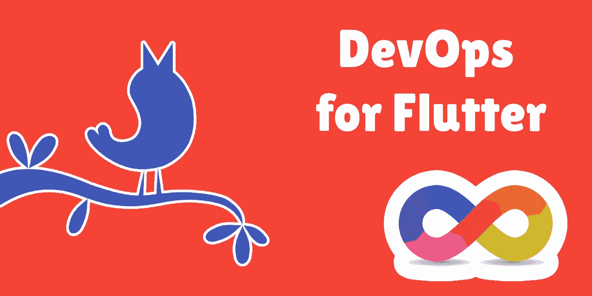
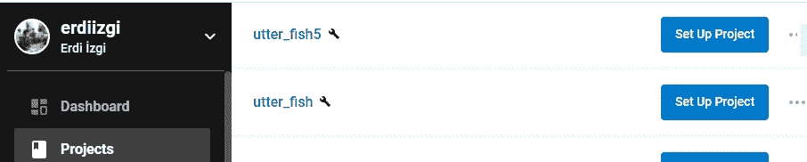
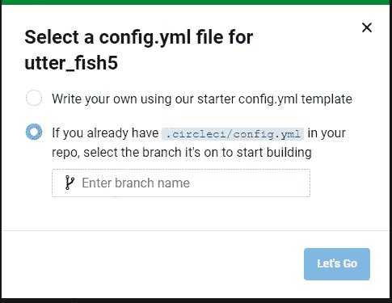
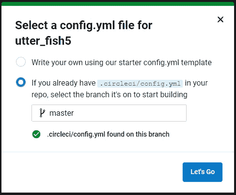
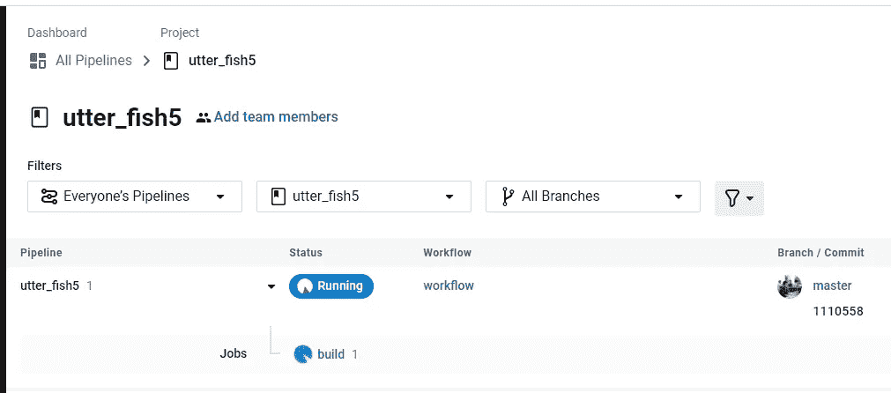
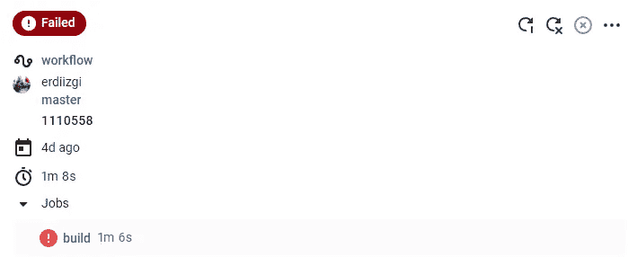
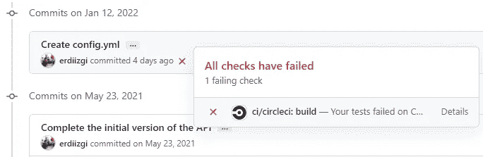
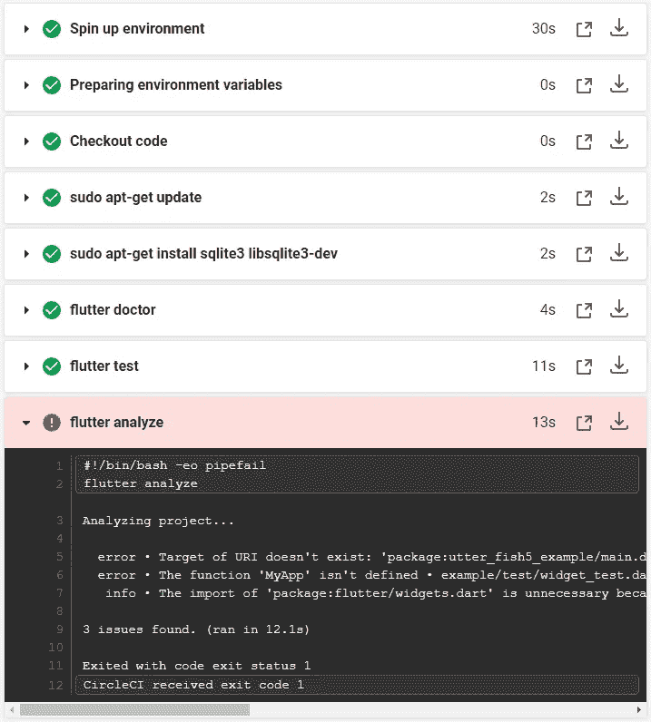

# 颤振的一点点 DevOps

> 原文：<https://levelup.gitconnected.com/little-bit-of-devops-for-flutter-d65ea2f0bf21>

## 每次使用 CircleCI 免费提交 Github 时，构建并测试你的应用。

我们喜欢自动化的东西，因为它带来了一致性和更多。为了保持你的代码库健康，你应该为你的 flutter 应用执行**自动构建**。

进行自动化构建迫使团队创建并维护一个完全自动化的构建脚本，这是一个积极的副作用。这确保了你的构建过程是**文档化的和可重复的**。

自动化构建可以有效地检测以下问题:

*   有人做了一件事**弄坏了一个 widget** 。
*   有人未能提交**所需的文件或更改**。
*   几项测试之一是**未通过**。
*   构建脚本**不再起作用**。

您可以在两种类型的自动化构建之间进行选择:**持续构建和每夜构建**。做一次夜间构建可以确保这些问题在发生后的 24 小时内被识别出来。每当有人提交时，继续构建就会发生**。**

我建议你尽早构建和经常构建，这取决于你使用的服务和构建时间。如果您正在处理一个大型项目，您可以将持续构建和夜间构建结合起来，只是范围略有不同。例如，数据库单元测试可以从连续的构建中省略，因为它们不会超过 10 分钟。

在这一节，我将向你展示我是如何设置我的**飘动云构建**的。如果你正在读这篇文章，我假设你是一个优秀的开发人员，不会回避编写单元和数据库测试。因此，这些测试将包含在本教程中。

# 开发者测试

根据我在业界的经验，测试一直是持续构建的主题。因此，他们应该在这里有自己的位置。为 flutter 编写单元测试轻而易举，我将向您展示如何尽可能简单地完成它。

## **单元测试**

为了理解如何编写单元测试，我们必须首先定义术语**“单元”**是指系统中可以逻辑隔离的最小的一段代码。通常，该代码包装在一个方法周围。因此，为了保持代码库健康，**我们必须测试所有的公共方法**。

下面是一个使用 flutter 的典型单元测试的例子:

正如您所看到的，您可以创建一组测试，尝试使用三个不同的输入来验证一个方法。这太棒了，因为其他人现在可以尝试重构 validate 方法，而不用担心将来会出错。他们现在需要做的就是确保测试在实施后是绿色的。当然，如果业务逻辑发生变化，他们应该保持测试**。**

## 数据库测试(数据库单元测试)

如果你正在开发一个**需要查询数据库**的应用程序，你应该考虑编写**数据库单元(dbUnit)测试**。当然，您可以为您的应用程序自由选择数据库。如果您不确定使用哪个数据库插件，请参见我的另一篇文章中的大量示例。

 [## 颤振发展的五大局部数据库解决方案

### 这里列出了最流行的数据库解决方案，以及代码示例。

levelup.gitconnected.com](/top-5-local-database-solutions-for-flutter-development-6351cd494070) 

[**【漂移】(Moor)**](https://drift.simonbinder.eu) 是我首选的数据库插件。我喜欢它的简单和全面。它还允许您编写 dbUnit 测试。

首先，我创建了这个公共类，用于所有的 dbUnit 测试。我不想在每次考试中反复做这些事情。因此，我想将它们隐藏在这个 util 类中。

这就是实际测试的样子。这与标准的单元测试没有太大的不同，但是创建一个**一次性数据库**并测试你的功能可能会很困难。然而，如你所见，**漂移**让这变得极其简单。当您有大量 Dao 和 dbUnit 测试时，您的连续构建**可能会变得更慢**。如果太慢，你可能需要采取行动。

## 小部件测试

小部件测试(在其他 UI 框架中也称为组件测试)测试单个小部件。小部件测试的目标是确保小部件的 UI 看起来和行为都符合预期。以我的经验来看，这些测试运行起来要花一点时间，但它们是值得的，因为它们确保了小部件在每次更改后都像预期的那样运行。

这一节我不会给出例子，因为我不想离题太远，因为小部件测试有点复杂，实际上需要熟悉 API。颤振有一个很好的教程，是彻底涵盖。你绝对应该调查一下。

 [## 小部件测试简介

### 在单元测试方法的介绍中，您学习了如何使用测试包来测试 Dart 类。要测试 widget…

docs.flutter.dev](https://docs.flutter.dev/cookbook/testing/widget/introduction) 

## 切尔莱西

有许多**持续集成(CI)** 工具可用；我用 CircleCI 做我的 flutter 项目，因为它给我**提供了 6000 分钟的免费建造时间。它与 GitHub 集成得很好。**这就是我目前所需要的。

你可以使用你的 **GitHub** 账户注册 **CircleCI** ，这简化了整合。如果您从左侧菜单中选择 ***项目*** ，您将看到与您的 **Github** 账户相关的所有项目列表。每个项目都有一个 ***设置项目*** 按钮。

单击时，会出现一个弹出窗口，如下所示。

我选择第二个选项，因为我想让**控制我的提交消息和分支**。因此，在你项目的主文件夹中，创建一个 ***。circleci*** 文件夹。然后，做一个名为 ***config.yml*** 的文件。我们的构建脚本将包含在这个 ***中。yml*文件。**

**构建脚本**

用于 flutter 开发的构建脚本可能如下所示:

这是一个非常简单的脚本，但是你可以用它做更多的事情，包括**将你的构建部署到 Google Play** 。有两个部分可见: **docker 和 steps** 。因此，构建首先提取颤动图像。这个包包含了创建一个 flutter 项目所需的一切。然后是步骤；

*   **checkout** :这个构建引用了您在这个分支上*最近的提交*。
*   **sudo apt-get update:** 它用于从所有已配置的源获取包信息。
*   **sudo apt-get install sqlite3 libsqlite3-dev:**由于我们的数据库单元测试，我们需要安装 **sqlite3** 。Drift 基于 sqlite 库，所以我们需要它来构建项目。
*   **扑医生:**这个你已经知道了；它用于确定颤振开发环境是否就绪和健康。
*   **颤振测试:**运行 ***测试*** 。
*   **flutter analyze:** 它分析你的代码并检测像未使用的导入这样的问题。您还可以定义自定义规则，以确保每个人都遵守代码约定。
*   **flutter -v build apk:** 它为 android 构建应用包。

当您将构建脚本提交到一个分支时， **CircleCI** 将检测哪些分支已经准备好构建。

一旦您点击 ***开始，您的第一次构建将开始。***

我等了大约**2-3 分钟**，我的第一次构建*失败了*。我希望失败，因为它会更好地说明。

点击构建细节底部的 ***构建*** 是查看构建失败原因的一种方式。然而，这不是唯一的选择。你不必总是在 CircleCI 网站上检查你的构建。**GitHub 和 CircleCI 的整合非常出色**。因此，您可以直接在 **GitHub** 上查看您的构建结果。

如果您点击 ***详细信息*，**，您将被带到 ***构建详细信息*** 页面，该页面将解释您的构建失败的原因。

当您进入 ***构建细节*** 时，您可以看到哪些步骤失败了以及失败的原因。如你所见，我有很多问题。修复后，所有步骤旁边都会有一个绿色的复选标记。

# 结论

即使你没有和团队一起工作，为你的 flutter 应用程序创建一个自动化的构建也是有意义的。然而，如果你和一群人一起工作，我会说这是必须的。

我提供的脚本使用了***cirrusci/flutter***docker 图像。我不需要创造自己的形象，因为它总是最新的。抖动更新可能会导致你的构建失败。好消息是，您不需要升级本地环境就可以看到它。

拥有一个自动化的构建有许多优点，这就是为什么它在业界被广泛使用，而不考虑技术栈。我希望我能够提供为您的 flutter 应用程序创建有用构建所需的所有信息。

我**不隶属于 circle ci**；我在本教程中使用它，因为它有一个奇妙的**免费计划**。感谢您花时间阅读本文。