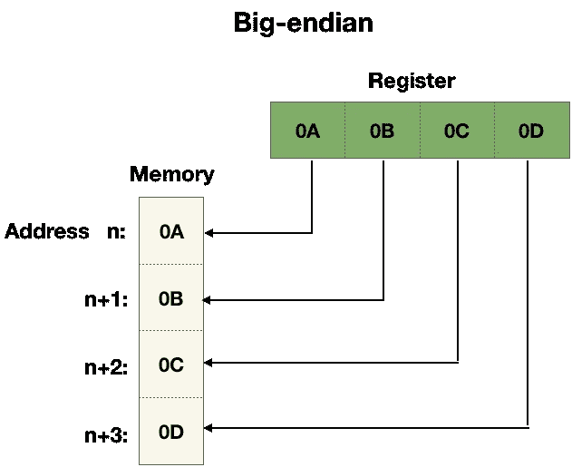
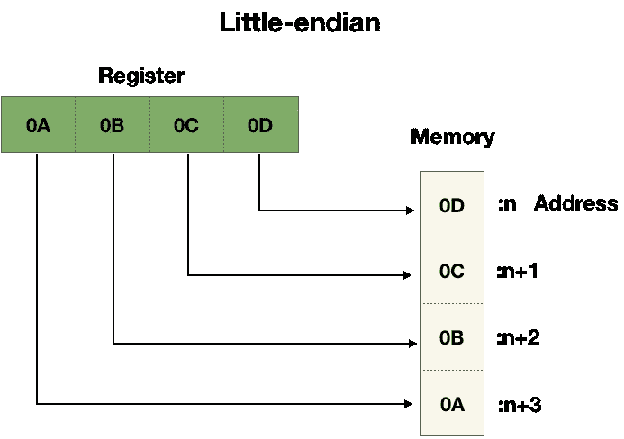

# 小端对大端

> 原文：<https://levelup.gitconnected.com/little-endian-vs-big-endian-eb2a2c3a9135>

关于编程中的字节序要知道的事情


马库斯·斯皮斯克在 [Unsplash](https://unsplash.com?utm_source=medium&utm_medium=referral) 上的照片

# 字节序

术语端序和端序指的是当处理器将字数据从其寄存器存储到存储器或者相反，将字数据从存储器加载到其寄存器时，决定字节顺序的约定。字数据只不过是与特定处理器架构相关联的常规数据单元(一堆位)。这种关联有点模糊，因为一些处理器为设计的不同方面(指令集大小、处理器和存储器之间的总线大小、寄存器宽度等)使用不同的数据单元，但它通常与处理器的通用寄存器的宽度有关。今天你看到的最常见的字长是 8、16、32 和 64 位，但其他字长也是可能的。在这篇文章的其余部分，我将假设世界大小为 32 位(4 字节)。

# 大端和小端

当在寄存器和存储器之间传输字数据时，字符顺序惯例包括两种不同的方式来决定字节的顺序。

第一种叫做大端序，第二种叫做小端序。Intel x86 处理器是小端的，所以大多数个人电脑都是小端的。

让我们用一个例子来看看区别。下面的两个图描述了存储字数据“0A 0B 0C 0D”(一组使用从左到右的位置十六进制表示法写出的 4 个字节)时，字节在大端和小端的顺序。



需要注意的重要一点是，字节是计算系统中最小的可寻址信息单位。主存储器可以被认为是一个线性的字节串，每个字节都有一个唯一的地址。这意味着它不能单独寻址每个位，也不能在每个地址改变字节数据中位的顺序。因此，字节序只涉及多字节数据(例如，一个字数据，uint32_t)来决定每个字节的顺序(而不是单独的位级)。

如上图所示，big-endian 将最重要的字节存储在最小的地址中。

接下来，我们来看看小尾序。



如您所见，与大端相反，小端将最低有效字节存储在最小的地址中。

另一方面，当处理器将数据从内存加载到寄存器时(反过来)，在大端和小端两种情况下，字节都被移回存储位置(因此，每个箭头的方向只改变为相反的方向)。因此，寄存器中的值在存储到内存之前和之后表示相同的值，只要它是在使用相同端序的机器上存储和读取的。这就是为什么只要您的程序范围在一台机器内结束，您就不需要担心字节顺序。

接下来，我们来看一个真实的程序例子。

# c 程序示例

下面是一个示例程序，它在运行时检查运行它的处理器的字节序。可以看到，首先，它将值 1 赋给字长类型为(uint32_t，4 字节)的*数据*变量。然后，它将*数据*的地址转换为指向 *uint8_t (cptr)的指针。*这样做是为了以后访问该值的最小地址的字节。

由于值 1 在十六进制记数法中表示为“00 00 00 01”，如果它是 big-endian，它将在内存中存储为“00 00 00 01”。如果它是小端的，它将被存储为“01 00 00 00”。程序通过解引用 *cptr* 指针来检查第一个字节。如果等于 0，表示处理器是大端的(" **00** 00 00 01 ")，如果等于 1，表示处理器是小端的(" **01** 00 00 00 ")。

```
#include <stdio.h>
#include <inttypes.h>int main(**void**) {uint32_t data;
uint8_t *cptr;data = 1; //Assign datacptr = (uint8_t *)&data; //Type cast**if** (*cptr == 1) { printf("little-endiann");} **else** **if** (*cptr == 0) { printf("big-endiann");}**return** 0;
}
```

# 当字节序很重要时

在编写代码时，通常不需要担心字符顺序。然而，你需要记住这一点，因为如果你不知道的话，这将是一个棘手的问题。

基本上，当你在系统的边界时，字节序很重要。如果您的程序处理在使用不同字节序的不同处理器的系统之间传输原始数据，这就很重要了。特别是，当

*   将数据字节写入一个处理器中的文件，然后将它发送到使用不同端序处理器的系统。
*   通过网络将数据字节作为串行数据流从一个端序处理器系统发送到另一个端序处理器系统。

实际上，在网络通信的情况下，传输控制协议和互联网协议(TCP/IP)套件中的所有协议层都被定义为 big-endian。这就是为什么 big-endian 有时被称为网络字节顺序。

# 公用事业

如果你需要检测和转换字节的顺序，比如当你使用带有小字节序处理器的机器时，你必须通过网络用大字节序发送数据，幸运的是，除了编写一个如上所述的简单程序之外，我们还可以使用一些实用程序。第一种叫做 [htonl，htons，ntohl，ntohs。](https://linux.die.net/man/3/ntohl)它可以用来转换数据的字节顺序。同样，如果你有一个带有 C++20 特性的编译器，你可以使用`[std::endian](https://en.cppreference.com/w/cpp/types/endian)`

```
#include <bit>

if constexpr (std::endian::native == std::endian::big)
{
    // Big endian system
}
else if constexpr (std::endian::native == std::endian::little)
{
    // Little endian system
}
else
{
    // Something else
}
```

# 结论

正如我提到的，您不太可能需要担心字节序，除非您通过文件或网络在具有不同字节序的不同机器之间传输原始流数据，但是了解这一点很重要，这样您就不会在将来遇到意外。如果我们需要处理字节序，有一些方法可以在运行时检测和处理字节序的差异，使用一个简单的程序逻辑或提供的实用程序，如 [htonl、htons、ntohl、ntohs](https://linux.die.net/man/3/ntohl) 或 std::endian。