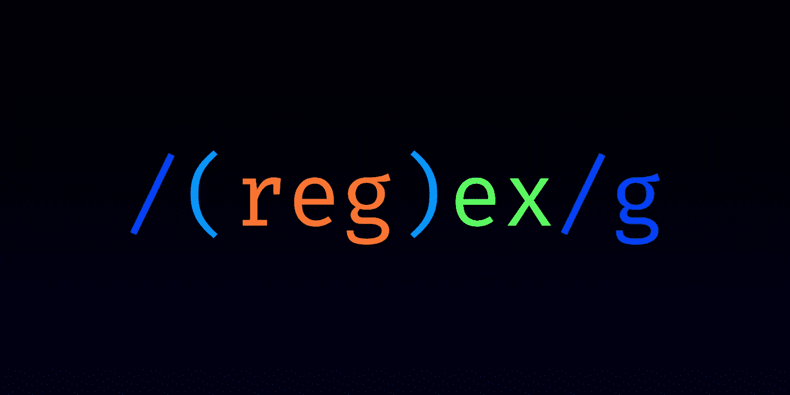

# 正则表达式小指南

> 原文：<https://levelup.gitconnected.com/little-guide-to-regular-expressions-b37e28cc56a0>

在困难时期，正则表达式是为你准备的。它们是我们许多开发人员的救命稻草，所以一定要让它们成为你的朋友。

我知道……乍一看，它们可能是一种黑暗晦涩的魔法语言。但是相信我，他们更容易理解谢谢你的思考！

> 当然，像其他技能一样，掌握正则表达式是很难的。但是你还是可以很擅长的，不费吹灰之力。这就是它学习曲线的美妙之处！

所以读完这篇短文，你会知道如何创建你的第一个正则表达式！

# 基础知识

为什么需要正则表达式？这很简单，它可以帮助你在任何类型的字符串中找到匹配的内容。

这里有一个例子:

让我们看看字符串“hello”中是否包含字母“o”至少一次。做这件事的正则表达式是`o`。对，就是这样。

同样，如果您想检查字符串“New York”是否包含单词“York”，那么正则表达式将是`york`。

在这种情况下，它将找不到任何匹配，因为默认情况下**搜索是区分大小写的**(尽管您可以更改)。

# 字母、数字和其他特殊字符

您可以使用一些“特殊”字符和语法来搜索更复杂的匹配。

再次，让我们用一个例子:`[marplex.medium.com](https://marplex.medium.com)`是输入字符串。

**搜索任何指定的字母或数字**

*   `[a-z]`匹配从“a”到“z”的每个字母
*   `[A-Z]`匹配从“A”到“Z”的每个字母
*   `[0-9]`匹配从 0 到 9 的所有数字
*   `[1-3]`匹配从 1 到 3 的每个数字
*   诸如此类…

**其他特殊字符**

*   `.`(对，就一个点)匹配每一个可能的字符。因此，在`[marplex.medium.com](https://marplex.medium.com)`的情况下，你将有 14 个匹配，每个字符一个。
*   `^`匹配行首(在这种情况下，由于示例是 1 行，它将找到 1 个匹配)
*   `$`匹配行尾

**结合一切**

假设您的程序现在需要检查输入字符串是否是有效的优惠券代码。每个优惠券代码以 3 个数字开始，然后是字母“-”，最后是 3 个小写字母(“827-afd”)

匹配该优惠券代码的正则表达式将是:

`^[0-9][0-9][0-9]-[a-z][a-z][a-z]$`

按顺序:

*   `^`从该行的开头开始
*   然后检查是否有 3 个数字从 0 到 9
*   `-`匹配该特定字符
*   `[a-z][a-z][a-z]`匹配从 a 到 z 的 3 个小写字母
*   `$`匹配行尾

# 量词

你刚刚看到的最新的正则表达式可以用量词简化。通过查看转换后的正则表达式，您将理解第一个量词。

`^[0-9][0-9][0-9]-[a-z][a-z][a-z]$`变成了`^[0-9]{3}-[a-z]{3}$`

我们没有写 3 次相同的`[a-z]`和`[0-9]`，而是说我们想用量词`{3}`将它们匹配 3 次。

*   同样，可以使用`{3,7}`在 3 和 7 之间进行匹配
*   `{3,}`匹配 3 个或更多
*   `+`或`{1,}`匹配 1 个或更多
*   `?`或`{0,1}`匹配 0 或 1
*   `*`或`{0,}`匹配 0 或更多

## 结论

这就是开始使用正则表达式所需的全部内容。

> 还有更多的东西需要学习(群体、非捕获群体、懒惰量词、贪婪量词等等)，包括一些你最终会记住的小技巧。

我鼓励你和 https://regex101.com 一起练习。我一直用它来动态地编写正则表达式。它向您显示了您正在匹配的内容，并解释了正则表达式正在做什么。这是一个伟大的工具！

我希望你喜欢阅读这篇文章。如果你愿意支持我当作家，可以考虑报名参加 [*成为*](https://marplex.medium.com/membership) *的中等会员。你可以以每周不到 1 美元的价格无限制地使用所有的媒体。*

[*作为一个媒介会员，你的会员费直接支持我和你阅读的其他作家。你也可以在媒体上看到所有的故事。*](https://marplex.medium.com/membership)

继续学习其他精彩的文章和视频:

*   [https://www . manishmshiva . com/a-complete-guide-to-regular-expressions/](https://www.manishmshiva.com/a-complete-guide-to-regular-expressions/)
*   [https://coder pad . io/blog/development/the-complete-guide-to-正则表达式-regex/](https://coderpad.io/blog/development/the-complete-guide-to-regular-expressions-regex/)
*   [100 秒内正则表达式(RegEx)](https://www.youtube.com/watch?v=sXQxhojSdZM)—YouTube