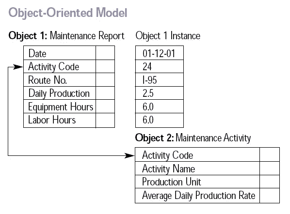

# 量入为出:Firestore 的星火计划

> 原文：<https://levelup.gitconnected.com/living-within-your-means-firestores-spark-plan-d7e20cdac1ba>

我最近开始了一个个人项目，我想在云中使用一个数据库。可供选择的有不少。我的主要标准是它要便宜或者免费。最终我决定选择 [Firestore](https://firebase.google.com/docs/firestore) ，使用[星火计划](https://firebase.google.com/pricing)。这个计划给了我 5Gb 的存储空间，每天免费读取 50K 数据和写入 20K 数据，这在当时看来已经足够了。我很快了解到，稍有不慎就可能很快超过交易限额。

Firestore 是一个 NoSQL 文档存储数据库。每个 NoSQL 数据库都是不同的，我的学习曲线比预期的要陡峭。如你所知，最好的老师是逆境，我很早就犯过错误。但是如果太多，我就会达到计划的读写极限，这有时会在一两个小时内发生。然后是收工的时候了。

现在情况有所好转，所以我提供这些经验教训:

# *从免费计划开始


照片由[卡里姆·曼吉拉](https://unsplash.com/@karim_manjra?utm_source=unsplash&utm_medium=referral&utm_content=creditCopyText)在 [Unsplash](https://unsplash.com/s/photos/free-beer?utm_source=unsplash&utm_medium=referral&utm_content=creditCopyText) 上拍摄

是的，超越计划的限制是很容易的，但是这些事情会迫使你学会有效地读写。您将变得更加注重以高效的方式对多个数据库操作进行排序。

# 从一个小数据集开始


由 [Vlad Tchompalov](https://unsplash.com/@tchompalov?utm_source=unsplash&utm_medium=referral&utm_content=creditCopyText) 在 [Unsplash](https://unsplash.com/s/photos/small?utm_source=unsplash&utm_medium=referral&utm_content=creditCopyText) 拍摄的照片

这似乎是显而易见的，但是我说的“小”是指总共不到 100 个文档。在我的项目中，我首先用 10K 文档创建了一个集合。我后来意识到我加载的数据中有一个错误，修复了它，找到了另一个，去修复它，但是…TRANSACTION _ RESOURCE _ LIMIT _ exceed。好了，今天到此为止。

# 花时间设计您的数据模型



就像木匠的公理:“量两次，切一次。”，您不希望一点一点地调整 JSON 文档字段和结构。哦，你当然会，但是你可以通过实践一点远见来节省一些交易。首先写出文档、它们的字段以及它们的关系的示意图。[想象是幸福的关键。](https://www.freecodecamp.org/news/inserting-uml-in-markdown-using-vscode/)

# 测试和验证您的数据加载脚本


JESHOOTS.COM 在 [Unsplash](https://unsplash.com/s/photos/test?utm_source=unsplash&utm_medium=referral&utm_content=creditCopyText) 上[拍照](https://unsplash.com/@jeshoots?utm_source=unsplash&utm_medium=referral&utm_content=creditCopyText)

您将需要脚本从其他来源填充数据库。现在是时候:

*   验证您加载的是您所期望的
*   正确处理字段的无数据情况

在这两种情况下，我都犯了错误。首先，当我将一些字符串数据加载到文档字段中时，我没有立即注意到这些字符串已经有了引号，所以存储的字符串已经嵌入了引号。这似乎不是一个严重的问题，但后来在编写和测试该领域的搜索时，它成了一种痛苦。因为有很多文档，所以我花了每天写配额的很大一部分来清理它们。

在第二种情况下，我发现 Firestore 没有机制来确定文档中属性的[存在(没有*未定义的*检查)。有*有*有](https://stackoverflow.com/questions/46806860/how-to-query-cloud-firestore-for-non-existing-keys-of-documents)[有**存在**对单据](https://firebase.google.com/docs/firestore/query-data/get-data#get_a_document)的测试，但对单据字段没有。最佳实践是用 null 填充缺失的数据字段，然后在 where 子句中进行 null 等价测试，以找到具有“缺失”属性的文档。

# 一个小数据集教不了你什么


本·怀特在 [Unsplash](https://unsplash.com/s/photos/learning?utm_source=unsplash&utm_medium=referral&utm_content=creditCopyText) 上的照片

一旦你解决了小数据集的问题，是时候升级到更大的数据集了。随着要处理的文档越来越多，查询效率、分页和批量请求变得越来越重要。

# 成块地读，成块地写


照片由[梅姆](https://unsplash.com/@picoftasty?utm_source=unsplash&utm_medium=referral&utm_content=creditCopyText)在 [Unsplash](https://unsplash.com/s/photos/chunks?utm_source=unsplash&utm_medium=referral&utm_content=creditCopyText) 上拍摄

[批处理操作](https://firebase.google.com/docs/firestore/manage-data/transactions)允许在单个事务中对数据库进行多次读/写，这意味着如果任何写操作失败，那么所有写操作都会失败，并且数据库数据会保留其原始状态。批处理中的每个操作都计入总读/写配额，因此它对使用配额没有帮助。此外，当通过批处理操作编写时，要注意每批有 500 个操作的限制。

在关联两个文档时要小心(即，对于每个 A 文档，都有一个对 B 文档的引用关联)。不要先获取一个，然后遍历另一个。这是在调试时咀嚼事务配额的好方法。

最好获取第一个集合的子集，然后逐个文档地遍历它。通过获取一个符合标准的**将这些文档与第二个集合中的文档相关联。继续这样做，直到获取了整个第一个集合。调试时，您可以验证一切看起来都正常工作，如果不正常，就在运行大量事务之前终止进程。**

# 如何限制查询结果


照片由[蒂莫西·穆扎](https://unsplash.com/@timothymuza?utm_source=unsplash&utm_medium=referral&utm_content=creditCopyText)在 [Unsplash](https://unsplash.com/s/photos/piece?utm_source=unsplash&utm_medium=referral&utm_content=creditCopyText) 上拍摄

Firestore 的查询语言不像 SQL 那样富于表现力，但仍然有许多方法来限制您的查询，使您不会过度提取数据。虽然从技术上讲，对后响应机构没有规模限制，但实际上是有。

一些限制查询结果的机制:

**where 和 compound where**

您可以将多个 where 子句链接在一起，类似于在 SQL 中将条件表达式添加到单个 where 子句中。

```
citiesRef.where('state', '==', 'CO').where('name', '==', 'Denver');
```

**极限和范围**

通过在查询对象的末尾链接一个 limit 子句，可以限制查询返回的文档数。

```
let biggest = citiesRef.where('population', '>', 2500000)
  .orderBy('population').limit(2);
```

您还可以通过 startAt/endAt 或 startBefore/endBefore 约束指定要检索的记录范围，这允许您进行基于光标的分页。

```
let docRef = db.collection('cities').doc('SF');return docRef.get().then(snapshot => {
  let startAtSnapshot = db.collection('cities')
    .orderBy('population')
    .startAt(snapshot);
  return startAtSnapshot.limit(10).get();
});
```

**在数组中查询**

您可以在数组中查找特定的匹配项。这对枚举值来说很好。

```
const usaOrJapan = citiesRef.where('country', 'in', ['USA', 'Japan']);
```

正如所展示的，随着你对 Firestore 的了解，在 Spark 计划的限制范围内工作是可能的。它是免费的，这总是一个好的开始。