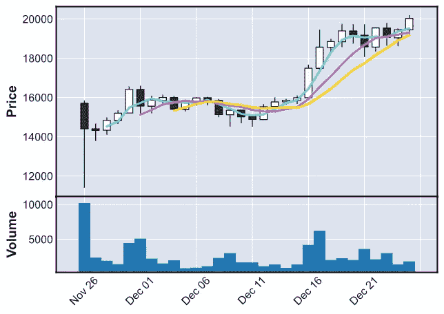

# 通过 Python 和 REST 从比特币基地专业版加载和可视化比特币市场数据

> 原文：<https://levelup.gitconnected.com/load-and-visualise-bitcoin-market-data-from-coinbase-pro-via-python-and-rest-api-fa5198e62646>

## 初学者和专家的逐步指南


图片:a-image/Shutterstock

如果你想开始成为一名加密投资者，并且想把事情掌握在自己手中，重要的是你能够以编程方式连接到数字货币交易所，如[比特币基地专业版](https://pro.coinbase.com)。这是开始数据分析和自动化并向算法交易前进的第一步。幸运的是，连接到加密交换机非常容易。在本文中，您将学习如何做到这一点。预先告诉你一个好消息:提取比特币(或任何其他数字货币)的市场数据并将其显示在一个漂亮的蜡烛图中只需要使用 Python，这是一个简单的四步过程。

阅读本文后，您将能够做到以下几点:

*   用 Python 连接到公共的比特币基地 Pro REST API
*   将比特币基地专业版的数据加载到熊猫数据框中
*   根据自己的优势处理和格式化数字货币市场数据
*   用 Python 可视化历史比特币数据

如果你想修改本文中使用的例子，请看看我的 [**GitHub**](https://github.com/ni79ls/coinbase-pro-market-data-rest) 页面上的完整 Python 代码。

# 第 0 步:理解相关的 Python 库和可重用函数

例如，我们需要以下 Python 库:

*   **请求:**为了从比特币基地 Pro 连接到 REST 端点，我们使用了[请求](https://requests.readthedocs.io/en/master/) HTTP 库。它非常用户友好，你只需要几行代码就可以通过 REST 连接。
*   **Pandas:** 对于数据分析和操作，我们使用每个数据科学家最喜欢的库 [Pandas](https://pandas.pydata.org/) 。
*   **Matplotlib:** 因为我们也想可视化一些数据，所以我们需要机器学习实践者大量使用的 [Matplotlib](https://matplotlib.org) 库。
*   **MPL Finance:**Finance 模块以前是 Matplotlib 的一部分，现在已经被弃用，现在在它自己的库中。你可以在这里找到更多信息。我们使用这个库来完成本文末尾的财务绘图。
*   为了更好的显示情节，我们使用了。

因为我们在多个场合连接到比特币基地 Pro REST API，所以让我们先从定义自定义函数 *connect* 开始。

上面的函数将一个 URL 和可选的参数作为 REST 端点的输入。然后它使用*请求*库返回一个响应对象。如果发生错误，将引发异常并打印错误。

# 第一步:连接并检索基本加密货币信息

首先，我们将使用上面定义的函数连接到比特币基地专业应用编程接口端点来检索产品信息。产品是可以在比特币基地专业版上交易的数字资产。该函数返回一个*响应*对象。

然后，我们将响应对象中的数据加载到名为*df _ currency*的 Pandas 数据帧中。响应是 json 格式的，因此我们可以使用来自 Pandas 的标准函数 *read_json* 。

接下来，我们打印出一些关于数据框的基本信息，比如列数和可用的列标题。最后一行打印出我感兴趣的四种入围货币的关键信息。该代码会产生以下结果:

```
Number of columns in the dataframe: 17Number of rows in the dataframe: 129['id', 'base_currency', 'quote_currency', 'base_min_size', 'base_max_size', 'quote_increment', 'base_increment', 'display_name', 'min_market_funds', 'max_market_funds', 'margin_enabled', 'post_only', 'limit_only', 'cancel_only', 'trading_disabled', 'status', 'status_message']                      id      quote_currency    base_min_size    base_max_size
38   BCH-EUR                 EUR              0.0            100.0
61   ETH-EUR                 EUR              0.0           1600.0
67   LTC-EUR                 EUR              0.1           1000.0
117  BTC-EUR                 EUR              0.0             00.0
```

# 第二步:获取更多统计数据

现在，我们已经成功地在比特币基地专业版上加载了可用产品的基本信息，我们希望进一步深入到四种入围货币(*MY _ currency*)。让我们来看看我们最喜欢的每种货币在过去 24 小时内发生了什么:

*   **开盘:**以欧元为单位的开盘价
*   **高:**欧元的最高价格
*   **低:**欧元的最低价格
*   **最后:**当前欧元价格
*   **成交量:**成交量

因此，我们使用比特币基地 Pro 的另一个 REST 端点，名为 *stats* 。在代码中，我们遍历这四种货币，并为每次迭代发出一个 HTTP 请求来检索数据。一旦我们有了所有的数据，我们就从中生成另一个熊猫数据框。

结果如下(开盘价、盘高、盘低值以报价货币表示，成交量以相应数字资产的基础货币表示):

```
 open      high       low           volume      
BTC-EUR     19153.1  20195.97  19110.75    2025.26142389     
ETH-EUR      489.27     518.8    486.96   21798.45961209       
LTC-EUR       87.73    102.32     86.63  107184.78064464        
BCH-EUR      238.07    265.68    235.11   13131.12487879 
```

# 第三步:深入研究比特币历史数据

我们现在想知道价格在过去 90 天里是如何发展的。我们将使用比特币作为例子，但你也可以使用你感兴趣的任何其他货币。比特币基地专业公司在检索*蜡烛*静止终点的更详细价格信息时需要三个参数:

*   **开始日期:**时间窗口的开始时间，ISO 8601 格式
*   **结束日期:**ISO 8601 格式的时间窗口的结束时间
*   **粒度:**一个时间窗口的大小，以秒为单位。仅接受以下值:60、300、900、3600、21600、86400

请注意，请求必须以这样一种方式设计，最多将返回 300 个时间片。在本例中，我们请求过去 90 天的每日时间片(86，400 秒)。所有三个参数都传递给另一个 HTTP 调用，如下所示:

同样，我们从接收到的数据中构建一个 Pandas 数据帧。*蜡烛线*静止终点为我们提供了以下信息:

*   **时间:**时间窗口的时间。
*   **低点:**时间窗内的最低价。
*   **高点:**时间窗口内的最高价。
*   **开盘:**时间窗口开始时的开盘价。
*   **收盘:**时间窗结束时的收盘价。
*   **成交量:**时间窗内的总成交量。

为了提高可读性，让我们在结果中再添加几列，如年、月和日:

打印数据的前五行可以让我们很好地了解数据的结构以及它包含的信息类型:

```
low        high      open      close     volume   year   month  day
--------------------------------------------------------------------
019225.7   20196.0   19460.9   20032.9   1766.7   2020   12     25
118616.5   19515.8   19049.0   19460.8   1328.4   2020   12     24
218650.0   19797.3   19547.3   19070.0   2979.2   2020   12     23
318339.0   19556.9   18575.3   19550.8   2078.5   2020   12     22
418069.0   19740.0   19175.9   18584.8   3566.8   2020   12     21
```

让我们在最后一步中使用这些数据来生成一些漂亮的可视化效果。

# 第四步:生成蜡烛图

幸运的是，MPL Finance 库有一个内置的功能来创建蜡烛图。蜡烛图有时也被称为 OHLC 图(**O**pen-**H**igh-**L**ow-**C**输)。非常适合我们在上一步中已经检索到的数据。

作为奖励，我们还在图表中添加了三个不同的移动平均值(MAV)。移动平均线是一个技术指标，它平滑了价格趋势，并减少了特定时间段内高波动的噪音。

我们只用几行代码就可以实现所有这些。首先，我们复制数据帧，并将其命名为 *df_ohlc* 。该图表应该只显示最近 30 天，因此我们删除了剩余的行。然后我们重新排列这些列，使它们符合图表的预期顺序。将日期作为数据框的索引非常重要。最后，我们必须颠倒顺序，以便图表按照自然阅读顺序从左到右显示值。

下面是上面代码的结果。仅仅几行代码就很不错了:



Python MPL Finance 生成的比特币蜡烛图

MPL 使用共同的命名法:白色蜡烛线代表收盘价高于开盘价的时期，而黑色蜡烛线代表收盘价低于开盘价的时期。

# 最后

如您所见，通过编程连接到数字货币交易所来检索任何种类的公共市场数据一点也不困难。你不需要成为一个专业的开发人员来完成事情。比特币基地专业是一个伟大的平台，开始与加密货币交易。另一个主要参与者是北海巨妖。在你开始你的旅程之前，一定要检查一下这两个网站。

我希望火种被点燃，你将开始在伟大的数字货币 API 之上编写你自己的解决方案。

去建造吧！

# 参考

下面是文章中提到的一些网站和图书馆:

*   [比特币基地](https://www.coinbase.com)数字货币兑换和钱包
*   [比特币基地专业](https://pro.coinbase.com)数字资产交易所
*   [北海巨妖](https://www.kraken.com)加密货币交易所
*   [请求](https://requests.readthedocs.io/en/master/) HTTP 库
*   [熊猫](https://pandas.pydata.org/)机器学习库
*   [Matplotlib](https://matplotlib.org) 机器学习库
*   [MPL 财务](https://github.com/matplotlib/mplfinance)可视化库
*   Seaborn 可视化库
*   [Jupyter 笔记本](https://github.com/ni79ls/coinbase-pro-market-data-rest)本文供图