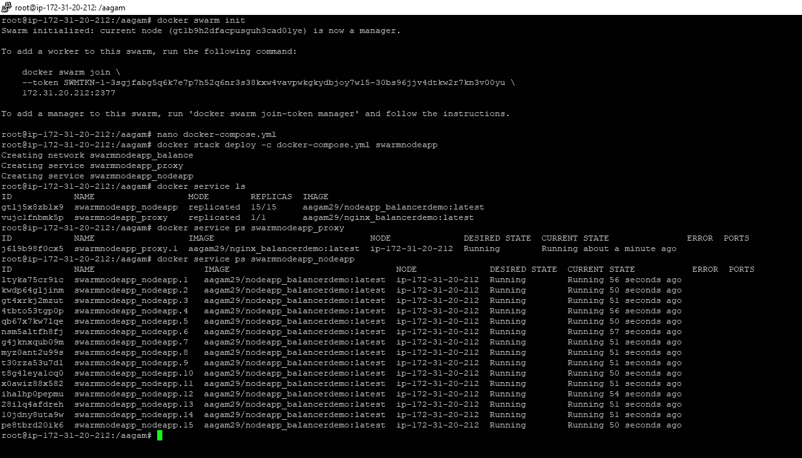
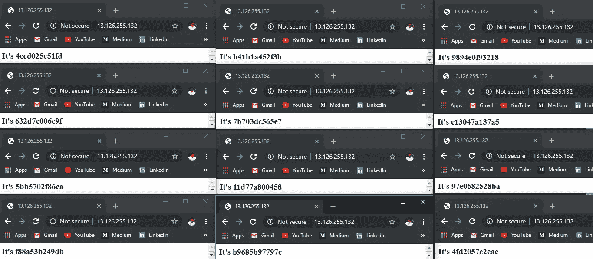
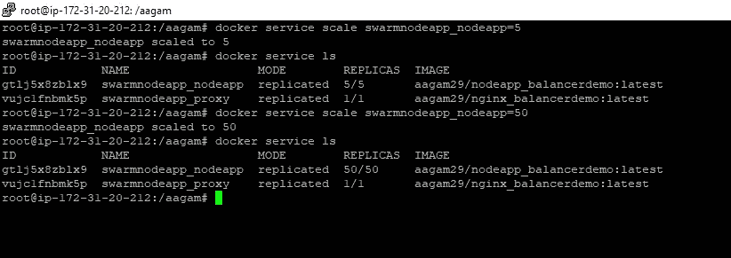
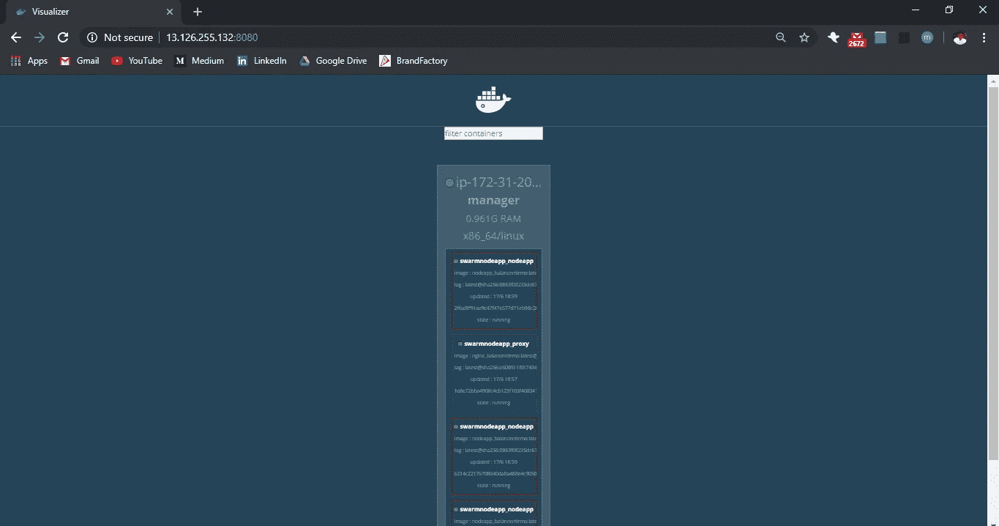

# 使用 Nginx 和 Docker Swarm 对 Node.js 容器进行负载平衡和扩展

> 原文：<https://levelup.gitconnected.com/load-balance-and-scale-node-js-containers-with-nginx-and-docker-swarm-9fc97c3cff81>

在我之前的博客[中，我们看到了如何在不同主机端口上的 docker 容器中部署 Node.js 应用程序，并使用 Nginx 对其进行负载平衡。](/set-up-a-nginx-load-balancer-for-a-dockerized-node-js-application-6bff1a54655a)

这是一个很好的方法，可以用来理解基础知识。然而，在生产环境中，在不同的端口上单独部署一个一个的容器是不可行的，还要在我们的 Nginx 配置文件中写入每个 ip:port，此外，当容器由于某种原因关闭时，还要管理和重写配置文件。因此，当容器数量增加时，它变得难以管理和令人沮丧。

这个问题的一个解决方案是使用`Container Orchestration`。我们将使用 docker 本身提供的称为`docker swarm`的编排来简化我们的工作。你可以在这里阅读对 swarm、服务、堆栈[的一般介绍](https://docs.docker.com/get-started/part4/)

**必备:** Docker 基础知识

**概述:**

在这篇博客中，我们将对接一个 Node.js 应用程序，然后在一个 swarm 集群中部署 15 个容器，看看我们如何使用 Nginx 在单个 IP 后面对它们进行负载平衡，最后以放大和缩小它们并以更好的方式可视化容器来结束。

***好了，我们开始吧***

我们的节点应用程序的 app.js 看起来像这样。

它只是在端口 5000 上用 os.hostname()响应，这样我们就可以区分不同的运行容器。
我们需要将此应用程序归档，因此复制下面的 docker 文件，并打开您的终端 cmd/shell 到同一个文件夹。

在这里，您需要运行`docker build -t username/appname .`，其中用户名是您的 docker-hub 用户名，然后使用`docker image push username/appname`将其推送到 docker hub。
我们正在将它推送到 docker hub，这样我们就可以进行一次性设置，并可以在任何需要的时候在任何服务器上使用 docker-compose.yml 文件来旋转我们的容器，此外，我们不需要在每台服务器上构建映像，我们只需要在我们的云服务器上使用 docker-compose.yml 文件。
所以对我来说，命令是:

*   `docker build -t aagam29/nodeapp_balancerdemo .`
*   `docker image push aagam29/nodeapp_balancerdemo`

我们需要 Nginx 作为容器的负载平衡器，所以让我们来设置它。移动到新文件夹并复制这些文件。
根据您的服务器更改 nginx.conf 中的 IP。
要了解更多关于 Nginx 的信息，你可能想参考[这个](https://www.nginx.com/)

现在，我们将做一个类似的图像构建和推动我们做了以上

*   `docker image build -t aagam29/nginx_balancerdemo`
*   `docker image push aagam29/nginx_balancerdemo`

完成后，你应该可以在 docker hub 上看到图片

好了，下一个任务是在我们的部署服务器上创建一个 swarm 集群。简单地输入`docker swarm init` ，一个蜂群就会被创造出来。我们将在一台服务器上看到部署，以防您希望使用多台服务器，只需[添加一个**管理器**节点](https://docs.docker.com/engine/swarm/swarm-tutorial/add-nodes/)到集群，并在构建 nginx 映像之前添加其 IP:Port，并开放所需的容器[端口](https://docs.docker.com/engine/swarm/swarm-tutorial/#open-protocols-and-ports-between-the-hosts)供它们通信。

在您的服务器上复制以下 docker-compose 文件，根据您在构建图像时使用的用户名/appname 更改图像名称。

如果您熟悉 docker-compose 文件，就很容易理解这里发生了什么。对于那些没有的人，我们提供两种服务:

*   第一个被命名为`nodeapp`，它将生成我们的映像`aagam29/nodeapp_balancerdemo`的`15`容器，映射将从主机端口 5000 到容器端口 5000。如果一个容器关闭，将有`3`次连续重启尝试，当更新时，它将延迟 10 秒关闭→启动容器
    `3 by 3`，容器将被添加到在文件末尾创建的名为`balance`的网络中
*   第二个名为`proxy`，它将从我们的映像`aagam29/nginx_balancerdemo`中旋转一个容器，该映像位于从主机端口 80 映射到容器端口 80 的同一个网络`balance`中，它依赖于`nodeapp`，这意味着一旦`nodeapp`服务启动，它就会启动，并且该节点应该是群中的`manager`，以便运行该服务

复制该文件后，我们需要使用`docker stack deploy -c docker-compose.yml swarmnodeapp` 使用 docker stack 部署我们的服务堆栈。部署完堆栈后，我们可以使用`docker service ls` 和`docker service ps **servicename**` 检查部署状态，还可以使用`docker container ls`查看正在运行的容器。

*随后的截图清晰的说出了整个过程！*

祝贺😃，我们快完成了！如果一切顺利，您可以访问您的 ip 来查看容器 ID，并多次点击刷新来查看它们每次的变化，以交叉检查负载平衡工作是否非常顺利！！

现在到了扩展的时候了，你可以用 swarm 很容易地扩展你的容器，你所需要做的就是运行`docker service scale servicename=replicas`比如`docker service scale swarmnodeapp_nodeapp=50`

为了更好地可视化运行的容器，我们可以使用 docker 可视化工具。只需运行`docker container run -p 8080:8080 -v /var/run/docker.sock:/var/run/docker.sock -d dockersamples/visualizer`

然后访问您的 IP:8080，以正确查看您的群中运行的容器。

干得好！

我们刚刚为您的 Node.js 应用程序实现了一次性可伸缩部署设置，还为它配置了负载平衡，并在不使用命令行的情况下可视化了它们。

***感谢阅读！如果你喜欢你所读的，那么留下一个👏然后跟着走。***