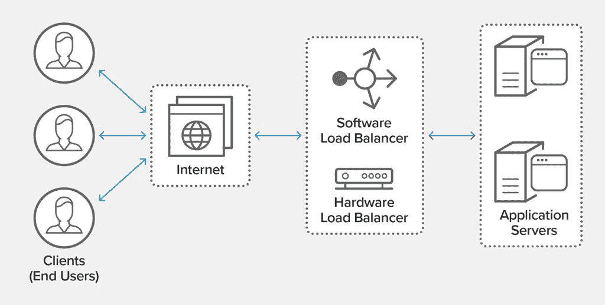

# 负载平衡器:深度探索

> 原文：<https://levelup.gitconnected.com/load-balancers-a-deep-dive-7d17067f5ff6>


泰勒·维克的照片

```
**Table of contents:**
```

1.  什么是负载平衡
2.  为什么我们需要负载平衡器
3.  负载平衡器分类
4.  负载平衡器在当今的系统中处于什么位置
5.  负载平衡算法
6.  在现代云基础架构中定义负载平衡器
7.  摘要

```
**1) What is Load Balancing ?**
```

在计算世界中，**负载平衡**指的是在一组[资源](https://en.wikipedia.org/wiki/System_resource)(计算单元)上分配一组[任务](https://en.wikipedia.org/wiki/Task_(computing))的过程，目的是使它们的整体处理更加高效。

负载平衡器有助于将流量分散到一个[服务器集群](https://en.wikipedia.org/wiki/Computer_cluster)中，以提高系统的响应能力和可用性，无论是应用程序、网站还是数据库等。

```
**2) Why do we need Load Balancers ?** 
```

在今天的系统中，意味着真正的分布式系统，跨[可用性域](https://docs.oracle.com/en-us/iaas/Content/General/Concepts/regions.htm)/区域，云基础架构[中的区域](https://en.wikipedia.org/wiki/Cloud_computing)拥有多套后端服务器是一种常见的做法。

**a)** **负载平衡器充当** [**反向代理**](https://en.wikipedia.org/wiki/Reverse_proxy) **:** 我们不想暴露后端服务器的 IP，所以我们使用负载平衡器充当后端服务器的“公共面孔”，从而提供了一个命名抽象。

**b)** **充当流量警察:**负载平衡器还充当“流量警察”，通过高效地将请求/网络负载路由到健康的服务器后端服务器池，有时强制执行安全规则。从而提供[容错](https://en.wikipedia.org/wiki/Fault_tolerance#:~:text=Fault%20tolerance%20is%20the%20property,within)%20some%20of%20its%20components.)和[高可用性](https://en.wikipedia.org/wiki/High_availability)。

**c)** **可扩展性和效率:**由于负载均衡器有效地接收请求并对其进行路由，因此可以根据负载/流量动态地向服务器池添加/移除服务器，从而提供[可扩展性](https://en.wikipedia.org/wiki/Scalability)和效率

**d)** **健康检查:**负载平衡器在每个后端服务器上进行连续的[健康检查](https://docs.oracle.com/en-us/iaas/Content/HealthChecks/Concepts/healthchecks.htm)，以确保请求只被健康的服务器服务。后端服务器的状态可以是(正常、警告、紧急、活动受损、无响应等)。)一边做健康检查。

```
***There are 2 Main Types of Health Checks:***
```

*   *浅层健康检查:*它涉及[ping](https://en.wikipedia.org/wiki/Ping_(networking_utility))每个后端服务器，以确保它们启动并运行(可用)。
*   *深度健康检查:*它包括依次检查应用程序依赖项的健康和状态，以便后端服务器实际上能够服务于客户端请求。

**e)** [**服务发现**](https://2immerse.eu/wiki/service-registry/) **:** 负载平衡器通过与服务注册表对话来发现网络上可用的设备和服务，服务注册表实质上是包含服务实例的网络位置的数据库。

**f)** [**缓存**](https://en.wikipedia.org/wiki/Cache_(computing)) **和** [**压缩**](https://en.wikipedia.org/wiki/HTTP_compression) **:** 负载平衡器可以在将后端服务器的响应返回给客户端之前对其进行压缩，从而节省网络带宽，并且还可以缓存这些响应以减少后端系统的负载。

**g)传入请求的解密:**在 [HTTPS/SSL](https://en.wikipedia.org/wiki/HTTPS) 监听器连接到您的负载平衡器的情况下，证书( [SSL 服务器证书(X.509](https://www.ssl.com/faqs/what-is-an-x-509-certificate/) )使负载平衡器能够终止连接，并在将传入请求传递到后端服务器之前对其进行解密。

```
**3) Load Balancers Classification**
```

负载平衡器可以根据各种标准进行分类。

```
I**) Software Load Balancers Vs Hardware Load Balancers**
```

传统的负载平衡解决方案依赖于位于数据中心的专有硬件，并需要一组经验丰富的 IT 人员来安装、调整和维护系统。只有拥有大量 IT 预算的大公司才能从改进的性能和可靠性中获益。在云计算时代，基于硬件的解决方案有另一个严重的缺点:它们不支持云负载平衡，因为云基础设施供应商通常不允许客户或专有硬件出现在他们的环境中。

幸运的是，基于软件的负载平衡器能够以低得多的成本提供基于硬件的解决方案的性能和可靠性优势。因为它们运行在商用硬件上，所以即使对较小的公司来说也是负担得起的。它们是云负载平衡的理想选择，因为它们可以像任何其他软件应用程序一样在云中运行。

```
II**) Layer 4 Load Balancers Vs Layer 7 Load Balancers**
```

**第 4 层负载均衡器**通常是运行负载均衡软件的专用硬件设备。在第 4 层负载均衡中，负载均衡器的公共 IP 通过 [DNS 服务](https://en.wikipedia.org/wiki/Domain_Name_System)(用于网站或服务)通告给客户端。第 4 层负载平衡通常依靠源和目的 IP 地址来做出负载平衡决策。它使用 [NAT](https://en.wikipedia.org/wiki/Network_address_translation) (网络地址转换)将目标服务器的 IP 地址从它自己的 IP 地址更改为一个健康的后端服务器的 IP 地址。通常，第 4 层负载平衡器可以通过 TCP、UPD 和 TLS 到达。

它只使用 TCP 流中请求的前几个[包](https://en.wikipedia.org/wiki/Network_packet)。第 4 层负载平衡已经过时，因为 [CPU 和内存](https://homepage.cs.uri.edu/faculty/wolfe/book/Readings/Reading04.htm)已经变得足够便宜，可以忽略第 4 层的微小性能优势。

**第 7 层负载均衡器**与 OSI 模型的第七层(应用层)相关，利用消息/请求的实际内容做出更加智能和明智的负载均衡决策。**例如，**浏览器标题中指示的语言可用于将访问者重定向到适当的内容版本。第 7 层负载平衡器充当代理，这意味着它维护两个 [TCP](https://en.wikipedia.org/wiki/Transmission_Control_Protocol) 连接:一个与客户端连接，一个与服务器连接。通常第 7 层负载平衡器可以通过 TCP、SSL/TLS、HTTP、HTTPS 访问。

根据服务和请求，一些负载平衡器可以配置为同时充当第 4 层和第 7 层负载平衡器。

```
III**) Private Load Balancers Vs Public Load Balancers**
```

**私有负载平衡器**拥有从本地私有网络[子网](https://en.wikipedia.org/wiki/Subnetwork)分配的[私有 IP](https://en.wikipedia.org/wiki/IP_address#Private_addresses_2) 。这种类型的负载平衡器通常用于处理私有网络(VCN、私有云)、私有网络之间(可用性区域/域之间)、区域之间的流量，以及来自[内部云](https://www.cleo.com/blog/knowledge-base-on-premise-vs-cloud)的网络流量。

**公共负载平衡器**拥有公共 IP 地址，可以从互联网访问。这通常用于面向客户的应用程序和系统。例如在 facebook、google、金融网站等。



供图:NGINX

```
**4) Where does the Load Balancers fit in today's systems**
```

让两个负载均衡器一个作为活动负载均衡器，另一个作为备用负载均衡器是一个很好的实践，以确保负载均衡器本身不会成为[单点故障](https://en.wikipedia.org/wiki/Single_point_of_failure)。

在这种情况下，我们采用了[浮动 IP](https://www.ionos.com/digitalguide/server/know-how/what-is-a-floating-ip/) ，这是一种可以同时分配给多个服务器(这里是负载平衡器)的虚拟 IP，*但是在任何给定时间它只能在一个服务器上活动。*

我们可以使用这个[浮动 IP](https://www.ionos.com/digitalguide/server/know-how/what-is-a-floating-ip/) 来实现故障转移，如果活动(主)负载平衡器完全停止工作(变得不可用)。在这种情况下，请求将被动态路由到备用负载平衡器(辅助)的 IP 地址(锚 IP 地址)。

***通常情况下，可以放置负载平衡器:***

*   在用户和网络服务器之间
*   在 web 服务器和应用服务器/缓存服务器之间
*   应用服务器和数据库之间

```
**5) Load Balancing Algorithms**
```

有数十种负载平衡算法。我在这里列出了几个流行的:

*   **循环调度:**请求按顺序分布在服务器组中。
*   **IP 哈希:**客户端的 IP 地址和特定的[哈希算法](https://en.wikipedia.org/wiki/Hash_function)用于确定哪个服务器接收请求。每当需要来自同一用户/客户机的请求每次都由同一后端服务器来服务时，就使用这种机制。
*   **最少连接:**一个新的请求被发送到当前与客户端连接最少的服务器。每台服务器的相对计算能力是决定哪台服务器连接最少的因素。
*   **最短时间:**将请求发送到由公式选择的服务器，该公式结合了最快的响应时间和最少的活动连接。
*   **基于资源:**结合来自 [OSI 层](https://en.wikipedia.org/wiki/OSI_model#Layer_architecture) 3、4 和 7 的知识，做出更优化的流量分配决策。

```
**6) Defining a Load Balancer in Modern Cloud Infrastructures**
```

为了在现代[云基础设施](https://www.redhat.com/en/topics/cloud-computing/what-is-cloud-infrastructure)中定义负载平衡器，我们需要以下(物理和逻辑)实体，其中服务器是唯一的一组物理实体。

*   两台服务器(一台活动，另一台备用),负载平衡器软件在其上运行，其上定义了监听程序(端口)(用于检查负载平衡器 IP 地址上的传入流量)
*   [虚拟网络](https://docs.oracle.com/en-us/iaas/Content/Network/Concepts/overview.htm)(VCN/私有云网络，[子网](https://en.wikipedia.org/wiki/Subnetwork))
*   [健康检查政策](https://docs.oracle.com/en-us/iaas/Content/Balance/Tasks/editinghealthcheck.htm)
*   负载平衡算法
*   可选的 SSL 处理
*   浮动 IP(故障转移，无停机时间)

```
**7) Summary**
```

负载均衡器实质上已经成为每个分布式、容错和高可用性系统的重要组成部分。它可以充当反向代理，也可以实施缓存和压缩技术。在当今“活跃用户”如饥似渴的应用程序中，由于不断增加的负载和网络流量，负载平衡器不容忽视。它们通过基于各种算法和机制来分配流量，从而提高系统的响应能力和整体性能。

```
**Interesting Reads:****1\.** [**Futures in Java: CompletableFutures**](https://medium.com/swlh/futures-in-java-completablefuture-69acc14fa71d)**2\.** [**Java Lombok: do we need getters and setters**](https://medium.com/swlh/java-lombok-why-getters-and-setters-84607f0a9ade)
```

快乐学习。！！

## 资源:

1.  [https://en . Wikipedia . org/wiki/Load _ balancing _(计算)](https://en.wikipedia.org/wiki/Load_balancing_(computing))
2.  [https://www.nginx.com/resources/glossary/load-balancing](https://www.nginx.com/resources/glossary/load-balancing/)
3.  https://docs.oracle.com/en-us/iaas/Content
4.  【https://www.haproxy.com/blog/loadbalancing-faq 
5.  [https://kb . lease web . com/network/floating-IPS/using-floating-IPS](https://kb.leaseweb.com/network/floating-ips/using-floating-ips)