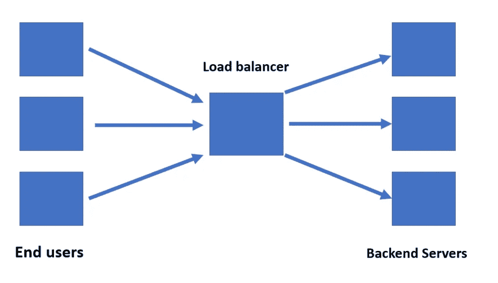
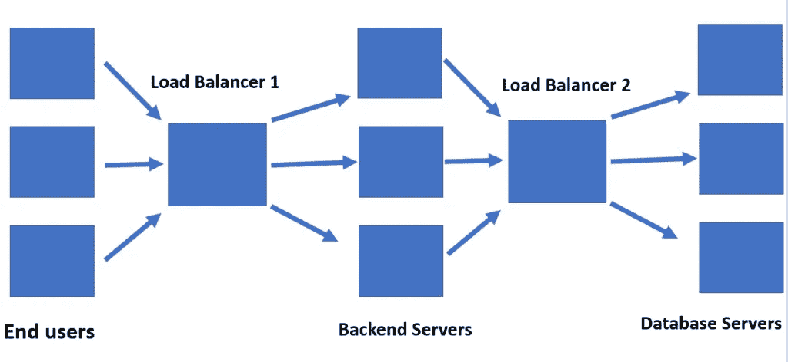

# 负载平衡及其不同类型

> 原文：<https://levelup.gitconnected.com/load-balancing-and-its-different-types-f1d0947686a0>

随着我们的应用程序扩展到多个用户，我们需要开始考虑用它来扩展我们的服务器和应用程序。负载平衡是在多台服务器之间有效分配流量负载的活动。

这就是我们实现高可用性应用程序的方式，这些应用程序可以帮助我们有效地实现扩展。

# 什么是负载平衡？

由于没有人能够承受 web 服务器过载，我们将后端服务器扩展到多台机器上。我们的目标是拥有一个分布式架构，避免所有用户都连接到一个服务器并阻塞它。因此，我们利用负载均衡器来分配传入流量。

负载均衡器因此成为我们架构中的一个关键组件，基于不同的技术转移流量，我们将在本文稍后讨论。它的主要职责是避免流量的汇聚，从而避免系统堵塞。

负载平衡器因此成为客户端请求的第一接触点。

一个系统中也可以有多个负载平衡器。应用程序的不同层各有一个。这将有助于更有效地处理独立的应用程序层，并在需要时独立地扩展它们。

还有一点很重要，当负载平衡器重定向到特定位置时，它可能不会命中应用服务器。如果我们进行全球扩展，它可能会影响在数据中心基于位置的集群中实施的另一个负载平衡器。

**注意:**如果一台服务器出现故障，负载均衡器还会确保在该服务器恢复运行之前，不会有流量被定向到该服务器。这是通过执行健康检查来实现的，确保负载平衡器只向在线服务器发送流量。

但是我们如何决定用户将登陆哪台机器呢？

# 负载平衡的类型

有三种类型的负载平衡:

1.  DNS 负载平衡
2.  基于硬件的负载平衡
3.  基于软件的负载平衡

和所有事情一样，这两种方法各有利弊。让我们详细讨论一下。

# DNS 负载平衡

DNS 负载平衡是最常用的负载平衡技术。名称服务器负责管理流量，而不是使用专用硬件来解析重定向到哪个服务器。

名称服务器有一个 IP 地址列表，对应于可以路由到的各种服务器。每当有人查询某个特定的域名时，域名服务器就会返回这个 IP 地址列表，并改变地址的顺序。重新排序是以循环方式完成的。因此，每个新请求都以循环的方式被路由到不同的机器，负载分布在不同的服务器上。

返回 IP 地址列表而不是单个 IP 地址的原因是为了有一个故障转移策略。如果第一个 IP 地址在规定的时间内没有响应，客户端可以调用列表中的下一个 IP 地址。

虽然这是一个受欢迎的策略，但它也有其局限性。该策略没有考虑的是服务器上的现有负载、服务器的处理时间、它们的在线状态等。

这种技术的另一个限制是 IP 地址缓存在客户机的 DNS 解析器上。这可以通过设置较低的 TTL(生存时间或存储映射的时间)来缓解。但这是一种折衷，因为较长的 TTL 意味着客户端不知道更改，而较短的 TTL 可能会提高准确性，但会增加 DNS 处理，DNS 缓存的实施首先是为了缓解这种情况。此外，客户端可能会选择完全忽略您的 TTL 值。所以不保证。

另一个限制是可能路由到一个不工作的机器。虽然目前大多数云服务确实提供健康检查和 DNS 平衡，但这可能并不适用于所有服务。

这种类型的负载平衡最常见的用例是在多个数据中心(可能位于不同的区域)之间分配流量。它也是公司的首选，因为它是一个经济高效的解决方案，易于部署。

# 基于硬件的负载平衡

顾名思义，我们使用物理设备作为负载平衡器。它们位于应用服务器的前面，处理流量的分配。

这些都是高性能的硬件，它们考虑了开放连接的数量、正在使用的计算量以及其他几个参数，以决定将流量路由到哪里。

拥有专门的硬件来负责负载平衡是非常高效的。它也是有效的，因为专用机器负责评估负载分布。由于专用处理器，吞吐量很快。它还提供了增强安全性的好处，因为组织可以限制对硬件的物理访问。

但是硬件的购买和安装都很昂贵，而且需要维护和定期更新。它还可能需要网络专家，因为这对于开发人员来说是一项繁重的工作。

另一个缺点是，我们必须考虑极端高峰流量的情况，并相应地计划购买硬件。对于基于软件的负载平衡器来说，情况并非如此。

# 基于软件的负载平衡

基于软件的负载平衡是在经济高效的硬件和虚拟机上安装负载平衡软件的过程。它们比硬件更便宜，也更灵活。它们还可以轻松地进行配置和升级。

与 DNS 负载平衡器相比，基于软件的负载平衡器的主要优势在于灵活性和高级配置选项。我们可以根据多个参数来配置负载平衡，如 cookies、HTTP 头、CPU 利用率、内存消耗、网络负载等。我们将在后面详细讨论可以实现的不同算法。

基于软件的方法优于基于硬件的方法的一个优点是，我们可以通过添加更多基于虚拟机的实例来扩展初始容量。无需购买额外的专用硬件。因此它更便宜。

有许多“软件平衡器即服务”服务，允许我们在没有任何配置的情况下使用它们。或者我们可以自己安装开源版本的软件。HAProxy 和 [Nginx](https://github.com/nginx/nginx) 是很多企业都在使用的相当常见的软件。

由于基于软件的负载平衡器有许多配置方式，我们接下来将讨论主要的配置算法。

# 软件平衡器使用的流量路由算法

**循环法:**与基于 DNS 的路由类似，一个软件使用一个 IP 地址列表，并根据每个请求循环使用这个列表。其他都不作为参数。

**加权循环法**:循环法的一种改进形式，以加权方式路由流量。权重由服务器的流量和计算能力决定。因此，相对于处理能力较低的机器，处理能力较高的机器可以获得更多的流量。

**最少连接:**流量被重定向到当前网络连接最少的机器。与上一个类似，有两种方法。假设对服务器的所有请求都占用相同的服务器资源。另一种方法是在决定最少打开的连接时，考虑服务器的流量和计算能力。
这种方法非常适合于连接是长期连接并且在更长时间内保持开放的情况，例如直播流或游戏应用。

**随机:**负载均衡器随机挑选两台服务器，然后使用最少连接机制，将请求发送给被选中的服务器。

**基于散列:**根据发生的分发来定义密钥。密钥可以是客户端 IP 地址或请求 URL，或者两者都是。对 IP 进行散列可以确保来自 IP 的请求总是被重定向到同一个服务器。这在服务器有一些关于用户信息的内存数据/缓存的情况下很有用。

**最少时间:**这建立在最少连接方法的基础上。流量被重定向到具有最少活动连接和最低平均响应时间的服务器。

这就是关于负载平衡的所有基本知识。负载平衡在分布式架构中扮演着重要的角色，有助于扩展我们的应用程序。它还有助于提高响应能力和实现高可用性。

如果您有任何疑问，请在下面留言。

*原载于 2021 年 1 月 26 日*[*【https://www.wisdomgeek.com】*](https://www.wisdomgeek.com/development/software-architecture/load-balancing-and-its-different-types/)*。*