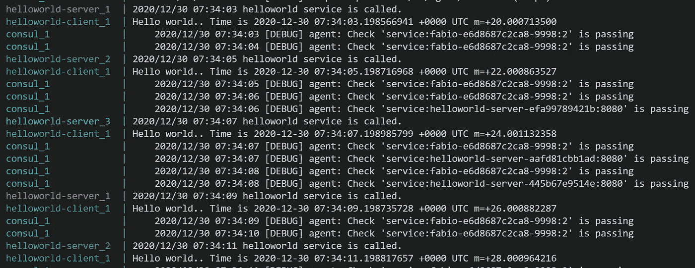

# Golang Cloud 中的负载平衡 Consul 和 Fabio 的原生微服务

> 原文：<https://levelup.gitconnected.com/load-balancing-in-golang-cloud-native-microservice-with-consul-and-fabio-f3026493982b>

在[上一篇文章](https://medium.com/p/731a01c648b4)中，我用一个真实的演示向你展示了如何在基于 Consul 和 Docker 的 Golang 云原生微服务应用中进行服务发现。在演示中，简单`helloworld-server`服务在 consult 中注册，`helloworld-client`可以通过 consult 发现服务的动态地址。但是前面的演示有一个限制，正如我在上一篇文章中提到的，在真实的微服务应用程序中，每个服务可能有多个实例来处理网络请求。

在本文中，我将展开演示，向您展示当一个服务的多个实例在 Consul 中注册时，如何做`load balancing`。

继续上一个帖子，新的演示将继续使用云原生方式与`Docker`和`Docker-compose`。


由 [Kelly Sikkema](https://unsplash.com/@kellysikkema?utm_source=medium&utm_medium=referral) 在 [Unsplash](https://unsplash.com?utm_source=medium&utm_medium=referral) 上拍摄的照片

# Fabio 负责负载平衡

为了实现 Consul 的负载平衡，Consul 官方文档推荐了几种策略。在这篇文章中，我选择使用[法比奥](https://github.com/fabiolb/fabio)。

> *Fabio 是一款开源工具，为 Consul 管理的服务提供快速、现代、零配置的负载平衡 HTTP(S)和 TCP 路由器。用户通过健康检查在 Consul 中注册服务，fabio 会自动将流量发送给他们。不需要额外的配置。*

Fabio 是一个有趣的项目，它基于 Consul 中服务注册的`tag`信息实现负载均衡。

用户使用以`urlprefix-`开头的标签注册服务，比如:

```
urlprefix-/my-service
```

然后，当在`/my-service`向 fabio 发出请求时，fabio 会自动将流量路由到集群中的健康服务。我将在下面的演示中告诉你如何做。我还将通过查看源代码对 Fabio 如何实现这一负载平衡策略进行简单的研究，并在下一篇文章中分享研究结果。

# Fabio 负载平衡演示

首先，这篇文章中显示的所有代码和配置文件都可以在这个 [github repo](https://github.com/baoqger/service-discovery-demo) 中找到，请`git checkout`到`load-balancing`分支查看这篇文章的演示。

## 服务器端

对于`helloworld-server`，有两个变化:

*   首先，每个服务实例应该有一个惟一的`ID`；
*   第二，添加`Tags`进行服务注册，标签遵循`Fabio`的规则。

好了，我们来检查一下新版本代码。

这些更改位于第 30、32 和 40 行，并在那里添加了注释来解释更改的目的。简单地说，现在每个服务实例都用一个惟一的 ID 注册自己，这个 ID 由基本服务名(本例中是 helloworld-server)和动态地址组成。另外，我们为每个注册添加了`urlprefix-/helloworld` **标签**。`urlprefix-`是 Fabio 的默认配置，您可以根据需要设置自定义前缀。基于这个**标签**，Fabio 可以对`/helloworld`端点进行自动负载均衡。

这就是服务器端的代码更改。让我们回顾一下客户的变化。

以前，我们需要运行`serviceDiscoveryWithConsul`来发现要调用的服务地址。现在，由于我们有`Fabio`作为负载均衡器，所以我们将请求发送到`Fabio`，我们的请求将由`Fabio`分发到服务实例。

这部分逻辑在以下方法中实现:

为了获得 Fabio 服务的地址，我们需要将其配置为一个环境变量，该变量将在 Docker-compose 的`yml`文件中设置。现在让我们来看看新的`yml`文件。

## docker-撰写配置

在这个`yml`配置文件中有几个变化:

*   添加新服务`Fabio`。如上所述，Fabio 是一个 zero-conf 负载均衡，可以简单地作为 docker 容器运行。这是如此方便，完全符合云原生风格。两个环境变量:`registry_consul_addr`和`proxy_strategy`，用于定义领事的地址和循环策略。
*   为客户端设置`FABIO_HTTP_ADDR`环境变量。这就是我们在上一节提到的，它允许`client.go`获取 Fabio 服务地址并发送请求。
*   将两个 docker 镜像升级到 **v1.0.2** 。

## 演示

是时候运行演示了！假设您在本地机器上构建了所有 docker 映像，然后运行以下命令:

```
docker-compose up --scale helloworld-server=3
```

这个命令有一个关于 Docker-compose 的重要提示:如何运行某些服务的多个实例。在我们的例子中，我们需要多个`helloworld-server`实例来实现负载平衡。Docker-compose 通过`--scale`选项支持这一功能。对于上面的命令，将启动 helloworld-server 的 3 个实例。

您可以在下图中看到演示的结果:



负载平衡

客户端重复并定期发送请求，Fabio 以循环方式将每个请求分配给三个实例中的一个。正是我们所期望的！