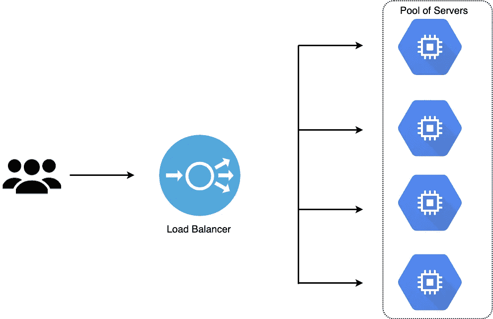
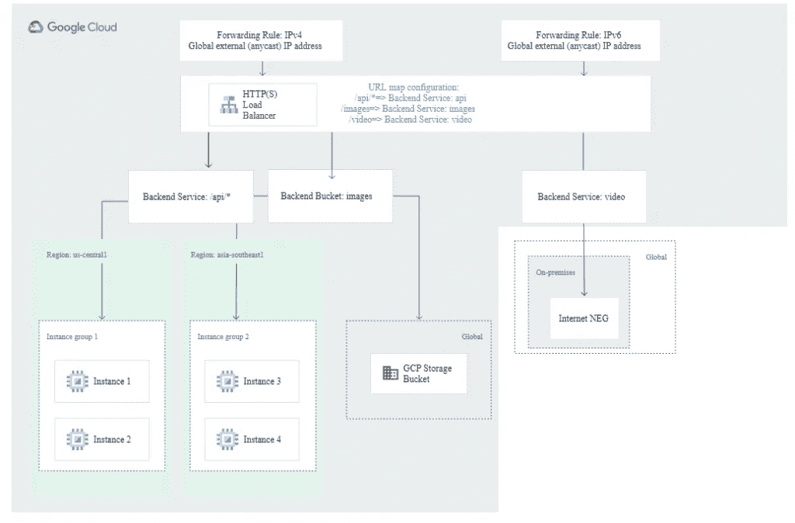
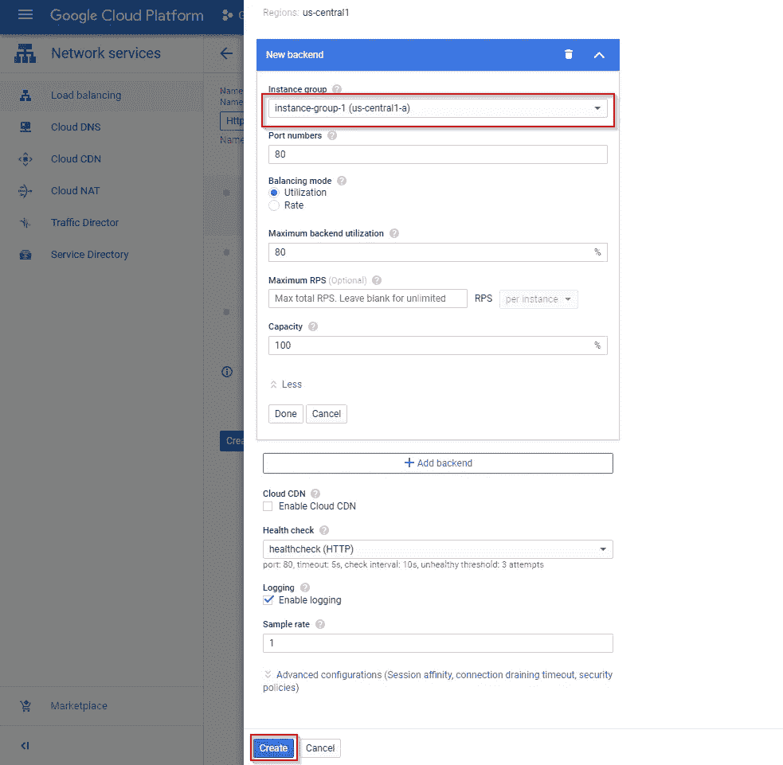
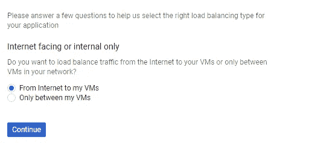
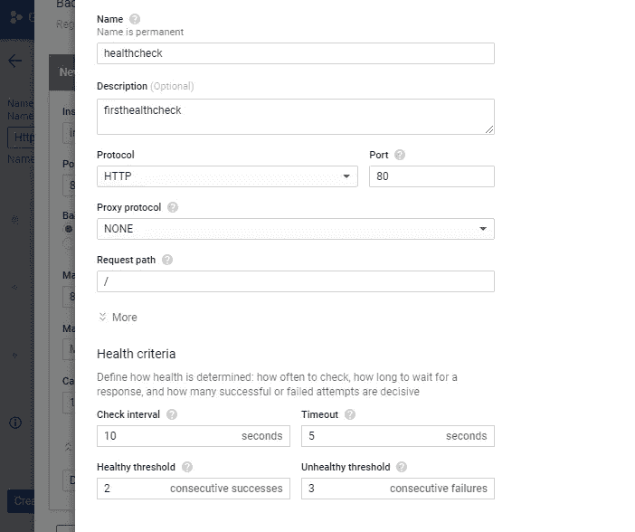
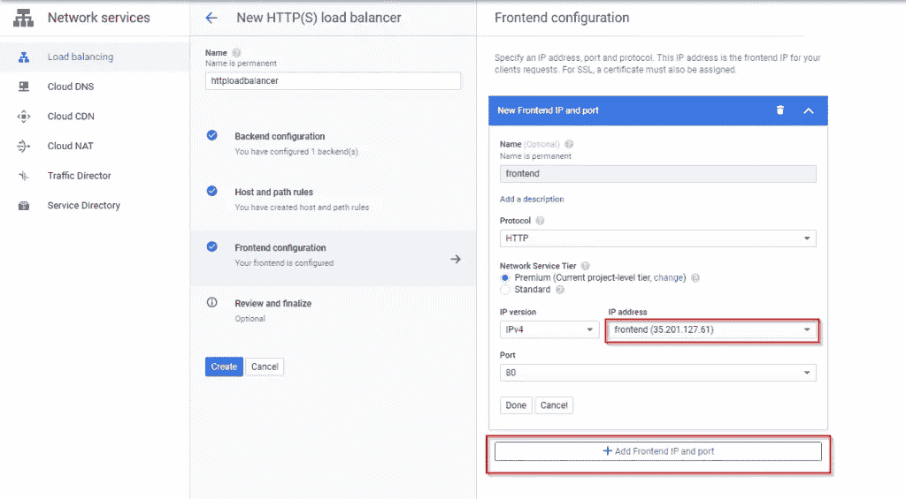
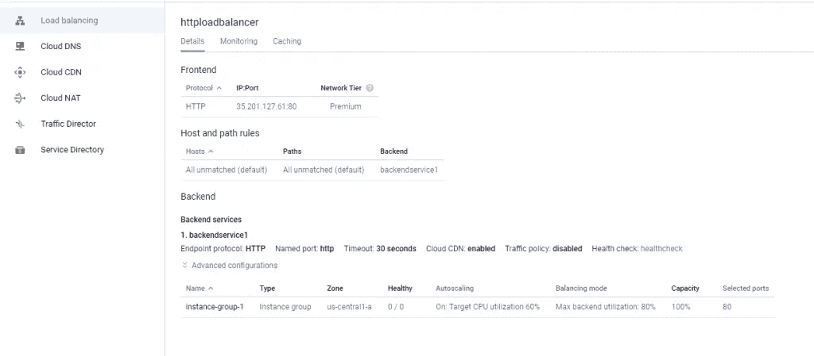

# 谷歌云平台(GCP)上的负载平衡:为什么和如何

> 原文：<https://levelup.gitconnected.com/load-balancing-on-google-cloud-platform-gcp-why-and-how-a8841d9b70c>

## 您有两种选择:纵向扩展或横向扩展

由 IOD 专家塞缪尔·詹姆斯

如果你是一个在 DevOps 或软件开发团队工作的人，你可能听说过这样一句话“[你建立它，你运行它](https://aws.amazon.com/blogs/enterprise-strategy/enterprise-devops-why-you-should-run-what-you-build/)”，这是亚马逊首席技术官沃纳·威格尔在 2016 年创造的。**这种态度主导了 DevOps 方法。**

现代应用程序服务于来自世界各地不同地理区域的用户的数百万个请求。团队必须找到一种有效的方式在服务器之间分配工作负载，以最大限度地提高速度和容量利用率。

**在这篇文章中，你将了解负载平衡在云中是如何工作的，**特别是在[谷歌云平台上，](https://cloud.google.com/)以及哪些负载平衡器可供你使用。

图 1:负载平衡的简单示例

> 云中负载平衡的主要目标之一是防止服务器崩溃或过载。

负载平衡器可以是基于硬件的，也可以是基于软件的。基于硬件的负载平衡器是物理硬件，本质上是专用系统(盒子)，其主要目的是平衡服务器之间的信息流。相反，基于软件的负载平衡器运行在标准操作系统和硬件(PC、台式机)上。

基于硬件的负载平衡器需要机架和专用设备，而基于软件的平衡器安装在虚拟机和标准 x86 服务器上。

基于硬件的负载平衡器通常要求您提供足够的负载平衡器来满足不断增长的网络流量需求。这意味着，几个负载平衡器将不得不保持空闲，直到网络流量增加，例如，在[黑色星期五](https://info.avinetworks.com/hubfs/443964/Avi_Website_Resource_Center/load-balancer-black-friday-survival-guide-ebook.pdf)。

# 为什么要负载平衡

单台计算机在给定时间内可以处理的请求数量是有限制的。当面对突然激增的请求时，您的应用程序将加载缓慢，网络将超时，并且您的服务器将吱吱作响。您有两种选择:纵向扩展或横向扩展。

当您纵向扩展(垂直扩展)时，您可以根据需要向现有的单台机器添加更多存储(磁盘)或处理能力(RAM、CPU ),从而增加单台机器的容量。但是向上扩展是有限制的——你会到达一个不能添加更多 RAM 或 CPU 的点。

更好的策略是向外扩展(水平扩展)，这涉及到在处理工作负载所需的尽可能多的服务器上分配负载。在这种情况下，您可以通过向现有的资源池中添加更多的物理机来无限扩展。

# 好处

负载平衡的好处包括:

## 防止网络服务器过载

当在云中使用负载平衡器时，您可以在几个服务器、网络单元、[数据中心和云提供商](https://iamondemand.com/blog/google-anthos-azure-arc-aws-outposts-the-race-to-dominate-hybrid-and-multicloud/)之间分配您的工作负载。这可让您在流量激增时有效防止网络服务器过载。

## 高可用性

高可用性的概念意味着无论何时系统组件停机或出现故障，您的整个系统都不会关闭。如果一个节点出现故障，您可以使用负载平衡器将请求简单地重定向到健康的节点。

## 更好的资源利用率

负载平衡的核心原则是跨数据中心并通过多种资源(如磁盘、服务器、集群或计算机)高效地分配工作负载。它最大化了吞吐量，优化了可用资源的使用，避免了任何单个资源的过载，并最小化了响应时间。

## 防止单一故障源

负载平衡器能够通过各种算法和健康检查技术来检测集群中的不健康节点。出现故障时，负载可以转移到不同的节点，而不会影响您的用户，从而为您提供解决问题的时间，而不是将其视为紧急情况。

# 谷歌云平台上的负载平衡(GCP)

图 2: GCP 负载均衡，来源:[谷歌云平台](https://cloud.google.com/load-balancing/docs/https)

选择谷歌云平台作为他们[首选云提供商](https://iamondemand.com/blog/the-landlords-of-the-net-oligopoly-in-the-cloud-market/)的组织的一个常见问题是:GCP 上有哪些负载平衡器产品可以有效地平衡他们的工作负载。在本节中，我将通过深入研究 GCP 上的负载平衡来回答这个问题。

如今，许多高流量网站同时服务于数百(甚至数百万)个来自客户/用户的请求，并以可靠和快速的方式返回正确的应用数据、视频、图像或文本。

随着网络流量的增加，当应用程序后端不能有效地扩展时，我们通常会遇到连接超时错误和长时间等待。

从逻辑上来说，人们可能会说增加更多的后端服务器可以解决流量问题，但有效的资源利用成为人们必须处理的下一个问题。诸如如何根据容量有效地将流量分配给后端服务器，以及如何停止向不健康的后端服务器发送流量等问题必须得到解答。

这就是 GCP 负载平衡的用武之地。

负载平衡器是 GCP 上的托管服务，它在应用程序的多个实例之间分配流量。GCP 承担着管理运营开销的负担，并降低了应用程序无法正常运行、运行缓慢或负担过重的风险。

让我们看看 GCP 上不同类型的负载平衡。

## 全局负载平衡(GLB)

全局负载平衡(GLB)是一种在位于不同地理区域的连接服务器资源之间分配流量的实践，它将您的工作负载分布在全球，而不是分布在单个数据中心。现代应用用户在本质上是分布的，你的 app 离你的用户越远，来回传输数据的时间就越长。具有全球负载平衡器的全球服务器池可确保您的用户能够连接到地理位置靠近他们的服务器。

全局负载平衡器提供增强的流量管理和灾难恢复优势，以优化应用程序的性能。您可以将 GLB 服务视为跨多个地理位置/地区托管的系统，这些系统可以平衡规模单位、端点和应用程序戳之间的负载。与 Azure 和 AWS 不同，GCP 全球负载平衡器可用于管理跨多个区域部署的资源，而无需网络对等配置和复杂的 VPN。

(注意:当您使用 GCP 的全球负载平衡器时，请使用[网络服务等级](https://cloud.google.com/network-tiers/docs/overview)的高级等级。)

## 区域负载平衡

区域负载平衡允许您通过位于同一区域的服务器池来分担工作负载。一些企业服务于特定地区的客户，可能是特定国家的利基市场。但是它们的工作负载可能超出了单个服务器所能处理的范围。此类企业可能在靠近其客户的区域拥有一批服务器来处理工作负载。

这就是区域负载平衡器发挥作用的地方。您可以将它们视为负载平衡器，在同一区域内的集群、容器或虚拟机之间平衡负载。

## 外部负载平衡(ELB)

外部负载均衡支持[实例组](https://cloud.google.com/compute/docs/instance-groups)、[区域网络端点组(NEGs)](https://cloud.google.com/load-balancing/docs/negs/zonal-neg-concepts) 、[云存储中的桶](https://cloud.google.com/storage/docs)、[无服务器 NEGs](https://cloud.google.com/load-balancing/docs/negs/serverless-neg-concepts) 和[互联网 NEGs](https://cloud.google.com/load-balancing/docs/negs/internet-neg-concepts) 。您可以使用 ELB 来支持 web、应用程序和数据库层服务。

外部负载平衡还支持基于内容的负载平衡和跨区域负载平衡，您可以通过高级层进行配置。这两个服务将使用不同的后端服务，每个服务在多个地区都有 neg 和后端实例组。当您使用高级层时，外部负载平衡器还会从不同的存在点通告相同的全局外部 IP 地址，并将流量路由到最近的 Google 前端。

## 内部负载平衡(ILB)

借助内部负载平衡，您可以在内部 IP 地址后运行您的应用程序，并将 HTTP/HTTPs 流量分散到托管在 Google Kubernetes Engine (GKE)或 Google Compute Engine (GCE)上的后端应用程序。

内部负载平衡器是一项托管服务，只能通过内部 IP 地址和虚拟私有云网络的选定区域进行访问。您可以使用它来路由和平衡虚拟机的负载流量。在较高层次上，内部负载平衡器由负载平衡器向其转发流量的一个或多个后端服务和客户端向其发送流量的内部 IP 地址组成。

内部负载平衡器使用一个 [URL 映射](https://cloud.google.com/load-balancing/docs/url-map-concepts)和健康检查来提供负载平衡服务。它们是改进遗留应用程序的有用工具，并支持 web 应用程序和数据库层服务。

## TCP/SSL 负载平衡

TCP/SSL 负载平衡允许您跨位于计算引擎区域内的虚拟机实例池分发 TCP 流量。您可以使用 TCP/SSL 负载平衡器在负载平衡层终止用户 SSL (TSL)连接；TCP 或 SSL 协议将平衡后端实例之间的连接。

您可以在全球范围内部署 TCP/SSL 负载平衡器，并使用它们来管理特定和众所周知的端口上的非 HTTP(s)流量和 TCP 流量的开销。当您在不同地区拥有多项服务时，TCP/SSL 负载平衡器会自动检测最近的有容量的位置，并相应地引导您的流量。当您在 GCP 上使用 TCP/SSL 负载平衡器时，您应该确保使用[网络服务层](https://cloud.google.com/network-tiers/docs/overview)的高级层；否则，负载平衡将成为区域性服务，其中所有后端都必须位于负载平衡器的转发规则和外部 IP 地址所使用的区域中。

## TCP 代理负载平衡

TCP 代理负载平衡(TPLB)是一种全局平衡服务，适用于不间断的非 HTTP 流量。它是在谷歌前端(GFEs)上实现的，这些前端是全球分布的，并向 IP 地址提供经过错误检查的可靠数据包流，这些 IP 地址不容易被破坏或丢失。

您可以使用 TCP 代理负载平衡器来终止您的客户 TCP 会话，还可以使用 SSL 或 TCP 将流量转发到您的虚拟机实例。这些实例可以位于不同的区域，平衡器会将流量定向到最近的具有最高容量的区域。当您使用 TCP 代理负载平衡器时，您只能有一个后端服务，它可以在多个区域有后端。TCP 负载平衡器的组件是转发规则/地址和目标代理。

TCP 负载平衡适合在处理 TCP 流量时使用，并且不需要任何 SSL 卸载。

# 在 GCP 创建您的第一个负载平衡器

在本节中，您将学习如何在 GCP 上创建负载平衡器。

对于生产工作负载，您应该通过像 [terraform](https://www.terraform.io/) 这样的机器可读代码来管理和配置您的资源，而不是通过 web 浏览器。但是为了简单起见，本例中使用的负载平衡器将从 GCP 控制台提供。

(注意:要访问 GCP，你需要有一个谷歌账户。你可以点击[这个链接](https://accounts.google.com/SignUp)来创建一个。)

让我们开始吧。

# 步骤 1:创建一个实例组

登录 [GCP 仪表板](https://console.cloud.google.com/getting-started?authuser=1)，点击“计算引擎”，然后点击“实例组”

计算引擎准备就绪后，单击“创建实例组”

输入名称和描述，然后选择区域(可以使用单个或多个区域)和区域，创建实例模板，并单击“创建”

# 步骤 2:创建一个 HTTP(s)负载平衡器

要创建 HTTP(s)负载平衡器，请导航到“网络服务”并单击“负载平衡”，然后单击“创建负载平衡器”

单击 HTTP(s)负载平衡选项下的“开始配置”按钮。

选择第一个选项，然后单击“继续”HTTP(s)负载平衡器将管理从互联网到虚拟机的 web 应用程序流量分配。

设置后端配置和前端配置。

输入负载平衡器名称，选择后端配置，填写必要的信息，创建运行状况检查，然后创建后端服务。运行状况检查将有助于确保计算引擎仅将流量路由到运行状况良好的现有实例。见下图:

单击“主机和路径规则”，并确认选择了新创建的后端服务。

要创建前端配置，请单击“前端配置”，输入名称，然后单击 IP 地址框以保留新的静态 IP 地址。之后，点击“添加前端 IP 和端口”

单击“审查并最终确定”选项卡，确认一切检查完毕。如果你对配置没意见，那么你可以简单地点击“创建”按钮。

恭喜，您现在已经在 GCP 上创建了您的第一个负载平衡器。

注意:您可以单击新创建的负载平衡器来查看其详细信息(如下所示)。

*这篇文章最初部分发表在 IOD 博客***上，这是一个由技术专家撰写的技术文章集。**