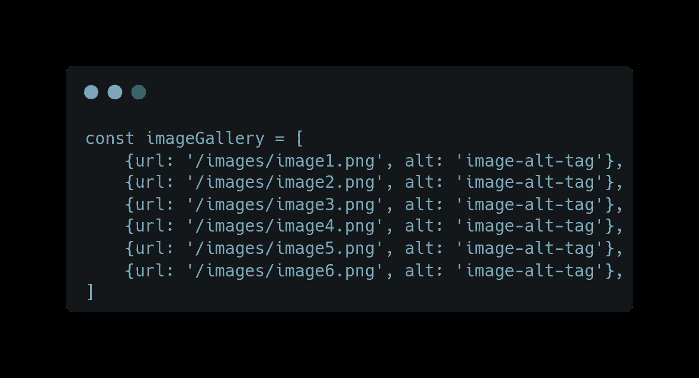
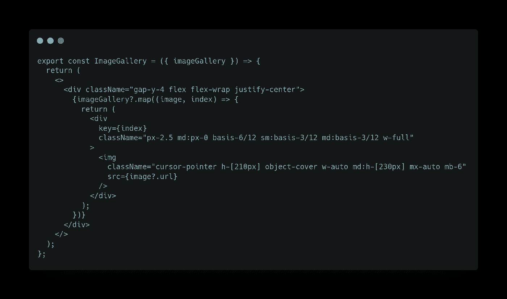
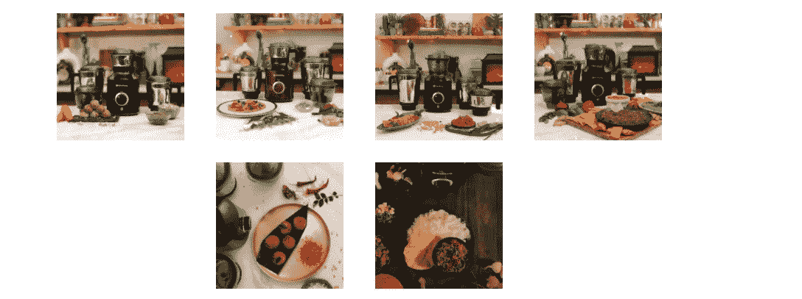
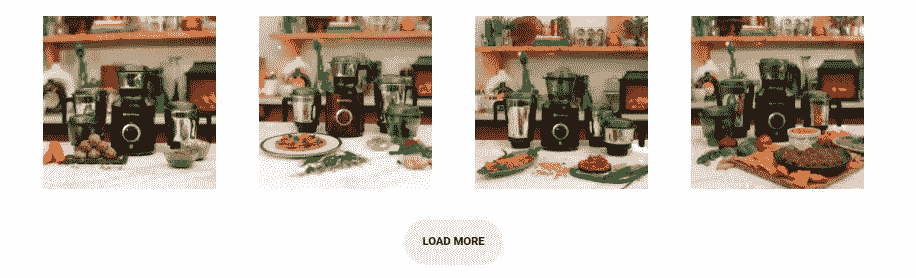

# 在 ReactJS 中加载更多功能

> 原文：<https://levelup.gitconnected.com/load-more-functionality-in-reactjs-82446862bc06>

> 如何实现加载更多功能？


照片由[迈克·范·登博斯](https://unsplash.com/@mike_van_den_bos?utm_source=medium&utm_medium=referral)在 [Unsplash](https://unsplash.com?utm_source=medium&utm_medium=referral) 上拍摄

在本文中，我们将看到一种分页形式，它涉及到使用一个 load more 按钮，当点击它时，将加载剩余的数据。
这种方法在很多情况下都很有用，比如社交媒体帖子、图片库、视频帖子等。

那么，我们开始吧。

我不会向您展示如何建立一个 react 项目和获取样本数据的初始版本。

您可以使用`CRA`来建立一个初始的基本 react 模板，然后使用`Fetch`或`Axios`从 API 获取数据。

向前看，

我们的数据看起来像这样



# 创建一个组件来显示数据

我们的 React 组件如下所示，其中我们将 imageGallery 数据(包含图像数据的对象数组)作为道具传递给组件。



当我们运行这个应用程序时，我们的组件呈现如下



现在，我们的数据只有六张图片，你可以在上面看到，但你会明白为什么我们需要加载更多的按钮，如果我们有超过 15 或 20 张图片或帖子，那么在一次加载中加载屏幕上的所有图片是不理想的，这是一个糟糕的用户体验。

现在，让我们转向我们的`load more button`逻辑:-

在展示代码之前，我将快速浏览一下我们将要做的事情。

*   创建一个名为`imagePerRow`的变量，它将保存要显示的图像的初始数量，以及用户每次单击 **load more** 按钮时要显示的额外图像的数量。
*   创建一个`load more`按钮，并给它一个名为`handleMoreImage`的`onClick`处理程序。
*   创建一个状态，存储要显示的图像的初始数量，并在单击按钮时更新状态。
*   创建每次点击 **load more** 按钮时运行的`handleMoreImage`函数。

现在是代码！

```
const imagePerRow = 4;export const ImageGallery = ({ imageGallery }) => {
  const [next, setNext] = useState(imagePerRow);const handleMoreImage = () => {
    setNext(next + imagePerRow);
  };return (
    <>
      <div className="gap-y-4 flex flex-wrap justify-center">
        {imageGallery?.slice(0, next)?.map((image, index) => {
          return (
            <div
              key={index}
              className="px-2.5 md:px-0"
            >
              
            </div>
          );
        })} {next < imageGallery?.length && (
          <Button
            className="mt-4"
            onClick={handleMoreImage}
          >
            Load more
          </Button>
        )}
      </div>
    </>
  );
};
```

让我解释一下上面的代码，

*   最初，当这个应用程序运行时，我们显示四个图像，因为我们将`imagePerRow`设置为四个。
*   只有当 imageGallery 数组长度大于我们想要显示的图像时，我们的`load more button` 才会可见。如果我们显示所有的图像，没有必要显示按钮。
*   我们附加了一个`onClick`事件句柄，当我们点击按钮时，`handleMoreImage`函数将被执行。
*   这个函数将我们的状态设置为接下来的四个图像，这意味着最初当我们显示四个图像时，当用户现在点击按钮时，它将是 4+4，即 8 个图像，等等。

这是我们的应用程序在初始渲染时的样子



带有“加载更多”按钮的初始渲染

在用户点击按钮后，它会将我们的状态设置为 4 + 4 更多的图像，因为我们在 imageGallery 数组中只有 6 张图像。它将显示总共 6 个图像，现在加载更多的按钮将消失。


点击加载更多按钮后

## 好了

只使用一个状态和一个根据用户点击更新状态的函数，很容易构建`load more functionality in react`。

没有必要为这种类型的东西下载一个 npm 包，因为它会增加你的构建的大小。我们需要在 react 中构建自定义逻辑来处理这类事情。

是的，现在就这些了…

请查看我之前的文章 [**如何在移动浏览器上查看本地主机 web 应用。**](https://blog.bitsrc.io/how-to-view-localhost-web-apps-on-mobile-browsers-2b7433df4abd?source=friends_link&sk=f09858ee0e1556fe9d1addafce884bdf)

> 请在评论区分享你的观点，欢迎反馈。
> 希望你会喜欢并分享这篇文章，以便更好地阅读。
> 查看我的其他文章:[***https://medium.com/@aayushtibra1997***](https://medium.com/@aayushtibra1997) ***感谢阅读:***