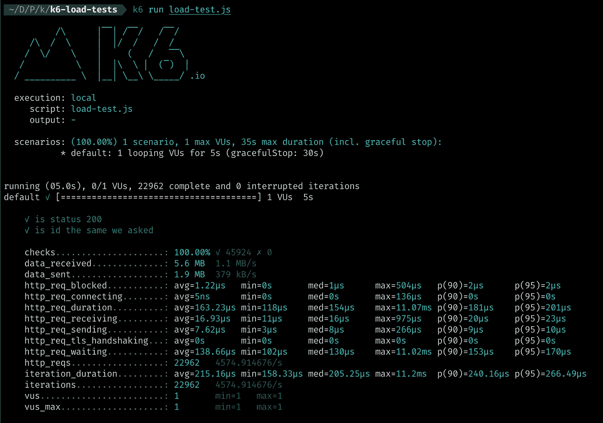

# 使用 K6 对 NodeJS 应用程序进行负载测试

> 原文：<https://levelup.gitconnected.com/load-test-your-nodejs-app-using-k6-f7b2bd8fa5cf>


使用 k6 的负载测试

# 什么是负载测试？

**负载测试**是一种软件**测试**，用来了解应用在特定预期**负载**下的行为。**执行负载测试**以确定系统在正常和峰值条件下的行为([参考](http://tryqa.com/what-is-load-testing-in-software/#:~:text=A%20load%20test%20is%20type,normal%20and%20at%20peak%20conditions.))。

如果你不熟悉这种类型的测试，你应该知道我们总是想知道我们的软件的能力和我们可以处理的在线用户的数量。负载测试的目标是给我们一个如何处理用户的估计，也许我们预计像*黑色星期五这样的特殊事件会有 10，000 个用户，但是*我们不确定我们是否可以用我们现在拥有的资源或结构来处理所有的用户。

**那么补救措施是什么？最好的补救办法是在灾难发生前对你的应用进行负载测试。**

# k6 是什么？

k6 是一个以开发人员为中心的免费开源负载测试工具，旨在让性能测试成为一种高效且愉快的体验。

使用 k6，您将能够更早地发现性能退化和问题，允许您构建弹性系统和健壮的应用程序([参考](https://k6.io/docs/))。

# 其他的选择是什么？

[**火炮**](https://artillery.io/) 是 NodeJS 应用的常用负载测试工具。还有其他一些强大的负载测试工具，你可以看看[这篇文章](https://www.softwaretestinghelp.com/performance-testing-tools-load-testing-tools/)了解更多细节。

# 为什么是 K6？

*   JavaScript ES2015/ES6 中的脚本—支持[本地和远程模块](https://k6.io/docs/using-k6/modules)
*   [检查](https://k6.io/docs/using-k6/checks)和[阈值](https://k6.io/docs/using-k6/thresholds)——用于面向目标、自动化友好的负载测试
*   在性能方面，我看了 Gitlab 的这一期以及他们为什么用 K6 代替火炮

现在，我们将创建一个简单的 express 应用程序，并使用 K6 进行测试。

# 创建一个简单的快速应用程序

一个简单的快递应用程序

这是我们可以使用 ExpressJS 创建的最简单的应用程序。我们在第 1 行实例化了一个 express 应用程序，之后，我们实现了以下格式的请求: *localhost:3000/someId*

# K6 安装

如果您使用的是 mac os，您可以使用`brew install k6`简单地安装它

如果您使用的是 Ubuntu，您可以使用以下方式安装它:

```
sudo apt-key adv --keyserver hkp://keyserver.ubuntu.com:80 --recv-keys 379CE192D401AB61
echo "deb [https://dl.bintray.com/loadimpact/deb](https://dl.bintray.com/loadimpact/deb) stable main" | sudo tee -a /etc/apt/sources.list
sudo apt-get update
sudo apt-get install k6
```

另外， *K6 docker 容器*可用，我们可以在 CI 管道中使用它。

如果您正在使用其他操作系统，请查看 [K6 安装指南](https://k6.io/docs/getting-started/installation)。

# 实现负载测试脚本

这是使用 K6 的简单负载测试的实现:

**导出一个默认函数**:这是 K6 每次想要发送请求时要调用的函数。

**发送 HTTP 请求:**对于发送请求，我们使用来自`k6/http`的`http`模块。在第 6 行中，我们向 express 应用程序中的端点发送了一个 HTTP 请求。

**执行检查:**如果你想确保收到你期望的响应，你可以使用`check`模块。第一个参数是响应，第二个参数是对象，对象的键是*检查，值是 ***检查的实现是应该返回布尔值*** 的函数。
我们实现的第一项检查是使用`response.status`检查响应状态。
在第二次检查中，我们检查了响应体中的`id`。通过使用`json`方法，我们可以访问响应体。使用`json`方法的格式是这样的:`response.json('fieldSelector')`。这里我们使用了`id`字段，因为它是一个字符串，所以我们将这个字符串转换成一个数字，以便与我们期望的值进行比较。*

## *选项:*

*我们可以在命令行中传递选项，也可以在脚本中导出选项。我们的选项包含`vus`，这意味着虚拟用户的**数量**我们可以作为不同的用户发送请求，或者我们可以像这样发送请求，只有一个人发送这些请求。`duration`是本次负载测试的持续时间。此外，我们还有另一个名为`thresholds`的有用选项，它对于在 CI 中使用 K6 非常实用。如果结果不符合阈值，则失败。有关阈值的更多信息，请查看 k6 文档的这一部分。*

## *运行负载测试*

*为了运行负载测试，我们可以使用以下命令:*

```
*k6 run load-test.js*
```

*这是我的本地机器上的结果:*

**

*K6 测试结果*

*正如您在结果中看到的，Express 应用程序每秒处理了 *22962* 个请求和大约 *4574* 个请求。*

# *结论*

*使用 K6 真的很容易，因为我们可以使用 Javascript 实现测试，而且 K6 对开发人员来说是友好的。*