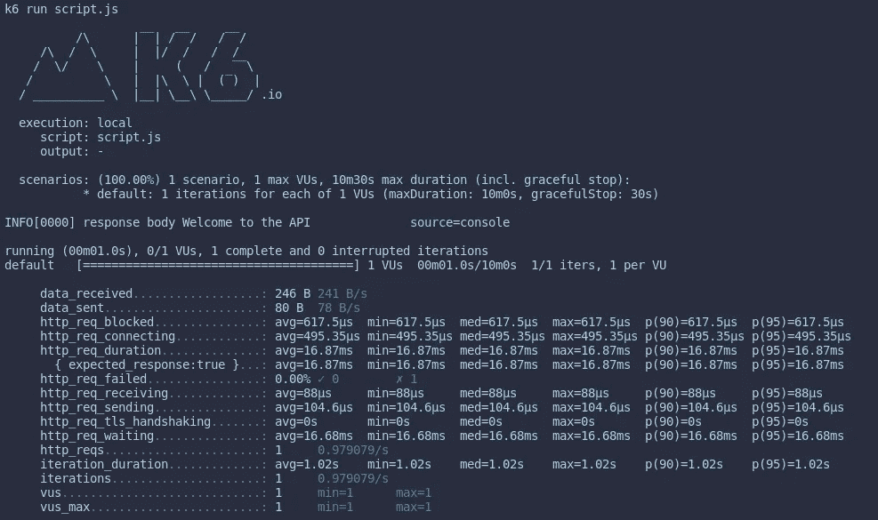
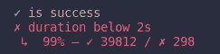

# 使用 k6 进行负载测试

> 原文：<https://levelup.gitconnected.com/load-testing-with-k6-48488c7946bb>

## 仅使用一种工具的一系列负载测试功能


托德·夸肯布什在 [Unsplash](https://unsplash.com?utm_source=medium&utm_medium=referral) 拍摄的照片

测试事物充满魅力。尤其是当我们在测试自己的作品时。至少，在我们编写了一些东西之后，我们首先用一些常见的案例手动测试它。如果它运行良好，那么我们提交代码。

但有一段时间，我们必须确保我们创造了可靠的产品。假设它在特定条件下工作良好，比如我们手动测试的方式。然而，我们如何确保我们的代码在任何其他条件下都表现得一样，比如当它受到大量请求的轰炸时？一定有更好的方法来测试它，而不需要请你的朋友帮助你手动地(并并行地)向你的应用程序发出请求。幸运的是，有。我们将学习如何在几种情况下使用 k6 对我们的应用程序进行负载测试。

# 装置

根据您的操作系统或系统环境，有几种方法可以安装 k6。但在本文中，我只会触及其中的两个，Linux/Ubuntu 和 Docker。

直接引自 k6 文档。您可以通过在终端上运行以下命令在 Linux Ubuntu 上安装 k6:

```
sudo apt-key adv --keyserver hkp://keyserver.ubuntu.com:80 --recv-keys C5AD17C747E3415A3642D57D77C6C491D6AC1D69echo "deb https://dl.k6.io/deb stable main" | sudo tee /etc/apt/sources.list.d/k6.listsudo apt-get updatesudo apt-get install k6
```

有了 Docker，事情变得简单了一些。您可以使用以下命令安装它:

```
docker pull loadimpact/k6
```

因为使用 Docker 使我们的生活变得更加容易。我将在本文中频繁使用 Docker。但是本质还是一样的。你可以在这里找到完整的解释[https://k6.io/docs/getting-started/installation/](https://k6.io/docs/getting-started/installation/)。

# 基础知识

出于本文的目的，我将对我的一个实践项目进行负载测试。但是我还会解释 API 的细节，所以您仍然可以继续学习。

如果您想完全理解本文，您可以在这里找到将要测试的应用程序。该应用程序本身是一个简单的财务管理器，您可以在其中注册、登录、创建收入或支出类别，并记下您的收入或支出。您将在自述文件中获得有关如何设置服务器的详细信息。

让我们开始测试基本 URL。假设基本 URL 是`http://localhost:3000`，并返回一条消息‘欢迎使用 API’。测试脚本应该是:

首先，我们在顶层导入依赖项。注意，在后台，k6 不在 NodeJS 中运行，因为通常 JavaScript 不太适合高性能。它是用 Go 编写的，以实现期望的高性能测试。

测试本身在导出的默认函数中运行。这部分代码就是我们通常所说的 VU 码。因此，测试运行一次，默认情况下只使用一个虚拟用户(把它想象成一个真实的用户，但是是模拟的)，但是您可以使用`options`来改变它。我们稍后将讨论 VU 码和期权。

如果你在使用 Docker 时遇到一些问题，比如连接被拒绝。你需要把`localhost`改成主机的 IP 地址。你可以用`docker inspect <container_id_or_name>`来检查。通常，地址主机是服务名被引用时的真实地址。或者如果你使用的是 Linux 系统，你可以使用`hostname -I`。你会得到类似`192.xxx.xxx.xx`的东西。然后用该 IP 地址替换`localhost`。

您可以通过运行以下命令来运行此测试:

```
// CLI
k6 run script.js// Docker
docker run -i loadimpact/k6 run - <script.js
```

你会马上在终端上看到测试结果。类似于这个的东西。



作者形象

如果我们没有为这个测试提供选项，那么它只运行一次，并且只使用一个虚拟用户。底部一堆数字是内置的度量，比如`data_received`、`http_req_duration`、`http_req_failed`、`vus`等。例如，`http_req_failed`是根据 [setResponseCallback](https://k6.io/docs/javascript-api/k6-http/setresponsecallback-callback) 的失败请求率。默认情况下，状态代码在 200 到 399 之间的请求被认为是“预期的”。稍后我们将看到如何定制度量标准。

# 生命周期

测试有四个阶段。第一个是`init`，然后是`setup`、`VU`和`teardown`。

一般来说，模式是这样的

每个虚拟用户运行一次`init`代码。你可以认为虚拟用户就像真实用户一样。但是它是模拟的，所有的人都做同样的事情，他们的行为在默认函数(VU 代码)中定义。您可以在这里导入模块，以便稍后在`setup`、`VU`或`teardown`中使用。

`setup`和`teardown`与任何其他测试工具都非常相似。如果你想在测试运行前后做些什么，你将需要它们。`setup`在`init`之后`VU`之前被调用，`teardown`在最后一次`VU`迭代之后被调用。

然后我们有 VU 电码。我们在这里定义了虚拟用户的行为；调用 API，检查我们得到的响应是否正确，将结果保存在指标中，等等。基本上，这个部分是真正的测试发生的地方。它为每个虚拟用户循环运行一个定义的持续时间或阶段(您可以在选项中设置)

# 真正的测试

在这一节中，我们将讨论真实测试实现中的选项、度量、阈值和生命周期。

从设置功能开始。

在这个设置函数中，我们注册我们的虚拟用户，然后登录以获取访问令牌。因为我们以后要测试的所有 API 都是用认证中间件保护的。

在创建任何收入或支出历史之前，我们需要创建它的类别，例如，购物、投资、税收等。

在我们获得令牌(包括用于演示的 id 和电子邮件)和新创建的收入/支出类型之后，我们可以返回这些值。因此稍后可以使用它来访问要测试的 API。

注意，我们必须将有效负载字符串化，并提供 params 内容类型 JSON，否则默认情况下，将发送的数据将是表单数据格式。

接下来是拆机功能。

拆卸功能相对简单。我们在这里做的是截断注入的表，这样它可以在下一次测试中使用。但要清空数据库，我们需要一个访问令牌。幸运的是，我们在数据对象中有它。

现在是测试核心 API 的时候了。

好吧，我们有新发现了。就像我说的，我们会触及选项和指标。注意，我省略了 setup 和 teardown 函数，它们仍然在实际的测试脚本文件中。

首先，我们有选择:

*   `vus`:模拟虚拟用户的最大数量
*   `duration`:测试持续时间
*   `thresholds`:测试标准

如果测试的结果仍然在我们定义的阈值范围内，我们就说测试通过了。从上面的例子来看，所有 HTTP 请求的持续时间必须少于 2 秒 75%。否则，测试将被中止。

显然，您可以使用更多选项。你可以在这里得到完整的列表[。](https://k6.io/docs/using-k6/options/)

接下来是`check`功能。通过查看第 46 到 49 行，你能猜出它是干什么的吗？是的，是关于检查一些需求。如果返回的响应不成功，并且 HTTP 调用持续时间超过 2 秒，则检查将失败。您将得到的结果与此类似。



作者形象

看到 298 次检查失败，这意味着 HTTP 请求持续时间超过 2 秒。

你可能知道，测试完成后，我们得到结果。如`http_req_duration`、`http_req_failed`、`http_req_waiting`等。这些是内置的指标，但是您也可以使用`Trend`和`Rate`来制定自己的指标(还有`Gauge`和`Counter`)。

在第 6 行和第 7 行，我们实例化了指标并给它们命名。然后在第 52 和 56 行，我们将 HTTP 请求持续时间的结果添加到 Rate 和 Trend 中。但是等等！什么是速率和趋势？

比率是非零附加值的百分比。想象一下当你添加一个数字 0 或 1。如果你在一个循环中重复添加这个随机数，那么你将结果除以循环次数。然后你就得到了利率。

同时，趋势就像测试的统计数据。它给你平均值、最小值、最大值和百分位数。

# 负载测试变化

在本节中，我们将讨论负载测试的一些变体，它们是负载测试、冒烟测试、压力测试、峰值测试和浸泡测试。

## 负载测试

到目前为止，我们所做的是负载测试。因为我们想评估我们系统的性能。通常，我们需要负载测试来确定我们的系统在正常和高峰流量两种情况下的行为。此外，不断地执行负载测试以确保我们的系统的性能仍然在期望值之内是很常见的。

一般来说，你只需要改变`options`来做负载测试变化。例如，`options`你需要的是这样的东西:

到现在为止我们还没有谈到`stages`。`stages`如预期流量。例如，5 分钟内只有 100 个用户。然后接下来的 10 分钟，它停留在 100 个用户。最后，它下降到 0 个用户来模拟恢复。

## 烟雾测试

当编写测试脚本时，会有一些健全性检查。测试脚本已经正确了吗？它在做我们想要它做的事情吗？

显然，当您编写测试脚本时，您不希望将测试持续时间设置为一个小时。等待一个小时来查看我们是否编写了正确的测试脚本，这显然是浪费时间。

这就是为什么烟雾测试通常会是这样的

您应该尽量减少用户数量和持续时间。

## 压力测试

假设您在一家电子商务公司工作，您想知道您的系统在高销售流量下的表现。你需要做的是对你的系统进行压力测试。

[压力测试是一种用于确定系统极限的负载测试。该测试的目的是验证系统在极端条件下的稳定性和可靠性。](https://k6.io/docs/test-types/stress-testing/)

当你进行压力测试时，你会超出你的典型流量。因此，在生产环境中进行压力测试肯定是有风险的。在您的本地机器或登台环境中测试它是没问题的。

## 尖峰测试

峰值测试类似于压力测试，我们希望在极端条件下测试我们的系统。不同之处在于，压力测试要经历更长的阶段才能达到目标，而峰值测试则一直进行到极端条件。模拟交通的突然激增。

## 浸泡测试

浸泡测试是在很长一段时间内评估系统的可靠性。浸泡测试揭示了系统长期处于压力下所产生的性能和可靠性问题。

可靠性问题通常与错误、内存泄漏、存储配额不足、配置不正确或基础设施故障有关。性能问题通常与不正确的数据库调优、内存泄漏、资源泄漏或大量数据有关。

# 结论

k6 有比我们在本文中讨论的更多的东西。您可以使用很多选项，如果您需要高级用户行为的场景，将测试结果保存在 CSV 或 JSON 文件中，拥有用于演示的仪表板，等等。

我认为 k6 文档易于浏览和理解。所有的事情都为我们写得清清楚楚。所以，不要犹豫，直接阅读官方文档。

最后，当我谈到性能时，我总是谈到这一点。在代码完全运行之前，我们不应该进行性能调整。首先确保代码是干净的和可维护的，然后是我们调整和寻找更好的解决方案来提高性能的时候了。否则，正如 Donald Knuth 所说，我们将陷入过早优化。

您可以在这里获得完整的测试脚本:[https://github . com/agusrichard/JavaScript-workbook/tree/master/K6-article-material](https://github.com/agusrichard/javascript-workbook/tree/master/k6-article-material)

感谢您的阅读和愉快的测试！

## 了解有关负载测试的更多信息

[](https://medium.com/nerd-for-tech/load-testing-using-locust-io-f3e6e247c74e) [## 使用 Locust.io 进行负载测试

### 在我们的应用程序或服务运行后，有一段时间我们想知道性能和负载…

medium.com](https://medium.com/nerd-for-tech/load-testing-using-locust-io-f3e6e247c74e) 

# 资源

[](https://k6.io/docs/) [## k6 文档

### Quickstart k6 是一款以开发人员为中心的免费开源负载测试工具，旨在使性能测试变得更加容易

k6.io](https://k6.io/docs/)