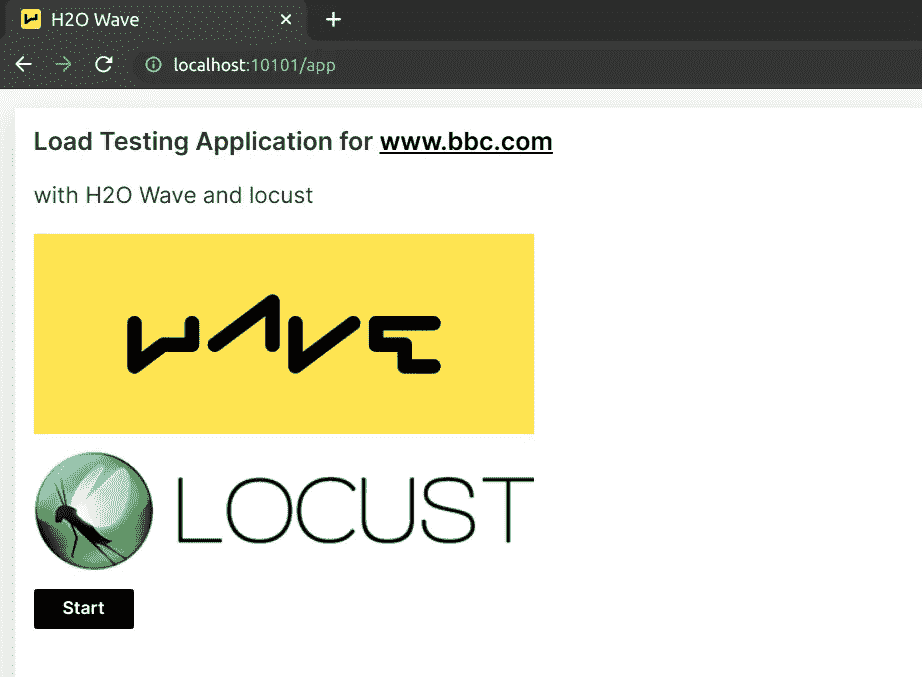
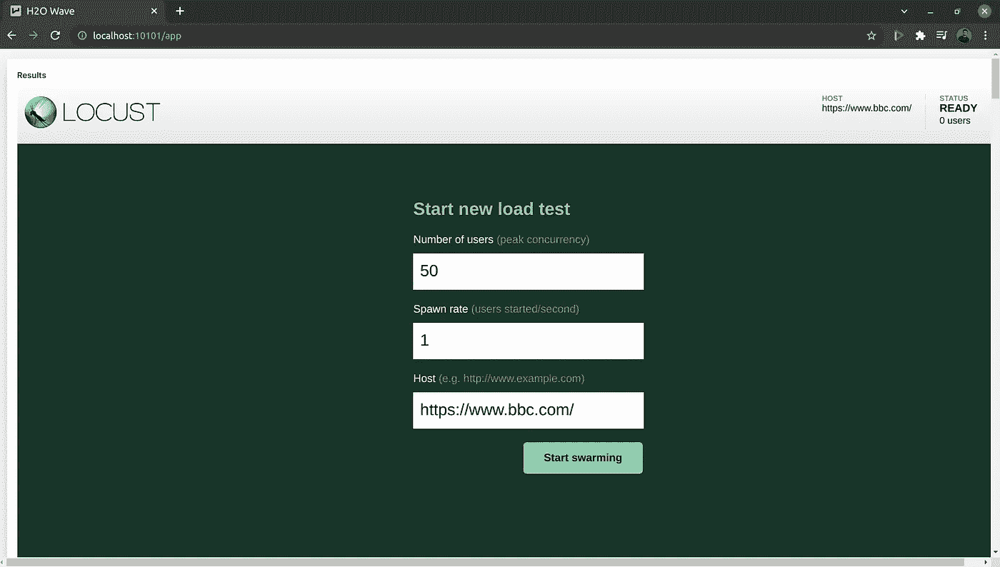
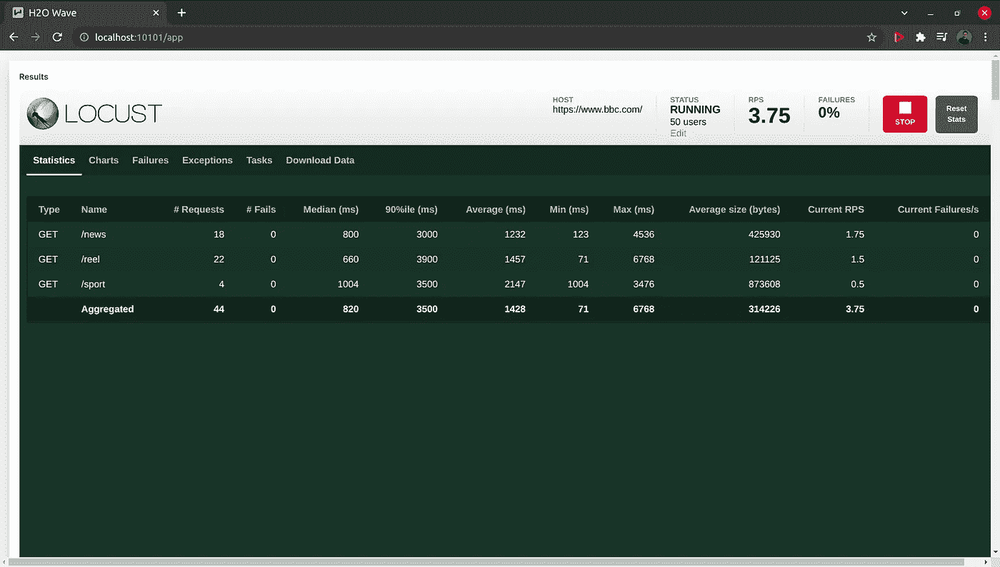
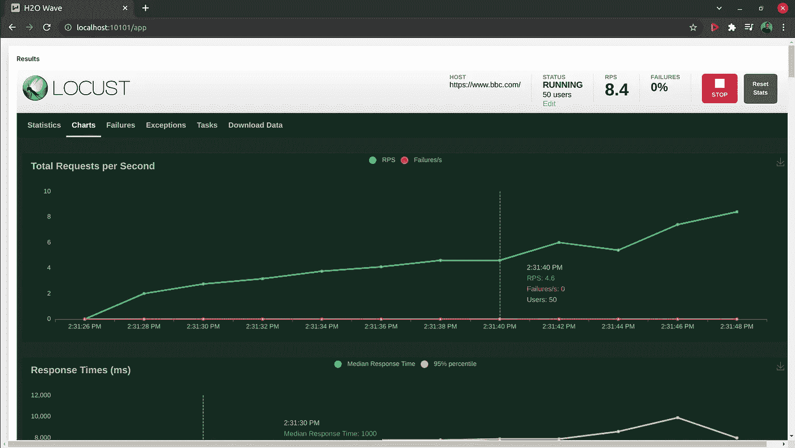
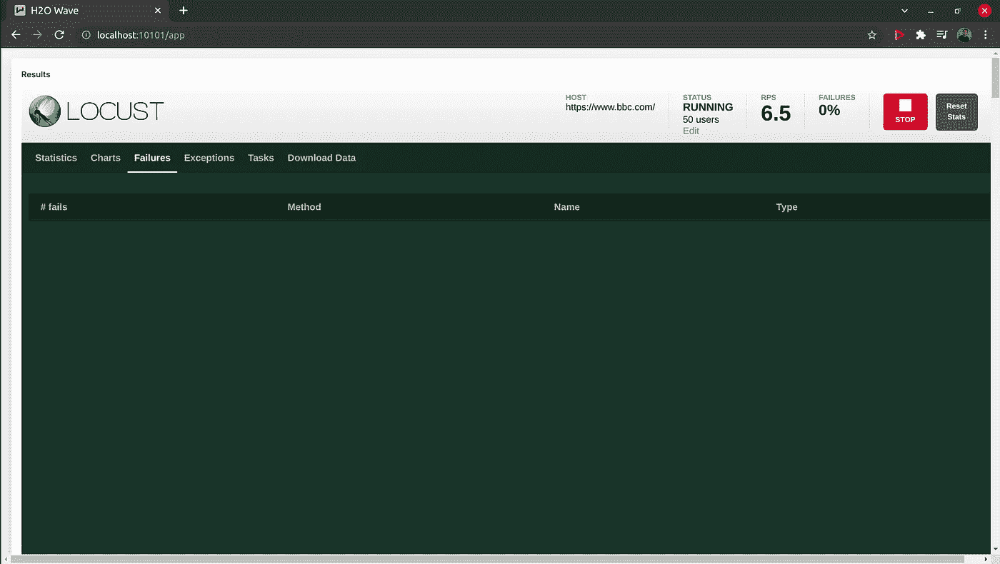
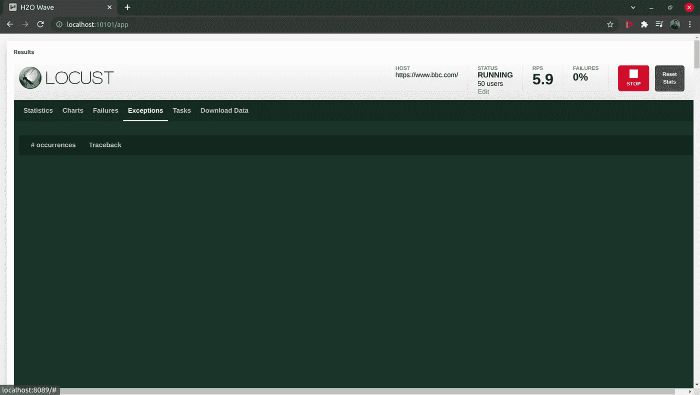
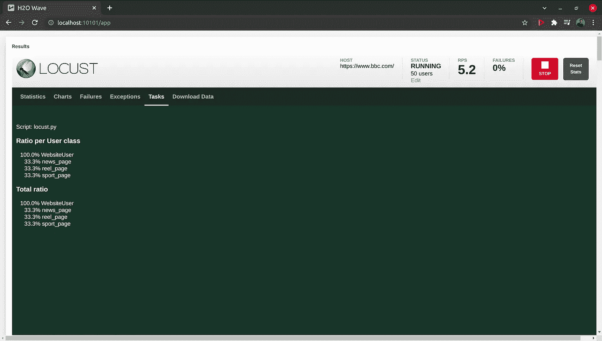
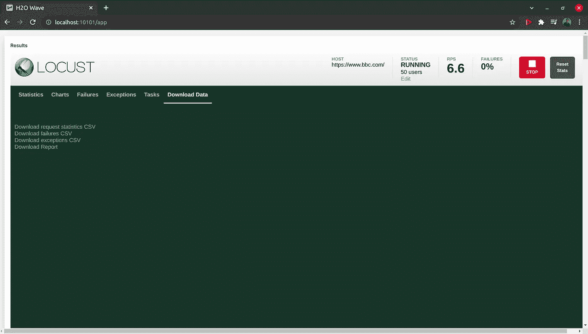

# 使用 Locust.io 进行负载测试

> 原文：<https://levelup.gitconnected.com/load-testing-with-locust-io-f57aa6bf6bb8>

## H2O 波应用中 Loucust.io 负载测试指南


图片鸣谢:[https://atmc . in/WP-content/uploads/2017/04/performance-management-in-the-digital-age . png](https://atmc.in/wp-content/uploads/2017/04/performance-management-in-the-digital-age.png)

最近我接到一个小任务，要构建一个 Wave 应用程序来测试 API 端点的负载。在做了一些研究之后，我找到了一个开源的工具来轻松地测试负载。我认为以文档化的方式保存我的发现和我的 Wave 应用程序的实现，对我和刚刚开始使用 Locust.io 的人来说是有益的。


H2O 波是一个软件栈，用于完全用 Python 构建漂亮的、低延迟的、实时的、基于浏览器的应用程序和仪表板，而不使用 HTML、Javascript 或 CSS


Locust 是一个开源、易用、可脚本化和可扩展的性能测试工具。

这是一个简单的应用程序，使用 H2O wave 框架和 Locust 测试 https://www.bbc.com[的负载。3 个端点已用于演示。](https://www.bbc.com/)

# 快速入门

## 先决条件:

1.  你需要在你的 Linux、macOS 和 Windows 上安装 Python 3.6+,才能安装 H2O wave。
2.  需要安装 git。

## 步骤:

H2O 安装 wave 并启动 wave 服务器

1.  使用 https://github.com/h2oai/wave/releases/tag/v0.19.0[下载并解压适用于您平台的 H2O Wave SDK](https://github.com/h2oai/wave/releases/tag/v0.19.0)
2.  将其移动到方便的位置。($HOME/wave/)
3.  进入你的 Wave 目录，打开一个新的终端。启动 wave 服务器，

```
./waved
```

# 设置应用程序

打开一个新的终端，为 wave 应用程序创建一个目录。($HOME/wave-apps/)

```
mkdir $HOME/wave-apps
cd $HOME/wave-apps
```

克隆存储库并进入文件夹。

```
git clone https://github.com/bhanukad610/load-testing-app
cd load-testing-app
```

设置虚拟环境

```
python3 -m venv venv
source venv/bin/activate
```

安装依赖项

```
pip install -r dependencies/requirements.txt
```

启动负载测试波形应用程序

```
wave run src/test_app.py
```

在同一个目录下打开一个新的终端，启动 locust 服务器。

```
./startLocust.sh
```

转到[http://localhost:10101/app](http://localhost:10101/app)访问应用程序。

# 应用程序用户手册

该应用程序的主页如下。您可以按“开始”按钮继续进行负载测试。



## 然后你会看到下面的页面要求输入。

1.  用户数量:您需要模拟的用户数量
2.  生成速率:在创建指定数量的并发用户之前，开始创建用户的速度
3.  主机:负载测试的主机(将为您填写为'[https://www.bbc.com](https://www.bbc.com/)')



然后你继续蝗虫仪表板。它有以下选项卡。

## 统计数字

这显示了服务器如何响应 Locust 发送的请求的实时统计数据。为此，在 src/locust.py 中使用并定义了 3 个端点。



## 图表

这显示了有关每秒总请求数、响应时间和用户数的图表。



## 失败

如果任何请求由于连接错误、超时、未找到页面、错误请求或类似原因而失败，它将显示在此选项卡中。



## 例外

如果代码生成异常，它会在执行过程中记录在“异常”选项卡中。



## 任务

显示 locust 文件中定义的任务。



## 下载数据

完成测试后，我们可以下载统计数据、故障数据和异常数据，以 CSV 文件和报告的形式显示在 web 界面上。



您可以从，

[](https://github.com/bhanukad610/load-testing-app) [## GitHub-bhanukad 610/load-testing-app:一个简单的应用程序，使用 H2O ai 测试给定 API 的负载

### 一个简单的应用程序来测试 https://www.bbc.com 与 H2O 波框架和蝗虫的负载。H2O 波是一个软件栈…

github.com](https://github.com/bhanukad610/load-testing-app) 

我希望您了解如何使用 Locust.io 测试 API 负载。感谢您的阅读！

## 参考

[](https://wave.h2o.ai/) [## 制作人工智能应用程序| H2O 浪潮

### Python 的实时 Web 应用和仪表盘

wave.h2o.ai](https://wave.h2o.ai/) [](https://locust.io/) [## locust——现代负载测试框架

### 编辑描述

locust.io](https://locust.io/)