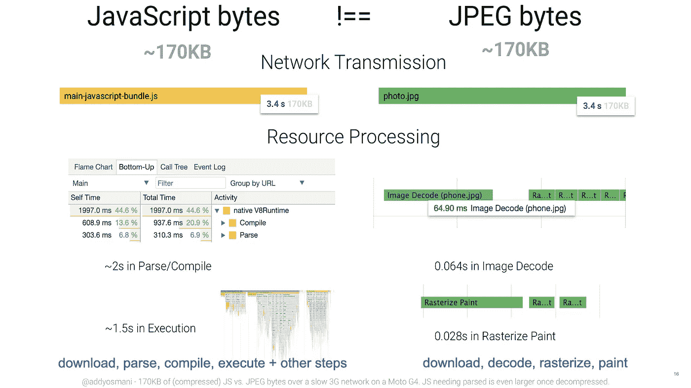

# 加载时间:关于这个性能指标，您应该知道什么

> 原文：<https://levelup.gitconnected.com/load-time-performance-metrics-5a105b190665>

## [网页性能](https://rakiabensassi.medium.com/list/software-engineering-7a179a23ebfd)

## 速度不仅仅是一个特征。速度是最重要的特征。—弗雷德·威尔逊

由[克里斯·利维拉尼](https://unsplash.com/@chrisliverani?utm_source=medium&utm_medium=referral)在 [Unsplash](https://unsplash.com?utm_source=medium&utm_medium=referral) 上拍摄

2012 年， [*《纽约时报》*](http://www.nytimes.com/2012/03/01/technology/impatient-web-users-flee-slow-loading-sites.html?pagewanted=all&_r=0) 称，如果一个网站只比竞争对手慢 250 毫秒，人们就会减少访问该网站的频率。这意味着如果用户在网站加载前眨眼，那么等待时间太长，不值得访问。

随着 Web 和用户体验的发展，web 性能成为一个更重要的衡量成功的标准，所以理解如何衡量它是很重要的。在本帖中，我们将回顾这个性能指标，看看它对您的应用程序意味着什么。我们将有一个案例研究，这是 CNN 网站，在那里我们将监测和分析这一点和其他两个指标:速度指数和内容大小。

# 什么是加载时间？

加载时间表示加载一个页面所需的时间。这是网络上最常见的[性能](https://betterprogramming.pub/angular-onpush-change-detection-f629cbce0bfa)指标。

虽然延迟本身并不一定是一件坏事——因为用户可以在内容加载时查看内容——但是如果太多内容花费的时间太长，用户就会离开你的网站。你的加载时间是谷歌用来判断你的网站是否快速可靠的标准之一。

# 装载过程中的 3 个关键时刻

装载之旅有三个关键时刻:发生了吗？有用吗？有用吗？

1.  **发生了吗**:服务器开始响应了吗？你能在屏幕上看到一些内容吗？
2.  **有用吗**:是否有一些文字或内容可以让用户从体验中获得价值并参与其中？
3.  **是否可用**:用户是否可以开始与页面进行有意义的交互？

一个糟糕的加载体验会让用户认为他们可以完成一个目标，而事实上，页面还没有加载完所有必要的资源。

网页的加载之旅([图片来源](https://medium.com/@addyosmani/the-cost-of-javascript-in-2018-7d8950fbb5d4))

# 响应时间与页面加载时间

性能监控和优化的一个关键区别在于*页面加载时间*和*响应时间*。这两个术语都有广泛的含义，但区别在于:

*   响应时间是指用户的查询从服务器收到响应需要多长时间。
*   页面加载时间是指下载并显示*整个网页*所需的时间。这包括所有页面元素:HTML、脚本、样式表、图像和第三方资源。

这种区分是必要的，因为如果一个网页的一些元素无法加载，但并没有明显降低用户体验，那么这些元素并不重要。只要站点中最重要和最有用的元素显示速度足够快，能够满足最终用户的需求，那么总的页面加载时间可能就无关紧要了。

# 我没有任何媒体文件，为什么我要关心我的加载时间？

一些[开发者](/a-day-in-the-life-of-a-software-engineer-cb817cf13d0)认为像图像这样的媒体文件是导致加载时间问题的主要原因。但不幸的是，这种假设是错误的。JavaScript 确实是我们发送给浏览器的一种昂贵的资源，因为它会在很大程度上延迟交互性。

> 需要记住的一点是，所有的字节并不相等。

200KB 脚本和 200KB 图像可能需要相同的下载时间，但处理时间不同。它们的成本非常不同:

*   对于 JPEG 图像，浏览器需要下载图像，将其栅格化，并将其绘制在屏幕上。在这个过程中，图像通常不会阻塞主线程或阻止界面交互。
*   有了 [JavaScript](https://betterprogramming.pub/javascript-history-and-future-71b0ceb737aa) 包，浏览器需要下载、解析、[编译](https://betterprogramming.pub/compiler-vs-interpreter-d0a12ca1c1b6)、执行，并完成引擎需要完成的许多其他步骤。

浏览器处理 JS 脚本的方式和处理 JPEG 图像的方式。(来源:[JavaScript 的成本](https://medium.com/dev-channel/the-cost-of-javascript-84009f51e99e))

## 这是什么意思？

[http archive](https://httparchive.org/) 称，2021 年移动设备上的 *JavaScript 字节*的平均大小为 **437.2KB** ，网站变得可交互的平均大小为 **16.8s** 。

从 [http 档案](https://httparchive.org/)生成的 2021 年 JavaScript 状态和加载速度报告

JavaScript 字节，根据 *http 存档*，是:

> 该页请求的所有外部脚本的传输大小(千字节)的总和。外部脚本被识别为具有`*js*`或`*json*`文件扩展名或者包含`*script*`或`*json*`的 MIME 类型的资源。

# CNN 案例研究

我在 2021 年 7 月 12 日使用 [WebPageTest](https://www.webpagetest.org/) 对[CNN 网站](https://edition.cnn.com)进行了一次性能测试。作为测试的参数，我输入 Chrome 作为浏览器，输入德国法兰克福作为地点。

WebPageTest 是一项服务，它使用连接到云[中真实服务器的真实用户浏览器来测量你的网站的性能。你可以在任何时间、任何地点、任何设备上使用它。这个工具的一个最具信息性的特性是，它提供了一个瀑布式的分解，按照大小对你的站点加载的各种资源进行排序。它还计算你的加载时间和速度指数。](https://betterprogramming.pub/serverless-bcc0d2b65b41)

以下是网站第一次浏览的结果:

## **主线程处理**

下图显示了浏览器主线程繁忙的地方。不包括空闲时间(等待资源)。正如您所注意到的，浏览器 70%以上的处理工作都被脚本消耗了:

**主线程处理故障——针对 CNN**

## **按 MIME 类型分类的内容**

这里我们看到:

*   大约 40%的资源是 JavaScript 文件，它们占所有内容大小的 75%以上。
*   HTML 文件代表 6%的资源和 6%的完整大小。
*   大约 13%的资源是[图像](https://rakiabensassi.medium.com/animated-gif-captivate-audience-b02318ec22c)，它们代表了大约 4%的完整大小。

**按 MIME 类型分类的内容——CNN**

## 速度指数

速度指数，即显示网页可见部分的平均时间，在我们的测试网站中超过 5 秒:

性能结果(速度指数)**—CNN**

# 最终想法

即使是持续几分之一秒的几乎不明显的延迟也会导致主要在线购物网站的跳出率增加和销售额下降。

监控和分析你的加载时间可以帮助你发现像[内存泄漏](https://betterprogramming.pub/build-me-an-angular-app-with-memory-leaks-please-36302184e658)这样的事情。你可以在你的[网络应用生命周期](https://betterprogramming.pub/frontend-architecture-376e6323ef9b)的许多阶段执行这个测试，但是你至少需要在开发的后期和预部署阶段(在启动你的应用之前)检查它。

请随意使用我们在这里讨论的方法或另一种方法来查看您自己的指标。如果你有问题或意见，请在下面留下。

🧠💡我为一群聪明、好奇的人写关于工程、技术和领导力的文章。 [**加入我的免费电子邮件简讯，独家获取**](https://rakiabensassi.substack.com/) 或在此注册 Medium。

## 参考

[JavaScript 的成本](https://medium.com/dev-channel/the-cost-of-javascript-84009f51e99e)

[2019 年 JavaScript 的成本](https://v8.dev/blog/cost-of-javascript-2019)

 [## 作为网络开发人员，你的老板希望你知道的 11 个流行词汇

### 获得关于工具箱中术语的更多见解

better 编程. pub](https://betterprogramming.pub/programming-buzzwords-9e94a3544eed)  [## 用动态表格构建一个自定义的自动完成搜索角应用程序

### 玩 CSS 覆盖和有角度的材料组件

better 编程. pub](https://betterprogramming.pub/angular-custom-autocomplete-7ffb479477e7)