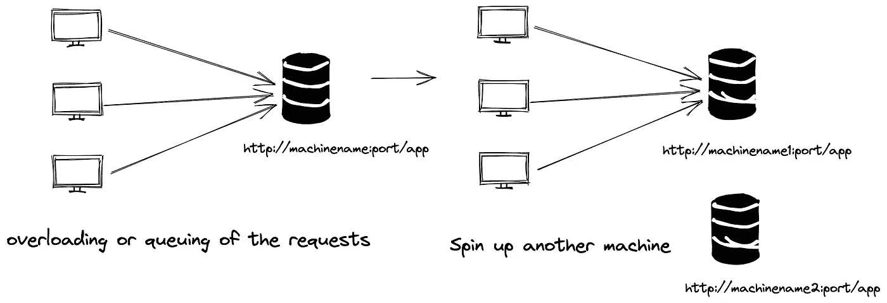
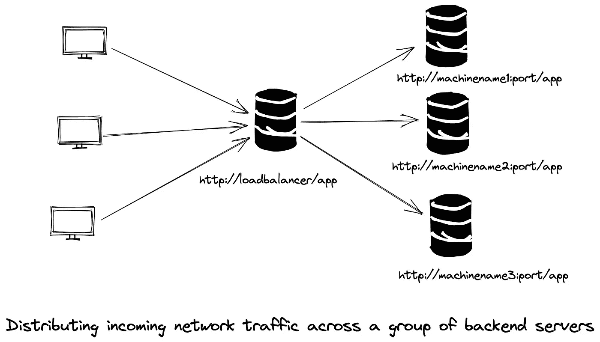
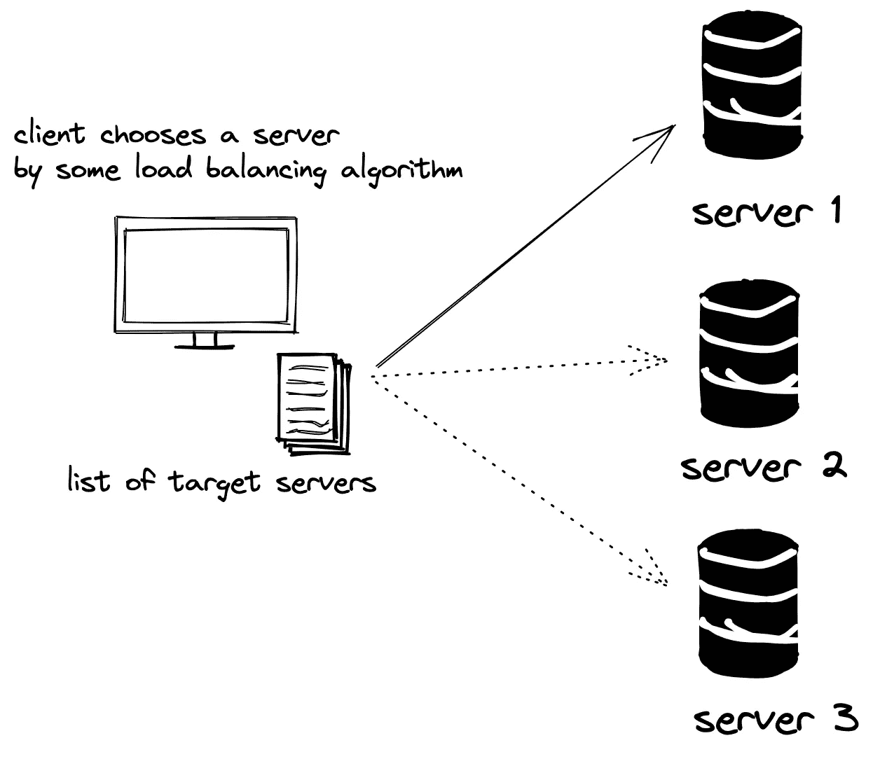
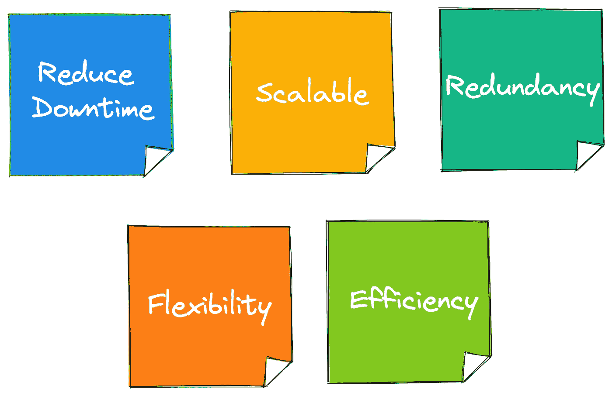

# 负载平衡

> 原文：<https://levelup.gitconnected.com/loadbalancing-a0e805baea37>

我们每天都会遇到负载平衡器。即使当您正在阅读这篇中型文章时，您的请求也会在这些内容到达您的浏览器之前流经多个负载平衡器。

> 负载平衡是我们每天都会遇到的最重要和最基本的概念之一。它是在后端跨多个服务器/进程/机器分发传入请求的过程。

为什么我们需要负载平衡？
通常，当我们开发一个应用程序时，客户会将他们的请求路由到一个后端服务器，但是一旦流量增加，那个服务器就会达到极限。为了克服这一点，我们可以启动另一台服务器来分担流量。但是我们如何让客户知道连接到新机器呢？

负载平衡是用于该路由的发现和决策的技术。有两种方法可以实现这一点——服务器端负载平衡或客户端负载平衡。

单个应用服务器因请求而过载

# 服务器端负载平衡:

有一个中间层，一个负载平衡器，它将传入的请求转发到不同的服务器，以消除这种复杂性。所有后端服务器都向负载平衡器注册，然后负载平衡器使用各种算法路由到其中一个服务器实例。AWS ELB、Nginx、Envoy 都是服务器端负载平衡器的例子。

服务器端负载平衡

## 优势

*   无需客户端更改。
*   易于对负载平衡算法和后端服务器进行更改。

# 客户端负载平衡:

在客户端负载平衡中，客户端处理负载平衡。让我们抽象地看一下这是如何实现的。要在客户端执行负载平衡-

*   客户端应该知道所有可用的 web 服务器
*   客户端的一个库，用于实现负载平衡算法

客户端使用客户端负载平衡库(如 [Ribbon](https://github.com/Netflix/ribbon) )将请求路由到其中一个服务器。客户端负载平衡也用于服务发现。

假设服务 A(客户端)想要访问服务 B(服务器端)。服务 B 有三个实例，并且都在发现服务器(X)上注册。服务 A 启用了功能区客户端，它允许进行客户端负载平衡。它从发现服务器获取可用的服务 B 实例，重定向来自客户端的流量，并持续监听任何变化。

在这里，我使用领事服务发现实现了客户端负载平衡:[https://github.com/Nancy-Chauhan/consul-service-discovery](https://github.com/Nancy-Chauhan/consul-service-discovery)

## 优势

*   不需要额外的基础设施。

# 负载平衡的优势

参考:[https://www.nginx.com/resources/glossary/load-balancing/](https://www.nginx.com/resources/glossary/load-balancing/)

负载平衡器是现代云原生应用的基础。负载平衡的概念和动态配置的能力创造了服务网格等创新。