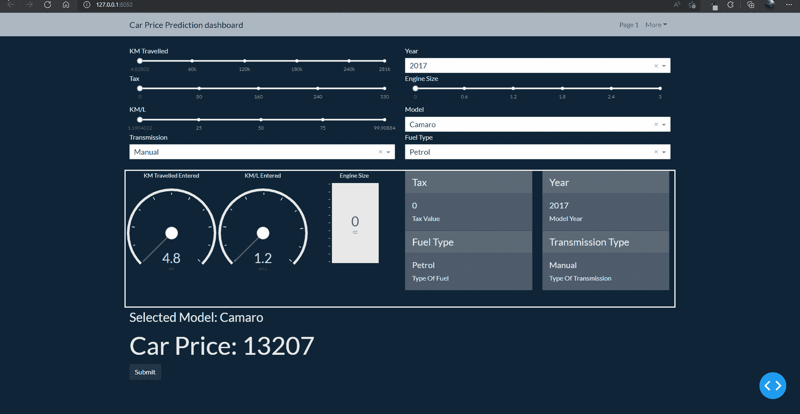
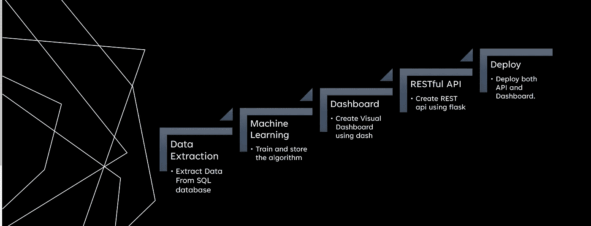
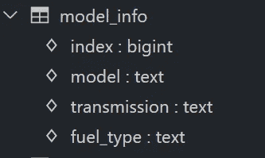
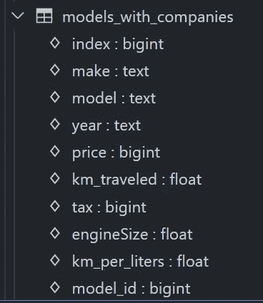
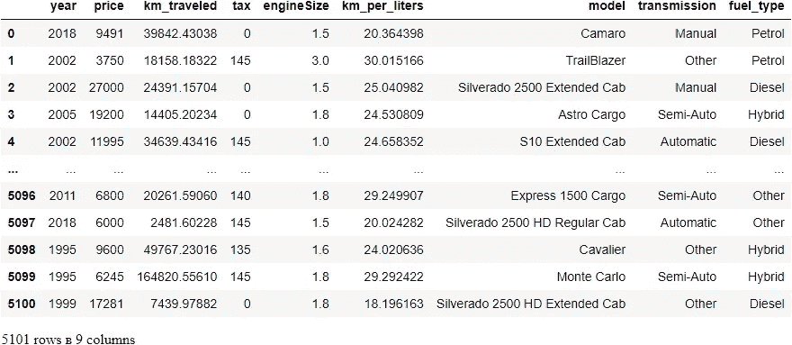
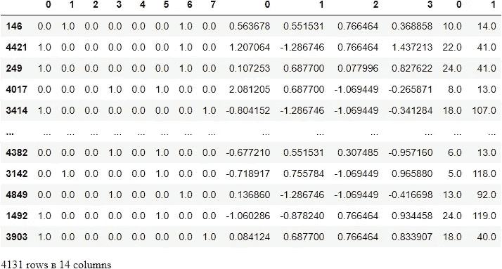
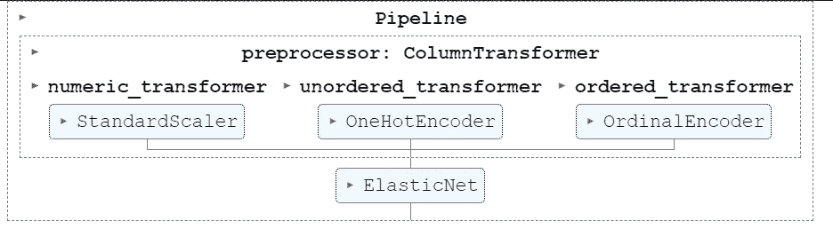
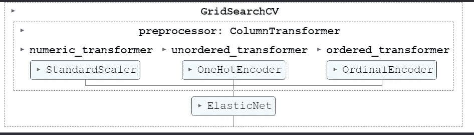

# 端到端机器学习提取到部署。

> 原文：<https://levelup.gitconnected.com/loading-and-extraction-83fedad258f0>

## 我将演示一个端到端的机器学习项目，从从 SQL 数据库提取数据开始，到部署为 web 应用程序或 Web 仪表板结束


维克多·黑塞在 [Unsplash](https://unsplash.com?utm_source=medium&utm_medium=referral) 上拍摄的照片

应用程序最终会是什么样子



本文的代码位于:

[kshiragarsiddharth/machine _ learning _ model _ for _ car _ prediction(github.com)](https://github.com/kshirsagarsiddharth/machine_learning_model_for_car_prediction/tree/master)



项目流程

## 问题陈述

1.  我们是一家名为二手车的公司的一部分，我们出售二手车。
2.  在最近的一次公司调查中，发现销售者对属于“雪佛兰”的汽车定价不正确。一些汽车价格过高，一些汽车价格过低，导致上一季度亏损严重。
3.  为了补救这一点，高级管理层要求我们创建一个模型，以最小的误差有效地预测汽车的价格。以便有助于销售人员对汽车进行正确定价。
4.  他们还要求我们为那些也想将自己的直觉与模型结合起来使用的卖家准备一个决策树。
5.  他们要求我们为没有技术背景的卖家创建交互式仪表盘。
6.  他们还要求我们创建一个 RESTful API，供我们其他客户的 IT 部门通过编程来获取价格。

## 目标

1.  公司数据在 SQLite 数据库中。所以我们需要提取只属于' Chevrolet '的行。
2.  将数据转换成熊猫数据框架。
3.  训练机器学习模型并保存机器学习模型。
4.  创建一个 RESTful API 并部署在 heroku 中。
5.  创建一个 Plotly Dash 仪表板作为前端，让卖家找到价格也部署在 heroku。

## 第 1 部分:将数据从 SQL 数据库加载到 pandas

**1.1:将数据从数据库加载到数据框架的方法 1:**安装 ipython-sql 以直接在 jupyter 单元中运行查询

```
**pip install ipython-sql**
```

连接到数据库

```
# in my case the data is at the same location where my notebook is located hence I have given that location
**%load_ext sql
%sql sqlite:///car_prediction_dataset.sqlite3**
```

**了解数据库结构**



**表 1**



**表 2**

1.  有两个表格包含了我们需要的数据。
2.  `model_info`中的索引列实际上是来自`model_with_companies.`的`model_id`
3.  换句话说，`model_with_companies`中的`model_id`是`model_info.`的外键
4.  我们将对`model_info`中的`index`和`model_with_companies`中的`model_id`执行内部连接，并只选择建模所需的行。

**根据问题陈述，我只选择属于“Cheverolet”的公司**

注:在 mc.model_id = mi 上。这里的“index”是在双引号中，因为 index 是 SQLite 中的一个标准函数，所以它在双引号中。



1.1.2 方法 2 使用 pandas 的 read_sql_query 方法将数据加载到 pandas DataFrame 中

安装所需模块:`**pip install SQLAlchemy**`

2.1 训练机器学习模型

导入必要的库

```
**import numpy as np 
import pandas as pd 
from sklearn.model_selection import train_test_split 
from sklearn.linear_model import LinearRegression
from sklearn.metrics import mean_absolute_error, mean_squared_error 
from sklearn.preprocessing import StandardScaler
from sklearn.preprocessing import OneHotEncoder 
from sklearn.model_selection import GridSearchCV
from sklearn.preprocessing import OrdinalEncoder
from sklearn.compose import ColumnTransformer 
from sklearn.pipeline import Pipeline**
```

2.2 检查空值

```
df.isnull().sum()year             0
price            0
km_traveled      0
tax              0
engineSize       0
km_per_liters    0
model            0
transmission     0
fuel_type        0
dtype: int64
```

2.3 将数据集分为依赖和独立数据集

```
y = df['price']
X = df.drop('price', axis = 1)df['model']0                               Camaro
1                          TrailBlazer
2          Silverado 2500 Extended Cab
3                          Astro Cargo
4                     S10 Extended Cab
                     ...              
5096                Express 1500 Cargo
5097     Silverado 2500 HD Regular Cab
5098                          Cavalier
5099                       Monte Carlo
5100    Silverado 2500 HD Extended Cab
Name: model, Length: 5101, dtype: object
```

2.4 将数据集分为训练、测试和有效三部分

*注意:我们可以简单地将整个数据集应用于无序列上的 pd.dummies，并将有序分类列转换为整数，但是我没有这样做，因为这是非常糟糕的做法。*

1.  我们希望将培训、测试和验证数据集分开
2.  如果新的数据来了，我们不能使用 pd.dummies 方法来转换新的数据集。
3.  使用 pd.dummies 方法是不可扩展的，并且妨碍了新模型和测试的快速开发

**2.5** 提取数值和分类列的名称

注:年份*栏、型号*栏为标签编码，传输*栏、燃料类型*栏为热编码。

```
**numeric_columns = X.select_dtypes(exclude='object').columns
unordered_columns =['transmission', 'fuel_type']**
# I am not one hot encoding year and model because there are too many values 
**ordered_columns = ['year', 'model']**print(numeric_columns)
print(unordered_columns)
print(ordered_columns)Index(['km_traveled', 'tax', 'engineSize', 'km_per_liters'], dtype='object')
['transmission', 'fuel_type']
['year', 'model']
```

**2.6** 一个热编码分类列

**2.7** 标签编码有序分类列

**2.8** 缩放数值栏

**2.9** 组合数字和分类列



**2.10** 将上述任务转换为一个函数，而不是分别对各个列进行编码。换句话说，使上述编码过程自动化。

**2.11** 使用不同的模型来检查哪种模型能给出最好的结果。

2.12 因此，性能最好的模型是 ElasticNet 和 RandomForest，因此让我们在 ElasticNet 算法上进行网格搜索

弹性网上的网格搜索

**2.13** 因此，我们简化了预处理，但仍然有太多的代码，因此，有另一种方法可以使整个过程自动化，我们将使用列转换器

1.  上述方法还有另一个缺点，首先是我们需要保存所有 3 个变压器和模型，以便以后加载。换句话说，我们需要挑选三个转换器，建模并在稍后的部署代码中加载 4 个文件来进行预测。
2.  这种方法不适合快速训练。

[](https://scikit-learn.org/stable/auto_examples/compose/plot_column_transformer_mixed_types.html) [## 混合型柱式变压器

### 这个例子说明了如何应用不同的预处理和特征提取管道到不同的子集…

scikit-learn.org](https://scikit-learn.org/stable/auto_examples/compose/plot_column_transformer_mixed_types.html) 

2.14 使用柱式变压器

将转换器应用于数组或 pandas 数据框架的列。

该估计器允许输入的不同列或列子集被分别变换，并且由每个变换器生成的特征将被连接以形成单个特征空间。这对于异构数据或列数据很有用，可以将几个特征提取机制或转换组合到单个转换器中。



培训模型管道

因此，这条管道做得很好，为了改善结果，我们还可以在这条管道上执行网格搜索。有关更多信息，请参考 ColumnTransformer 指南。



**保存模型**

```
**import joblib**
# saving the model 
**joblib.dump(grid_search.best_estimator_,'final_car_prediction_model.pkl')**
# saving the column names 
**joblib.dump(list(X.columns),'column_names.pkl')**['column_names.pkl']
```

**加载保存的模型**

```
**loaded_model = joblib.load('final_car_prediction_model.pkl')**
```

**对加载的模型进行预测**

```
**joblib.load('column_names.pkl')))****loaded_model.predict(pd.DataFrame(data = [['2018', 39842.43038, 0, 1.5, 20.3643976, 'Camaro', 'Manual','Petrol']],
                                  columns =** array([12693.99485813])
```

现在是时候按照要求创建仪表板了。请在

[https://siddharth 1 . medium . com/deploy-ml-project-as-dashboard-with-Google-authentic ation-14 fee 8 c 6988 c](https://siddharth1.medium.com/deploy-ml-project-as-dashboard-with-google-authentication-14fee8c6988c)