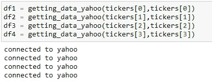

# 从 S3 向 AWS Athena 加载数据

> 原文：<https://levelup.gitconnected.com/loading-data-from-s3-to-aws-athena-7c56c63efccc>

*了解如何使用 AWS CLI 和 boto3 在 AWS 中接收数据*


图片来自作者

# 介绍

如今，许多组织使用[亚马逊 S3](https://aws.amazon.com/s3/) 作为各种文件(包括 AWS 服务日志)的主要存储目的地。将数据存储在 S3 存储桶中的好处之一是，您可以接收数据，然后以任何方式访问数据。将数据吸收到 S3 的一个流行选项是使用 Python 编写脚本，然后使用 [Amazon Athena](https://aws.amazon.com/athena/) 查询数据，这是一个针对 S3 数据的无服务器查询引擎。

在本教程中，我们将了解如何结合使用这些技术来创建在云中运行的数据摄取流程。我们将从 API 中提取数据，然后使用 boto3 将这些表存储在 S # buckets 中，然后我们将在 Amazon Athena 中分析这些数据。

在我们的 ETL 管道的第一步中，我们将通过使用 [pandas data reader](https://pandas-datareader.readthedocs.io/en/latest/readers/yahoo.html) 包从雅虎财经中提取一些美国股票市场数据来完成 *ET* 部分，然后我们将把这些提取转换成 pandas dataframes 上传到 S3 桶中。

首先，让我们了解一下提取部分涉及的技术。

> 亚马逊 S3:根据 www.amazon.com[的说法](https://aws.amazon.com/s3/)亚马逊简单存储服务或众所周知的 S3“是一种提供行业领先的可扩展性、数据可用性、安全性和性能的对象存储服务。各种规模和行业的客户都可以为几乎任何使用情形存储和保护任意数量的数据，例如数据湖、云原生应用程序和移动应用程序。借助经济高效的存储类别和易于使用的管理功能，您可以优化成本、组织数据和配置微调的访问控制，以满足特定的业务、组织和合规性要求。

其用途从构建可扩展的可靠数据湖、运行云原生应用程序，到以极低的成本备份和归档关键数据。

它的多功能性还在于它可以与 Python 等其他一些前沿技术集成，具体来说就是 [boto3](https://boto3.amazonaws.com/v1/documentation/api/latest/index.html) ，这个库允许开发人员直接从命令行管理(创建、更新和删除)AWS 资源，甚至更好地将这些配置包含在 Python 脚本中。

为了从头开始学习 boto3，以下是来自 [Real Python](https://realpython.com/) 的非常好的资源:

[](https://realpython.com/python-boto3-aws-s3/#:~:text=Boto3%20is%20the%20name%20of,resources%20from%20your%20Python%20scripts) [## Python、Boto3 和 AWS S3:揭秘——真正的 Python

### 立即观看本教程有一个由真正的 Python 团队创建的相关视频课程。和书面的一起看…

realpython.com](https://realpython.com/python-boto3-aws-s3/#:~:text=Boto3%20is%20the%20name%20of,resources%20from%20your%20Python%20scripts) 

最后，根据[www.amazon.com](https://aws.amazon.com/athena/)的说法，“亚马逊雅典娜是一个构建在开源框架上的无服务器交互式分析服务，支持开放表格和文件格式。Athena 提供了一种简单、灵活的方法来分析其所在位置的 Pb 级数据。从亚马逊简单存储服务(S3)数据湖和 25 个以上的数据源分析数据或构建应用程序，包括内部数据源或使用 SQL 或 Python 的其他云系统。Athena 构建在开源的 Trino 和 Presto 引擎以及 Apache Spark 框架之上，无需任何配置工作。”

事不宜迟，让我们进入主题，开始构建一个环境来提取数据，然后在云中加载和分析数据。

# 从 API 提取数据

如前所述，我们将从 pandas-datareader 中提取数据，使开发人员能够从不同的互联网来源提取金融数据作为 pandas 数据框架。

首先，我们需要在我们的环境中安装 aws cli，library 将使我们能够从 Jupyter 笔记本上访问我们存储在亚马逊 S3 的对象。

为了安装它，只需从你的终端写`sudo apt install awscli`


图片来自作者

最后，您将运行`aws --version`来检查 aws cli 是否已成功安装，并运行`aws configure`来在您的主目录中设置您的 aws 用户凭证:


图片来自作者

有一篇非常好的文章展示了如何完整地配置 aws cli，然后配置它的更多特性:

[](https://medium.com/@vishal.sharma./create-an-aws-s3-bucket-using-aws-cli-5a19bc1fda79) [## 使用 AWS CLI 创建 AWS S3 存储桶

### 使用 AWS CLI(命令行界面)创建 AWS S3(简单存储服务)存储区非常简单，我们可以 S3…

medium.com](https://medium.com/@vishal.sharma./create-an-aws-s3-bucket-using-aws-cli-5a19bc1fda79) 

然后，您需要通过运行`pip install boto3`或`pip3 install boto3`将 boto3 库安装到您的环境中，如果您使用 linux 的话。

Medium 中有大量关于如何使用 boto3 管理 S3 存储桶的资源，以下是其中之一:

[](https://towardsdatascience.com/introduction-to-pythons-boto3-c5ac2a86bb63) [## Python 的 Boto3 简介

### AWS SDK 简单易行

towardsdatascience.com](https://towardsdatascience.com/introduction-to-pythons-boto3-c5ac2a86bb63) 

也许你需要先打开一个 Jupyter 笔记本，然后`import boto3,`如果你遵循 boto3 [文档](https://boto3.amazonaws.com/v1/documentation/api/latest/guide/quickstart.html#using-boto3)，第一步是列出你的水桶:

```
import boto3
s3 = boto3.client('s3')
response = s3.list_buckets()
```

在那里，您将收到一个 JSON 形式的响应，然后在您的 AWS 帐户中列出现有的存储桶就像下面这样简单:


图片来自作者

但是，如果您没有任何存储桶，您将需要通过您的 aws 帐户或通过 aws cli 来创建它们，AWS 文档在这方面已经足够清楚了:

 [## 在亚马逊 S3 上传、下载和使用对象

### 要在亚马逊 S3 中存储数据，需要使用名为桶和对象的资源。水桶是装…的容器

docs.aws.amazon.com](https://docs.aws.amazon.com/AmazonS3/latest/userguide/uploading-downloading-objects.html) 

一旦设置好 AWS bucket，就可以开始使用 aws cli 或 boto3 向 AWS 资源发出远程请求。你会在我的 [GitHub](https://github.com/fvgm-spec/medium_notebooks/blob/main/managing_s3_and_athena/managing_s3_data.ipynb) 回购中找到处理这些的代码。

# 上传数据到 S3

在 ETL 过程的这一部分，我们将使用一些我用 Python 编写的函数，还有一些来自 boto3 文档的函数，将从 API 提取的数据加载到我们的 S3 桶中。

```
##Getting buckets data
def getting_bucket_data():
    ##Setting boto3 client
    s3 = boto3.client('s3')
    ##Getting response from S3 client
    r = s3.list_buckets()
    ##Listing AWS buckets
    for bucket in r['Buckets']:
        bucketName = bucket["Name"]

    return bucketName
```

上面的函数将列出您的 S3 中的所有存储桶，在我的例子中，我刚刚创建了一个:


图片来自作者


图片来自作者

现在让我们看看我们刚刚从 yahoo API 下载的数据，我们将它存储在名为 **data** 的本地文件夹中，当您克隆了回购后，您将拥有以下结构:


图片来自作者

在那里，我使用这个函数从 API 请求数据，并将其存储在本地的 csv 文件中:

```
def getting_data_yahoo(ticker,file_name,path=data_path):
    # yahoo gives only daily historical data
    connected = False
    while not connected:
        try:
            df = web.get_data_yahoo(ticker, start=start_time, end=end_time)
            connected = True
            print('connected to yahoo')
        except Exception as e:
            print("type error: " + str(e))
            time.sleep( 5 )
            pass   

    # use numerical integer index instead of date    
    df = df.reset_index()
    df.to_csv(f'{path}{file_name}.csv',index=False)
```

根据该函数，我们需要传递一个 ticker 名称(在笔记本的列表中定义)和一个文件名，该文件名将输出 csv 文件作为该函数的参数。



图片来自作者

让我们快速浏览一下其中一个下载的文件:


图片来自作者

如果你想学习如何使用 *csvlook* 看看我之前写的这篇文章:

[](https://felixvidalgu.medium.com/data-wrangling-in-the-command-line-af35a609c5f1) [## 命令行中的数据争论

### 学习如何使用 Unix Power Tools 在命令行中获取和操作数据

felixvidalgu.medium.com](https://felixvidalgu.medium.com/data-wrangling-in-the-command-line-af35a609c5f1) 

然后这个来自 boto3 [文档](https://boto3.amazonaws.com/v1/documentation/api/latest/guide/s3-uploading-files.html)的函数将把你的 csv 文件上传到你的 S3 桶，传递*文件名*和*桶名*作为参数:

```
def upload_files(file_name, bucket, object_name=None):
    """Upload a file to an S3 bucket

    :param file_name: File to upload
    :param bucket: Bucket to upload to
    :param object_name: S3 object name. If not specified then file_name is used
    :return: True if file was uploaded, else False
    """

    # If S3 object_name was not specified, use file_name
    if object_name is None:
        object_name = os.path.basename(file_name)

    # Upload the file
    s3_client = boto3.client('s3')
    try:
        response = s3_client.upload_file(file_name, bucket, object_name)
    except ClientError as e:
        logging.error(e)
        return False
    return True
```

为了简单起见，让我们通过将 file_name 和 bucket_name 传递给函数来加载一个 csv 文件，然后您需要创建一个数据库和表来保存 Amazon Athena 中的数据:

```
upload_file('AAPL.csv',bucketName)
```

上传后，您的存储桶将具有以下结构:


图片来自作者

# 在 Athena 中解释数据

为了管理我们存储在 S3 的数据，我们将使用 Athena，首先您将通过访问 AWS 帐户中的 Athena 服务来创建一个数据库:


图片来自作者

在进入这一点之前，我强烈建议您阅读 AWS 官方文档上的 Athena 入门指南:

 [## 入门指南

### 本教程将引导您使用 Amazon Athena 查询数据。您将基于存储在…中的示例数据创建一个表

docs.aws.amazon.com](https://docs.aws.amazon.com/athena/latest/ug/getting-started.html) 

一旦创建了数据库，现在您需要基于存储在 S3 的示例数据创建一些新表，最好也是最简单的方法是创建一个 crawler，它将完成将存储在 S3 的数据加载到 Athena 数据库的所有工作，请遵循本教程，它将向您展示如何配置 crawler:

[](https://medium.com/@cndro/connect-csv-data-in-s3-bucket-with-athena-database-11d98aa89066) [## 将 S3 桶中的 CSV 数据与 Athena 数据库连接

### Athena 是一种无服务器查询服务，允许您对存储在 S3 的数据运行 SQL 查询。它可以方便地查询…

medium.com](https://medium.com/@cndro/connect-csv-data-in-s3-bucket-with-athena-database-11d98aa89066) 

当您的 crawler 完成这项工作时，您将拥有新创建的表中的数据:


图片来自作者


图片来自作者

从那时起，您可以开始在 Athena 中对该数据进行一些查询，或者如果需要，您可以将该数据库与您喜欢的数据可视化平台(如 Tableau 或 Amazon Quicksight)连接，以便生成一些指标和统计数据。

# 结论

亚马逊 S3 和 Athena 都是优秀的资源，允许开发人员在云中创建基于非结构化和结构化数据的可靠应用程序，这些数据可以使用 python 和 boto3 包加载。然后，在 Athena 中，您可以开始使用 ANSI SQL 运行特定查询。Athena 还与 Amazon Quicksight 集成，以实现轻松的数据可视化，然后生成报告或使用商业智能工具探索数据。

一些其他的参考资料，祝您在云中愉快地编码！！