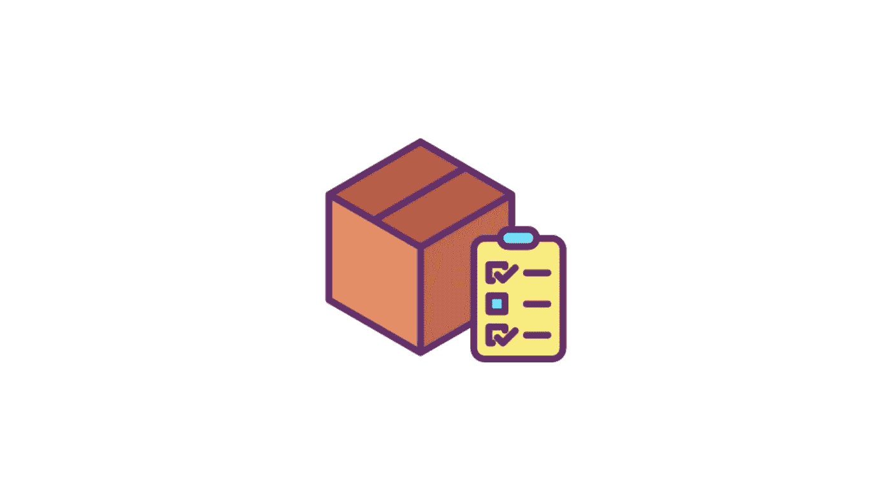

# 用 Promise API 加载 JavaScript、CSS 或图像文件

> 原文：<https://levelup.gitconnected.com/loading-javascript-css-or-image-via-promise-api-c19912aea9b1>

## 使用 JavaScript 或 TypeScript 加载资源(JavaScript、CSS、Image)的最简单方法

Web 应用程序通常使用第三方 API 来提供应用程序特定路线的功能。这些 API 很多都很重，在 NPM 上没有打包。在 web 应用程序中添加这些 API 的通常方法是将其添加到主 HTML 文件中。使用这种方法会对页面加载时间产生很大影响。例如，如果它是一个 JavaScript 文件，它将下载、编译并执行脚本。

如果我们可以避免在页面第一次加载时加载这些 API 会怎么样？这将有助于页面内容更快地加载，减少整体网络数据使用，并降低低端设备的内存使用。当您异步加载资产时，这是可能的。

# Loadx API

[Loadx API](https://github.com/cesarwbr/loadx) 将帮助我们通过以下特性异步加载资产:

*   🚚加载 **JS** 、 **CSS** 或**图片**
*   🚀缓存结果
*   ⏳️很好地完成了承诺和异步/等待
*   📦️刚刚压缩了 ES3 的 400 字节

让我们使用这个 API 创建一个示例:

# 结论

现在，我们可以仅在需要时加载资产。让我们试一试！