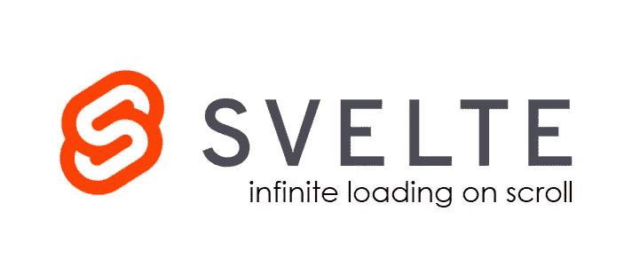

# 细长的无限滚动

> 原文：<https://levelup.gitconnected.com/loading-more-results-on-scroll-with-svelte-js-restful-apis-svelte-infinite-scrolling-ad80a09b5e33>

## 用苗条的 JS 和 RESTFul APIs 在 Scroll 上加载更多结果



无限加载滚动条是为用户提供更好导航体验的好方法。

它消除了在客户端手动触发加载更多数据的需要。它还允许您的服务器向用户提供适量的数据，因为如果用户有兴趣向下滚动页面，还可以获取更多的数据。

在这篇文章中，我们将学习如何通过几个简单的步骤来做到这一点。

# 创建一个苗条的应用程序

首先，通过输入以下命令创建一个苗条的应用程序。

```
npx degit sveltejs/template svelte-infinite-scroll-app
cd svelte-infinite-scroll-app && yarn#Or if you are using npmnpx degit sveltejs/template svelte-infinite-scroll-app
cd svelte-infinite-scroll-app && npm install
```

# 添加我们需要的依赖项

我们需要我们的项目下面的依赖关系。

```
yarn add -D axios svelte-inview#Or if you are using npmnpm install axios svelte-inview --save-dev
```

当一个元素在视图框架之内或之外时，svelte-inview 将触发一个动作。它将帮助我们知道用户何时到达最后一个获取的项目，并触发新的获取以获得更多结果。

现在您已经有了项目设置，让我们进入代码。
我们将创建一个应用程序，从 JSON placeholder API 中获取大量用户帖子。

# 准备好明信片组件

在您的项目目录中，创建一个名为明信片. svelte 的组件

`./src/components/PostCard.svelte`

我们稍后将使用该组件…

# 在滚动条上加载更多帖子

就是这样！

感谢您花时间阅读！

如果你遇到任何问题，打电话给我，我会很乐意帮忙的！

你喜欢这篇文章吗？留下反馈，并与可能会觉得有用的人分享。